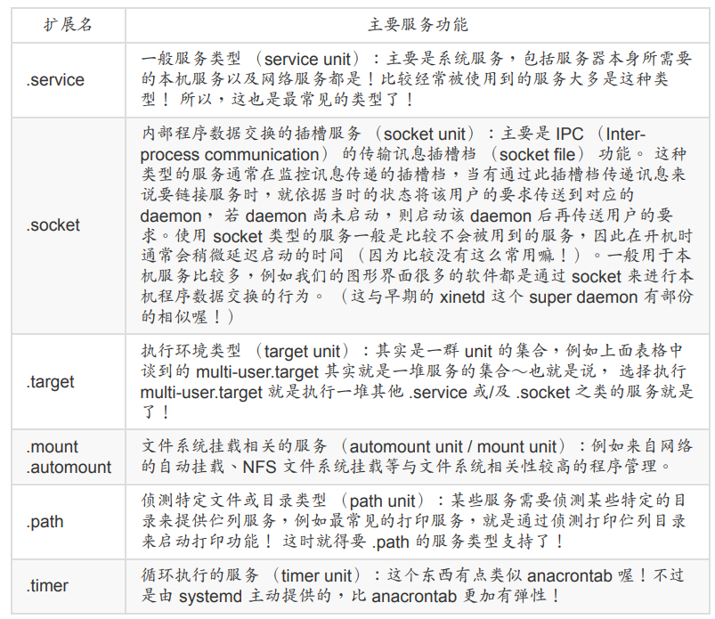

# linux学习

## 磁盘管理
1. 新加磁盘
```shell
lsblk
parted /dev/sdc print
fdisk /dev/sdc #新建GPT分区表，g w
gdisk /dev/sdc #新建GPT分区
partprobe #更新linux核心的分区表信息】
mkfs.ext4 /dev/sdc1 #磁盘格式化（建置文件系统）
fsck.ext4 /dev/sdc1 #文件系统检测
blkid #获取待挂载分区/文件系统
mount /dev/sdc1 /data/ext4 #挂载
df /data/ext4 #查看是否挂载
```
2. 扩缩容

```shell
lsblk
blkid
parted /dev/sda print
fdisk /dev/sda
#1.d 2    --删除待扩容分区
#2.n 2    --重建待扩容分区
#3.2048   --重建待扩容分区开始大小
#4.+10G   --重建待扩容分区结束大小
#5.w
resize2fs /dev/sda2

parted /dev/sda
#resizepart 2 30G
resize2fs /dev/sda2

```

3. 清空磁盘
```shell
dd if=/dev/zero of=/dev/sdd bs=1M count=10 conv=fsync
wipefs -a -f /dev/sdd
```

分区软件：GParted


## 网络管理
```shell
用户权限
sudo su - root
passwd
#/etc/network/interfaces.d/setup
auto lo
iface lo inet loopback

auto eth0
iface eth0 inet dhcp

auto enp0s8
iface enp0s8 inet static
address 192.168.56.101
netmask 255.255.255.0
```

##服务
