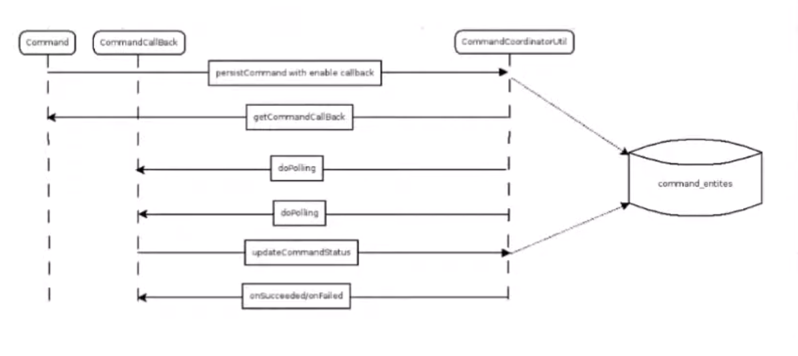
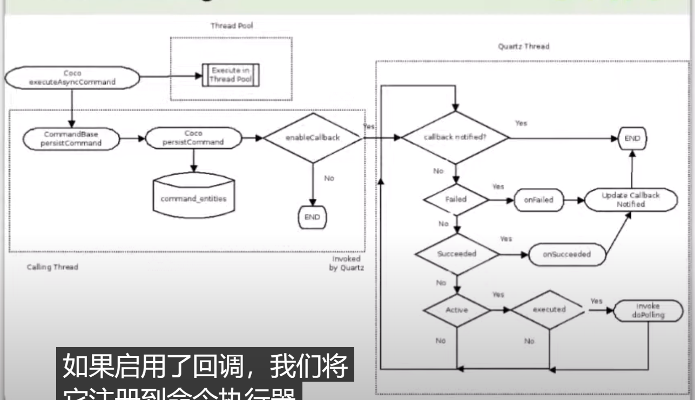

## 设计流程

### 6.详细设计

> 详细设计: 具体指导开发的设计部分，包括流程、数据模型、具体用到的算法、和客户端的接口，等等.这一部分很重要，如果没做好，没对齐，那么搞不好就要返工，耽误进度。

1. 流程设计
    2. 流程图或时序图描述业务流程
2. 算法设计
3. 数据模型设计
4. 接口设计
5. 异常处理

## 任务管理器

### ovirt-engine 任务流程

1. bll 每个操作在ActionType 枚举中都有一个值.每个枚举值都有一个对应的类，类由工厂通过反射实例化。
2. Backend.RunAction：入口，通过 CommandFactory.CreateCommand 接收枚举值和命令参数，并实例化相应的命令。然后，该命令实例通过command.executeAction（）运行，
   1. 首先运行所有命令的基类：CommandBase的executeAction初始实现。
   2. CommandBase.executeAction 首先检查命令范围的验证，然后运行派生的命令实现。
   3. 在验证阶段，填充字段“returnValue”，包括其子字段“canDoAction”和“errorMessage”。
   4. 命令的行为与函数非常相似，因此其“returnValue”字段充当函数实际返回值的隐喻。如果验证成功，则开始执行阶段，其中填充“成功”和“异常”。
3. 当用户一次运行多个命令时，后端使用MultipleActionsRunner，execute方法同时异步运行所有命令的验证，然后等待所有验证线程，完成所有验证后，两种：1.全部通过 2.每个命令执行通过验证
4. internalValidate() 验证命令 和 execute() 执行命令
5. 
6. 

```markdown
### 主线程（接受请求并响应）

1. 判断删除虚拟机操作是否可以执行
    1. 通过命令工厂创建删除虚拟机命令(RemoveVmCommand)实例(实例化和创建命令上下文)
    2. 判断删除虚拟机命令是否可以执行，判断失败返回
        1. 判断虚拟机信息是否存在，失败返回
        2. 判断虚拟机类型是否可以执行删除命令，失败返回
        3. 通过虚拟机id从数据库获取中更新示例虚拟机实例信息
        4. 判断虚拟机是否运行（Unassigned，Down，ImageIllegal，ImageLocked），失败返回
        5. 判断虚拟机是否绑定池，失败返回
        6. 判断虚拟机是否正在进行快照，失败返回
        7. 判断存储池是否可用，失败返回
        8. 判断虚拟机是否正在进行备份，失败返回
    3. 将删除虚拟机命令和关联id提交到EngineThreadPool线程池中。
2. 返回删除虚拟机操作是否可以执行的结果给前端

### EngineThreadPool 线程池（执行删除虚拟机操作）

1. 对删除虚拟机命令进行监控 (prepareCommandForMonitoring())
    1. 判断删除虚拟机命令是否可以监控，判断失败返回
    2. 持久化删除虚拟机作业到数据库job表中。名称：RemoveVm，状态：STARTED
2. 执行删除虚拟机操作 (executeAction())
    1. 生成删除虚拟机命令的参数对象 RemoveVmParameters
    2. 设置删除虚拟机操作状态为EXECUTE
    3. 新增删除虚拟机作业的验证步骤
        1. 持久化新增删除虚拟机作业验证步骤到数据库step表中。名称：VALIDATING，状态：STARTED
    4. 判断删除虚拟机命令是否可以执行（通过主线程验证结果可跳过）
    5. 完成删除虚拟机作业的验证步骤
        1. 持久化更新删除虚拟机作业验证步骤到数据库step表中。名称：VALIDATING，状态：FINISHED
    6. 判断5的验证结果，如果验证失败则终止删除虚拟机命令，返回执行结果false
        1. 执行删除虚拟机 (execute())
            1. 更新删除虚拟机命令状态为ACTIVE
            2. 判断是否持久化命令，如果删除虚拟机命令包含callback或父命令包含callback
                1. true：持久化新增删除虚拟机命令实体到数据库command_entities表中。名称：RemoveVm，状态：ACTIVE
                2. 将新增删除虚拟机命令实体添加到commandsCache中
                3. 将<删除虚拟机命令,定时器>添加到callbacksTiming中，后续由定时任务invokeCallbackMethods更新该命令状态
            3. 新增删除虚拟机作业的执行步骤
                1. 持久化新增删除虚拟机作业执行步骤到数据库step表中。名称：EXECUTING，状态：STARTED
            4. 处理删除虚拟机命令步骤
                1. 判断删除虚拟机命令参数对象中是否包含步骤
                2. 关联删除虚拟机命令和相关步骤
            5. 获取删除虚拟机命令参数中事务的范围
            6. 根据事务范围执行删除虚拟机命令 (executeInScope)(Suppress)
                1. 如果当前存在事务，暂停事务
                2. 判断删除虚拟机操作的状态，执行操作或终止操作
                    1. EXECUTE
                        1. 执行删除虚拟机操作(executeActionInTransactionScope())
                            1. 执行删除虚拟机命令(executeCommand())
                                1. 判断虚拟机是否锁定
                                    1. false: 锁定当前虚拟机
                                    2. 创建数据库事务1将虚拟机状态更新为lock
                                    3. 通过vds更新vm的状态
                                    4. 更新business_entity_snapshot表
                                    5. 提交数据库事务1
                                2. 删除虚拟机（removeVM()）
                                    1. 执行删除虚拟机快照操作，如果失败记录日志
                                    2. 创建数据库事务2
                                    3. 删除数据库中虚拟机相关信息(Users,Network,Snapshots,Static,Icons)
                                    4. 判断是否删除虚拟机关联的磁盘
                                        1. 更新数据库中images虚拟机关联的磁盘状态为LOCKED
                                    5. 提交数据库事务2
                                    6. 执行删除虚拟机所有磁盘操作(runInternalActionWithTasksContext())
                                        1. 设置删除虚拟机所有磁盘操作状态为EXECUTE
                                        2. 判断删除虚拟机所有磁盘命令是否可以执行
                                        3. 执行删除虚拟机所有磁盘(execute())
                                            1. 持久化删除虚拟机任务删除所有磁盘命令(RemoveAllVmImages)
                                               到数据库command_entities表中。名称：RemoveAllVmImages ，状态：ACTIVE
                                            2. 执行删除虚拟机所有磁盘命令
                                            3. 执行删除磁盘操作(runAction())
                                                1. 设置删除磁盘操作状态为EXECUTE
                                                2. 判断删除磁盘命令是否可以执行
                                                3. 执行删除磁盘(execute())
                                                    1. 持久化删除磁盘命令（RemoveImage）到数据库command_entities表中。名称：RemoveImages
                                                       ，状态：ACTIVE
                                                    2. 执行删除磁盘命令
                                                    3. 持久化vdsm删除磁盘异步任务到数据库async_tasks表中。
                                                    4. 添加vdsm删除磁盘异步任务到任务任务管理器中。
                                                    5. 获取删除磁盘命令执行结果
                                                    6. 判断执行结果，如果添加任务成功
                                                    7. 修改vdsm删除磁盘异步任务状态为polling
                                                    8. 判断删除磁盘操作结果，将任务id添加到任务列表中
                                                    9. 判断删除虚拟机所有磁盘命令执行结果，更新命令状态
                                                    10. 持久化更新删除虚拟机任务删除所有磁盘命令状态
                                                4. 判断删除虚拟机所有磁盘操作结果
                                                5. 所有虚拟机删除后触发监听事件并返回true，否则返回false
                                                6. 返回删除虚拟机执行结果
                                        4. 判断删除虚拟机所有磁盘操作结果
                                        5. 所有虚拟机删除后触发监听事件并返回true，否则返回false
                                        6. 返回删除虚拟机执行结果
                            2. 根据命令执行结果数据库command_entities表命令状态
                        2. 判断删除虚拟机操作结果
                            1. true：返回执行结果
                            2. false：通过任务管理器执行任务的stop命令，返回执行结果
                    2. 非EXECUTE
                        1. 执行终止删除虚拟机操作(endActionInTransactionScope())
                3. 如果当前存在事务，恢复事务
            7. 判断删除虚拟机命令是否成功
                1. true：将删除虚拟机命令关联的任务状态置为polling，后续由定时任务timerElapsed更新该命令状态
    7. 更新数据库删除虚拟机命令信息
    8. 返回执行删除虚拟机结果
    9. 创建并提交事务3 删除数据库中的异步任务

### 定时任务 invokeCallbackMethods 
1. 获取callbacksTiming中删除虚拟机命令
2. 判断删除虚拟机命令的状态
   3. ACTIVE
      4. 执行删除虚拟机命令的回调方法
   4. SUCCEEDED
   5. FAILED
      6. 执行删除虚拟机命令的终止

### 定时任务 timerElapsed

```