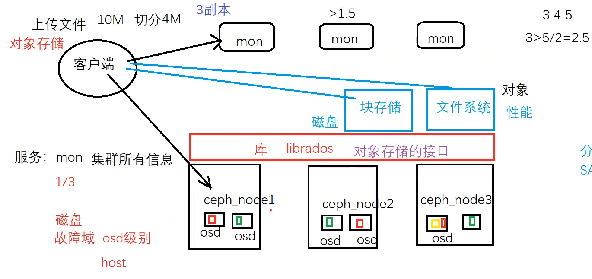

# 存储
### 1. 集中式存储
1. DAS
2. NAS
3. SAN:SCSI
### 2. 分布式存储
1. 块存储  磁盘（未格式化）,性能要求高
2. 文件系统存储  （NAS），文本编辑
3. 对象存储  上传 下载 备份
    4.  2006 亚马逊 s3

#### 2.1 ceph
    软件定义的开源文件解决方案，对象存储重点（s3,swift）
版本：
```shell
#相关操作
#部署
#1.ceph-deploy方式
#主机名 不能更改
#主机名解析

/etc/hosts
#yum ceph安装
#ssh免密

ceph-deploy new ceph1 ceph2 ceph3
yum install ceph
ceph-deploy mon create-initial
ceph-deploy admin ceph1 ceph2 ceph3
ceph-deploy mgr create ceph1 ceph2 ceph3

ceph-deploy osd create --data /dev/sdb ceph1_osd

lsblk
blkid
#ceph 相关命令
ceph --version
ceph osd tree
ceph osd pool create mypool 8
ceph pg dump pgs_brief
ceph osd pool get mypool all

#块存储
ceph osd pool application enable mypool rbd
rbd create mypool/disk01 --size 1G
rbd map mypool/disk01
ll /dev/rbd0
mkfs.ext4 /dev/rbd0

#2.cephadm

#3.手动

#4.ceph-ansible
```

架构
1. 服务
   1. mon 集群所有信息,状态，入口
   2. mgr 监控，收集所有信息,查询操作
   3. mds 元数据
2. osd 磁盘
3. pool 存储池 逻辑概念 ，先创建 
   1. `ceph osd pool ls detail`
   2. pg: 归置组，看不见，对象名hash计算后存到PG上（crush1），PG根据pool的类型和副本数放到对应的osd( crush2)
   3. pgp: 
4. rdb 块
5. iSCSI（Internet Small Computer System Interface）是一种在IP网络上运行的存储协议，它将SCSI协议封装在TCP/IP协议中，可以通过网络提供块级存储服务。iSCSI架构通常包括以下组件：
   1. iSCSI initiator：发起iSCSI请求的主机或设备，它使用iSCSI协议访问iSCSI target上的存储资源。
   2. iSCSI target：提供存储资源的设备或主机，它使用iSCSI协议响应iSCSI initiator的请求，并将存储资源映射到iSCSI LUN（Logical Unit Number）。
   3. iSCSI LUN：iSCSI target上的逻辑单元号，它可以是一个物理磁盘、一个分区、一个文件或其他存储资源，由iSCSI target管理并映射给iSCSI initiator。
   4. iSCSI SAN（Storage Area Network）：使用iSCSI协议连接的存储网络，它可以是一个局域网或广域网，连接多个iSCSI initiator和iSCSI target，并提供共享存储资源。
   5. iSCSI HBA（Host Bus Adapter）：连接iSCSI initiator和iSCSI SAN的网络适配器或网卡，它可以是专用的iSCSI HBA或使用标准网卡实现。
   6. iSCSI software initiator：在主机上安装的iSCSI initiator软件，它使用主机的网络适配器或网卡连接到iSCSI SAN，并将iSCSI请求转换为SCSI命令。
   7. 在iSCSI架构中，iSCSI initiator通过网络连接到iSCSI target，并访问iSCSI LUN上的存储资源，就像直接连接到本地存储设备一样。通过iSCSI技术，可以实现存储资源的共享、备份、迁移等功能，提高存储资源的利用率和可靠性。

rados是对象数据的底层存储服务由多个主机组成的存储集群
librados 是rados的api 可以使用java

ceph通过crush 计算后存储在对应的服务器上  

访问方式 基于librados api提供接口
1. cephfs 挂载后访问
2. rbd 块，相当于提供的磁盘
3. RadosGW 

底层rados  
1. FileStore BlueStore
POSIX


  

对象存储
1. 副本，故障域（osd，host）

