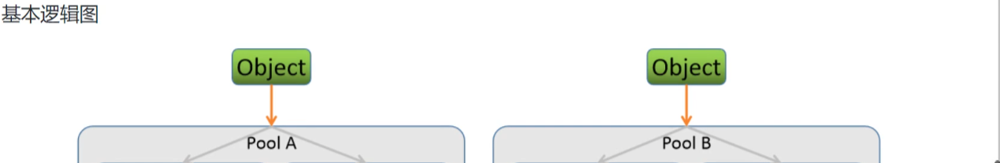
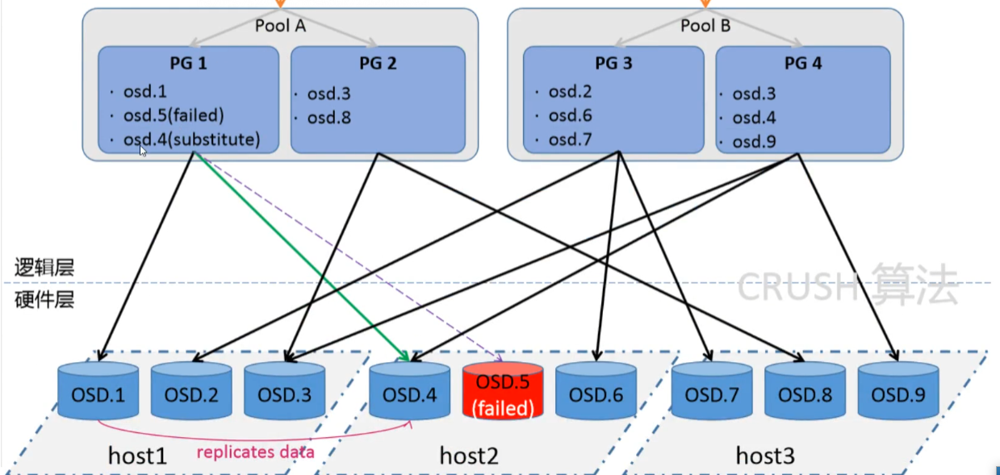
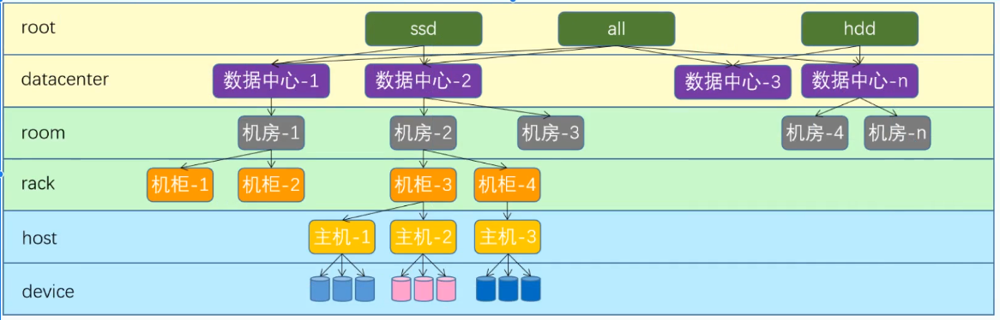

# ceph分布式文件系统

## 1.快速入门
### 1.集群部署
#### osd模块
1. osd部署 本地磁盘挂载至ceph中
   2. 分类
      2. blueStore ceph-osd 进程
      3. FileStore xfs+ leveldb  
   ```shell
   #格式化，非必须
   mkfs.ext4 /dev/sdb
   blkid
   ceph-deplay disk list
   ceph-deplay disk zap #擦除
      
   ceph-deplay osd create node --data /dev/sdb --block-db 
   ceph osd tree
   ceph osd ls
   ceph osd dump
   ceph osd status
   ceph osd perf #统计延迟
   ceph osd df
   ```
2. osd操作
   ```shell
   ceph osd pause #暂停接受数据
   ceph osd unpause
   ceph osd crush reweight osd.编号 #修改权重值
   ceph osd down osd.编号 #关闭也会重新启动，只能停服务
   ceph osd up osd.编号 #
   ceph osd out osd.编号 #驱逐出及集群
   ceph osd in osd.编号 #加回集群
   ```
3. osd节点
   ```shell
   #删除
   #1.修改权重 osd crush reweight
   #2.停止指定osd进程 systemctl stop
   #3.驱逐出 osd out
   #4.从crush移除osd节点 osd crush  rm
   #5.删除节点 osd rm
   #6.删除osd认证节点 auth rm
   
   #添加
   1.没有被占用 
   2.格式化
   3.加入集群 ceph-deploy
   ```
#### 存储实践
1. 概念
   1. Pool 逻辑存储区域
   2. PG 归置组 pool->pg->osd
   3. PGP 维持pg和osd的一种策略
   4. CRUSH
      5. 一致性hash算法将对象名称映射到PG
      6. 将PG id 基于crush算法映射到OSD
2. 操作
```shell
ceph osd pool create 存储池名 16 16 #16个pg，16个组
ceph osd pool ls
ceph osd pool ls detail
ceph osd pool stats
rados lspools
rados put 文件对象名(id) /path/to/file --pool 存储池名 #上传文件
ceph osd map 存储池 文件对象名(id)
rados rm 文件对象名(id) --pool 存储池名 #上传文件

ceph pg dump
ceph pg ls
ceph pg ls-by-pool
ceph pg ls-by-osd
#删除
ceph osd pool rm 存储池名 存储池名 
```




## 4. 综合实践
1. 可视化工具
   1. calamari
   2. VSM
   3. Inksope
   4. dashboard python 开发的监控页面，安装在mgr节点上
2. dashboard
```shell

```
3. tls
对dashboard 提供证书访问
```shell
```
4. rgw
默认dashboard未开启
```shell
radosgw-admin user create --uid=rgw --display-name=rgw --lsb_release -a
echo access_key/secret_key > 1/2.file
ceph dashboard set-rgw-api-access-key -i 1.file
ceph dashboard set-rgw-api-secret-key -i 1.file
```

1. 监控  
prometheus  
架构
### crush
#### 基础知识
1. 数据分发算法，多维度的
2. 寻址的三次映射
   3. File和object映射：文件数据object的数据块切片操作，便于多数据的并行化处理
   4. object和PG映射：将文件数据切分后的每一个object通过简单的hash算法归到一个PG中
   5. PG和OSD映射：将PG映射到主机实际的OSD数据磁盘上
6. 配置和更改和数据动态再平衡等关键特性，

7. crush map 不同层次的逻辑Buckets和Devices组成
   8. buckets：Root多区域，datacenter数据中心，room机房，rack机柜，host是主机
   9. devices: 各种OSD存储设备

buckets 示例
```shell
host mon01{
  id -3
  id -4 class hdd
  weight 0.039
  alg straw2
  hash 0
  item osd.0 weight 0.019 #低一层级的bucket名称
  item osd.1 weight 0.019
  
}

```
相关操作
```shell
#1.获取crush信息
ceph osd crush dump
#2.操作相关信息 格式转换->再次应用

ceph osd getcrushmap -o crushmap_file.txt
crushtool -d crushmap_file.txt 
crushtool -c crushmap_file.txt -o new.txt
ceph osd setcrushmap -i new_crushmap_file.txt
ceph osd crush dump|grep max_size
```


