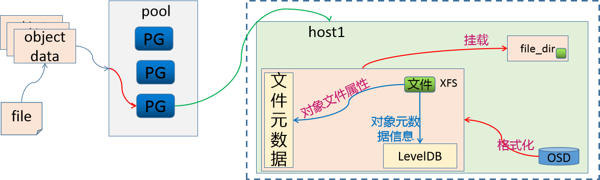

# 1 快速入门

## 1.1 基础知识

### 1.1.1 存储基础

学习目标

这一节，我们从 基础知识、文件系统、小结 三个方面来学习。

**基础知识**

存储基础

```powershell
	我们知道，对于一个计算机设备来说，其存储功能是非常重要的，也就是说，任何一台电脑上，必须包含一个设备--磁盘。这个磁盘就是用于数据存储的目的的。
```

```powershell
常见的存储设备接口：
DAS设备：IDE、SATA、SCSI、SAS、USB
	无论是那种接口，他都是存储设备驱动下的磁盘设备，而磁盘设备其实就是一种存储，这种存储是直接接入到主板总线上去的。
	- 基于数据块来进行访问
	- 基于服务器方式实现互联访问，操作简单、成本低。
NAS设备：NFS、CIFS
	几乎所有的网络存储设备基本上都是以文件系统样式进行使用，无法进一步格式化操作。
	- 基于文件系统方式访问
	- 没有网络区域限制，支持多种协议操作文件。
SAN:scsi协议、FC SAN、iSCSI
	基于SAN方式提供给客户端操作系统的是一种块设备接口，所以这些设备间主要是通过scsi协议来完成正常的通信。
	scsi的结构类似于TCP/IP协议，也有很多层，但是scsi协议主要是用来进行存储数据操作的。既然是分层方式实现的，那就是说，有部分层可以被替代。比如将物理层基于FC方式来实现，就形成了FCSAN，如果基于以太网方式来传递数据，就形成了iSCSI模式。
	- 基于数据块来实现访问
	- 不受服务器约束，通过存储池实现资源的高效利用，扩展性好
```


存储使用

```powershell
	对于存储的使用，我们需要借助于文件系统的方式来实现，而存储在使用前往往需要进行格式化。
```

**文件系统**

简介

```powershell
	文件系统的基本数据单位是文件，它的目的是对磁盘上的文件进行组织管理，那组织的方式不同，就会形成不同的文件系统。	Linux 文件系统会为每个文件分配两个数据结构：索引节点(index node)和目录项(directory entry)，它们主要用来记录文件的元信息和目录层次结构。

索引节点 
	- 用来记录文件的元信息，比如 inode 编号、文件大小、访问权限、创建时间、等信息。
	- 索引节点是文件的唯一标识，它们之间一一对应，也同样都会被存储在硬盘中，所以索引节点同样占用磁盘空间。
	- 用户查找的时候，会根据inode的信息，找到对应的数据块，我们可以将inode理解为数据块的路由信息。
目录项
	- 用来记录文件的名字、索引节点指针以及与其他目录项的层级关联关系。多个目录项关联起来，形成目录结构
	- 它与索引节点不同，目录项是由内核维护的一个数据结构，不存放于磁盘，而是缓存在内存。
	- 目录项和索引节点的关系是多对一
```

数据存储

```powershell
数据块
	磁盘读写的最小单位是扇区，扇区的大小只有 512B 大小，文件系统把多个扇区组成了一个逻辑块，每次读写的最小单位就是逻辑块（数据块），Linux 中的逻辑块大小为 4KB，也就是一次性读写 8 个扇区，这将大大提高了磁盘的读写的效率。
	磁盘想要被文件系统使用，需要进行格式化，此时磁盘会被分成三个存储区域
		- 超级块，用来存储文件系统的详细信息，比如块个数、块大小、空闲块等等。 
		- 索引节点区，用来存储索引节点；
		- 数据块区，用来存储文件或目录数据；
```

存储应用的基本方式


```powershell
为了加速文件的访问，通常会把相关信息加载到内存中，但是考虑到内存的容量限制，它们加载进内存的时机是不同的：
	超级块：当文件系统挂载时进入内存；
	索引节点区：当文件被访问时进入内存；
	数据块：文件数据使用的时候进入内；
```

文件存储

```powershell
	文件的数据是要存储在硬盘上面的，数据在磁盘上的存放方式，有两种方式：
		连续空间存放方式 
			- 同一个文件存放到一个连续的存储空间
			- 一旦文件删除可能导致磁盘空间碎片
			- 文件内容长度扩展不方便，综合效率是非常低的。
		非连续空间存放方式
			- 同一个文件存放到一个不连续的存储空间，每个空间会关联下一个空间
			- 可以消除磁盘碎片，可大大提高磁盘空间的利用率，同时文件的长度可以动态扩展。
			- 查找效率低，需要额外的资源消耗。
```


**小结**

```

```

### 1.1.2 DFS概述

学习目标

这一节，我们从 DFS简介、原理解读、小结 三个方面来学习。

**DFS简介**

存储基础

```powershell
存储处理能力不足：
	传统的IDE的io值是100次/秒，SATA固态磁盘500次/秒，NVMe固态硬盘达到2000-4000次/秒。即时磁盘的io能力再大数十倍，难道能够抗住网站访问高峰期数十万、数百万甚至上亿用户的同时访问么？这还受到网络io能力的限制。

存储空间能力不足：
	单块磁盘的容量再大，也无法满足用户的正常访问所需的数据容量限制。

需求：
	可以实现横向扩展的存储系统，这种存储系统在市面中的表现样式很多，不过他们有一个统一的称呼 -- 分布式存储系统。
```

分布式文件系统

```powershell
	随着传输技术发展，操作系统读写数据的方式，不再局限于本地I/O技术，开始支持远距离的TCP/IP方式获取数据。它相当于新增一种可以远距离传输的I/O技术，使得分散的存储设备和用户操作系统可以通过网络方式接入联合在一起，形成更大容量，更易于拓展伸缩的存储系统，对此人们引入分布式文件系统的概念。 
```

```powershell
	分布式文件系统（Distributed File System，DFS）是指文件系统管理的物理存储资源不一定直接连接在本地节点上，而是通过计算机网络与节点相连；或是若干不同的逻辑磁盘分区或卷标组合在一起而形成的完整的有层次的文件系统。
	分布式文件系统的发展现后经历了三个阶段：网络文件系统、共享SAN文件系统、面向对象的并行文件系统。
```

```powershell
	从本质上来说，分布式文件系统跟传统的文件系统没本质的差别，只不过是需要额外考虑多节点网络连接的可靠性、接入的存储设备的复杂性，需要文件系统、网络环境、存储策略共同协作而已。
	由于文件系统与传统一致，网络环境不受控制，所以，我们平常所说的分布式文件系统，也等同于分布式存储系统。
```

DSS简介

```powershell
	分布式存储系统，是将数据分散存储在多台独立的设备上，从而解决传统的存储系统的容量和性能限制。所以如果存储服务器的可靠性和安全性无法满足大规模存储应用的需要，那么它就会成为分布式文件系统的性能瓶颈。
	其实，分布式存储系统可以理解为多台单机存储系统的各司其职、协同合作，统一的对外提供存储的服务。
```

```powershell
	分布式网络存储系统采用可扩展的系统结构，利用多台存储服务器分担存储负荷，利用位置服务器定位存储信息，它不但提高了系统的可靠性、可用性和存取效率，还易于扩展。
	按照分布式存储系统的作用场景，我们可以将其划分为 存储非结构化数据的分布式文件系统、存储结构化数据的分布式数据库、存储半结构化数据的分布式NoSQL数据库等。
```

常见的文件系统


**原理解读**

分布式数据存储


存储角色

```powershell
节点角色
	当我们将数据存储到分布式系统上的时候，就需要有一个路由机制，能够将我们的请求转交给对应的存储节点上。所以，根据我们对数据在单节点上的存储原理，我们就需要有一个单独的节点来存储所有数据的元数据信息，然后，分布式存储就作为block的存储区域，专门用户数据存储。
	存储元素据的节点我们把它称为NameNode，存储具体数据的节点我们称为DataNode。
	
数据拆分：
	当我们要存储的数据非常大，比如说5个G，所以我们在存储的时候，将存储的数据信息发送给元数据控制节点，然后元数据控制节点根据自定义的存储策略，将要存储的数据进行拆分(64M一块)--也就是数据切片，将切分后的数据作为一个独立的文件，然后基于同样的路由逻辑，将其分散存储到不同的存储节点上。
	元数据控制节点，在进行数据切分的时候，还需要能够组合起来，所以拆分后的数据块大小、组合时候的偏移信息、路由到的节点等信息都应该有针对性的记录。
	在切片的时候，还可以实现并行的存储逻辑效果。每一个数据块都称为一个shard。
```

数据高可用

```powershell
元数据高可用
	由于NameNode保存了非常重要的数据信息，所以为了避免因为NameNode故障导致的问题，我们一定要对NameNode进行高可用处理。
	由于元数据非常小(几k)，所以NameNode上的数据是 非常密集而且io量非常小的。所以为了提高数据的查询和存储效率，我们一般将这些数据保存到内存中。所以为了防止主机断电导致数据丢失，所以我们需要随时的进行数据同步到磁盘中，因为没有办法判断每一次到底是哪种数据被访问或更改，所以在磁盘数据同步的时候，随机io是非常大的。
	同时，为了避免单节点的数据文件丢失，我们需要通过共享存储的方式将数据保存在第三方的存储设备上，同时还需要对数据存储主机进行高可用
```

```powershell
数据高可用
	由于我们对元数据进行了数据切片的方式，实现了数据的高效率存取，但是我们知道，一旦这些数据块中，任意丢弃一块，就会导致所有的数据无法正常的使用。所以有必要对这些数据进行高可用的操作。对于高可用的方式，我们一般会有两种方式来实现数据的冗余。
	节点级：
		通过对主机节点进行高可用，从而实现数据的冗余，这种机制，成本太高了，不值得。
	数据级：
		我们对拆分后的数据块进行副本操作，而且还可以根据节点的数量，自定义冗余的副本数量。这是推荐的。
		主角色的数据块称为 primary shard，副本数据块称为 replica shard。
```

```powershell
	在进行数据块数据冗余的时候，这些副本的策略机制是有元数据节点来进行控制的，当一个DataNode故障的时候：
		- 如果主shard没有了，从所有的副本shard中选择一个主。
		- 如果副本shard没有了，再创建一个副本shard即可。
		- 一旦DataNode节点数量多于副本数量，控制副本数据在另一个DataNode节点上复制一个新的副本
			从而保证副本的总体是满足预期的。
	
	为了防止数据副本节点在同一个物理机架上的时候，因为机架故障，导致所有副本无效，所以我们在考虑冗余的时候，还需要考虑地理位置区域的冗余。
```

**小结**

```

```

### 1.1.3 存储简介

学习目标

这一节，我们从 存储类型、ceph简介、小结 三个方面来学习。

**存储类型**

三种存储


块存储

```powershell
	块存储是将裸磁盘空间整个映射给主机使用的，主机层面操作系统识别出硬盘，与我们服务器内置的硬盘没有什么差异,可以自由的进行磁盘进行分区、格式化，
	块存储不仅仅是直接使用物理设备，间接使用物理设备的也叫块设备，比如虚机创建虚拟磁盘、虚机磁盘格式包括raw、qcow2等。	
	常见解决方案：
		ABS(Azure Block Storage)、GBS(Google Block Storage)、EBS(Elastic Block Storag)
		Cinder、Ceph RBD、sheepdog
```

文件系统存储

```powershell
	最常见、最容易、最经典实现的一种存储接口。它可以直接以文件系统挂载的方式，为主机提供存储空间资源。它有别于块存储的特点就在于，可以实现共享效果，但是有可能受网络因素限制导致速度较慢。
	
	常见解决方案：
		AFS(Azure FileStorage)、GFS(Google FileStorage)、EFS(Elastic File Storage)
		Swift、CephFS、HDFS、NFS、CIFS、Samba、FTP
```

对象存储

```powershell
	其核心是将 数据读或写 和 元数据 分离，并且基于对象存储设备(Object-based Storage Device，OSD)构建存储系统，然后借助于对象存储设备的管理功能，自动管理该设备上的数据分布。
	对象存储主要包括四部分：对象、对象存储设备、元数据服务器、对象存储系统的客户端
	
	简单地说，块存储读写块，不利于共享，文件存储读写慢，利于共享，而对象存储综合了两者的优点。
	常见的解决方案：
		AS(Azure Storage)、GCS(Google Cloud Storage)、S3(Simple Storage Service)
		Swift、Ceph OSD
```

**Ceph简介**

官方介绍

```
	Ceph is the future of storage; where traditional(传统的) systems fail to deliver, Ceph is designed to excel(出色). Leverage(利用) your data for better business(业务) decisions(决策) and achieve(实现) operational(运营) excellence(卓越) through scalable, intelligent(智能), reliable(可靠) and highly available(可用) storage software. Ceph supports object, block and file storage, all in one unified(统一) storage system.
```

```powershell
来源：
	Ceph项目最早起源于Sage就读博士期间的工作（最早的成果于2004年发表，论文发表于2006年），并随后贡献给开源社区。
```

```powershell
参考资料：
	官方地址：https://ceph.com/en/
	官方文档：https://docs.ceph.com/en/latest/#
	github地址：https://github.com/ceph/ceph
	最新版本：Quincy-17.2.3(2022-04-19)、Pacific-16.2.10(2021-03-31)、Octopus-15.2.17(2020-03-23)
	系统支持：
		全系列最好的系统支持是Ubuntu
		Ceph的发展对于Centos系列和Redhat系列不友好，新版本不支持旧版本系统。
```


软件特点


```powershell
为什么很多人用ceph？
	1 创新，Ceph能够同时提供对象存储、块存储和文件系统存储三种存储服务的统一存储架构
	2 算法，Ceph得以摒弃了传统的集中式存储元数据寻址方案，通过Crush算法的寻址操作，有相当强大的扩展性。
	3 可靠，Ceph中的数据副本数量可以由管理员自行定义，并可以通过Crush算法指定副本的物理存储位置以分隔故障域，支持数据强一致性的特性也使Ceph具有了高可靠性，可以忍受多种故障场景并自动尝试并行修复。
```

基本结构


```powershell
	Ceph是一个多版本存储系统，它把每一个待管理的数据流（例如一个文件） 切分为一到多个固定大小的对象数据，并以其为原子单元完成数据存取。
	对象数据的底层存储服务是由多个主机（host）组成的存储集群，该集群也被称之为 RADOS（Reliable Automatic Distributed Object Store）存储集群，即可靠、自动化、 分布式对象存储系统 
	librados是RADOS存储集群的API，它支持C、C++、Java、Python、Ruby和PHP等编程语言。
```

应用场景

```
	Ceph uniquely(独特的) delivers object, block, and file storage in one unified(统一) system. 
	注意：这个介绍在官网这几年基本没有变化
```


```
	RadosGW、RBD和CephFS都是RADOS存储服务的客户端，它们把RADOS的存储服务接口(librados)分别从不同的角度做了进一步抽象，因而各自适用于不同的应用场景。
	也就是说，ceph将三种存储类型统一在一个平台中，从而实现了更强大的适用性。
```


```
LIBRADOS	- 通过自编程方式实现数据的存储能力
RADOSGW		- 通过标准的RESTful接口，提供一种云存储服务
RBD			- 将ceph提供的空间，模拟出来一个一个的独立块设备使用。
				而且，ceph环境部署完毕后，服务端就准备好了rbd接口
CFS			- 通过一个标准的文件系统接口来进行数据的存储

参考图例：https://docs.ceph.com/en/pacific/_images/stack.png
```


**小结**

```

```

### 1.1.4 组件解析

学习目标

这一节，我们从 组件介绍、流程解读、小结 三个方面来学习。

**组件介绍**

组件简介

```
	无论您是想向云平台提供 Ceph 对象存储和 Ceph 块设备服务、部署 Ceph 文件系统还是将 Ceph 用于其他目的，所有 Ceph 存储集群部署都从设置每个 Ceph 节点、您的网络和 Ceph 开始 存储集群。
    一个 Ceph 存储集群至少需要一个 Ceph Monitor、Ceph Manager 和 Ceph OSD（对象存储守护进程）。 运行 Ceph 文件系统客户端时也需要 Ceph 元数据服务器。
```


| 组件      | 解析                                                         |
| --------- | ------------------------------------------------------------ |
| Monitors  | Ceph Monitor (守护进程ceph-mon) 维护集群状态的映射，包括监视器映射、管理器映射、OSD 映射、MDS 映射和 CRUSH 映射。 这些映射是 Ceph 守护进程相互协调所需的关键集群状态。 监视器还负责管理守护进程和客户端之间的身份验证。 通常至少需要三个监视器才能实现冗余和高可用性。基于 paxos 协议实现节点间的信息同步。 |
| Managers  | Ceph 管理器 (守护进程ceph-mgr) 负责跟踪运行时指标和 Ceph 集群的当前状态，包括存储利用率、当前性能指标和系统负载。 Ceph 管理器守护进程还托管基于 Python 的模块来管理和公开 Ceph 集群信息，包括基于 Web 的 Ceph 仪表板和 REST API。 高可用性通常至少需要两个管理器。基于 raft 协议实现节点间的信息同步。 |
| Ceph OSDs | Ceph OSD（对象存储守护进程，ceph-osd）存储数据，处理数据复制、恢复、重新平衡，并通过检查其他 Ceph OSD 守护进程的心跳来向 Ceph 监视器和管理器提供一些监控信息。 通常至少需要 3 个 Ceph OSD 来实现冗余和高可用性。本质上osd就是一个个host主机上的存储磁盘。 |
| MDSs      | Ceph 元数据服务器（MDS[Metadata Server]、ceph-mds）代表 Ceph 文件系统存储元数据。 Ceph 元数据服务器允许 POSIX（为应用程序提供的接口标准） 文件系统用户执行基本命令（如 ls、find 等），而不会给 Ceph 存储集群带来巨大负担。 |
| PG        | PG全称Placement Grouops，是一个逻辑的概念，一个PG包含多个OSD。引入PG这一层其实是为了更好的分配数据和定位数据。写数据的时候，写入主osd，冗余两份。 |

**流程解读**

综合效果图


```powershell
Ceph 将数据作为对象存储在逻辑存储池中，主要包括两步：
	把对象数据 映射给 PG	
		- 计算出哪个归置组应该包含该对象
		- 这部分功能是由Hash算法实现的
	把 PG 映射到 host的OSD 
		- 计算出哪个 Ceph OSD Daemon 应该存储该归置组
		- 这部分由 CRUSH算法来决定的，CRUSH 算法使 Ceph 存储集群能够动态扩展、重新平衡和恢复。
```

数据存储逻辑


**小结**

```

```

### 1.1.5 存储原理

学习目标

这一节，我们从 存储解读、案例解读、小结 三个方面来学习。

**存储解读**

存储数据

```powershell
	Ceph 存储集群从 Ceph 客户端接收数据,无论是通过 Ceph 块设备、Ceph 对象存储、Ceph 文件系统还是您使用 librados 创建的自定义实现, 这些数据存储为 RADOS 对象, 每个对象都存储在一个对象存储设备上。
	Ceph OSD 守护进程处理存储驱动器上的读、写和复制操作。它主要基于两种文件方式实现：
    	- Filestore方式，每个 RADOS 对象都作为一个单独的文件存储在传统文件系统（通常是 XFS）上。 
    	- BlueStore方式，对象以类似整体数据库的方式存储，这是新版本ceph默认的存储方式。
	
	注意：在Ceph中，每一个文件都会被拆分为多个独立的object，然后按照上面的逻辑进行持久化。
```


```powershell
	Ceph OSD 守护进程将"数据"作为对象存储在平面命名空间中,该对象包括如下部分：
		标识符	- 在内存中唯一查找的标识
		二进制数据 - 每个对象的真实数据
		属性数据 - 由一组名称/值对组成的元数据，语义完全取决于 Ceph 客户端。 
	例如，CephFS 使用元数据来存储文件属性，例如文件所有者、创建日期、上次修改日期等。
	
注意：
	对象 ID 在整个集群中是唯一的，而不仅仅是本地文件系统.
```


**案例解读**

存储示例

```powershell
存储一个大小为16M的文件，存储的时候，需要首先进行切割，假设每个对象(object)大小为4M,然后通过hash方式将object存储到对应的PG上，然后通过 CRUSH 策略将对应的数据关联到不同的host上。
	这个时候遇到一个问题：osd是一个磁盘设备，那么如何来进行存储数据
	
常见的处理措施主要有两种：
	第一种：将osd格式化为文件系统，然后挂载到对应目录，然后就可以使用了
	第二种：osd有自己的守护进程，那么直接在守护进程空间中实现数据的处理
```

方法1 - FileStore


```powershell
这个时候，osd就变成一个文件系统中的文件(目录)了。
	因此，OSD需要维护object的对象属性信息，object的元数据保存到 osd(文件系统)的元数据区。
	但是文件系统的元数据区只能存放文件的 属主、属组、权限、时间戳等信息。对于ceph来说，object的元数据信息却包含很多相关信息，那么这些数据保存到哪里？
```

```powershell
那么为了保存文件系统默认能够保存的数据之外的元数据(object对象的其他元数据信息)，我们就需要将OSD做成一个XFS文件系统，在这个文件系统中，需要有一个单独的数据库(LevelDB)，来维护ceph的元数据信息，效果如下
```



```powershell
由于这种方式是基于文件系统映射的方式来实现 ceph的属性存储，所以我们把这种文件的存储方式称为 FiltStore。
劣势：
	由于我们的object本来已经称为对象了，而在FileStore中，我们需要将其转换为文件方式来进行数据属性的存储，所以效率有些慢
	
附注：
	XFS是被开发用于高容量磁盘以及高性能文件系统之用的。主要规划为三个部分：
	资料区（data section）- 存储包括inode、block、superblock等数据
	文件系统活动登录区（log section） - 用来记录文件系统的变化
	实时运作（realtime section）- 数据真正存储的地方
```

方法2 - BlueStore

```powershell
	因为osd对象是由一个ceph-osd守护进程来实现存储数据、处理数据复制、恢复、重新平衡等管理操作的。所以新版的Ceph的osd进程中，维护了一个RocksDB用于存储objects的元数据属性信息.
	RocksDB为了实现数据的存储还需要一个文件系统，所以Ceph就为它开发了一个文件系统 BlueFS。
	
	RocksDB + BlueFS 共同实现了objects的元数据的存储，所以我们把这种存储方式称为 BlueStore。新版的Ceph的存储机制，默认采用的就是 BlueStore机制。
```


**小结**

```

```

## 1.2 集群部署

### 1.2.1 环境概述

学习目标

这一节，我们从 基础知识、环境规划、小结 三个方面来学习。

**基础知识**

注意事项

```powershell
	在Ceph系统的搭建过程中,会出现各种意想不到或者预想到问题，就算整个过程中每一步都没问题，还是会出现各种问题，这些问题不仅仅在网上找不到，甚至在官网中找不到，甚至玩ceph数年的人都解决不了。
	尤其是，就算你第一次成功后，第二次重试就会出现问题。所以，如果出现问题怎么办？一步一步踏踏实实的进行研究，分析解决问题，并进行总结并梳理成册就可以了。
```

简介

```powershell
ceph的环境部署是非常繁琐的，所以，官方帮我们提供了很多的快捷部署方式。
参考资料：
	https://docs.ceph.com/en/pacific/install/
```

```powershell
推荐方法：
Cephadm 
	使用容器和 systemd 安装和管理 Ceph 集群，并与 CLI 和仪表板 GUI 紧密集成。
	仅支持 Octopus 和更新版本，需要容器和 Python3支持
	与新的编排 API 完全集成
Rook
	在 Kubernetes 中运行的 Ceph 集群，同时还支持通过 Kubernetes API 管理存储资源和配置。
 	仅支持 Nautilus 和较新版本的 Ceph
 	
其他方法
ceph-ansible 	使用Ansible部署Ceph集群，对于新的编排器功能、管理功能和仪表板支持不好。
ceph-deploy 	是一个快速部署集群的工具，不支持Centos8
DeepSea			使用 Salt 安装 Ceph
ceph-mon		使用 Juju 安装 Ceph
Puppet-ceph		通过 Puppet 安装 Ceph
二进制源码		 手工安装
windows图形	   在windows主机上，通过鼠标点点点的方式进行部署。
```

版本的选择

```powershell
版本地址：https://docs.ceph.com/en/latest/releases/
最新版本：官网版本 v16.2.10 Pacific
版本特性：x.0.z(开发版)、x.1.z(候选版)、x.2.z(稳定、修正版)
```

**环境规划**

网络规划


```powershell
公有网络(public)：
	- 用于用户的数据通信
	- 10.0.0.0/16
集群网络(cluster)：
	- 用于集群内部的管理通信
	- 192.168.8.0/16
```

主机规划

```powershell
磁盘规划
	磁盘1 - VM的系统盘
	磁盘2和磁盘3 - Ceph的OSD
```

```powershell
主机名规划	
	主机名    公有网络     私有网络 	  	磁盘		   其他角色
	admin	10.0.0.12	192.168.8.12 	sdb、sdc
	stor01	10.0.0.13	192.168.8.13  	sdb、sdc		mon01
	stor02	10.0.0.14	192.168.8.14  	sdb、sdc		mon02
	stor03	10.0.0.15	192.168.8.15 	sdb、sdc 	mon03
	stor04	10.0.0.16	192.168.8.16  	sdb、sdc		
	stor05	10.0.0.17	192.168.8.17 	sdb、sdc
	stor06	10.0.0.18	192.168.8.18  	sdb、sdc
```

```powershell
注意：
	由于生产中，ceph的集群角色是非常多的，当我们的主机量少的时候，只能让一台主机节点运行多个角色。
		stor01~03 这三台主机，还同时兼具 mon的角色，视情况兼容mgr角色
		主机名的完整格式是： xxx.superopsmsb.com 
```

其他准备

```powershell
管理用户
	由于我们接下来的所有操作，基本上都在 admin这个主机上来运行，所以，我们不推荐直接使用root用户来管理，倾向于通过一个普通用户来操作接下来的操作。
	由于后续的安装软件，涉及到root用户权限的操作，所以这个普通用户最好具备sudo的权限。
```

```powershell
时间同步
	对于任何一个集群来说，时间同步是非常重要的。
```

```powershell
主机名规划
	随着生产中的主机节点越来越多，我们通过手工定制主机名的方式就不太适合集群的主机管理了。所以在企业中，我们的主机名相关的信息，倾向于通过内网dns来进行管理。
	尤其是等我们到 radosgw的时候，必须通过泛域名解析的机制来实现，更强大的面向客户端的主机名管理体系。
```

VM主机准备


```powershell
所有节点都准备三块盘，两块网卡
虚拟网络设置：
	VMnet1 设定为 192.168.8.0 网段， VMnet8 设定为 10.0.0.0 网段
虚拟机设置
	额外添加两块盘，每个根据自己的情况设定容量，我这里设定为20G
	额外更加一块网络适配器，使用仅主机模式 -- VMnet1，mac地址必须要重新生成，避免冲突
```

**小结**

```powershell

```

### 1.2.2 准备工作

学习目标

这一节，我们从 基本环境、软件安装、小结 三个方面来学习。

**基本环境**

主机名管理

```powershell
编辑 /etc/hosts 文件
10.0.0.12 admin.superopsmsb.com admin
10.0.0.13 stor01.superopsmsb.com stor01 mon01.superopsmsb.com mon01
10.0.0.14 stor02.superopsmsb.com stor02 mon02.superopsmsb.com mon02
10.0.0.15 stor03.superopsmsb.com stor03 mon03.superopsmsb.com mon03
10.0.0.16 stor04.superopsmsb.com stor04
10.0.0.17 stor05.superopsmsb.com stor05
10.0.0.18 stor06.superopsmsb.com stor06
注意：
	后续可能会涉及到k8s环境的部署，所以hosts文件有可能会发生变动。
```

防火墙管理

```powershell
关闭防火墙
systemctl stop iptables firewalld 
systemctl disable iptables firewalld
systemctl status iptables firewalld 
```

跨主机通信

```powershell
脚本文件名称 01_remote_host_auth.sh 
#!/bin/bash
# 功能: 批量设定远程主机免密码认证
# 版本: v0.2
# 作者: 书记
# 联系: superopsmsb.com

# 准备工作
user_dir='/root'
host_file='/etc/hosts'
login_user='root'
login_pass='123456'
target_type=(部署 免密 同步 主机名 退出)

# 菜单
menu(){
  echo -e "\e[31m批量设定远程主机免密码认证管理界面\e[0m"
  echo "====================================================="
  echo -e "\e[32m 1: 部署环境   2: 免密认证   3: 同步hosts \e[0m"
  echo -e "\e[32m 4: 设定主机名 5：退出操作 \e[0m"
  echo "====================================================="
}
# expect环境
expect_install(){
  if [ -f /usr/bin/expect ]
  then
     echo -e "\e[33mexpect环境已经部署完毕\e[0m"
  else
     yum install expect -y >> /dev/null 2>&1 && echo -e "\e[33mexpect软件安装完毕\e[0m" || (echo -e "\e[33mexpect软件安装失败\e[0m" && exit)
  fi
}
# 秘钥文件生成环境
create_authkey(){
  # 保证历史文件清空
  [ -d ${user_dir}/.ssh ] && rm -rf ${user_dir}/.ssh/* || mkdir -p ${user_dir}/.ssh 
  # 构建秘钥文件对
  /usr/bin/ssh-keygen -t rsa -P "" -f ${user_dir}/.ssh/id_rsa
  echo -e "\e[33m秘钥文件已经创建完毕\e[0m"
}
# expect自动匹配逻辑
expect_autoauth_func(){
  # 接收外部参数
  command="$@"
  expect -c "
    spawn ${command}
    expect {
      \"yes/no\" {send \"yes\r\"; exp_continue}
      \"*password*\" {send \"${login_pass}\r\"; exp_continue}
      \"*password*\" {send \"${login_pass}\r\"}
   }"
}
# 跨主机传输文件认证
sshkey_auth_func(){
  # 接收外部的参数
  local host_list="$*"
  for ip in ${host_list}
  do
     # /usr/bin/ssh-copy-id -i ${user_dir}/.ssh/id_rsa.pub root@10.0.0.12
     cmd="/usr/bin/ssh-copy-id -i ${user_dir}/.ssh/id_rsa.pub"
     remote_host="${login_user}@${ip}"
     expect_autoauth_func ${cmd} ${remote_host}
  done
}

# 跨主机同步hosts文件
scp_hosts_func(){
  # 接收外部的参数
  local host_list="$*"
  for ip in ${host_list}
  do
     remote_host="${login_user}@${ip}"
     scp ${host_file} ${remote_host}:${host_file}
  done
}

# 跨主机设定主机名规划
set_hostname_func(){
  # 接收外部的参数
  local host_list="$*"
  for ip in ${host_list}
  do
     host_name=$(grep ${ip} ${host_file}|awk '{print $NF}')
     remote_host="${login_user}@${ip}"
     ssh ${remote_host} "hostnamectl set-hostname ${host_name}"
  done
}
# 帮助信息逻辑
Usage(){
  echo "请输入有效的操作id"
}
# 逻辑入口
while true
do
  menu
  read -p "请输入有效的操作id: " target_id
  if [ ${#target_type[@]} -ge ${target_id} ]
  then
    if [ ${target_type[${target_id}-1]} == "部署" ]
    then
       echo "开始部署环境操作..."
       expect_install
       create_authkey
    elif [ ${target_type[${target_id}-1]} == "免密" ]
    then
       read -p "请输入需要批量远程主机认证的主机列表范围(示例: {12..19}): " num_list
       ip_list=$(eval echo 10.0.0.$num_list)
       echo "开始执行免密认证操作..."
       sshkey_auth_func ${ip_list}
    elif [ ${target_type[${target_id}-1]} == "同步" ]
    then
       read -p "请输入需要批量远程主机同步hosts的主机列表范围(示例: {12..19}): " num_list
       ip_list=$(eval echo 10.0.0.$num_list)
       echo "开始执行同步hosts文件操作..."
       scp_hosts_func ${ip_list}
    elif [ ${target_type[${target_id}-1]} == "主机名" ]
    then
       read -p "请输入需要批量设定远程主机主机名的主机列表范围(示例: {12..19}): " num_list
       ip_list=$(eval echo 10.0.0.$num_list)
       echo "开始执行设定主机名操作..."
       set_hostname_func ${ip_list}
    elif [ ${target_type[${target_id}-1]} == "退出" ]
    then
       echo "开始退出管理界面..."
       exit
    fi
  else
    Usage
  fi
done
```

```powershell
执行脚本文件
[root@localhost ~]# /bin/bash /data/scripts/01_remote_host_auth.sh
批量设定远程主机免密码认证管理界面
=====================================================
 1: 部署环境   2: 免密认证   3: 同步hosts
 4: 设定主机名 5：退出操作
=====================================================
请输入有效的操作id: 1
开始部署环境操作...
expect环境已经部署完毕
Generating public/private rsa key pair.
Your identification has been saved in /root/.ssh/id_rsa.
Your public key has been saved in /root/.ssh/id_rsa.pub.
The key fingerprint is:
SHA256:DNQAfWAD3MYPywK4W0BrNsgK+u3ysliuI6QdF3BOuyc root@localhost
The key's randomart image is:
+---[RSA 2048]----+
|.o .o**+         |
|= + +o*.o        |
|oO * +.=         |
|B o = oo.        |
|oo   +  S        |
|.o..E .          |
|o.oo.o           |
|+++.             |
|+oo=o            |
+----[SHA256]-----+
秘钥文件已经创建完毕
批量设定远程主机免密码认证管理界面
=====================================================
 1: 部署环境   2: 免密认证   3: 同步hosts
 4: 设定主机名 5：退出操作
=====================================================
请输入有效的操作id: 2
请输入需要批量远程主机认证的主机列表范围(示例: {12..19}): {12..18}
开始执行免密认证操作...
...
Now try logging into the machine, with:   "ssh 'root@10.0.0.12'"
and check to make sure that only the key(s) you wanted were added.
...
Now try logging into the machine, with:   "ssh 'root@10.0.0.18'"
and check to make sure that only the key(s) you wanted were added.

批量设定远程主机免密码认证管理界面
=====================================================
 1: 部署环境   2: 免密认证   3: 同步hosts
 4: 设定主机名 5：退出操作
=====================================================
请输入有效的操作id: 3
请输入需要批量远程主机同步hosts的主机列表范围(示例: {12..19}): {12..18}
开始执行同步hosts文件操作...
hosts 	100%  520     1.2MB/s   00:00
...
hosts	100%  520   403.3KB/s   00:00
批量设定远程主机免密码认证管理界面
=====================================================
 1: 部署环境   2: 免密认证   3: 同步hosts
 4: 设定主机名 5：退出操作
=====================================================
请输入有效的操作id: 4
请输入需要批量设定远程主机主机名的主机列表范围(示例: {12..19}): {12..18}
开始执行设定主机名操作...
批量设定远程主机免密码认证管理界面
=====================================================
 1: 部署环境   2: 免密认证   3: 同步hosts
 4: 设定主机名 5：退出操作
=====================================================
请输入有效的操作id: 5
开始退出管理界面...
```

```powershell
测试效果
[root@localhost ~]# for i in {12..18}; do hostname=$(ssh root@10.0.0.$i "hostname"); echo "10.0.0.$i - $hostname"; done
10.0.0.12 - admin
10.0.0.13 - mon01
10.0.0.14 - mon02
10.0.0.15 - mon03
10.0.0.16 - stor04
10.0.0.17 - stor05
10.0.0.18 - stor06
```

**软件安装**

用户管理

```powershell
创建普通用户
useradd -m cephadm -s /bin/bash
echo cephadm:123456 | chpasswd

为用户配置root权限
echo "cephadm ALL = (root) NOPASSWD:ALL" | sudo tee /etc/sudoers.d/cephadm 
chmod 0440 /etc/sudoers.d/cephadm
```

```powershell
切换用户时候不输出最近登录信息
[root@admin ~]# grep  "se.*postlogin" /etc/pam.d/su
# session               include         postlogin
```

```powershell
脚本方法 02_create_ceph_user.sh 
#!/bin/bash
# 功能: 创建专属的ceph管理用户
# 版本: v0.1
# 作者: 书记
# 联系: superopsmsb.com

# 准备工作
login_user='cephadm'
login_pass='123456'

# 设定普通用户
useradd -m ${login_user} -s /bin/bash
echo ${login_user}:${login_pass} | chpasswd
echo "${login_user} ALL = (root) NOPASSWD:ALL" | sudo tee /etc/sudoers.d/${login_user} 
chmod 0440 /etc/sudoers.d/${login_user}
```

```powershell
批量执行
for i in {13..18}
do
  ssh root@10.0.0.$i "mkdir /data/scripts -p"
  scp /data/scripts/02_create_ceph_user.sh root@10.0.0.$i:/data/scripts/02_create_ceph_user.sh
  ssh root@10.0.0.$i "/bin/bash /data/scripts/02_create_ceph_user.sh"
done
```

```powershell
确认效果
[root@localhost ~]# for i in {12..18}; do usermsg=$(ssh root@10.0.0.$i "id cephadm"); echo "10.0.0.$i - $usermsg"; done
10.0.0.12 - uid=1001(cephadm) gid=1001(cephadm) 组=1001(cephadm)
10.0.0.13 - uid=1001(cephadm) gid=1001(cephadm) 组=1001(cephadm)
10.0.0.14 - uid=1001(cephadm) gid=1001(cephadm) 组=1001(cephadm)
10.0.0.15 - uid=1001(cephadm) gid=1001(cephadm) 组=1001(cephadm)
10.0.0.16 - uid=1001(cephadm) gid=1001(cephadm) 组=1001(cephadm)
10.0.0.17 - uid=1001(cephadm) gid=1001(cephadm) 组=1001(cephadm)
10.0.0.18 - uid=1001(cephadm) gid=1001(cephadm) 组=1001(cephadm)
```

跨主机免密码认证

```powershell
脚本文件内容 /data/scripts/03_remote_cephadm_auth.sh
#!/bin/bash
# 功能: 批量设定远程主机免密码认证
# 版本: v0.3
# 作者: 书记
# 联系: superopsmsb.com

# 准备工作
user_dir='/home/cephadm'
login_user='cephadm'
login_pass='123456'
host_file='/etc/hosts'
target_type=(部署 免密 退出)

# 菜单
menu(){
  echo -e "\e[31m批量设定远程主机免密码认证管理界面\e[0m"
  echo "====================================================="
  echo -e "\e[32m 1: 部署环境   2: 免密认证   3: 退出操作 \e[0m"
  echo "====================================================="
}
# expect环境
expect_install(){
  if [ -f /usr/bin/expect ]
  then
     echo -e "\e[33mexpect环境已经部署完毕\e[0m"
  else
     sudo yum install expect -y >> /dev/null 2>&1 && echo -e "\e[33mexpect软件安装完毕\e[0m" || (echo -e "\e[33mexpect软件安装失败\e[0m" && exit)
  fi
}
# 秘钥文件生成环境
create_authkey(){
  # 保证历史文件清空
  [ -d ${user_dir}/.ssh ] && rm -rf ${user_dir}/.ssh/*
  # 构建秘钥文件对
  /usr/bin/ssh-keygen -t rsa -P "" -f ${user_dir}/.ssh/id_rsa
  echo -e "\e[33m秘钥文件已经创建完毕\e[0m"
}
# expect自动匹配逻辑
expect_autoauth_func(){
  # 接收外部参数
  command="$@"
  expect -c "
    spawn ${command}
    expect {
      \"yes/no\" {send \"yes\r\"; exp_continue}
      \"*password*\" {send \"${login_pass}\r\"; exp_continue}
      \"*password*\" {send \"${login_pass}\r\"}
   }"
}
# 跨主机传输文件认证
sshkey_auth_func(){
  # 接收外部的参数
  local host_list="$*"
  for ip in ${host_list}
  do
     # /usr/bin/ssh-copy-id -i ${user_dir}/.ssh/id_rsa.pub root@10.0.0.12
     cmd="/usr/bin/ssh-copy-id -i ${user_dir}/.ssh/id_rsa.pub"
     remote_host="${login_user}@${ip}"
     host_name=$(grep ${ip} ${host_file}|awk '{print $NF}')
     remote_host1="${login_user}@${host_name}"
     remote_host2="${login_user}@${host_name}.superopsmsb.com"
     expect_autoauth_func ${cmd} ${remote_host}
     expect_autoauth_func ${cmd} ${remote_host1}
     expect_autoauth_func ${cmd} ${remote_host2}
  done
}

# 帮助信息逻辑
Usage(){
  echo "请输入有效的操作id"
}
# 逻辑入口
while true
do
  menu
  read -p "请输入有效的操作id: " target_id
  if [ ${#target_type[@]} -ge ${target_id} ]
  then
    if [ ${target_type[${target_id}-1]} == "部署" ]
    then
       echo "开始部署环境操作..."
       expect_install
       create_authkey
    elif [ ${target_type[${target_id}-1]} == "免密" ]
    then
       read -p "请输入需要批量远程主机认证的主机列表范围(示例: {12..19}): " num_list
       ip_list=$(eval echo 10.0.0.$num_list)
       echo "开始执行免密认证操作..."
       sshkey_auth_func ${ip_list}
    elif [ ${target_type[${target_id}-1]} == "退出" ]
    then
       echo "开始退出管理界面..."
       exit
    fi
  else
    Usage
  fi
done
```

```powershell
更改文件权限
chown cephadm:cephadm /data/scripts/03_remote_cephadm_auth.sh

切换用户
su - cephadm
```

```powershell
执行脚本文件
[cephadm@admin ~]$ /bin/bash /data/scripts/03_remote_cephadm_auth.sh
批量设定远程主机免密码认证管理界面
=====================================================
 1: 部署环境   2: 免密认证   3: 退出操作
=====================================================
请输入有效的操作id: 1
开始部署环境操作...
expect环境已经部署完毕
Generating public/private rsa key pair.
Your identification has been saved in /home/cephadm/.ssh/id_rsa.
Your public key has been saved in /home/cephadm/.ssh/id_rsa.pub.
The key fingerprint is:
SHA256:EvrdtcF4q+e2iyVVOovFkoHOisorCem+1eSG7WO+NCQ cephadm@admin
The key's randomart image is:
+---[RSA 2048]----+
|                 |
|         .       |
|      . . .   .  |
|     . +   * o   |
| . E.o. S + @    |
|o   Oo + . B *   |
|o. o.Bo . + =    |
|oo..+o.    =o    |
|.+=.o+o   o++o   |
+----[SHA256]-----+
秘钥文件已经创建完毕
批量设定远程主机免密码认证管理界面
=====================================================
 1: 部署环境   2: 免密认证   3: 退出操作
=====================================================
请输入有效的操作id: 2
请输入需要批量远程主机认证的主机列表范围(示例: {12..19}): {12..18}
开始执行免密认证操作...
...
Now try logging into the machine, with:   "ssh 'cephadm@10.0.0.18'"
and check to make sure that only the key(s) you wanted were added.

批量设定远程主机免密码认证管理界面
=====================================================
 1: 部署环境   2: 免密认证   3: 退出操作
=====================================================
请输入有效的操作id: 3
开始退出管理界面...
```

```powershell
测试效果
[cephadm@admin ~]$ for i in {12..18}; do hostname=$(ssh cephadm@10.0.0.$i "hostname"); echo "10.0.0.$i - $hostname"; done
10.0.0.12 - admin
10.0.0.13 - mon01
10.0.0.14 - mon02
10.0.0.15 - mon03
10.0.0.16 - stor04
10.0.0.17 - stor05
10.0.0.18 - stor06
```

```powershell
因为10.0.0.13-15 有两个角色，所以我们需要将相关角色的免密认证
num_list={1..3}
for i in $(eval echo stor0$num_list stor0$num_list.superopsmsb.com); do ssh-copy-id cephadm@$i; done
```


定制软件源

```powershell
	对于ceph-deploy方式部署Ceph来说，Ceph的官方仓库路径是http://download.ceph.com/，包括各种ceph版本，比如octopus、pacific、quincy等，它根据不同OS系统环境，分别位于rpm-版本号 或者 debian-版本号 的noarch目录下。比如pacific版本的软件相关源在 rpm-octopus/el7/noarch/ceph-release-1-1.el7.noarch.rpm。
	注意：
		el7代表支持Red Hat 7.x、CentOS 7.x 系统的软件
		el8代表支持Red Hat 8.x、CentOS 8.x 系统的软件
		pacific版本及其更新版本，只支持CentOS 8.x环境
```

```powershell
	Ceph的pacific和Quincy版本，仅仅支持CentOS8.X，Octopus版本虽然有CentOS7的版本，不仅仅软件不全，而且对于底层GCC库和GLIBC库要求比较高，如果升级CentOS7的底层库，会导致其他软件受到影响，无法正常使用，另外没有配套的ceph-deploy。所以对于CentOS7来说，只能部署Nautilus版本和更低版本。
	对于Ubuntu系统来说，即使多个版本对于底层环境要求有些区别，但是经过测试，问题不大，也就是说Ubuntu系统可以安装Ceph的全系列
```

```powershell
安装软件源
yum install -y https://mirrors.aliyun.com/ceph/rpm-nautilus/el7/noarch/ceph-release-1-1.el7.noarch.rpm

更新软件源
yum makecache fast
```

```powershell
所有ceph节点部署软件源
for i in {12..18}
do 
  ssh root@10.0.0.$i yum install -y  https://mirrors.aliyun.com/ceph/rpm-nautilus/el7/noarch/ceph-release-1-1.el7.noarch.rpm
  ssh root@10.0.0.$i yum makecache fast
done
```

部署依赖

```powershell
admin主机安装ceph软件
yum update -y
yum install  ceph-deploy python-setuptools python2-subprocess32 -y

测试效果
su - cephadm -c "ceph-deploy --help"
```

命令解析

```powershell
查看命令帮助
[root@admin ~]# su - cephadm
[cephadm@admin ~]$ ceph-deploy --help
usage: ceph-deploy [-h] [-v | -q] [--version] [--username USERNAME]
                   [--overwrite-conf] [--cluster NAME] [--ceph-conf CEPH_CONF]
                   COMMAND ...

Easy Ceph deployment

    -^-
   /   \
   |O o|  ceph-deploy v1.5.25
   ).-.(
  '/|||\`
  | '|` |
    '|`

Full documentation can be found at: http://ceph.com/ceph-deploy/docs

optional arguments:
  -h, --help            show this help message and exit
  -v, --verbose         be more verbose
  -q, --quiet           be less verbose
  --version             the current installed version of ceph-deploy
  --username USERNAME   the username to connect to the remote host
  --overwrite-conf      overwrite an existing conf file on remote host (if
                        present)
  --cluster NAME        name of the cluster
  --ceph-conf CEPH_CONF
                        use (or reuse) a given ceph.conf file

commands:
  COMMAND               description
    # 创建一个集群
    new                 Start deploying a new cluster, and write a
                        CLUSTER.conf and keyring for it.
    install             Install Ceph packages on remote hosts.
    rgw                 Deploy ceph RGW on remote hosts.
    mds                 Deploy ceph MDS on remote hosts.
    mon                 Deploy ceph monitor on remote hosts.
    gatherkeys          Gather authentication keys for provisioning new nodes.
    disk                Manage disks on a remote host.
    osd                 Prepare a data disk on remote host.
    # 同步admin秘钥信息
    admin               Push configuration and client.admin key to a remote host.
    # 同步ceph.conf文件
    config              Push configuration file to a remote host.
    uninstall           Remove Ceph packages from remote hosts.
    purgedata           Purge (delete, destroy, discard, shred) any Ceph data
                        from /var/lib/ceph
    purge               Remove Ceph packages from remote hosts and purge all data.
    forgetkeys          Remove authentication keys from the local directory.
    pkg                 Manage packages on remote hosts.
    calamari            Install and configure Calamari nodes. Assumes that a
                        repository with Calamari packages is already
                        configured. Refer to the docs for examples
                        (http://ceph.com/ceph-deploy/docs/conf.html)
```

**小结**

```

```

### 1.2.3 Ceph部署

学习目标

这一节，我们从 集群创建、Mon环境、小结 三个方面来学习。

**集群创建**

准备工作

```powershell
首先在管理节点上以cephadm用户创建集群相关的配置文件目录：
su - cephadm
mkdir ceph-cluster && cd ceph-cluster
```

初始化集群解析

```powershell
操作解析
	ceph-deploy new --help
	初始化第一个MON节点的命令格式为”ceph-deploy new {initial-monitor-node(s)}“，
		- mon01即为第一个MON节点名称，其名称必须与节点当前实际使用的主机名称(uname -n)保存一致
		- 可以是短名称，也可以是长名称，但是最终用的仍然是短名称,但是会导致如下报错：
			ceph-deploy new: error: hostname:  xxx is not resolvable
		- 推荐使用完整写法：
			格式 hostname:fqdn，比如 mon01:mon01.superopsmsb.com
注意：
	如果初始化的时候，希望同时部署多个节点的换，使用空格隔开hostname:fqdn即可
	如果部署过程出现问题，需要清空
        ceph-deploy forgetkeys
        ceph-deploy purge mon01
        ceph-deploy purgedata mon01
        rm ceph.*
```

集群初始化

```powershell
部署3个mon节点
	[cephadm@admin ceph-cluster]$ ceph-deploy new --public-network 10.0.0.0/24 --cluster-network 192.168.8.0/24 mon01:mon01.superopsmsb.com mon02:mon02.superopsmsb.com mon03:mon03.superopsmsb.com --no-ssh-copykey
	...
	[ceph_deploy.new][DEBUG ] Resolving host mon03.superopsmsb.com
    [ceph_deploy.new][DEBUG ] Monitor mon03 at 10.0.0.15
    [ceph_deploy.new][DEBUG ] Monitor initial members are ['mon01', 'mon02', 'mon03']
    [ceph_deploy.new][DEBUG ] Monitor addrs are [u'10.0.0.13', u'10.0.0.14', u'10.0.0.15']
    [ceph_deploy.new][DEBUG ] Creating a random mon key...
    [ceph_deploy.new][DEBUG ] Writing monitor keyring to ceph.mon.keyring...
    [ceph_deploy.new][DEBUG ] Writing initial config to ceph.conf...
```

```powershell
注意：
	如果出现如下报错：
	[ceph_deploy][ERROR ] AttributeError: 'module' object has no attribute 'needs_ssh'
	在执行命令的时候，添加一个 --no-ssh-copykey 参数即可
	这主要是因为免密认证的时候，没有进行 ssh cephadm@主机名 导致的
```

查看效果

```powershell
查看初始化后的文件内容
[cephadm@admin ceph-cluster]$ ls
ceph.conf  ceph.log  ceph.mon.keyring

查看集群的配置文件
[cephadm@admin ceph-cluster]$ cat ceph.conf
[global]
fsid = 7738ce65-2d87-481c-8253-9d0d4b29e8eb  # 这个地方很重要的，每次都不一样，不要乱动
public_network = 10.0.0.0/24
cluster_network = 192.168.8.0/24
mon_initial_members = mon01, mon02, mon03
mon_host = 10.0.0.13,10.0.0.14,10.0.0.15
auth_cluster_required = cephx
auth_service_required = cephx
auth_client_required = cephx
filestore_xattr_use_omap = true

查看集群通信的认证信息
[cephadm@admin ceph-cluster]$ cat ceph.mon.keyring
[mon.]
key = AQBZ9y1jAAAAABAAKnVONZ3l+EEpjUOjtK8Xmw==
caps mon = allow *

查看集群初始化的日志信息
[cephadm@admin ceph-cluster]$ cat ceph.log
[ceph_deploy.conf][DEBUG ] found configuration file at: /home/cephadm/.cephdeploy.conf
...
```

**部署Mon**

部署mon软件

```powershell
操作解析：
	ceph-deploy命令能够以远程的方式连入Ceph集群各节点完成程序包安装等操作
	
命令格式：
	ceph-deploy install {ceph-node} [{ceph-node} ...]
	示例：ceph-deploy install --nogpgcheck admin mon01 mon02 mon03
	注意：
		这里主要是ceph的工作角色的的节点
		一般情况下，不推荐使用这种直接的方法来进行安装，效率太低，而且容易干扰其他主机环境
```

```powershell
注意：	
	上面会在所有节点上都来进行正常的安装部署其实还有另外一种方法，手工在所有节点上安装ceph软件-- 推荐
	yum install -y ceph ceph-osd ceph-mds ceph-mon ceph-radosgw
	
	最后在admin角色主机上安装
	ceph-deploy install --no-adjust-repos --nogpgcheck admin mon01 mon02 mon03
```

```powershell
执行过程
[cephadm@admin ceph-cluster]$ ceph-deploy install --no-adjust-repos --nogpgcheck admin mon01 mon02 mon03
[ceph_deploy.conf][DEBUG ] found configuration file at: /home/cephadm/.cephdeploy.conf
[ceph_deploy.cli][INFO  ] Invoked (1.5.25): /bin/ceph-deploy install --no-adjust-repos admin mon01 mon02 mon03
[ceph_deploy.install][DEBUG ] Installing stable version hammer on cluster ceph hosts admin mon01 mon02 mon03
[ceph_deploy.install][DEBUG ] Detecting platform for host mon01 ...
[admin][DEBUG ] connection detected need for sudo
[admin][DEBUG ] connected to host: admin
...
[mon03][DEBUG ] 完毕！
[mon03][INFO  ] Running command: sudo ceph --version
[mon03][DEBUG ] ceph version 14.2.22 (ca74598065096e6fcbd8433c8779a2be0c889351) nautilus (stable)
```

集群通信认证

```powershell
配置初始MON节点,同时向所有节点同步配置
ceph-deploy mon create-initial
注意：
	为了避免因为认证方面导致的通信失败，尤其是在现有环境上，推荐使用 --overwrite-conf 参数
	ceph-deploy --overwrite-conf config push mon01 mon02 mon03
```

```powershell
执行效果
[cephadm@admin ceph-cluster]$ ceph-deploy mon create-initial
[ceph_deploy.conf][DEBUG ] found configuration file at: /home/cephadm/.cephdeploy.conf
[ceph_deploy.cli][INFO  ] Invoked (2.0.1): /bin/ceph-deploy mon create-initial
...
[mon01][DEBUG ] ********************************************************************************
[mon01][DEBUG ] status for monitor: mon.mon01
[mon01][DEBUG ] {
[mon01][DEBUG ]   "election_epoch": 0,
[mon01][DEBUG ]   "extra_probe_peers": [
...
[mon01][DEBUG ]   "feature_map": {
...
[mon01][DEBUG ]   },
[mon01][DEBUG ]   "features": {
...
[mon01][DEBUG ]   },
[mon01][DEBUG ]   "monmap": {
...
[mon01][DEBUG ]     "mons": [
[mon01][DEBUG ]       {
[mon01][DEBUG ]         "addr": "10.0.0.13:6789/0",
[mon01][DEBUG ]         "name": "mon01",
[mon01][DEBUG ]         "public_addr": "10.0.0.13:6789/0",
[mon01][DEBUG ]         "public_addrs": {
[mon01][DEBUG ]           "addrvec": [
[mon01][DEBUG ]             {
[mon01][DEBUG ]               "addr": "10.0.0.13:3300",
[mon01][DEBUG ]               "nonce": 0,
[mon01][DEBUG ]               "type": "v2"
[mon01][DEBUG ]             },
[mon01][DEBUG ]             {
[mon01][DEBUG ]               "addr": "10.0.0.13:6789",
[mon01][DEBUG ]               "nonce": 0,
[mon01][DEBUG ]               "type": "v1"
[mon01][DEBUG ]             }
[mon01][DEBUG ]           ]
[mon01][DEBUG ]         },
[mon01][DEBUG ]         "rank": 0
[mon01][DEBUG ]       },
[mon01][DEBUG ]       {
[mon01][DEBUG ]         "addr": "0.0.0.0:0/1",
[mon01][DEBUG ]         "name": "mon02",
...
[mon01][DEBUG ]         "rank": 1
[mon01][DEBUG ]       },
[mon01][DEBUG ]       {
[mon01][DEBUG ]         "addr": "0.0.0.0:0/2",
[mon01][DEBUG ]         "name": "mon03",
...
[mon01][DEBUG ]         "rank": 2
[mon01][DEBUG ]       }
[mon01][DEBUG ]     ]
[mon01][DEBUG ]   },
[mon01][DEBUG ]   "name": "mon01",
[mon01][DEBUG ]   "outside_quorum": [
[mon01][DEBUG ]     "mon01"
[mon01][DEBUG ]   ],
[mon01][DEBUG ]   "quorum": [],
[mon01][DEBUG ]   "rank": 0,
[mon01][DEBUG ]   "state": "probing",
[mon01][DEBUG ]   "sync_provider": []
[mon01][DEBUG ] }
[mon01][DEBUG ] ********************************************************************************
[mon01][INFO  ] monitor: mon.mon01 is running
[mon01][INFO  ] Running command: sudo ceph --cluster=ceph --admin-daemon /var/run/ceph/ceph-mon.mon01.asok mon_status
...
[ceph_deploy.gatherkeys][INFO  ] Storing ceph.bootstrap-osd.keyring
[ceph_deploy.gatherkeys][INFO  ] Storing ceph.bootstrap-rgw.keyring
[ceph_deploy.gatherkeys][INFO  ] Destroy temp directory /tmp/tmpyal7qW
```

```powershell
到mon的节点上查看mon的守护进程
[cephadm@admin ceph-cluster]$ for i in {13..15}; do ssh cephadm@10.0.0.$i "ps aux | grep -v grep | grep ceph-mon"; done
ceph        2189  0.1  1.8 504004 34644 ?        Ssl  11:55   0:00 /usr/bin/ceph-mon -f --cluster ceph --id mon01 --setuser ceph --setgroup ceph
ceph        2288  0.1  1.7 502984 33328 ?        Ssl  11:55   0:00 /usr/bin/ceph-mon -f --cluster ceph --id mon02 --setuser ceph --setgroup ceph
ceph        2203  0.1  1.7 502988 32912 ?        Ssl  11:55   0:00 /usr/bin/ceph-mon -f --cluster ceph --id mon03 --setuser ceph --setgroup ceph
结果显示：
	在所有的节点主机上，都有一套ceph-mon的进程在进行。
```

```powershell
集群在初始化的时候，会为对应的mon节点生成配套的认证信息
[cephadm@admin ceph-cluster]$ ls /home/cephadm/ceph-cluster
ceph.bootstrap-mds.keyring  ceph.bootstrap-osd.keyring  ceph.client.admin.keyring  
ceph-deploy-ceph.log 		ceph.bootstrap-mgr.keyring  ceph.bootstrap-rgw.keyring
ceph.conf                  	ceph.mon.keyring
```

```powershell
结果显示：
	这里生成了一系列的与ceph集群相关的 认证文件
	ceph.bootstrap-mds.keyring		引导启动 mds的秘钥文件
	ceph.bootstrap-osd.keyring		引导启动 osd的秘钥文件
	ceph.client.admin.keyring		ceph客户端和管理端通信的认证秘钥，是最重要的
	ceph-deploy-ceph.log		   
	ceph.bootstrap-mgr.keyring		引导启动 mgr的秘钥文件
	ceph.bootstrap-rgw.keyring		引导启动 rgw的秘钥文件
	ceph.conf
	ceph.mon.keyring
	注意：
		ceph.client.admin.keyring 拥有ceph集群的所有权限，一定不能有误。
```

**小结**

```

```


### 1.2.4 Ceph部署2

学习目标

这一节，我们从 Mon认证、Mgr环境、小结、三个方面来学习

**Mon认证**

```powershell
	为了方便后续的监控环境认证操作，在admin角色主机上，把配置文件和admin密钥拷贝Ceph集群各监控角色节点,拷贝前秘钥文件前的各个mon节点效果
[cephadm@admin ceph-cluster]$ for i in {13..15}; do ssh cephadm@10.0.0.$i "echo -----$i-----; ls /etc/ceph"; done
-----13-----
ceph.conf
rbdmap
tmpc8lO0G
-----14-----
ceph.conf
rbdmap
tmpkmxmh3
-----15-----
ceph.conf
rbdmap
tmp4GwYSs
```

```powershell
原则上要求，所有mon节点上的 ceph.conf 内容必须一致，如果不一致的话，可以通过下面命令同步
	ceph-deploy --overwrite-conf config push mon01 mon02 mon03
	
执行集群的认证文件的拷贝动作
ceph-deploy admin mon01 mon02 mon03
```

```powershell
执行认证文件信息同步
[cephadm@admin ceph-cluster]$ ceph-deploy admin mon01 mon02 mon03
[ceph_deploy.conf][DEBUG ] found configuration file at: /home/cephadm/.cephdeploy.conf
...
[ceph_deploy.admin][DEBUG ] Pushing admin keys and conf to mon01
...
[mon01][DEBUG ] write cluster configuration to /etc/ceph/{cluster}.conf
[ceph_deploy.admin][DEBUG ] Pushing admin keys and conf to mon02
...
[mon02][DEBUG ] write cluster configuration to /etc/ceph/{cluster}.conf
[ceph_deploy.admin][DEBUG ] Pushing admin keys and conf to mon03
...
[mon03][DEBUG ] write cluster configuration to /etc/ceph/{cluster}.conf
```

```powershell
查看效果
[cephadm@admin ceph-cluster]$ for i in {13..15}; do ssh cephadm@10.0.0.$i "echo -----$i-----; ls /etc/ceph"; done
-----13-----
ceph.client.admin.keyring
ceph.conf
rbdmap
tmpc8lO0G
-----14-----
ceph.client.admin.keyring
ceph.conf
rbdmap
tmpkmxmh3
-----15-----
ceph.client.admin.keyring
ceph.conf
rbdmap
tmp4GwYSs
结果显示：
	所有的mon节点上多了一个 ceph的客户端与服务端进行认证的秘钥文件了。
	ceph.client.admin.keyring 主要用于 ceph客户端与管理端的一个通信认证。
	注意：如果我们不做交互式操作的话，这个文件可以不用复制。
```

认证文件权限

```powershell
	虽然我们把认证文件传递给对应的监控角色主机了，但是我们的服务式通过普通用户cephadm来进行交流的。而默认情况下，传递过去的认证文件，cephadm普通用户是无法正常访问的
[cephadm@admin ceph-cluster]$ for i in {13..15}; do ssh cephadm@10.0.0.$i "echo -----$i-----; ls /etc/ceph/ceph.cl* -l"; done
-----13-----
-rw------- 1 root root 151 9月  25 12:06 /etc/ceph/ceph.client.admin.keyring
-----14-----
-rw------- 1 root root 151 9月  25 12:06 /etc/ceph/ceph.client.admin.keyring
-----15-----
-rw------- 1 root root 151 9月  25 12:06 /etc/ceph/ceph.client.admin.keyring
```

```powershell
我们需要在Ceph集群中需要运行ceph命令的的节点上，以root用户的身份设定普通用户cephadm能够读
取/etc/ceph/ceph.client.admin.keyring文件的权限。
[cephadm@admin ceph-cluster]$ for i in {13..15}; do ssh cephadm@10.0.0.$i "sudo setfacl -m u:cephadm:r /etc/ceph/ceph.client.admin.keyring"; done

查看文件权限效果
[cephadm@admin ceph-cluster]$ for i in {13..15}; do ssh cephadm@10.0.0.$i "echo -----$i-----; ls /etc/ceph/ceph.cl* -l"; done
-----13-----
-rw-r-----+ 1 root root 151 9月  25 12:06 /etc/ceph/ceph.client.admin.keyring
-----14-----
-rw-r-----+ 1 root root 151 9月  25 12:06 /etc/ceph/ceph.client.admin.keyring
-----15-----
-rw-r-----+ 1 root root 151 9月  25 12:06 /etc/ceph/ceph.client.admin.keyring

查看文件的授权信息
[root@mon01 ~]# getfacl /etc/ceph/ceph.client.admin.keyring
getfacl: Removing leading '/' from absolute path names
# file: etc/ceph/ceph.client.admin.keyring
# owner: root
# group: root
user::rw-
user:cephadm:r--
group::---
mask::r--
other::---
```

```powershell
监控节点就可以自己来收集相关的数据了，比如我们在mon01上执行如下命令
[root@mon01 ~]# ceph -s
  cluster:
    id:     1d4e5773-619a-479d-861a-66ba451ce945
    health: HEALTH_WARN
            mons are allowing insecure global_id reclaim

  services:
    mon: 3 daemons, quorum mon01,mon02,mon03 (age 18m)
    mgr: no daemons active
    osd: 0 osds: 0 up, 0 in

  data:
    pools:   0 pools, 0 pgs
    objects: 0 objects, 0 B
    usage:   0 B used, 0 B / 0 B avail
    pgs:
结果显示：
	我们的cluster状态不是正常的
	对于service来说，有三个mon服务，选举的节点有三个，其他的服务没有。
```

```powershell
集群状态不正常的原因，我们可以通过 ceph health命令来进行确认，效果如下
[root@mon01 ~]# ceph health
HEALTH_WARN mons are allowing insecure global_id reclaim
[root@mon01 ~]# ceph health detail
HEALTH_WARN mons are allowing insecure global_id reclaim
AUTH_INSECURE_GLOBAL_ID_RECLAIM_ALLOWED mons are allowing insecure global_id reclaim
    mon.mon01 has auth_allow_insecure_global_id_reclaim set to true
    mon.mon02 has auth_allow_insecure_global_id_reclaim set to true
    mon.mon03 has auth_allow_insecure_global_id_reclaim set to true
结果显示：
	我们在所有的mon节点上进行提示属性的设定
```

```powershell
[root@mon01 ~]# ceph config set mon auth_allow_insecure_global_id_reclaim false
[root@mon01 ~]# ceph health detail
HEALTH_OK
结果显示：
	集群状态问题已经解决了
```

**Mgr环境**

需求

```powershell
	Ceph-MGR工作的模式是事件驱动型的，简单来说，就是等待事件，事件来了则处理事件返回结果，又继续等待。Ceph MGR 是 Ceph 12.2 依赖主推的功能之一，它负责 Ceph 集群管理的组件，它主要功能是把集群的一些指标暴露给外界使用。根据官方的架构原则上来说，mgr要有两个节点来进行工作。
	对于我们的学习环境来说，其实一个就能够正常使用了,为了节省资源的使用，我们这里将mon01 和mon02主机节点兼做MGR节点，为了后续的节点扩充实践，我们暂时先安装一个节点，后面再安装一个节点。
```

```powershell
未部署mgr节点的集群状态效果
[cephadm@admin ceph-cluster]$ ssh mon01  ceph -s
  cluster:
    id:     1d4e5773-619a-479d-861a-66ba451ce945
    health: HEALTH_OK

  services:
    mon: 3 daemons, quorum mon01,mon02,mon03 (age 29m)
    mgr: no daemons active
    osd: 0 osds: 0 up, 0 in

  data:
    pools:   0 pools, 0 pgs
    objects: 0 objects, 0 B
    usage:   0 B used, 0 B / 0 B avail
    pgs:
```

mgr服务配置

```powershell
配置Manager节点，启动ceph-mgr进程：
[cephadm@admin ceph-cluster]$ ceph-deploy mgr create mon01
[ceph_deploy.conf][DEBUG ] found configuration file at: /home/cephadm/.cephdeploy.conf
[ceph_deploy.cli][INFO  ] Invoked (2.0.1): /bin/ceph-deploy mgr create mon01
[ceph_deploy.cli][INFO  ] ceph-deploy options:
...
[ceph_deploy.cli][INFO  ]  mgr                           : [('mon01', 'mon01')]
...
[mon01][INFO  ] Running command: sudo systemctl start ceph-mgr@mon

```

```powershell
在指定的mgr节点上，查看守护进程
[cephadm@admin ceph-cluster]$ ssh mon01 ps aux | grep -v grep | grep ceph-mgr
ceph        3065  2.8  6.6 1037824 124244 ?      Ssl  12:27   0:01 /usr/bin/ceph-mgr -f --cluster ceph --id mon01 --setuser ceph --setgroup ceph
结果显示：
	在mon01上，部署了一个mgr的服务进程
```

```powershell
查看集群服务的运行状态
[cephadm@admin ceph-cluster]$ ssh mon01  ceph -s
  cluster:
    ...
  services:
    mon: 3 daemons, quorum mon01,mon02,mon03 (age 33m)
    mgr: mon01(active, since 86s)
    osd: 0 osds: 0 up, 0 in
  data:
    ...
结果显示：
	这个时候，service上，多了一个mgr的服务，在mon01节点上，服务状态是 active。
```

admin查看状态

```powershell
远程查看状态方式不太方便，我们可以在admin主机上进行一下操作来实现admin主机查看集群状态
sudo yum -y install ceph-common
ceph-deploy admin admin
sudo setfacl -m u:cephadm:rw /etc/ceph/ceph.client.admin.keyring
```

```powershell
确认效果
[cephadm@admin ceph-cluster]$ ceph -s
  cluster:
    id:     1d4e5773-619a-479d-861a-66ba451ce945
    health: HEALTH_WARN
            OSD count 0 < osd_pool_default_size 3

  services:
    mon: 3 daemons, quorum mon01,mon02,mon03 (age 37m)
    mgr: mon01(active, since 4m)
    osd: 0 osds: 0 up, 0 in

  data:
    pools:   0 pools, 0 pgs
    objects: 0 objects, 0 B
    usage:   0 B used, 0 B / 0 B avail
    pgs:
```

**小结**

```

```

### 1.2.5 OSD环境

学习目标

这一节，我们从 基本环境、OSD实践、小结、三个方面来学习。

**基本环境**

简介

```powershell
	我们知道对于osd来说，它进行真正数据的存储的引擎有两种：BlueStore和FileStore，自动Ceph L版之后，默认都是BlueStore了。
```

基本流程

```powershell
一般来说，我们可以通过一下四个步骤来设置OSD环境：
	1 要知道对应的主机上有哪些磁盘可以提供给主机来进行正常的使用。
	2 格式化磁盘(非必须)
	3 ceph擦除磁盘上的数据
	4 添加osd
```

1 确保提供专属数据磁盘，然后进行格式化

```powershell
根据我们的了解，我们为所有的节点主机都准备了两块额外的磁盘，
fdisk -l
```

2 进行磁盘格式化

```powershell
我们在所有的osd角色的主机上，进行磁盘的格式化操作,对所有的osd节点主机进行磁盘格式化。
mkfs.ext4  /dev/sdb
mkfs.ext4  /dev/sdc
```

```powershell
查看磁盘格式化效果，以mon03为例
[root@mon03 ~]# blkid | egrep "sd[bc]"
/dev/sdb: UUID="49b5be7c-76dc-4ac7-a3e6-1f54526c83df" TYPE="ext4"
/dev/sdc: UUID="ecdc0ce6-8045-4caa-b272-2607e70700ee" TYPE="ext4"
```

3 ceph擦除磁盘上的数据

```powershell
保证所有包含OSD磁盘上主机上，安装ceph的命令
yum install -y ceph radosgw
```

```powershell
检查并列出OSD节点上所有可用的磁盘的相关信息
[cephadm@admin ceph-cluster]$ ceph-deploy disk list stor01 stor02 stor03
[ceph_deploy.conf][DEBUG ] found configuration file at: /home/cephadm/.cephdeploy.conf
[ceph_deploy.cli][INFO  ] Invoked (2.0.1): /bin/ceph-deploy disk list stor01 stor02 stor03
...
[stor01][DEBUG ] connection detected need for sudo
...
[stor01][INFO  ] Running command: sudo fdisk -l
[stor02][DEBUG ] connection detected need for sudo
...
[stor02][INFO  ] Running command: sudo fdisk -l
[stor03][DEBUG ] connection detected need for sudo
...
[stor03][INFO  ] Running command: sudo fdisk -l
```

```powershell
在管理节点上使用ceph-deploy命令擦除计划专用于OSD磁盘上的所有分区表和数据以便用于OSD，
[cephadm@admin ceph-cluster]$ for i in {1..3}
do 
   ceph-deploy disk zap stor0$i /dev/sdb /dev/sdc
done
...
[stor03][WARNIN]  stderr: 记录了10+0 的读入
[stor03][WARNIN] 记录了10+0 的写出
[stor03][WARNIN] 10485760字节(10 MB)已复制
[stor03][WARNIN]  stderr: ，0.018883 秒，555 MB/秒
[stor03][WARNIN] --> Zapping successful for: <Raw Device: /dev/sdc>
```

**OSD实践**

命令解析

```powershell
对于osd的相关操作，可以通过 ceph-deploy osd 命令来进行，帮助信息如下
[cephadm@admin ceph-cluster]$ ceph-deploy osd --help
usage: ceph-deploy osd [-h] {list,create} ...

Create OSDs from a data disk on a remote host:
    ceph-deploy osd create {node} --data /path/to/device

For bluestore, optional devices can be used::
    ceph-deploy osd create {node} --data /path/to/data --block-db /path/to/db-device
    ceph-deploy osd create {node} --data /path/to/data --block-wal /path/to/wal-device
    ceph-deploy osd create {node} --data /path/to/data --block-db /path/to/db-device --block-wal /path/to/wal-device

For filestore, the journal must be specified, as well as the objectstore::
    ceph-deploy osd create {node} --filestore --data /path/to/data --journal /path/to/journal

For data devices, it can be an existing logical volume in the format of:
vg/lv, or a device. For other OSD components like wal, db, and journal, it
can be logical volume (in vg/lv format) or it must be a GPT partition.

positional arguments:
  {list,create}
    list         List OSD info from remote host(s)
    create       Create new Ceph OSD daemon by preparing and activating a device
...
```

```powershell
帮助显示：这里提示了两类的存储机制：
	对于bluestore来说，它主要包括三类数据：
		--data /path/to/data						ceph 保存的对象数据
		--block-db /path/to/db-device 		     	ceph 保存的对象数据
		--block-wal /path/to/wal-device		      	数据库的 wal 日志
	对于filestore来说，它主要包括两类数据	
		--data /path/to/data 		  		   		ceph的文件数据
		--journal /path/to/journal			     	文件系统日志数据
	对于 osd来说，它主要有两个动作：
		list	列出osd相关的信息
		create	创建osd设备
```

添加OSD命令解读

```powershell
对于osd的创建来说，我们来看一下他的基本格式
[cephadm@admin ceph-cluster]$ ceph-deploy osd create --help
usage: ceph-deploy osd create [-h] [--data DATA] [--journal JOURNAL]
                              [--zap-disk] [--fs-type FS_TYPE] [--dmcrypt]
                              [--dmcrypt-key-dir KEYDIR] [--filestore]
                              [--bluestore] [--block-db BLOCK_DB]
                              [--block-wal BLOCK_WAL] [--debug]
                              [HOST]

positional arguments:
  HOST                  Remote host to connect

optional arguments:
  -h, --help            show this help message and exit
  --data DATA           The OSD data logical volume (vg/lv) or absolute path
                        to device
  --journal JOURNAL     Logical Volume (vg/lv) or path to GPT partition
  --zap-disk            DEPRECATED - cannot zap when creating an OSD
  --fs-type FS_TYPE     filesystem to use to format DEVICE (xfs, btrfs)
  --dmcrypt             use dm-crypt on DEVICE
  --dmcrypt-key-dir KEYDIR
                        directory where dm-crypt keys are stored
  --filestore           filestore objectstore
  --bluestore           bluestore objectstore
  --block-db BLOCK_DB   bluestore block.db path
  --block-wal BLOCK_WAL
                        bluestore block.wal path
  --debug               Enable debug mode on remote ceph-volume calls
结果显示：
	对于osd的创建，默认情况下用的就是 bluestore类型，
```

4 添加osd

```powershell
创建osd，我们这里全部用于存储数据。
ceph-deploy --overwrite-conf osd create stor01 --data /dev/sdb
ceph-deploy --overwrite-conf osd create stor01 --data /dev/sdc
注意：
	这里只能一个磁盘一个磁盘的添加
```

```powershell
查看效果
[cephadm@admin ceph-cluster]$ ceph-deploy --overwrite-conf osd create stor01 --data /dev/sdc
[ceph_deploy.conf][DEBUG ] found configuration file at: /home/cephadm/.cephdeploy.conf
[ceph_deploy.cli][INFO  ] Invoked (2.0.1): /bin/ceph-deploy --overwrite-conf osd create stor01 --data /dev/sdc
...
[stor01][WARNIN] --> ceph-volume lvm activate successful for osd ID: 1
[stor01][WARNIN] --> ceph-volume lvm create successful for: /dev/sdc
[stor01][INFO  ] checking OSD status...
[stor01][DEBUG ] find the location of an executable
[stor01][INFO  ] Running command: sudo /bin/ceph --cluster=ceph osd stat --format=json
[ceph_deploy.osd][DEBUG ] Host stor01 is now ready for osd use.
```

```powershell
查看命令执行后的ceph的集群状态
[cephadm@admin ceph-cluster]$ ceph -s
  cluster:
    ...

  services:
    mon: 3 daemons, quorum mon01,mon02,mon03 (age 59m)
    mgr: mon01(active, since 27m)
    osd: 2 osds: 2 up (since 98s), 2 in (since 98s)

  data:
    ...
结果显示：
	在services部分，的osd多了信息，有两个osd是up的状态,而且都加入到了集群中。
```

```powershell
接下来，我们通过批量操作的方式，将其他节点主机的磁盘都格式化
for i in 2 3
do
  ceph-deploy --overwrite-conf osd create stor0$i --data /dev/sdb
  ceph-deploy --overwrite-conf osd create stor0$i --data /dev/sdc
done

执行后的效果如下：
```

```powershell
再次查看集群状态
[cephadm@admin ceph-cluster]$ ceph -s
  cluster:
    ...
  services:
    mon: 3 daemons, quorum mon01,mon02,mon03 (age 66m)
    mgr: mon01(active, since 34m)
    osd: 6 osds: 6 up (since 5s), 6 in (since 5s)

  data:
    ...
结果显示：
	osd的磁盘数量达到了 6个，都是处于up的状态。
	对于ceph集群的数据容量来说，一共有120G的磁盘空间可以使用
```

查看节点磁盘状态

```powershell
[cephadm@admin ceph-cluster]$ ceph-deploy osd list stor01
[ceph_deploy.conf][DEBUG ] found configuration file at: /home/cephadm/.cephdeploy.conf
[ceph_deploy.cli][INFO  ] Invoked (2.0.1): /bin/ceph-deploy osd list stor01
...
[stor01][DEBUG ] connection detected need for sudo
[stor01][DEBUG ] connected to host: stor01
[stor01][DEBUG ] detect platform information from remote host
[stor01][DEBUG ] detect machine type
[stor01][DEBUG ] find the location of an executable
[ceph_deploy.osd][INFO  ] Distro info: CentOS Linux 7.9.2009 Core
[ceph_deploy.osd][DEBUG ] Listing disks on stor01...
[stor01][DEBUG ] find the location of an executable
[stor01][INFO  ] Running command: sudo /usr/sbin/ceph-volume lvm list
[stor01][DEBUG ]
[stor01][DEBUG ]
[stor01][DEBUG ] ====== osd.0 =======
[stor01][DEBUG ]
...
[stor01][DEBUG ]       type                      block
[stor01][DEBUG ]       vdo                       0
[stor01][DEBUG ]       devices                   /dev/sdb
[stor01][DEBUG ]
[stor01][DEBUG ] ====== osd.1 =======
[stor01][DEBUG ]
...
[stor01][DEBUG ]       type                      block
[stor01][DEBUG ]       vdo                       0
[stor01][DEBUG ]       devices                   /dev/sdc
```

OSD的磁盘状态查看

```powershell
对于osd来说，它还有一个专门用于osd管理的 命令 ceph，相关的帮助信息如下
ceph osd --help
帮助解析：
	这里面有几个是与osd信息查看相关的
	ls		       	查看所有OSD的id值
	dump	     	查看 OSD 的概述性信息
	status			查看 OSD 的详细的状态信息
	stat			查看 OSD 的精简的概述性信息
```

```powershell
查看所有OSD的id值 
[cephadm@admin ceph-cluster]$ ceph osd ls
0
1
2
3
4
5

查看 OSD 的概述性信息
[cephadm@admin ceph-cluster]$ ceph osd dump
epoch 25
...
max_osd 6
osd.0 up   in  weight 1 up_from 5 up_thru 0 down_at 0 last_clean_interval [0,0) [v2:10.0.0.13:6802/5544,v1:10.0.0.13:6803/5544] [v2:192.168.8.13:6800/5544,v1:192.168.8.13:6801/5544] exists,up 78bd7a7e-9dcf-4d91-be20-d5de2fbec7dd
...

查看 OSD 的精简的概述性信息
[cephadm@admin ceph-cluster]$ ceph osd stat
6 osds: 6 up (since 4m), 6 in (since 4m); epoch: e25


```


**小结**

```

```


### 1.2.6 OSD操作

学习目标

这一节，我们从 基本实践、进阶实践、小结、三个方面来学习。

**基本实践**

简介

```powershell
	OSD全称Object Storage Device，负责响应客户端请求返回具体数据的进程。一个Ceph集群中，有专门的osd角色主机，在这个主机中一般有很多个OSD设备。
```

```powershell
对于osd来说，它还有一个专门用于osd管理的 命令 ceph，相关的帮助信息如下
	ceph osd --help
帮助解析：
	这里面有几个是与osd信息查看相关的
	ls		       	查看所有OSD的id值
	dump	     	查看 OSD 的概述性信息
	status			查看 OSD 的详细的状态信息
	stat			查看 OSD 的精简的概述性信息
	tree 			查看 OSD 在主机上的分布信息
	perf			查看 OSD 磁盘的延迟统计信息
	df				查看 OSD 磁盘的使用率信息
```

命令查看

```powershell
查看所有OSD的id值 
[cephadm@admin ceph-cluster]$ ceph osd ls
0
1
2
3
4
5
```

```powershell
查看 OSD 的数据映射信息
[cephadm@admin ceph-cluster]$ ceph osd dump
epoch 25
...
max_osd 6
osd.0 up   in  weight 1 up_from 5 up_thru 0 down_at 0 last_clean_interval [0,0) [v2:10.0.0.13:6802/5544,v1:10.0.0.13:6803/5544] [v2:192.168.8.13:6800/5544,v1:192.168.8.13:6801/5544] exists,up 78bd7a7e-9dcf-4d91-be20-d5de2fbec7dd
...

查看指定OSD节点的信息
[cephadm@admin ceph-cluster]$ ceph osd dump 3
epoch 3
fsid 1d4e5773-619a-479d-861a-66ba451ce945
...
osd.0 down out weight 0 up_from 0 up_thru 0 down_at 0 last_clean_interval [0,0)   exists,new 78bd7a7e-9dcf-4d91-be20-d5de2fbec7dd
```

```powershell
查看 OSD 的精简的概述性信息
[cephadm@admin ceph-cluster]$ ceph osd stat
6 osds: 6 up (since 4m), 6 in (since 4m); epoch: e25
状态解析：
	OSD节点数量(osds)
	集群内(in)、集群外(out)
	运行(up)、不再运行(down)
	OSD 的每一次状态变更的历史信息(epoch)
```

```powershell
查看 OSD 的详细的状态信息
[cephadm@admin ceph-cluster]$ ceph osd status
+----+-------+-------+-------+--------+---------+--------+---------+-----------+
| id |  host |  used | avail | wr ops | wr data | rd ops | rd data |   state   |
+----+-------+-------+-------+--------+---------+--------+---------+-----------+
| 0  | mon01 | 1027M | 18.9G |    0   |     0   |    0   |     0   | exists,up |
| 1  | mon01 | 1027M | 18.9G |    0   |     0   |    0   |     0   | exists,up |
| 2  | mon02 | 1027M | 18.9G |    0   |     0   |    0   |     0   | exists,up |
| 3  | mon02 | 1027M | 18.9G |    0   |     0   |    0   |     0   | exists,up |
| 4  | mon03 | 1027M | 18.9G |    0   |     0   |    0   |     0   | exists,up |
| 5  | mon03 | 1027M | 18.9G |    0   |     0   |    0   |     0   | exists,up |
+----+-------+-------+-------+--------+---------+--------+---------+-----------+
```

```powershell
查看OSD在各个主机上的分布情况
[cephadm@admin ceph-cluster]$ ceph osd tree
ID CLASS WEIGHT  TYPE NAME      STATUS REWEIGHT PRI-AFF
-1       0.11691 root default
-3       0.03897     host mon01
 0   hdd 0.01949         osd.0      up  1.00000 1.00000
 1   hdd 0.01949         osd.1      up  1.00000 1.00000
-5       0.03897     host mon02
 2   hdd 0.01949         osd.2      up  1.00000 1.00000
 3   hdd 0.01949         osd.3      up  1.00000 1.00000
-7       0.03897     host mon03
 4   hdd 0.01949         osd.4      up  1.00000 1.00000
 5   hdd 0.01949         osd.5      up  1.00000 1.00000
```

```powershell
查看OSD磁盘的延迟统计信息
[cephadm@admin ceph-cluster]$ ceph osd perf
osd commit_latency(ms) apply_latency(ms)
  5                  0                 0
  4                  0                 0
  0                  0                 0
  1                  0                 0
  2                  0                 0
  3                  0                 0
结果显示：
	主要解决单块磁盘问题，如果有问题及时剔除OSD。统计的是平均值
	commit_latency 表示从接收请求到设置commit状态的时间间隔
	apply_latency 表示从接收请求到设置apply状态的时间间隔
```

```powershell
查看OSD磁盘的使用率信息
[cephadm@admin ceph-cluster]$ ceph osd df
ID CLASS WEIGHT  REWEIGHT SIZE    RAW USE DATA    OMAP META  AVAIL   %USE VAR  PGS STATUS
 0   hdd 0.01949  1.00000  20 GiB 1.0 GiB 3.2 MiB  0 B 1 GiB  19 GiB 5.02 1.00   0     up
 1   hdd 0.01949  1.00000  20 GiB 1.0 GiB 3.2 MiB  0 B 1 GiB  19 GiB 5.02 1.00   0     up
 2   hdd 0.01949  1.00000  20 GiB 1.0 GiB 3.2 MiB  0 B 1 GiB  19 GiB 5.02 1.00   0     up
 3   hdd 0.01949  1.00000  20 GiB 1.0 GiB 3.2 MiB  0 B 1 GiB  19 GiB 5.02 1.00   0     up
 4   hdd 0.01949  1.00000  20 GiB 1.0 GiB 3.2 MiB  0 B 1 GiB  19 GiB 5.02 1.00   0     up
 5   hdd 0.01949  1.00000  20 GiB 1.0 GiB 3.2 MiB  0 B 1 GiB  19 GiB 5.02 1.00   0     up
                    TOTAL 120 GiB 6.0 GiB  20 MiB  0 B 6 GiB 114 GiB 5.02
MIN/MAX VAR: 1.00/1.00  STDDEV: 0
```

**进阶实践**

osd 暂停开启

```powershell
命令格式：
	ceph osd pause		集群暂停接收数据
	ceph osd unpause	集群开始接收数据
```

```powershell
[cephadm@admin ceph-cluster]$ ceph osd pause
pauserd,pausewr is set
[cephadm@admin ceph-cluster]$ ceph -s
  ...
  services:
    mon: 3 daemons, quorum mon01,mon02,mon03 (age 2h)
    mgr: mon01(active, since 2h)
    osd: 6 osds: 6 up (since 107m), 6 in (since 107m)
         flags pauserd,pausewr			# 可以看到，多了pause的标签
  ...

[cephadm@admin ceph-cluster]$ ceph osd unpause
pauserd,pausewr is unset
[cephadm@admin ceph-cluster]$ ceph -s
  ...
  services:
    mon: 3 daemons, quorum mon01,mon02,mon03 (age 2h)
    mgr: mon01(active, since 2h)
    osd: 6 osds: 6 up (since 107m), 6 in (since 107m)
  ...									# 可以看到，pause的标签已经被移除
```

osd数据操作比重

```powershell
命令格式：
	osd节点上线：ceph osd crush reweight osd.编号 权重值
```

```powershell
查看默认的OSD操作权重值
[cephadm@admin ceph-cluster]$ ceph osd crush tree
ID CLASS WEIGHT  TYPE NAME
-1       0.11691 root default
-3       0.03897     host mon01
 0   hdd 0.01949         osd.0
 1   hdd 0.01949         osd.1
...

修改osd的数据操作权重值
[cephadm@admin ceph-cluster]$ ceph osd crush reweight osd.0 0.1
reweighted item id 0 name 'osd.0' to 0.1 in crush map
[cephadm@admin ceph-cluster]$ ceph osd crush tree
ID CLASS WEIGHT  TYPE NAME
-1       0.19742 root default
-3       0.11948     host mon01
 0   hdd 0.09999         osd.0
 1   hdd 0.01949         osd.1
...

恢复osd的数据操作权重值 
[cephadm@admin ceph-cluster]$ ceph osd crush reweight osd.0 0.01949
reweighted item id 0 name 'osd.0' to 0.01949 in crush map
[cephadm@admin ceph-cluster]$ ceph osd crush tree
ID CLASS WEIGHT  TYPE NAME
-1       0.11691 root default
-3       0.03897     host mon01
 0   hdd 0.01949         osd.0
 1   hdd 0.01949         osd.1

```

osd上下线

```powershell
命令格式：
	osd节点上线：ceph osd down osd编号
	osd节点下线：ceph osd up osd编号
注意：
	由于OSD有专门的管理服务器控制，一旦发现被下线，会尝试启动它
```

```powershell
将磁盘快速下线，然后查看状态
[cephadm@admin ceph-cluster]$ ceph osd down 0 ; ceph osd tree
marked down osd.0.
ID CLASS WEIGHT  TYPE NAME      STATUS REWEIGHT PRI-AFF
-1       0.11691 root default
-3       0.03897     host mon01
 0   hdd 0.01949         osd.0    down  1.00000 1.00000
...

等待一秒钟后查看状态，指定的节点又上线了
[cephadm@admin ceph-cluster]$ ceph osd tree
ID CLASS WEIGHT  TYPE NAME      STATUS REWEIGHT PRI-AFF
-1       0.11691 root default
-3       0.03897     host mon01
 0   hdd 0.01949         osd.0      up  1.00000 1.00000
...
```

驱逐加入OSD对象

```
命令格式：
	ceph osd out osd编号
	ceph osd in osd编号
注意：
	所谓的从OSD集群中驱离或者加入OSD对象，本质上Ceph集群数据操作的权重值调整
```

```powershell
将0号OSD下线
[cephadm@admin ceph-cluster]$ ceph osd out 0
marked out osd.0.
[cephadm@admin ceph-cluster]$ ceph osd tree
ID CLASS WEIGHT  TYPE NAME      STATUS REWEIGHT PRI-AFF
-1       0.11691 root default
-3       0.03897     host mon01
 0   hdd 0.01949         osd.0      up        0 1.00000
... 

将0号OSD上线
[cephadm@admin ceph-cluster]$ ceph osd in 0;
marked in osd.0.
[cephadm@admin ceph-cluster]$ ceph osd tree
ID CLASS WEIGHT  TYPE NAME      STATUS REWEIGHT PRI-AFF
-1       0.11691 root default
-3       0.03897     host mon01
 0   hdd 0.01949         osd.0      up  1.00000 1.00000
...
结果显示：
	OSD在上下线实践的时候，所谓的REWEIGHT会进行调整，1代表上线，空代表下线
```

**小结**

```powershell

```

### 1.2.7 OSD节点

学习目标

这一节，我们从 OSD删除、OSD添加、小结 三个方面来学习

**OSD删除**

基本步骤

```powershell
将OSD删除需要遵循一定的步骤：
	1 修改osd的数据操作权重值，让数据不分布在这个节点上
	2 到指定节点上，停止指定的osd进程
	3 将移除OSD节点状态标记为out
	4 从crush中移除OSD节点，该节点不作为数据的载体
	5 删除OSD节点
	6 删除OSD节点的认证信息
```

删除OSD节点实践

```powershell
修改osd的数据操作权重值
[cephadm@admin ceph-cluster]$ ceph osd crush reweight osd.5 0
reweighted item id 5 name 'osd.5' to 0 in crush map
[cephadm@admin ceph-cluster]$ ceph osd crush tree
ID CLASS WEIGHT  TYPE NAME
...
-7       0.01949     host mon03
 4   hdd 0.01949         osd.4
 5   hdd       0         osd.5
```

```powershell
到指定节点上，停止指定的osd进程
[cephadm@admin ceph-cluster]$ ssh mon03 sudo systemctl disable ceph-osd@5
Removed symlink /etc/systemd/system/ceph-osd.target.wants/ceph-osd@5.service.
[cephadm@admin ceph-cluster]$ ssh mon03 sudo systemctl stop ceph-osd@5
[cephadm@admin ceph-cluster]$ ssh mon03 sudo systemctl status ceph-osd@5
...
9月 25 15:25:32 mon03 systemd[1]: Stopped Ceph object storage daemon osd.5.
```

```powershell
将移除OSD节点状态标记为out
[cephadm@admin ceph-cluster]$ ceph osd out osd.5
marked out osd.5.
[cephadm@admin ceph-cluster]$ ceph osd tree
ID CLASS WEIGHT  TYPE NAME      STATUS REWEIGHT PRI-AFF
...
-7       0.01949     host mon03
 4   hdd 0.01949         osd.4      up  1.00000 1.00000
 5   hdd       0         osd.5    down        0 1.00000
```

```powershell
从crush中移除OSD节点，该节点不作为数据的载体
[cephadm@admin ceph-cluster]$ ceph osd crush remove osd.5
removed item id 5 name 'osd.5' from crush map

查看效果
[cephadm@admin ceph-cluster]$ ceph osd crush tree
ID CLASS WEIGHT  TYPE NAME
...
-7       0.01949     host mon03
 4   hdd 0.01949         osd.4
结果显示：
	osd.5 已经被移除了
```

```powershell
删除OSD节点前查看效果
[cephadm@admin ceph-cluster]$ ceph osd tree
ID CLASS WEIGHT  TYPE NAME      STATUS REWEIGHT PRI-AFF
...
-7       0.01949     host mon03
 4   hdd 0.01949         osd.4      up  1.00000 1.00000
 5             0 osd.5            down        0 1.00000
 
移除无效的osd节点
[cephadm@admin ceph-cluster]$ ceph osd rm osd.5
removed osd.5

再次确认效果
[cephadm@admin ceph-cluster]$ ceph osd tree
ID CLASS WEIGHT  TYPE NAME      STATUS REWEIGHT PRI-AFF
...
-7       0.01949     host mon03
 4   hdd 0.01949         osd.4      up  1.00000 1.00000
结果显示：
	osd节点已经被移除了
```

```powershell
查看历史认证信息
[cephadm@admin ceph-cluster]$ ceph auth ls
...
osd.5
        key: AQCy4C9jI1wzDhAAaPjSPSQpMdu8NUPIRecctQ==
        caps: [mgr] allow profile osd
        caps: [mon] allow profile osd
        caps: [osd] allow *
...

删除OSD节点的认证信息
[cephadm@admin ceph-cluster]$ ceph auth del osd.5
updated
[cephadm@admin ceph-cluster]$ ceph auth ls
...
结果显示：
	已经没有历史的节点信息了
```

**OSD添加**

基本步骤

```powershell
将OSD增加到集群需要遵循一定的步骤：
	1 确定OSD节点没有被占用
	2 磁盘格式化
	3 ceph擦除磁盘上的数据
	4 添加OSD到集群
```

添加OSD节点实践简介

```powershell
确定OSD节点没有被占用
[root@mon03 ~]# blkid | egrep 'sd[bc]'
/dev/sdb: UUID="h3NNr5-Sgr8-nJ8k-QWbY-UiRu-Pbmu-nxs3pZ" TYPE="LVM2_member"
/dev/sdc: UUID="VdOW5k-zxMN-4Se5-Bxlc-8h93-uhPA-R30P3u" TYPE="LVM2_member"

格式化磁盘失败
[root@mon03 ~]# mkfs.ext4 /dev/sdc
mke2fs 1.42.9 (28-Dec-2013)
/dev/sdc is entire device, not just one partition!
无论如何也要继续? (y,n) y
/dev/sdc is apparently in use by the system; will not make a 文件系统 here!
```

```powershell
查看被占用的磁盘
[root@mon03 ~]# dmsetup status
ceph--9dd352be--1b6e--4d60--957e--81c59eafa7b3-osd--block--49251ee9--b1cc--432f--aed7--3af897911b60: 0 41934848 linear
ceph--3712fe04--cc04--4ce4--a75e--f7f746d62d6f-osd--block--99787a7e--40ee--48ae--802a--491c4f326d0c: 0 41934848 linear

1 确定OSD节点没有被占用，注意ceph的osd挂载目录
[root@mon03 ~]# cat /var/lib/ceph/osd/ceph-4/fsid
49251ee9-b1cc-432f-aed7-3af897911b60

移除被占用磁盘
[root@mon03 ~]# dmsetup remove ceph--3712fe04--cc04--4ce4--a75e--f7f746d62d6f-osd--block--99787a7e--40ee--48ae--802a--491c4f326d0c
[root@mon03 ~]# dmsetup status | grep 99787a7e
```

```powershell
2 磁盘格式化
[root@mon03 ~]# mkfs.ext4 /dev/sdc
```

```powershell
3 ceph擦除磁盘上的数据
[cephadm@admin ceph-cluster]$ ceph-deploy disk zap stor03 /dev/sdc
```

```powershell
4 添加OSD到集群
ceph-deploy --overwrite-conf osd create stor03 --data /dev/sdc
```

```powershell
确认效果
[cephadm@admin ceph-cluster]$ ceph osd tree
ID CLASS WEIGHT  TYPE NAME      STATUS REWEIGHT PRI-AFF
...
-7       0.03897     host mon03
 4   hdd 0.01949         osd.4      up  1.00000 1.00000
 5   hdd 0.01949         osd.5      up  1.00000 1.00000
结果显示：
	之前被移除的osd节点已经被找回来了
```


**小结**

```

```


### 1.2.8 存储实践

学习目标

这一节，我们从 基本环境、OSD实践、小结、三个方面来学习。

**基本环境**

存储术语

```powershell
Pool
	RADOS存储集群提供的基础存储服务需要由“存储池（pool）”分割为逻辑存储 区域，此类的逻辑区域亦是对象数据的名称空间。

PG
	归置组（Placement Group）是用于跨OSD将数据存储在某个存储池中的内部数据 结构
	相对于存储池来说，PG是一个虚拟组件，它是对象映射到存储池时使用的虚拟层
	是实现大容量集群的关键效率技术
	
PGP	
	 (Placement Group for Placement)是用于维持PG和OSD的一种策略。
	 防止OSD重新分配时候，PG找不到之前的OSD，从而引起大范围的数据迁移
	 
CRUSH
	把对象直接映射到OSD之上会导致二者之间的紧密耦合关系，在OSD设备变动时不可避免地对整个集群产生扰动。所以需要一种策略算法来处理这种问题。
	Ceph将一个对象映射进RADOS集群的过程分为两步
    	- 首先是以一致性哈希算法将对象名称映射到PG 
    	- 而后是将PG ID基于CRUSH算法映射到OSD
	CRUSH(Controlled Replication Under Scalable Hashing),它是一种数据分布式算法，类似于一致性哈希算法，用于为RADOS存储集群控制数据分布。
```

基本逻辑图


需求

```powershell
	OSD平台的目的就是数据的存在，我们这里就先来简单的演示一下，OSD环境的数据操作。这里主要临时演示两个功能:
	数据存储 - 客户端连接至RADOS集群上某存储池,根据相关的CRUSH规则完成数据对象存储.
	数据删除 - 集合配套的命令，实现数据的移除功能。
```

**OSD实践**

创建存储池

```powershell
命令格式
	ceph osd pool create <pool-name> <pg-num> [pgp-num] [replicated] \ [crush-rule-name] [expected-num-objects]
	参数解析：
		pool-name：存储池名称，在一个RADOS存储集群上必须具有唯一性；
		pg-num：当前存储池中的PG数量，一定要合理
		pgp-num ：用于归置的PG数量，其值应该等于PG的数量
		replicated：存储池类型；副本存储池需更多原始存储空间，但已实现Ceph支持的所有操 作
		crush-ruleset-name：此存储池所用的CRUSH规则集的名称，引用的规则集必须事先存在
查看命令
	ceph osd pool ls
	rados lspools
```

```powershell
创建一个存储池，名称为mypool，pg数量和pgp数量都是16
[cephadm@admin ceph-cluster]$ ceph osd pool create mypool 16 16
pool 'mypool' created

查看存储池的列表
[cephadm@admin ceph-cluster]$ ceph osd pool ls
mypool
[cephadm@admin ceph-cluster]$ rados lspools
mypool
```

数据的上传

```powershell
命令格式：
	虽然我们目前没有形成专用的数据接口，但是ceph提供了一个原理的文件测试接口 -- rados命令
	rados put 文件对象名(id) /path/to/file --pool=存储池 
```

```powershell
提交文件到对应的osd里面
[cephadm@admin ceph-cluster]$ rados put ceph-file /home/cephadm/ceph-cluster/ceph.conf --pool=mypool

确认上传数据效果
[cephadm@admin ceph-cluster]$ rados ls --pool=mypool
ceph-file
```

查看数据的存储关系

```powershell
命令格式：
	通过属性的方式获取到存储池中数据对象的具体位置信息
	ceph osd map 存储池 文件对象名(id)
```

```powershell
查看ceph-file文件对象的内部属性关系
[cephadm@admin ceph-cluster]$ ceph osd map mypool ceph-file
osdmap e51 pool 'mypool' (1) object 'ceph-file' -> pg 1.7753490d (1.d) -> up ([2,1,5], p2) acting ([2,1,5], p2)
结果解析：
	可以看到文件对象的内部属性关系
	[ num ] 是副本所存储的osd id的值
```

数据删除实践

```powershell
命令格式：
	将文件对象从pool里面删除
	rados rm 文件对象名(id) --pool=存储池
```

```powershell
将刚才添加的文件对象从存储池里面移除
[cephadm@admin ceph-cluster]$ rados rm ceph-file --pool=mypool

查看存储池的内容
[cephadm@admin ceph-cluster]$ rados ls --pool=mypool
[cephadm@admin ceph-cluster]$
```

**小结**

```

```

### 1.2.9 存储解析

学习目标

这一节，我们从 存储解析、存储删除、小结、三个方面来学习。

**基本环境**

数据存储逻辑


```powershell
pool 是ceph存储数据时的逻辑分区，它起到据不同的用户场景，基于namespace实现隔离故障域的作用。
每个pool包含一定数量的PG, PG里的对象被映射到不同的OSD上。
OSD分散到所有的主机磁盘上
```

存储池基本信息

```powershell
命令格式
	ceph osd pool ls [detail]
	ceph osd pool stats {<poolname>}
```

```powershell
查看存储池名称
[cephadm@admin ceph-cluster]$ ceph osd pool ls
mypool

查看存储池详情
[cephadm@admin ceph-cluster]$ ceph osd pool ls detail
pool 1 'mypool' replicated size 3 min_size 2 crush_rule 0 object_hash rjenkins pg_num 16 pgp_num 16 autoscale_mode warn last_change 51 flags hashpspool stripe_width 0

确认存储池状态
[cephadm@admin ceph-cluster]$ ceph osd pool stats mypool
pool mypool id 1
  nothing is going on
结果显示：
	对于mypool来说，它的id是1，该存储池里面的所有pg都是以1为开头的
```

存储池&PG

```powershell
通过 pg 查找 pool
	ceph pg dump | grep "^{poolid}\."
 
通过 pool 查找 pg
	ceph pg ls-by-pool {poolname}
	ceph pg ls {poolid}
```

```powershell
根据pg查找pools
[cephadm@admin ceph-cluster]$ ceph pg dump | grep "^1. "
...
[cephadm@admin ceph-cluster]$ ceph pg dump pools
POOLID OBJECTS ...
1            0 ...

根据存储池找PG
[cephadm@admin ceph-cluster]$ ceph pg ls-by-pool mypool | awk '{print $1,$2,$15}'
PG OBJECTS ACTING
1.0 0 [3,5,0]p3
...
1.e 0 [2,1,5]p2
1.f 0 [3,1,4]p3

看出mypool的pg都是以1开头的,确定pg的分布情况
[cephadm@admin ceph-cluster]$ ceph pg dump pgs|grep ^1|awk '{print $1,$2,$15,$19}'
dumped pgs
1.f 0 0'0 [3,1,4]
...
1.9 0 0'0 [3,4,1]
结果显示：
	每个pg都会分布在三个osd上，整个集群有6个osd
```

PG & OSD

```powershell
通过 pg 查找 osd
	ceph pg map {pgid}
通过 osd 查找 pg
	ceph pg ls-by-osd osd.{osdid}
```

```powershell
根据pg找osd的分布
[cephadm@admin ceph-cluster]$ ceph pg map 1.1
osdmap e51 pg 1.1 (1.1) -> up [5,0,2] acting [5,0,2]

根据osd找pg的分布
[cephadm@admin ceph-cluster]$ ceph pg ls-by-osd osd.1 | awk '{print $1,$2,$10,$14,$15}'
PG OBJECTS STATE UP ACTING
1.3 0 active+clean [1,2,5]p1 [1,2,5]p1
...
1.f 0 active+clean [3,1,4]p3 [3,1,4]p3
* NOTE: and soon afterwards
```

**存储删除**

存储池删除

```powershell
命令格式：
	删除存储池命令存在数据丢失的风险，Ceph于是默认禁止此类操作。
	管理员需要在ceph.conf配置文件中启用支持删除动作
	ceph osd pool rm 存储池名 存储池名 --yes-i-really-really-mean-it
	注意：
		存储池名称必须出现两遍，后面的 参数代表是强制
```

删除实践

```powershell
默认情况下删除存储池
[cephadm@admin ceph-cluster]$ ceph osd pool rm mypool mypool --yes-i-really-really-mean-it
Error EPERM: pool deletion is disabled; you must first set the mon_allow_pool_delete config option to true before you can destroy a pool
```

```powershell
主节点上修改ceph.conf文件，增加两行配置，让其运行删除pool
[cephadm@admin ceph-cluster]$ tail -n2 ceph.conf
[mon]
mon allow pool delete = true

同步ceph.conf文件到所有的ceph节点上
[cephadm@admin ceph-cluster]$ ceph-deploy --overwrite-conf config push admin mon01 mon02 mon03

重启所有的mon节点上的ceph-mon服务
[cephadm@admin ceph-cluster]$ for i in mon0{1..3}; do ssh $i "sudo systemctl restart ceph-mon.target"; done
```

```powershell
将刚才添加的文件对象从存储池里面移除
[cephadm@admin ceph-cluster]$ ceph osd pool rm mypool mypool --yes-i-really-really-mean-it
pool 'mypool' removed

确认效果
[cephadm@admin ceph-cluster]$ ceph osd pool stats
there are no pools!
[cephadm@admin ceph-cluster]$ ceph osd pool ls
[cephadm@admin ceph-cluster]$
```

**小结**

```powershell

```


### 1.2.10 环境完善

学习目标

这一节，我们从 扩展mon、扩展mgr、小结、三个方面来学习。

**扩展mon**

操作mon节点基础

```powershell
命令格式：
	ceph-deploy mon add mon节点名称
	注意：如果add换成destroy，则变成移除mon节点
```

```powershell
查看ceph的mon状态
[cephadm@admin ceph-cluster]$ ceph -s
  cluster:
	...
  services:
    mon: 3 daemons, quorum mon01,mon02,mon03 (age 3m)
    mgr: mon01(active, since 4h)
    osd: 6 osds: 6 up (since 60m), 6 in (since 60m)
    
[cephadm@admin ceph-cluster]$ ceph mon stat
e1: 3 mons at {mon01=[v2:10.0.0.13:3300/0,v1:10.0.0.13:6789/0],mon02=[v2:10.0.0.14:3300/0,v1:10.0.0.14:6789/0],mon03=[v2:10.0.0.15:3300/0,v1:10.0.0.15:6789/0]}, election epoch 6, leader 0 mon01, quorum 0,1,2 mon01,mon02,mon03
```

移除实践

```powershell
移除mon节点
[cephadm@admin ceph-cluster]$ ceph-deploy mon destroy mon03
[ceph_deploy.conf][DEBUG ] found configuration file at: /home/cephadm/.cephdeploy.conf
...

查看效果
[cephadm@admin ceph-cluster]$ ceph -s
  cluster:
    ...
  services:
    mon: 2 daemons, quorum mon01,mon02 (age 9s)
    mgr: mon01(active, since 4h)
    osd: 6 osds: 6 up (since 63m), 6 in (since 63m)
结果显示：
	mon03已经被移除了
```

扩展实践

```powershell
扩展mon实践
[cephadm@admin ceph-cluster]$ ceph-deploy mon add mon03
...

确认效果
[cephadm@admin ceph-cluster]$ ceph -s
  cluster:
    ...
  services:
    mon: 3 daemons, quorum mon01,mon02,mon03 (age 2s)
    mgr: mon01(active, since 4h)
    osd: 6 osds: 6 up (since 65m), 6 in (since 65m)
结果显示：
	mon03已经被添加到集群了
```

**扩展mgr**

简介

```powershell
	Ceph Manager在高可用的场景下，守护进程以“Active/Standby”模式运行，部署其它ceph-mgr守护程序可确保在Active节点或其上的ceph-mgr守护进程故障时，其中的一个Standby实例可以在不中断服务的情况下接管其任务。如果只有一个mgr服务器的话，守护进程的状态是Active。
```

```powershell
确认效果
[cephadm@admin ceph-cluster]$ ceph -s
  cluster:
    ...
  services:
    mon: 3 daemons, quorum mon01,mon02,mon03 (age 2s)
    mgr: mon01(active, since 4h)
    osd: 6 osds: 6 up (since 65m), 6 in (since 65m)
```

扩展实践

```powershell
在当前的环境中，添加mgr节点
[cephadm@admin ceph-cluster]$ ceph-deploy mgr create mon02
[ceph_deploy.conf][DEBUG ] found configuration file at: /home/cephadm/.cephdeploy.conf
...

查看效果
[cephadm@admin ceph-cluster]$ ceph -s
  cluster:
    ...
  services:
    mon: 3 daemons, quorum mon01,mon02,mon03 (age 3m)
    mgr: mon01(active, since 4h), standbys: mon02
    osd: 6 osds: 6 up (since 69m), 6 in (since 69m)
结果显示：
	mon01节点就是我们的主角色节点，mon02是我们的从角色节点。
```

**小结**

```

```

