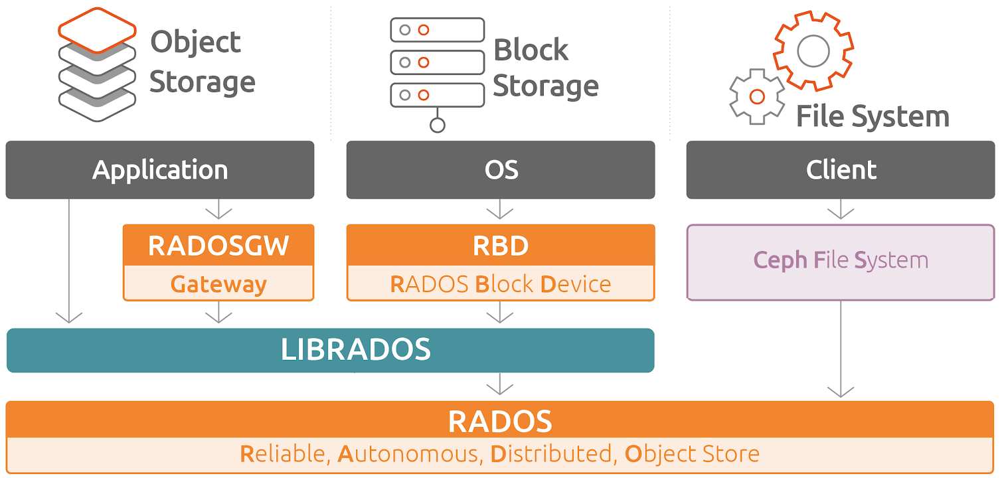
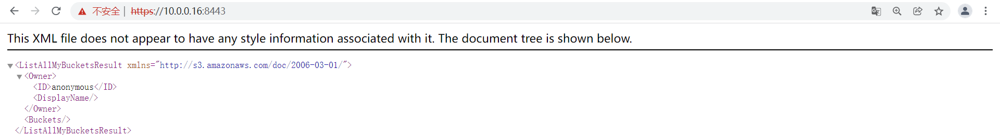

# 1 核心实践

## 1.1 认证管理

### 1.1.1 认证基础

学习目标

这一节，我们从 基础知识、简单实践、小结 三个方面来学习。

**基础知识**

简介

```powershell
	Ceph作为一个分布式存储系统，支持对象存储、块设备和文件系统。为了在网络传输中防止数据被篡改，做到较高程度的安全性，加入了Cephx加密认证协议。其目的是客户端和管理端之间的身份识别，加密、验证传输中的数据。
	注意：所谓的client就是使用ceph命令的客户端
	
```

```powershell
ceph集群默认开启了cephx协议功能
[cephadm@admin ceph-cluster]$ cat ceph.conf
[global]
...
auth_cluster_required = cephx
auth_service_required = cephx
auth_client_required = cephx
...

如果我们提供的是公共的信息 -- 不需要进行认证，所以我们可以禁用CephX功能。将对应的属性值设置为 none即可，比如
auth_cluster_required = none
```

认证场景

```powershell
命令行与Ceph集群操作，包括：
    RadosGW 对象网关认证（对象网关认证系统+cephx）
    RBD 认证
    CephFS 用户认证（文件路径+cephx）
Ceph集群内部组件之间通信
	执行ceph命令时，会使用client.admin 用户并加载 /etc/ceph/ceph.client.admin.keyring文件
```

认证和授权

```powershell
	在ceph系统中，所有元数据保存在mon节点的ceph-mon的进程中，mon保存了系统中重要的认证相关元数据，例如每个用户的key以及权限。样式结构如下：
	
    名称				key		Caps（权限）
    client.admin	xxxxxx	  osd allow rw, mon allow rw
    
    
```

```powershell
对于ceph的认证和授权来说，主要涉及到三个内容：ceph用户、资源权限、用户授权。
	- Ceph用户必须拥有执行权限才能执行Ceph的管理命令
	- Ceph用户需要拥有存储池访问权限才能到ceph中读取和写入数据
```

基本概念

```powershell
用户 
	- ceph创建出来的用户，可以进入到ceph集群里面
	- ceph支持多种类型，可管理的用户属于Client类型
	- MON、OSD和MDS等系统组件属于系统参与者客户端
授权
	- 将某些资源的使用权限交给特定的用户。
	- allow
权限
	- 描述用户可针对MON、OSD或MDS等资源的使用权限范围或级别
	- MON具备的权限包括r、w、x和allow profile cap
	- OSD具备的权限包括r、w、x和class-read、class-write和profile osd、存储池和名称空间设置
	- OSD具备的权限包括allow
```

权限解析

```powershell
allow
	需先于守护进程的访问设置指定，标识赋予的xx权限
r：读取权限，访问MON以检索CRUSH时依赖此使能
w：对象写入权限
x：调用类方法（读取和写入）的能力，以及在MON上执行auth操作的能力
class-read：x能力的子集，授予用户调用类读取方法的能力
class-write：x的子集，授予用户调用类写入方法的能力
*：授予用户对特定守护进程/存储池的读取、写入和执行权限，以及执行管理命令的能力
```

```powershell
profile osd
	授予用户以某个OSD身份连接到其他OSD或监视器的权限
profile mds
	授予用户以某个MDS身份连接到其他MDS或监视器的权限
profile bootstrap-osd
	授予用户引导OSD的权限，在部署时候产生
profile bootstrap-mds
	授予用户引导元数据服务器的权限，在部署时候产生
```

**简单实践**

CephX身份验正流程


```powershell
	client和osd都有一个叫做monclient的模块负责认证和密钥交换。而monitor上有一个AuthMonitor的服务模块负责与monclient对话。
```

```powershell
Ceph使用cephx协议对客户端进行身份认证
	每个MON都可以对客户端进行身份验正并分发密钥，不存在单点故障和性能瓶颈,MON会返回用于身份验正的数据结构，其包含获取Ceph服务时用到的session key.
	- session key通过客户端密钥进行加密
	- 客户端使用session key向MON请求所需的服务
	- MON向客户端提供一个ticket，用于向实际处理数据的OSD等验正客户端身份
	- MON和OSD共享同一个secret，因此OSD会信任由MON发放的ticket
	- ticket存在有效期限
注意：
	CephX身份验正功能仅限制Ceph的各组件之间，它不能扩展到其它非Ceph组件；
	它并不解决数据传输加密的问题；
```

CephX身份验正-MDS和OSD


```powershell
1 当client与Monitor实现基本的认证后，monitor与后端的mds和osd会自动进行认证信息的同步
2 当client与Monitor实现基本的通信认证后
	可以独立与后端的MDS服务发送请求。
	可以独立与后端的OSD服务发送请求
```

**小结**

```

```


### 1.1.2 用户基础

学习目标

这一节，我们从 基础知识、简单实践、小结 三个方面来学习。

**基础知识**

简介

```powershell
Ceph集群管理员能够直接在Ceph集群中创建、更新和删除用户
注意：
	创建用户时，可能需要将密钥分发到客户端，以便将密钥添加到密钥环
```

常见命令

```powershell
列出用户
	命令：ceph auth list
	用户标识：TYPE.ID，因此，osd.0表示OSD类型的用户，用户ID为0

检索特定用户
	命令：ceph auth get TYPE.ID或者ceph auth export TYPE.ID
	
列出用户的密钥
	命令：ceph auth print-key TYPE.ID
```

**简单实践**

信息查看

```powershell
查看用户账号
[cephadm@admin ceph-cluster]$ ceph auth list
osd.0
        key: AQCv3i9j34BWKhAAII3+THENuLJTv5Yr2NwDxA==
        caps: [mgr] allow profile osd
        caps: [mon] allow profile osd
        caps: [osd] allow *
...
结果显示：
	每个osd都有类似的caps权限信息
	client.admin具备的权限是非常多的
```

```powershell
查看制定的认证信息
[cephadm@admin ceph-cluster]$ ceph auth get osd.0
[osd.0]
        key = AQCv3i9j34BWKhAAII3+THENuLJTv5Yr2NwDxA==
        caps mgr = "allow profile osd"
        caps mon = "allow profile osd"
        caps osd = "allow *"
exported keyring for osd.0
```

```powershell
查看秘钥文件信息
[cephadm@admin ceph-cluster]$ ls /etc/ceph/
ceph.client.admin.keyring  ceph.conf  rbdmap  tmpr0oj5H
	
查看秘钥环相关的信息
[cephadm@admin ceph-cluster]$ cat /etc/ceph/ceph.client.admin.keyring
[client.admin]
        key = AQAr0S9jK8RNLxAAD/xpDZgnAx1kQEV3+/utWw==
        caps mds = "allow *"
        caps mgr = "allow *"
        caps mon = "allow *"
        caps osd = "allow *"
注意：
	一个秘钥环里面可以存放很多秘钥信息的
```

```powershell
列出用户秘钥信息
[cephadm@admin ceph-cluster]$ ceph auth print-key mgr.mon01
AQC12C9j/hAgKhAA6lOZiUpz5kqA55PFv3eHng==
```

**小结**

```

```

### 1.1.3 用户实践

学习目标

这一节，我们从 基础知识、简单实践、小结 三个方面来学习。

**基础知识**

简介

```powershell
	在ceph中，针对用户主要有两种场景：增删和导出导入
```

命令解析

```powershell
添加用户
	ceph auth add：创建用户、生成密钥并添加指定的caps
	ceph auth get-or-create：创建用户并返回密钥文件格式的密钥信息，用户存在时返回密钥信息
	ceph auth get-or-create-key：创建用户并返回密钥信息，用户存在时返回密钥信息

注意：
	典型的用户至少对 Ceph monitor 具有读取功能，并对 Ceph OSD 具有读取和写入功能；
	另外，用户的 OSD 权限通常应该限制为只能访问特定的存储池，
	否则，他将具有访问集群中所有存储池的权限
```

```powershell
导入用户
	命令：ceph auth import

修改用户caps
	命令：ceph auth caps
		会覆盖用户现有的caps，因此建立事先使用ceph auth get TYPE.ID命令查看用户的caps
	若是为添加caps，则需要先指定现有的caps,命令格式如下：
		ceph auth caps TYPE.ID daemon 'allow [r|w|x|*|...] [pool=pool-name]' ...

删除用户
	命令：ceph auth del TYPE.ID
```

**简单实践**

添加用户

```powershell
查看帮助信息
[cephadm@admin ceph-cluster]$ ceph auth --help

 General usage:
 ==============
usage: ceph [-h] [-c CEPHCONF] [-i INPUT_FILE] [-o OUTPUT_FILE]
            [--setuser SETUSER] [--setgroup SETGROUP] [--id CLIENT_ID]
            [--name CLIENT_NAME] [--cluster CLUSTER]
            [--admin-daemon ADMIN_SOCKET] [-s] [-w] [--watch-debug]
            [--watch-info] [--watch-sec] [--watch-warn] [--watch-error]
            [--watch-channel {cluster,audit,*}] [--version] [--verbose]
            [--concise] [-f {json,json-pretty,xml,xml-pretty,plain}]
            [--connect-timeout CLUSTER_TIMEOUT] [--block] [--period PERIOD]
```

```powershell
创建普通用户
[cephadm@admin ceph-cluster]$ ceph auth add client.testuser mon 'allow r' osd 'allow rw pool=rdbpool'
added key for client.testuser

获取创建的用户信息
[cephadm@admin ceph-cluster]$ ceph auth get client.testuser
[client.testuser]
        key = AQDfOTBjsmRaEhAATcpXwDluXBpshy4420/zgg==
        caps mon = "allow r"
        caps osd = "allow rw pool=rdbpool"
exported keyring for client.testuser

列出用户的秘钥信息
[cephadm@admin ceph-cluster]$ ceph auth print-key client.testuser
AQDfOTBjsmRaEhAATcpXwDluXBpshy4420/zgg==
```

用户授权

```powershell
修改用户的授权
[cephadm@admin ceph-cluster]$ ceph auth caps client.testuser mon 'allow rw' osd 'allow rw pool=rdbpool1'
updated caps for client.testuser

查看修改后的授权信息
[cephadm@admin ceph-cluster]$ ceph auth get client.testuser
[client.testuser]
        key = AQDfOTBjsmRaEhAATcpXwDluXBpshy4420/zgg==
        caps mon = "allow rw"
        caps osd = "allow rw pool=rdbpool1"
exported keyring for client.testuser
```

导出用户

```powershell
查看导出信息
[cephadm@admin ceph-cluster]$ ceph auth export client.testuser
[client.testuser]
        key = AQDfOTBjsmRaEhAATcpXwDluXBpshy4420/zgg==
        caps mon = "allow rw"
        caps osd = "allow rw pool=rdbpool1"
export auth(key=AQDfOTBjsmRaEhAATcpXwDluXBpshy4420/zgg==)
```

```powershell
导出信息到一个备份文件
[cephadm@admin ceph-cluster]$ ceph auth export client.testuser > testuser.file
export auth(key=AQDfOTBjsmRaEhAATcpXwDluXBpshy4420/zgg==)

[cephadm@admin ceph-cluster]$ cat testuser.file
[client.testuser]
        key = AQDfOTBjsmRaEhAATcpXwDluXBpshy4420/zgg==
        caps mon = "allow rw"
        caps osd = "allow rw pool=rdbpool1"
```

删除用户

```powershell
删除用户信息
[cephadm@admin ceph-cluster]$ ceph auth del client.testuser
updated

查看效果
[cephadm@admin ceph-cluster]$ ceph auth get client.testuser
Error ENOENT: failed to find client.testuser in keyring
```

导入用户

```powershell
导入用户文件
[cephadm@admin ceph-cluster]$ ceph auth  import -i testuser.file
imported keyring

查看文件效果
[cephadm@admin ceph-cluster]$ ceph auth get client.testuser
[client.testuser]
        key = AQDfOTBjsmRaEhAATcpXwDluXBpshy4420/zgg==
        caps mon = "allow rw"
        caps osd = "allow rw pool=rdbpool1"
exported keyring for client.testuser
```

尝试创建一个未知的用户

```powershell
创建一个已知的用户
[cephadm@admin ceph-cluster]$ ceph auth get-or-create client.testuser
[client.testuser]
        key = AQDfOTBjsmRaEhAATcpXwDluXBpshy4420/zgg==
结果显示：
	如果是一个已存在的用户名，则会返回具体的信息，而且不会覆盖现有的用户信息
	
[cephadm@admin ceph-cluster]$ ceph auth get client.testuser
[client.testuser]
        key = AQDfOTBjsmRaEhAATcpXwDluXBpshy4420/zgg==
        caps mon = "allow rw"
        caps osd = "allow rw pool=rdbpool1"
exported keyring for client.testuser
```

```powershell
创建一个未知的用户
[cephadm@admin ceph-cluster]$ ceph auth get-or-create client.testuser2 mon 'allow r' osd 'allow rw pool=rdbpool'
[client.testuser2]
        key = AQAwPDBjHPByABAA+nMEvAXztrzE8FSCZkNGgg==
        
如果从未出现过的用户，则直接创建新的用户
[cephadm@admin ceph-cluster]$ ceph auth get client.testuser2
[client.testuser2]
        key = AQAwPDBjHPByABAA+nMEvAXztrzE8FSCZkNGgg==
        caps mon = "allow r"
        caps osd = "allow rw pool=rdbpool"
exported keyring for client.testuser2
```

**小结**

```

```


### 1.1.4 秘钥管理

学习目标

这一节，我们从 基础知识、简单实践、小结 三个方面来学习。

**基础知识**

keyring

```powershell
	密钥环文件是“存储机密、密码、密钥、证书并使它们可用于应用程序的组件的集合”。密钥环文件存储一个或多个 Ceph 身份验证密钥以及可能的相关功能规范。

注意：
	每个键都与一个实体名称相关联，形式为 {client,mon,mds,osd}.name。
	ceph-authtool 是一个用于创建、查看和修改 Ceph 密钥环文件的实用程序。
```

秘钥环文件信息

```powershell
访问Ceph集群时，客户端会于本地查找密钥环，只有，认证成功的对象，才可以正常使用。

默认情况下，Ceph会使用以下四个密钥环名称预设密钥环
	/etc/ceph/cluster-name.user-name.keyring：保存单个用户的keyring
	/etc/ceph/cluster.keyring：保存多个用户的keyring
	/etc/ceph/keyring
	/etc/ceph/keyring.bin
	注意：
		cluster-name是为集群名称，user-name是为用户标识（TYPE.ID）
		client.admin用户的在名为ceph的集群上的密钥环文件名为ceph.client.admin.keyring
```

keyring的管理

```powershell
创建keyring
	ceph auth add等命令添加的用户还需要额外使用ceph-authtool命令为其创建用户密钥环文件,ceph客户端通过keyring文件查找用户名并检索密钥
	命令：ceph-authtool --create-keyring /path/to/kerying
注意
	keyring文件一般应该保存于/etc/ceph目录中，以便客户端能自动查找
	创建包含多个用户的keyring文件时，应该使用cluster-name.keyring作为文件名
	创建仅包含单个用户的kerying文件时，应该使用cluster-name.user-name.keyring作为文件名
```

```powershell
将用户添加至keyring
	可将某个用户从包含多个用户的keyring中导出，并保存于一个专用的keyring文件
	命令：ceph auth get TYPE.ID -o /etc/ceph/cluster-name.user-name.keyring

	也可将用户的keyring合并至一个统一的keyring文件中
	命令：ceph-authtool /etc/ceph/cluster-name.keyring --import-key /etc/ceph/clustername.
user-name.keyring
```

```powershell
ceph-authtool命令可直接创建用户、授予caps并创建keyring
	ceph-authtool keyringfile [-C | --create-keyring] [-n | --name entityname] [--genkey]
[-a | --add-key base64_key] [--cap | --caps capfile]
	
注意：
	此种方式添加的用户仅存在于keyring文件中，管理员还需要额外将其添加至Ceph集群上；
	命令： ceph auth add TYPE.ID -i /PATH/TO/keyring
```


**简单实践**

创建携带秘钥环的账号

```powershell
创建普通格式的用户
[cephadm@admin ceph-cluster]$ ceph auth get-or-create client.kube mon 'allow r' osd 'allow * pool=kube'
[client.kube]
        key = AQA11TBjzq6NEhAAF2tyvEY0L+XYMP7IOykkcQ==
```

```powershell
查看用户信息
[cephadm@admin ceph-cluster]$ ceph auth get client.kube
[client.kube]
        key = AQA11TBjzq6NEhAAF2tyvEY0L+XYMP7IOykkcQ==
        caps mon = "allow r"
        caps osd = "allow * pool=kube"
exported keyring for client.kube

查看文件
[cephadm@admin ceph-cluster]$ ls
ceph.bootstrap-mds.keyring  ceph.bootstrap-rgw.keyring  ceph-deploy-ceph.log
ceph.bootstrap-mgr.keyring  ceph.client.admin.keyring   ceph.mon.keyring
ceph.bootstrap-osd.keyring  ceph.conf                   testuser.file                  
结果显示：
	没有生成对应的用户秘钥环文件
```

导出秘钥环文件

```powershell
将普通的用户导出为keyring
[cephadm@admin ceph-cluster]$ ceph auth get client.kube -o ceph.client.kube.keyring
exported keyring for client.kube
```

```powershell
查看效果
[cephadm@admin ceph-cluster]$ ll *kube*
-rw-rw-r-- 1 cephadm cephadm 117 9月  26 06:26 ceph.client.kube.keyring
[cephadm@admin ceph-cluster]$ cat ceph.client.kube.keyring
[client.kube]
        key = AQA11TBjzq6NEhAAF2tyvEY0L+XYMP7IOykkcQ==
        caps mon = "allow r"
        caps osd = "allow * pool=kube"
```

合并秘钥环文件

```powershell
创建要合并的文件
[cephadm@admin ceph-cluster]$ ceph-authtool --create-keyring cluster.keyring
creating cluster.keyring
[cephadm@admin ceph-cluster]$ ll cluster.keyring
-rw------- 1 cephadm cephadm 0 9月  26 06:28 cluster.keyring

合并要导入的keyring文件
[cephadm@admin ceph-cluster]$ ceph-authtool cluster.keyring --import-keyring ceph.client.kube.keyring
importing contents of ceph.client.kube.keyring into cluster.keyring
[cephadm@admin ceph-cluster]$ cat cluster.keyring
[client.kube]
        key = AQA11TBjzq6NEhAAF2tyvEY0L+XYMP7IOykkcQ==
        caps mon = "allow r"
        caps osd = "allow * pool=kube"
```

```powershell
再来合并一个用户
c[cephadm@admin ceph-cluster]$ ceph-authtool cluster.keyring --import-keyring ceph.client.admin.keyring
importing contents of ceph.client.admin.keyring into cluster.keyring

查看合并后效果
[cephadm@admin ceph-cluster]$ cat cluster.keyring
[client.admin]
        key = AQAr0S9jK8RNLxAAD/xpDZgnAx1kQEV3+/utWw==
        caps mds = "allow *"
        caps mgr = "allow *"
        caps mon = "allow *"
        caps osd = "allow *"
[client.kube]
        key = AQA11TBjzq6NEhAAF2tyvEY0L+XYMP7IOykkcQ==
        caps mon = "allow r"
        caps osd = "allow * pool=kube"
```

```powershell
专用查看keyring的内容
[cephadm@admin ceph-cluster]$ ceph-authtool -l cluster.keyring
[client.admin]
        key = AQAr0S9jK8RNLxAAD/xpDZgnAx1kQEV3+/utWw==
        caps mds = "allow *"
        caps mgr = "allow *"
        caps mon = "allow *"
        caps osd = "allow *"
[client.kube]
        key = AQA11TBjzq6NEhAAF2tyvEY0L+XYMP7IOykkcQ==
        caps mon = "allow r"
        caps osd = "allow * pool=kube"
```

**小结**

```

```


## 1.2 RBD接口

### 1.2.1 基础知识

学习目标

这一节，我们从 基础知识、简单实践、小结 三个方面来学习。

**基础知识**

简介



```powershell
	Ceph块设备，也称为RADOS块设备（简称RBD），是一种基于RADOS存储系统支持超配（thin-provisioned）、可伸缩的条带化数据存储系统，它通过librbd库与OSD进行交互。RBD为KVM等虚拟化技术和云OS（如OpenStack和CloudStack）提供高性能和无限可扩展性的存储后端，这些系统依赖于libvirt和QEMU实用程序与RBD进行集成。
```

RBD

```powershell
RBD，全称RADOS Block Devices，是一种建构在RADOS存储集群之上为客户端提供块设备接口的存储服务中间层.
	- 这类的客户端包括虚拟化程序KVM（结合qemu）和云的计算操作系统OpenStack和CloudStack等

RBD基于RADOS存储集群中的多个OSD进行条带化，支持存储空间的简配（thinprovisioning）和动态扩容等特性，并能够借助于RADOS集群实现快照、副本和一致性。同时，RBD自身也是RADOS存储集群的客户端，它通过将存储池提供的存储服务抽象为一到多个image（表现为块设备）向客户端提供块级别的存储接口
	- RBD支持两种格式的image，不过v1格式因特性较少等原因已经处于废弃状态
	- 当前默认使用的为v2格式
```

```powershell
客户端访问RBD设备的方式有两种
	- 通过内核模块rbd.ko将image映射为节点本地的块设备，相关的设备文件一般为/dev/rdb#（#为设备编号，例如rdb0等）
	- 通过librbd提供的API接口，它支持C/C++和Python等编程语言，qemu即是此类接口的客户端
```

操作逻辑

```powershell
	RBD接口在ceph环境创建完毕后，就在服务端自动提供了; 客户端基于librbd库即可将RADOS存储集群用作块设备。不过，RADOS集群体用块设备需要经过一系列的"额外操作"才能够为客户端提供正常的存储功能。
	这个过程步骤，主要有以下几步：
		- 1 创建一个专用的存储池
			ceph osd pool create {pool-name} {pg-num} {pgp-num}
		- 2 对存储池启用rbd功能
			ceph osd pool application enable {pool-name} rbd
		- 3 对存储池进行环境初始化
			rbd pool init -p {pool-name}
		- 4 基于存储池创建专用的磁盘镜像
			rbd create --size <megabytes> --pool <pool-name> <image-name>
```

```powershell
其他命令
	存储池中的各image名称需要惟一，“rbd ls”命令能够列出指定存储池中的image
	rbd ls [-p <pool-name>] [--format json|xml] [--pretty-format] <pool-name>

	要获取指定image的详细信息，则通常使用“rbd info”命令
	rbd info [--pool <pool>] [--image <image>]  [--format <format>] ...
```


**简单实践**

创建专用存储池

```powershell
[cephadm@admin ceph-cluster]$ ceph osd pool create rbddata 64
pool 'rbddata' created

注意：
	这里面的pg数量，我们定制为64个
```

对存储池启用rbd功能

```powershell
启用存储池的rbd功能
[cephadm@admin ceph-cluster]$ ceph osd pool application enable rbddata rbd
enabled application 'rbd' on pool 'rbddata'
注意：
	如果关闭应用的话，使用disable
	
查看rbc的效果
[cephadm@admin ceph-cluster]$ ceph osd pool application get rbddata
{
    "rbd": {}
}
```

对存储池进行环境初始化

```powershell
环境初始化
[cephadm@admin ceph-cluster]$ rbd pool init -p rbddata

查看效果
[cephadm@admin ceph-cluster]$ rbd pool stats rbddata
Total Images: 0
Total Snapshots: 0
Provisioned Size: 0 B
```

基于存储池创建专用的磁盘镜像

```powershell
创建镜像
[cephadm@admin ceph-cluster]$ rbd create img1 --size 1024 --pool rbddata
[cephadm@admin ceph-cluster]$ rbd ls -p rbddata
img1

查看状态
[cephadm@admin ceph-cluster]$ rbd pool stats rbddata
Total Images: 1
Total Snapshots: 0
Provisioned Size: 1 GiB
```

```powershell
注意：
	这个时候，我们创建出来的磁盘影响文件，就可以在客户端上，通过内核机制，直接导入到内核中，在内核中被当成一个磁盘设备来进行使用，样式就是 /dev/xxx，然后就可以针对这个rdb磁盘设备，进行各种后续分区、格式化等操作。
```

查看磁盘信息

```powershell
查看方法1：
[cephadm@admin ceph-cluster]$ rbd info rbddata/img1
[cephadm@admin ceph-cluster]$ rbd --image img1 --pool rbddata info
rbd image 'img1':
        size 1 GiB in 256 objects
        order 22 (4 MiB objects)
        snapshot_count: 0
        id: 3817a3738fac
        block_name_prefix: rbd_data.3817a3738fac
        format: 2
        features: layering, exclusive-lock, object-map, fast-diff, deep-flatten
        op_features:
        flags:
        create_timestamp: Mon Sep 26 10:46:25 2062
        access_timestamp: Mon Sep 26 10:46:25 2062
        modify_timestamp: Mon Sep 26 10:46:25 2062
```

```powershell
size : 就是这个块的大小，即1024MB=1G，1024MB/256 = 4M,共分成了256个对象(object)，每个对象4M。
order 22： 有效范围为12-25。22是个幂编号，4M是22， 8M是23，也就是2^22 bytes = 4MB, 2^23 bytes = 8MB
block_name_prefix : 这个是块的最重要的属性了，这是每个块在ceph中的唯一前缀编号，有了这个前缀，把主机上的OSD都拔下来带回家，就能复活所有的VM了
format : 格式有两种，1和2
features：当前image启用的功能特性，其值是一个以逗号分隔的字符串列表，例如
        	layering, exclusive-lock, object-map
op_features：可选的功能特性；
```

磁盘设备的删除

```powershell
删除设备
[cephadm@admin ceph-cluster]$ rbd rm rbddata/img1
Removing image: 100% complete...done.

查看效果
[cephadm@admin ceph-cluster]$ rbd ls -p rbddata
[cephadm@admin ceph-cluster]$ rbd pool stats rbddata
Total Images: 0
Total Snapshots: 0
Provisioned Size: 0 B

删除存储池
[cephadm@admin ceph-cluster]$ ceph osd pool rm rbddata rbddata --yes-i-really-really-mean-it
pool 'rbddata' removed
```

**小结**

```

```


### 1.2.2 镜像管理

学习目标

这一节，我们从 基础知识、简单实践、小结 三个方面来学习。

**基础知识**

镜像属性

| 属性           | 解析                                                         |
| -------------- | ------------------------------------------------------------ |
| layering       | 分层克隆机制，磁盘的数据分层获取克隆机制                     |
| striping       | 是否支持数据对象间的数据条带化                               |
| exclusive-lock | 排它锁的机制，磁盘应用于多路读写机制场景。限制同时仅能有一个客户端访问当前image |
| object-map     | 对象位图机制，主要用于加速导入、导出及已用容量统计等操作，依赖于exclusive-lock特性 |
| fast-diff      | 快照定制机制，快速对比数据差异，便于做快照管理，依赖于object-map特性 |
| deep-flatten   | 数据处理机制，解除父子image及快照的依赖关系                  |
| journaling     | 磁盘日志机制，将image的所有修改操作进行日志化，便于异地备份，依赖于exclusive-lock特性 |
| data-pool      | 是否支持将image的数据对象存储于纠删码存储池，主要用于将image的元数据与数据放置于不同的存储池； |

属性操作

```powershell
镜像功能命令
cephadm@admin:~/ceph-cluster$ rbd --help | grep feature
    feature disable                   Disable the specified image feature.
    feature enable                    Enable the specified image feature.
```

**简单实践**

准备工作

```powershell
创建存储池
[cephadm@admin ceph-cluster]$ ceph osd pool create kube 64 64
pool 'kube' created
[cephadm@admin ceph-cluster]$ ceph osd pool ls
kube


启动rbd功能
[cephadm@admin ceph-cluster]$ ceph osd pool application enable kube rbd
enabled application 'rbd' on pool 'kube'


rbd环境初始化
[cephadm@admin ceph-cluster]$ rbd pool init kube
```


创建镜像

```powershell
方法2：通过参数属性方式，创建一个2G的镜像文件
[cephadm@admin ceph-cluster]$ rbd create --pool super --size 2G --image vol01

查看镜像
[cephadm@admin ceph-cluster]$ rbd ls --pool kube
vol01
```

```powershell
方法2：通过<image-spec>方式，创建一个2G的镜像文件
[cephadm@admin ceph-cluster]$ rbd create --size 2G kube/vol02

查看镜像
[cephadm@admin ceph-cluster]$ rbd ls --pool kube
vol01
vol02
```

```powershell
查看详情信息 -l
[cephadm@admin ceph-cluster]$ rbd ls --pool kube -l
NAME   SIZE   PARENT  FMT  PROT  LOCK
vol01  2 GiB            2
vol02  2 GiB            2

以json格式查看详情 --format json --pretty-format
[cephadm@admin ceph-cluster]$ rbd ls --pool kube -l --format json --pretty-format
[
    {
        "image": "vol01",
        "size": 2147483648,
        "format": 2
    },
    {
        "image": "vol02",
        "size": 2147483648,
        "format": 2
    }
]
```

```powershell
查看镜像属性
[cephadm@admin ceph-cluster]$ rbd info kube/vol01
rbd image 'vol01':
        size 2 GiB in 512 objects
        order 22 (4 MiB objects)
        snapshot_count: 0
        id: 386ed735e96b
        block_name_prefix: rbd_data.386ed735e96b
        format: 2
        features: layering, exclusive-lock, object-map, fast-diff, deep-flatten
        ...
```


镜像属性

```powershell
禁用磁盘镜像功能
[cephadm@admin ceph-cluster]$ rbd feature disable kube/vol01 object-map fast-diff deep-flatten
[cephadm@admin ceph-cluster]$ rbd info --pool kube --image vol01
rbd image 'vol01':
        size 2 GiB in 512 objects
        ...
        features: layering, exclusive-lock
        ...
```

```powershell
启用磁盘镜像功能
[cephadm@admin ceph-cluster]$ rbd feature enable kube/vol01 object-map fast-diff
[cephadm@admin ceph-cluster]$ rbd info --pool kube --image vol01
rbd image 'vol01':
        size 2 GiB in 512 objects
        ...
        flags: object map invalid, fast diff invalid
        ...
```


**小结**

```

```


### 1.2.3 镜像实践

学习目标

这一节，我们从 基础知识、简单实践、小结 三个方面来学习。

**基础知识**

磁盘使用

```powershell
使用方法1：通过内核级别的ceph模块，将rdb设备提供给相关主机使用
	初始化存储池后，创建image
	最好禁用 object-map，fast-diff，deep-flatten功能
	需要直接与monitor角色进行通信
		- 若存储集群端启用了CephX认证，还需要指定用户名和keyring文件
	使用rdb命令的map子命令，进行磁盘文件的映射
	
注意：
	在客户端上可以通过 rbd showmapped 查看已经映射的image
	在客户端上可以通过 rbd unmap 命令断开已经映射的image
```

admin主机管理image镜像文件的权限

```powershell
禁用无效的属性
[cephadm@admin ceph-cluster]$ rbd feature disable kube/vol01 object-map fast-diff
[cephadm@admin ceph-cluster]$ rbd info --pool kube --image vol01
rbd image 'vol01':
        size 2 GiB in 512 objects
        ...
        features: layering, exclusive-lock
```

映射命令的帮助

```powershell
[cephadm@admin ceph-cluster]$ rbd help map
usage: rbd map [--device-type <device-type>] [--pool <pool>]
               [--namespace <namespace>] [--image <image>] [--snap <snap>]
               [--read-only] [--exclusive] [--options <options>]
               <image-or-snap-spec>
...
```

**简单实践**

客户端主机安装基本环境

```powershell
客户端主机安装环境
[root@stor06 ~]# yum install ceph ceph-common -y
```

```powershell
查看模块效果
[root@stor06 ~]# modinfo ceph
filename:       /lib/modules/3.10.0-1160.el7.x86_64/kernel/fs/ceph/ceph.ko.xz
license:        GPL
description:    Ceph filesystem for Linux
author:         Patience Warnick <patience@newdream.net>
author:         Yehuda Sadeh <yehuda@hq.newdream.net>
author:         Sage Weil <sage@newdream.net>
alias:          fs-ceph
retpoline:      Y
rhelversion:    7.9
srcversion:     EB765DDC1F7F8219F09D34C
depends:        libceph
intree:         Y
vermagic:       3.10.0-1160.el7.x86_64 SMP mod_unload modversions
signer:         CentOS Linux kernel signing key
sig_key:        E1:FD:B0:E2:A7:E8:61:A1:D1:CA:80:A2:3D:CF:0D:BA:3A:A4:AD:F5
sig_hashalgo:   sha256
```

管理端主机传递相关文件

```powershell
查看认证信息
[cephadm@admin ceph-cluster]$ ceph auth get client.kube
[client.kube]
        key = AQA11TBjzq6NEhAAF2tyvEY0L+XYMP7IOykkcQ==
        caps mon = "allow r"
        caps osd = "allow * pool=super"
exported keyring for client.kube
[cephadm@admin ceph-cluster]$ ls *kube*
ceph.client.kube.keyring

传递认证文件
[cephadm@admin ceph-cluster]$ sudo scp ceph.client.kube.keyring root@stor06:/etc/ceph/
```

```powershell
传递正常的ceph集群的配置文件
[cephadm@admin ceph-cluster]$ sudo scp ceph.conf root@stor06:/etc/ceph/
```

客户端简单使用

```powershell
默认情况下，是无法正常连接ceph集群的
root@stor06:~# ceph -s
[root@stor06 ~]# ceph -s
2062-09-26 11:05:04.530 7f7cca27f700 -1 auth: unable to find a keyring on /etc/ceph/ceph.client.admin.keyring,/etc/ceph/ceph.keyring,/etc/ceph/keyring,/etc/ceph/keyring.bin,: (2) No such file or directory
...
[errno 2] error connecting to the cluster
结果显示：
	默认采用的认证用户是 client.admin账号，而我们没有。
	
通过--user参数，使用指定的用户来访问ceph
[root@stor06 ~]# ceph --user kube -s
  cluster:
    id:     1d4e5773-619a-479d-861a-66ba451ce945
    health: HEALTH_OK
    ...
```

rdb文件的使用

```powershell
查看当前的系统磁盘效果
[root@stor06 ~]# fdisk -l | grep '磁盘 '
磁盘 /dev/sda：21.5 GB, 21474836480 字节，41943040 个扇区
磁盘 /dev/sdb：21.5 GB, 21474836480 字节，41943040 个扇区
磁盘 /dev/sdc：21.5 GB, 21474836480 字节，41943040 个扇区
```

```powershell
映射远程ceph的磁盘文件到本地
root@stor06:~# rbd --user kube map kube/vol01
/dev/rbd0

查看效果
[root@stor06 ~]# fdisk -l | grep '磁盘 '
...
磁盘 /dev/rbd0：2147 MB, 2147483648 字节，4194304 个扇区
```

```powershell
格式化磁盘
[root@stor06 ~]# mkfs.ext4 /dev/rbd0
mke2fs 1.45.5 (07-Jan-2020)
...
写入超级块和文件系统账户统计信息： 已完成
```

```powershell
挂载操作
[root@stor06 ~]# mount /dev/rbd0 /mnt
[root@stor06 ~]# mount | grep rbd
/dev/rbd0 on /mnt type ext4 (rw,relatime,stripe=1024,data=ordered)

尝试使用磁盘文件
[root@stor06 ~]# cp /etc/issue /mnt/
[root@stor06 ~]# cat /mnt/issue
```

```powershell
卸载操作
[root@stor06 ~]# umount /mnt
```

我们还可以在客户端上，使用 rbd命令对rbd设备进行管理

```powershell
客户端挂载操作
[root@stor06 ~]# mount /dev/rbd0 /mnt

确认效果
[root@stor06 ~]# rbd showmapped
id pool namespace image snap device
0  kube           vol01 -    /dev/rbd0
```

```powershell
主服务器上，查看挂载效果
[cephadm@admin ceph-cluster]$ rbd ls --pool kube -l
NAME  SIZE  PARENT FMT PROT LOCK
vol01 2 GiB          2      excl
vol02 2 GiB          2
```

磁盘卸载操作

```powershell
卸载操作
[root@stor06 ~]# rbd unmap /dev/rbd0
rbd: sysfs write failed
rbd: unmap failed: (16) Device or resource busy

卸载磁盘
[root@stor06 ~]# umount /mnt
[root@stor06 ~]# rbd unmap /dev/rbd0

查看挂载效果
[root@stor06 ~]# rbd showmapped

主节点查看挂载效果
[cephadm@admin ceph-cluster]$ rbd ls --pool kube -l
NAME   SIZE   PARENT  FMT  PROT  LOCK
vol01  2 GiB            2
vol02  2 GiB            2
```

**小结**

```

```


### 1.2.4 容量管理

学习目标

这一节，我们从 基础知识、简单实践、小结 三个方面来学习。

**基础知识**

容量

```powershell
如果有必要的话，我们可以针对镜像文件的大小进行容量的调整。
[cephadm@admin ceph-cluster]$ rbd help resize
usage: rbd resize [--pool <pool>] [--namespace <namespace>]
                  [--image <image>] --size <size> [--allow-shrink]
                  [--no-progress]
                  <image-spec>
```

调整image的大小

```powershell
增大：
	rbd resize [--pool <pool>] [--image <image>] --size <size>
减少：
	rbd resize [--pool <pool>] [--image <image>] --size <size> [--allow-shrink]
```

删除image

```powershell
命令格式
	rbd remove [--pool <pool>] [--image <image>] ... 
	注意：
		删除image会导致数据丢失，且不可恢复；
```

```powershell
	如果删除一些敏感的image，为了保险，推荐使用回收站功能trash，确定不再需要时再从trash中删除；
命令格式：
	rbd trash {list|move|purge|remove|restore}
```


**简单实践**

image的容量扩展

```powershell
查看当前的image容量
[cephadm@admin ceph-cluster]$ rbd ls -p kube -l
NAME   SIZE   PARENT  FMT  PROT  LOCK
vol01  2 GiB            2
vol02  2 GiB            2

调整image容量
[cephadm@admin ceph-cluster]$ rbd resize -s 5G kube/vol01
Resizing image: 100% complete...done.

再次确认image容量大小
[cephadm@admin ceph-cluster]$ rbd ls -p kube -l
NAME   SIZE   PARENT  FMT  PROT  LOCK
vol01  5 GiB            2
vol02  2 GiB            2
```

image容量的缩小

```powershell
调整image容量
[cephadm@admin ceph-cluster]$ rbd resize -s 3G kube/vol01 --allow-shrink
Resizing image: 100% complete...done.

再次确认image容量大小
[cephadm@admin ceph-cluster]$ rbd ls -p kube -l
NAME   SIZE   PARENT  FMT  PROT  LOCK
vol01  3 GiB            2
vol02  2 GiB            2
```

删除image文件

```powershell
删除image文件
[cephadm@admin ceph-cluster]$ rbd rm kube/vol02
Removing image: 100% complete...done.

查看image文件效果
[cephadm@admin ceph-cluster]$ rbd ls -p kube -l
NAME   SIZE   PARENT  FMT  PROT  LOCK
vol01  3 GiB            2
注意：
	image文件的删除是不可修复的
```

image文件恢复

```powershell
查看trash命令帮助
[cephadm@admin ceph-cluster]$ rbd trash --help | grep trash
    trash list (trash ls)             List trash images.
    trash move (trash mv)             Move an image to the trash.
    trash purge                       Remove all expired images from trash.
    trash remove (trash rm)           Remove an image from trash.
    trash restore                     Restore an image from trash.
```

简介

```powershell
查看回收站
[cephadm@admin ceph-cluster]$ rbd trash ls -p kube

移动文件到回收站
[cephadm@admin ceph-cluster]$ rbd trash move kube/vol01

查看回收站
[cephadm@admin ceph-cluster]$ rbd trash ls -p kube
386ed735e96b vol01

查看文件
[cephadm@admin ceph-cluster]$ rbd ls -p kube -l
[cephadm@admin ceph-cluster]$
```

```powershell
恢复image文件
[cephadm@admin ceph-cluster]$ rbd trash restore -p kube --image vol01 --image-id 386ed735e96b

查看回收站
[cephadm@admin ceph-cluster]$ rbd trash ls -p kube

查看image文件
[cephadm@admin ceph-cluster]$ rbd ls -p kube -l
NAME  SIZE  PARENT FMT PROT LOCK
vol01 3 GiB          2
```

**小结**

```

```


### 1.2.5 快照管理

学习目标

这一节，我们从 基础知识、简单实践、小结 三个方面来学习。

**基础知识**

快照

```powershell
	RBD支持image快照技术，借助于快照可以保留image的状态历史。Ceph还支持快照“分层”机制，从而可实现快速克隆VM映像。
```

常见命令

```powershell
创建快照
	rbd snap create [--pool <pool>] --image <image> --snap <snap>
	或者 rbd snap create [<pool-name>/]<image-name>@<snapshot-name>
注意：
	在创建映像快照之前应停止image上的IO操作，且image上存在文件系统时，还要确保其处于一致状态；
```

```powershell
列出快照
	rbd snap ls [--pool <pool>] --image <image> ...
```

```powershell
回滚快照
	rbd snap rollback [--pool <pool>] --image <image> --snap <snap> ...
注意：
	意味着会使用快照中的数据重写当前版本的image，回滚所需的时间将随映像大小的增加而延长
```

```powershell
限制快照数量
	快照数量过多，必然会导致image上的原有数据第一次修改时的IO压力恶化
	rbd snap limit set [--pool <pool>] [--image <image>] ...

解除限制
	rbd snap limit clear [--pool <pool>] [--image <image>]
```

```powershell
删除快照
	rbd snap rm [--pool <pool>] [--image <image>] [--snap <snap>] [--no-progress]
[--force]
提示：
	Ceph OSD会以异步方式删除数据，因此删除快照并不能立即释放磁盘空间;
```

```powershell
清理快照
	删除一个image的所有快照，可以使用rbd snap purge命令
	rbd snap purge [--pool <pool>] --image <image> [--no-progress]
```


**简单实践**

查看快照命令

```powershell
[cephadm@admin ceph-cluster]$ rbd --help | grep '  snap '
    snap create (snap add)            Create a snapshot.
    snap limit clear                  Remove snapshot limit.
    snap limit set                    Limit the number of snapshots.
    snap list (snap ls)               Dump list of image snapshots.
    snap protect                      Prevent a snapshot from being deleted.
    snap purge                        Delete all unprotected snapshots.
    snap remove (snap rm)             Delete a snapshot.
    snap rename                       Rename a snapshot.
    snap rollback (snap revert)       Rollback image to snapshot.
    snap unprotect                    Allow a snapshot to be deleted.
```

客户端准备rbd文件

```powershell
客户端挂载rbd文件
[root@stor06 ~]# rbd --user kube map kube/vol01
/dev/rbd0

查看效果
[root@stor06 ~]# rbd showmapped
id  pool  namespace  image  snap  device
0   kube             vol01  -     /dev/rbd0

挂载操作
[root@stor06 ~]# mount /dev/rbd0 /mnt
[root@stor06 ~]# ls /mnt/
issue  lost+found
结果显示：
	虽然容量调整过了，但是就有的文件仍然存在
```

管理端创建快照

```powershell
查看快照
[cephadm@admin ceph-cluster]$ rbd snap list kube/vol01

创建快照
[cephadm@admin ceph-cluster]$ rbd snap create kube/vol01@snap01

查看快照
[cephadm@admin ceph-cluster]$ rbd snap list kube/vol01
SNAPID NAME   SIZE  PROTECTED TIMESTAMP
     4 snap01 3 GiB           Mon Sep 26 11:34:20 2062
```

恢复快照动作

```powershell
客户端将文件删除
[root@stor06 ~]# ls /mnt/
issue  lost+found
[root@stor06 ~]# rm -f /mnt/issue
[root@stor06 ~]# ls /mnt/
lost+found

客户端解除磁盘的占用
root@stor06:~# umount /mnt
root@stor06:~# rbd unmap /dev/rbd0
root@stor06:~# rbd showmapped
```

```powershell
服务端恢复快照
[cephadm@admin ceph-cluster]$ rbd snap rollback kube/vol01@snap01
Rolling back to snapshot: 100% complete...done.

客户端重新加载磁盘文件
[root@stor06 ~]# rbd --user kube map kube/vol01
/dev/rbd0
[root@stor06 ~]# mount /dev/rbd0 /mnt
[root@stor06 ~]# ls /mnt/
issue  lost+found
结果显示：
	快照数据恢复过来了
```

删除快照

```powershell
删除之前查看效果
[cephadm@admin ceph-cluster]$ rbd snap list kube/vol01
SNAPID NAME   SIZE  PROTECTED TIMESTAMP
     4 snap01 3 GiB           Mon Sep 26 11:34:20 2062
     
删除快照
[cephadm@admin ceph-cluster]$ rbd snap rm kube/vol01@snap01
Removing snap: 100% complete...done.

确认删除效果
[cephadm@admin ceph-cluster]$ rbd snap list kube/vol01
[cephadm@admin ceph-cluster]$ 
```

快照数量的限制

```powershell
设定快照数量的限制
[cephadm@admin ceph-cluster]$ rbd snap limit set --pool kube --image vol01 --limit 5

确认效果
[cephadm@admin ceph-cluster]$ rbd snap create kube/vol01@snap01
...
[cephadm@admin ceph-cluster]$ rbd snap create kube/vol01@snap06
rbd: failed to create snapshot: (122) Disk quota exceeded

解除快照限制
[cephadm@admin ceph-cluster]$ rbd snap limit clear --pool kube --image vol01

确认效果
[cephadm@admin ceph-cluster]$ rbd snap create kube/vol01@snap06
Creating snap: 100% complete...done.
[cephadm@admin ceph-cluster]$ rbd snap list kube/vol01
SNAPID NAME   SIZE  PROTECTED TIMESTAMP
     6 snap01 3 GiB           Mon Sep 26 11:38:25 2022
     ...
    13 snap06 3 GiB           Mon Sep 26 11:39:07 2022
```

清理所有快照

```powershell
清理所有快照
[cephadm@admin ceph-cluster]$ rbd snap purge --pool kube --image vol01

确认效果
[cephadm@admin ceph-cluster]$ rbd snap list kube/vol01
```


**小结**

```

```


### 1.2.6 快照分层

学习目标

这一节，我们从 基础知识、简单实践、小结 三个方面来学习。

**基础知识**

简介

```powershell
	Ceph支持在一个块设备快照的基础上创建一到多个COW或COR（Copy-On-Read）类型的克隆，这种中间快照层机制提了一种极速创建image的方式.用户可以创建一个基础image并为其创建一个只读快照层，而后可以在此快照层上创建任意个克隆进行读写操作，甚至能够进行多级克隆
	
例如:
	实践中可以为Qemu虚拟机创建一个image并安装好基础操作系统环境作为模板，对其创建创建快照层后，便可按需创建任意多个克隆作为image提供给多个不同的VM（虚拟机）使用，或者每创建一个克隆后进行按需修改，而后对其再次创建下游的克隆.
```

```powershell
	通过克隆生成的image在其功能上与直接创建的image几乎完全相同，它同样支持读、写、克隆、空间扩缩容等功能，惟一的不同之处是克隆引用了一个只读的上游快照，而且此快照必须要置于“保护”模式之下
```

```powershell
Ceph的快照支持COW和COR两种类型
	COW是为默认的类型，仅在数据首次写入时才需要将它复制到克隆的image中
	COR则是在数据首次被读取时复制到当前克隆中，随后的读写操作都将直接基于此克隆中的对象进行
```

分层快照使用

```powershell
在RBD上使用分层克隆的方法非常简单：
	创建一个image，对image创建一个快照并将其置入保护模式，而克隆此快照即可
	
创建克隆的image时，
	需要指定引用的存储池、镜像和镜像快照，以及克隆的目标image的存储池和镜像名称，
	因此，克隆镜像支持跨存储池进行
```


```powershell
简单来说，这里的快照分层，主要说的就是：
	基础的模板快照和特有应用快照
```


命令实践

```powershell
保护上游的原始快照
	下游image需要引用上游快照中的数据，快照的意外删除必将导致数据服务的中止，因此在克隆操作之外，必须将上游的快照置于保护模式
	rbd snap protect [--pool <pool>] --image <image> --snap <snap>
```

```powershell
克隆快照
	rbd clone [--pool <pool>] --image <image> --snap <snap> --dest-pool <dest-pool> ...
	rbd clone [<pool-name>/]<image-name>@<snapshot-name> [<pool-name>/]<image-name>
```

```powershell
列出快照的子项
	rbd children [--pool <pool>] --image <image> --snap <snap>
```

```powershell
展平克隆的image
	克隆的映像会保留对父快照的引用，删除子克隆对父快照的引用时，可通过将信息从快照复制到克隆，进行image的“展平”操作
	展平克隆所需的时间随着映像大小的增加而延长
	要删除某拥有克隆子项的快照，必须先平展其子image
	命令： rbd flatten [--pool <pool>] --image <image> --no-progress
```

```powershell
取消快照保护
	必须先取消保护快照，然后才能删除它
	用户无法删除克隆所引用的快照，需要先平展其每个克隆，然后才能删除快照
	命令：rbd snap unprotect [--pool <pool>] --image <image> --snap <snap>
```

**简单实践**

清理环境

```powershell
在客户端将磁盘取消应用
[root@stor06 ~]# umount /mnt
[root@stor06 ~]# rbd unmap /dev/rbd0
[root@stor06 ~]# rbd showmapped
```

服务端定制基础快照

```powershell
定制基础快照
[cephadm@admin ceph-cluster]$ rbd snap create kube/vol01@clonetpl01
[cephadm@admin ceph-cluster]$ rbd snap ls kube/vol01
SNAPID NAME       SIZE  PROTECTED TIMESTAMP
    20 clonetpl01 3 GiB           Mon Sep 26 11:42:51 2062
```

```powershell
将快照置于保护模式
[cephadm@admin ceph-cluster]$ rbd snap protect kube/vol01@clonetpl01
[cephadm@admin ceph-cluster]$ rbd snap ls kube/vol01
SNAPID NAME       SIZE  PROTECTED TIMESTAMP
    20 clonetpl01 3 GiB yes       Mon Sep 26 11:42:51 2062
结果显示：
	该快照已经被处于保护模式了
```

基于快照来进行克隆操作

```powershell
基于基础模板克隆一个镜像
[cephadm@admin ceph-cluster]$ rbd clone kube/vol01@clonetpl01 kube/myimg01
[cephadm@admin ceph-cluster]$ rbd clone kube/vol01@clonetpl01 kube/myimg02

查看效果
[cephadm@admin ceph-cluster]$ rbd ls -p kube
myimg01
myimg02
vol01

查看模板镜像的所有子镜像文件
[cephadm@admin ceph-cluster]$ rbd children kube/vol01@clonetpl01
kube/myimg01
kube/myimg02
```

```powershell
客户端尝试应用一下clone文件
[root@stor06 ~]# rbd --user kube map kube/myimg01
/dev/rbd0

查看效果
[root@stor06 ~]# rbd showmapped
id pool namespace image   snap device
0  kube           myimg01 -    /dev/rbd0

挂载操作
[root@stor06 ~]# mount /dev/rbd0 /mnt
[root@stor06 ~]# ls /mnt
issue  lost+found
[root@stor06 ~]# echo myimg1 >> /mnt/issue
结果显示：
	该clone镜像文件可以正常的使用
```

```powershell
客户端再次应用clone文件
[root@stor06 ~]# rbd --user kube map kube/myimg02
/dev/rbd1

查看效果
[root@stor06 ~]# rbd showmapped
id pool namespace image   snap device
0  kube           myimg01 -    /dev/rbd0
1  kube           myimg02 -    /dev/rbd1

挂载操作
[root@stor06 ~]# mkdir /mnt1
[root@stor06 ~]# mount /dev/rbd1 /mnt1
[root@stor06 ~]# cat /mnt1/issue
\S
Kernel \r on an \m
结果显示：
	多个clone镜像文件可以独立的正常使用
```

卸载操作

```powershell
客户端卸载myimg02
[root@stor06 ~]# umount /mnt1
[root@stor06 ~]# rbd unmap kube/myimg02

管理端删除image镜像
[cephadm@admin ceph-cluster]$ rbd rm kube/myimg02
Removing image: 100% complete...done.
[cephadm@admin ceph-cluster]$ rbd children kube/vol01@clonetpl01
kube/myimg01
```

展平快照文件

```powershell
	如果我们要删除底层的模板快照文件，为了避免对上层镜像的文件产生不好的影响，我们可以将底层快照的文件转移到上层clone文件中一份，这个动作叫展平快照文件
```

```powershell
展平数据
[cephadm@admin ceph-cluster]$ rbd flatten kube/myimg01
Image flatten: 100% complete...done.

取消保护基础快照模板文件
[cephadm@admin ceph-cluster]$ rbd snap unprotect kube/vol01@clonetpl01

移除底层的模板文件
[cephadm@admin ceph-cluster]$ rbd snap rm kube/vol01@clonetpl01
Removing snap: 100% complete...done.

查看效果
[cephadm@admin ceph-cluster]$ rbd snap ls kube/vol01
[cephadm@admin ceph-cluster]$ 
```

```powershell
在客户端上不影响子clone文件的操作
[root@stor06 ~]# ls /mnt
[root@stor06 ~]# cat /mnt/issue
```


**小结**

```

```


### 1.2.7 RBD实践

学习目标

这一节，我们从 案例需求、简单实践、小结 三个方面来学习。

**基础知识**

简介

```powershell
	ceph提供的块存储能够可以为其他虚拟机提供磁盘设备来进行使用，所以接下来我们准备将ceph的磁盘文件提供给kvm进行使用。
```

```powershell
	我们需要按照如下的步骤来进行相关的实践：
		1 kvm环境和ceph环境准备
		2 ceph和kvm认证集成
		3 kvm到ceph中创建镜像文件
		4 启动kvm虚拟机测试ceph磁盘使用效果
```

准备系统文件

```powershell
获取镜像文件
mkdir /data/images/ && cd /data/images/
wget http://download.cirros-cloud.net/0.5.2/cirros-0.5.2-x86_64-disk.img
```

部署kvm环境

```powershell
判断CPU是否支持硬件虚拟化
[root@stor05 ~]# egrep '(vmx|svm)' --color=always /proc/cpuinfo | wc -l
2

检查kvm模块是否加载
[root@stor05 ~]# lsmod | grep kvm
kvm_intel             188740  0
kvm                   637289  1 kvm_intel
irqbypass              13503  1 kvm
```

```powershell
安装软件
[root@stor05 ~]# yum install -y virt-manager libvirt qemu-kvm kvm
注意：
	libvirt 虚拟机管理
	virt 虚拟机安装克隆
	qemu-kvm 管理虚拟机磁盘
```

```powershell
启动服务
systemctl start libvirtd.service

确认效果
systemctl status libvirtd.service
```

```powershell
查看虚拟网络
[root@stor05 ~]# virsh net-list
 名称               状态     自动开始  持久
----------------------------------------------------------
 default              活动     是           是

查看虚拟主机
[root@stor05 ~]# virsh list
 Id    名称                         状态
----------------------------------------------------
```

部署ceph环境

```powershell
安装ceph软件
[root@stor05 ~]# yum install ceph ceph-common -y
```


**简单实践**

确认kvm环境支持rdb磁盘

```powershell
内置的qemu-kvm包已经支持RBD块设备
[root@stor05 ~]# qemu-img --help | grep rbd
Supported formats: vvfat vpc vmdk vhdx vdi ssh sheepdog rbd ...

[root@stor05 ~]# ldd /usr/libexec/qemu-kvm | grep rbd
        librbd.so.1 => /lib64/librbd.so.1 (0x00007f9badca9000)
        
结果显示：
	qemu-kvm具备访问RBD的能力。
```

ceph创建专属的pool和秘钥

```powershell
Ceph建立一个Pool，
[cephadm@admin ceph-cluster]$ ceph osd pool create superopsmsb 16 16
pool 'superopsmsb' created

启动rbd功能
[cephadm@admin ceph-cluster]$ ceph osd pool application enable superopsmsb rbd
enabled application 'rbd' on pool 'superopsmsb'

rbd环境初始化
[cephadm@admin ceph-cluster]$ rbd pool init superopsmsb
```

```powershell
创建superopsmsb的pool专属认证权限
[cephadm@admin ceph-cluster]$ ceph auth get-or-create client.superopsmsb mon 'allow r' osd 'allow class-read object_prefix rbd_children, allow rwx pool=superopsmsb'
[client.superopsmsb]
        key = AQD5JzFjymapKxAASoWCRgp/yQt4dFGRmZDI8w==
```

```powershell
创建专属用户的秘钥文件
[cephadm@admin ceph-cluster]$ ceph auth get client.superopsmsb -o ceph.client.superopsmsb.keyring
exported keyring for client.superopsmsb
```

```powershell
传递认证文件
[cephadm@admin ceph-cluster]$ sudo scp ceph.client.superopsmsb.keyring root@stor05:/etc/ceph/
[cephadm@admin ceph-cluster]$ sudo scp ceph.client.admin.keyring root@stor05:/etc/ceph/

传递正常的ceph集群的配置文件
[cephadm@admin ceph-cluster]$ sudo scp ceph.conf root@stor05:/etc/ceph/
```

```powershell
确认效果
[root@stor05 ~]# ceph --user superopsmsb -s
  cluster:
    id:     1d4e5773-619a-479d-861a-66ba451ce945
    ...
```

kvm 集成ceph

```powershell
创建认证文件 ceph-client-superopsmsb-secret.xml
<secret ephemeral='no' private='no'>
	<usage type='ceph'> 
		<name>client.superopsmsb secret</name>
	</usage>
</secret>
```

```powershell
使用virsh创建secret
[root@stor05 /data/conf]# virsh secret-define --file ceph-client-superopsmsb-secret.xml
生成 secret caf4336b-d2de-4699-8aee-94569531559b
```

```powershell
将ceph的client.superopsmsb的密钥导⼊secret中
[root@stor05 /data/conf]# virsh secret-set-value --secret caf4336b-d2de-4699-8aee-94569531559b --base64 $(ceph auth get-key client.superopsmsb)
secret 值设定

确认效果
[root@stor05 /data/conf]# virsh secret-list
 UUID                                  用量
--------------------------------------------------------------------------------
 caf4336b-d2de-4699-8aee-94569531559b  ceph client.superopsmsb secret
```

镜像创建

```powershell
创建空的image，或者导⼊已经的磁盘镜像内容
方法1：导入镜像
qemu-img convert -f qcow2 -O raw /path/to/image.img rbd:<pool-name>/<image-name>
方法2：创建镜像
qemu-img xxx create -f rbd rbd:<pool-name>/<image-name> size
```

```powershell
创建镜像
[root@stor05 /data/conf]# qemu-img create -f rbd rbd:superopsmsb/superopsmsb-image 1G
Formatting 'rbd:superopsmsb/superopsmsb-image', fmt=rbd size=10737418240 cluster_size=0
```

```powershell
确认镜像文件
[root@stor05 /data/conf]# qemu-img info /data/images/cirros-0.5.2-x86_64-disk.img
image: cirros-0.5.2-x86_64-disk.img
file format: qcow2
...

导入镜像文件到rdb
[root@stor05 /data/conf]# qemu-img convert -f qcow2 -O raw /data/images/cirros-0.5.2-x86_64-disk.img rbd:superopsmsb/cirros-0.5.2
```

```powershell
确认效果
[root@stor05 ~]# rbd --user superopsmsb ls superopsmsb -l
NAME              SIZE    PARENT FMT PROT LOCK
cirros-0.5.2      112 MiB          2
superopsmsb-image  10 GiB          2
注意：
	因为是远程查看，所以信息展示有可能缓慢，我们可以直接在admin主机上进行快速查看
```

虚拟机创建

```powershell
定制虚拟机配置文件 /data/conf/node1.xml
<domain type='kvm'>
  <name>node1</name>
  <memory unit='KiB'>512000</memory>
  <currentMemory unit='KiB'>512000</currentMemory>
  <vcpu placement='static'>1</vcpu>
  <os>
    <type arch='x86_64'>hvm</type>
  </os>
  <devices>
    <emulator>/usr/libexec/qemu-kvm</emulator>
    <disk type='network' device='disk'>
      <source protocol='rbd' name='superopsmsb/cirros-0.5.2'>
        <host name='mon01' port='6789' />
      </source>
      <auth username='superopsmsb'>
        <secret type='ceph' uuid='caf4336b-d2de-4699-8aee-94569531559b'/>
      </auth>
      <target dev='vda' bus='virtio'/>
    </disk>
    <interface type='network'>
      <mac address='52:54:01:74:1c:9e'/>
      <source network='default'/>
      <model type='virtio'/>
    </interface>
    <serial type='pty'>
      <target type='isa-serial' port='0'>
        <model name='isa-serial'/>
      </target>
    </serial>
    <console type='pty'>
      <target type='serial' port='0'/>
    </console>
    <graphics type='vnc' port='-1' autoport='yes'>
      <listen type='address' address='0.0.0.0'/>
    </graphics>
  </devices>
</domain>
```

```powershell
创建虚拟机
[root@stor05 /data/conf]# virsh define node1.xml
定义域 node1（从 node1.xml）
[root@stor05 /data/conf]# virsh start node1
域 node1 已开始
```

```powershell
查看主机状态
[root@stor05 /data/conf]# virsh list --all
 Id    名称                         状态
----------------------------------------------------
 2     node1                          running

查看设备信息
[root@stor05 /data/conf]# virsh domblklist node1
目标     源
------------------------------------------------
vda        superopsmsb/cirros-0.5.2

可以借助于vnc viewer 连接到虚拟机查看效果
注意：
	启动很慢，但是运行需要等待3分钟左右
```

磁盘挂载

```powershell
关闭虚拟机
[root@stor05 /data/conf]# virsh destroy node1
域 node1 被删除
```

```powershell
编写专有设备文件 device.xml 
<disk type='network' device='disk'>
  <driver name='qemu' type='raw'/>
  <auth username='superopsmsb'>
    <secret type='ceph' uuid='caf4336b-d2de-4699-8aee-94569531559b'/>
  </auth>
  <source protocol='rbd' name='superopsmsb/superopsmsb-image'>
    <host name='mon01' port='6789'/>
  </source>
  <target dev='vdc' bus='virtio'/>
</disk>
```

```powershell
将设备追加到虚拟机中
[root@stor05 /data/conf]# virsh attach-device node1 device.xml --persistent
成功附加设备

确认磁盘挂载效果
[root@stor05 /data/conf]# virsh domblklist node1
目标     源
------------------------------------------------
vda        superopsmsb/cirros-0.5.2
vdc        superopsmsb/superopsmsb-image
```

环境还原

```powershell
删除虚拟机
[root@stor05 /data/conf]# virsh undefine node1
```

```powershell
删除pool
[cephadm@admin ceph-cluster]$ ceph osd pool rm superopsmsb superopsmsb --yes-i-really-really-mean-it
pool 'superopsmsb' removed
[cephadm@admin ceph-cluster]$ ceph osd pool rm kube kube  --yes-i-really-really-mean-it
pool 'kube' removed
```


**小结**

```

```


## 1.3 RGW接口

### 1.3.1 基础知识

学习目标

这一节，我们从 基础知识、简单实践、小结 三个方面来学习。

**基础知识**

OSS简介

```powershell
对象存储(Object Storage) 是无层次结构的数据存储方法，通常用于云计算环境中。不同于其他数据存储方法，基于对象的存储不使用目录树
	数据作为单独的对象进行存储
	数据并不放置在目录层次结构中，而是存在于平面地址空间内的同一级别
	应用通过唯一地址来识别每个单独的数据对象
	每个对象可包含有助于检索的元数据
	专为使用API在应用级别（而非用户级别）进行访问而设计
```

对象

```powershell
对象是对象存储系统中数据存储的基本单位，每个Object是数据和数据属性集的综合体，数据属性可以根据应用的需求进行设置，包括数据分布、服务质量等
	每个对象自我维护其属性，从而简化了存储系统的管理任务
	对象的大小可以不同，甚至可以包含整个数据结构，如文件、数据库表项等
```

```powershell
对象存储系统一般是一类智能设备，它具有自己的存储介质、处理器、内存以及网络系统等，负责管理本地的对象，是对象存储系统的核心.
```


术语解析

```powershell
一般说来，一个对象存储系统的核心资源类型应该包括用户（User）、存储桶（ bucket）和对象（object）
它们之间的关系是：
	- User将Object存储到存储系统上的Bucket
	- 存储桶属于某个用户并可以容纳对象，一个存储桶用于存储多个对象
	- 同一个用户可以拥有多个存储桶，不同用户允许使用相同名称的bucket
```


常见方案

```powershell
各种存储方案，虽然在设计与实现上有所区别，但大多数对象存储系统对外呈现的核心资源类型大同小异
```

| 方案            | 描述                                                         |
| --------------- | ------------------------------------------------------------ |
| Amazon S3       | 提供了user、bucket和object分别表示用户、存储桶和对象，其中bucket隶属于user，因此user名称即可做为bucket的名称空间，不同用户允许使用相同名称的bucket |
| OpenStack Swift | 提供了user、container和object分别对应于用户、存储桶和对象，不过它还额外为user提供了父级组件account，用于表示一个项目或租户，因此一个account中可包含一到多个user，它们可共享使用同一组container，并为container提供名称空间 |
| RadosGW         | 提供了user、subuser、bucket和object，其中的user对应于S3的user，而subuser则对应于Swift的user，不过user和subuser都不支持为bucket提供名称空间，因此 ，不同用户的存储桶也不允许同名；不过，自Jewel版本起，RadosGW引入了tenant（租户）用于为user和bucket提供名称空间，但它是个可选组件<br>Jewel版本之前，radosgw的所有user位于同一名称空间，它要求所有user的ID必须惟一，并且即便是不同user的bucket也不允许使用相同的bucket ID |

**简单实践**

简介

```powershell
	Ceph对象存储使用Ceph对象网关守护进程（radosgw），它是用于与Ceph存储群集进行交互的HTTP服务器。由于它提供与OpenStack Swift和Amazon S3兼容的接口，因此Ceph对象网关具有自己的用户管理。Ceph对象网关可以将数据存储在用于存储来自Ceph文件系统客户端或Ceph块设备客户端的数据的同一Ceph存储群集中。S3和Swift API共享一个公共的名称空间，因此可以使用一个API编写数据，而使用另一个API检索数据。
```

```powershell
Ceph RGW基于librados，是为应用提供RESTful类型的对象存储接口。RGW提供两种类型的接口：
　　1) S3：兼容Amazon S3RESTful API；
　　2) Swift：兼容OpenStack Swift API。
　　
同时，RGW为了实现RESTful接口的功能，默认使用Civetweb作为其Web Sevice，而Civetweb默认使用端口7480提供服务，如果想修改端口（如80端口），就需要修改Ceph的配置文件。
```

要点

```powershell
RGW在创建的时候，自动会初始化自己的存储池，而且RGW还需要自己独有的守护进程服务才可以正常的使用

RGW并非必须的接口，仅在需要用到与S3和Swift兼容的RESTful接口时才需要部署RGW实例
```


RGW内部逻辑处理层级结构图


```powershell
HTTP 前端: 
	接收数据操作请求。
REST API接口：
	从http请求中解析出 S3 或 Swift 数据并进行一系列检查。
API操作逻辑:
	经Restful 接口检查通过后，根据内部业务逻辑交由不同业务模块进行数据处理。
RADOS接口：
	如果需要写入或者操作ceph集群数据，则经由RADOS + librados 调用将数据发送给集群的后端主机
```

常见属性

```powershell
	自0.80版本起，Ceph放弃了基于apache和fastcgi提供radosgw服务的传统而代之以默认嵌入在ceph-radosgw进程中的Citeweb，这种新的实现方式更加轻便和简洁，但直到Ceph 11.0.1版本，Citeweb才开始支持SSL协议.
	
	Citeweb默认监听于TCP协议的7480端口提供http服务，修改配置需要编辑ceph.conf配置文件，以如下格式进行定义
	[client.rgw.<gateway-node>]
	rgw_host = <hostname OR ipaddr>
	rgw_frontends = "civetweb port=80"
	
	配置完成后需要重启ceph-radosgw进程以生效新配置
	ceph-radosgw@rgw.<gateway-node>
```

```powershell
其他相关的配置 
配置https
	额外添加参数ssl_certificate=/PATH/TO/PEM_FILE
	定义port=443s，或者port=80+443s

其它配置参数
	num_threads：Citeweb以线程模型处理客户端请求，它为每个连接请求分配一个专用线
程，因而此参数定义了其支持的最大并发连接数，默认值为50
	request_timeout_ms：网络发送与接收操作的超时时长，以ms为单位，默认值为30000
；可以在必要时通过增大此值实现长连接的效果
	access_log_file：访问日志的文件路径，默认为空
	error_log_file：错误日志的文件路径，默认为空
	rgw_dns_name： 定制专属的dns服务解析域名
```

**小结**

```

```


### 1.3.2 基础操作

学习目标

这一节，我们从 基础知识、简单实践、小结 三个方面来学习。

**基础知识**

部署RGW主机

```powershell
到stor04主机上的部署ceph环境
[root@stor04 ~]# yum install -y ceph-radosgw
```

```powershell
admin节点上，创建rgw的主机环境
[cephadm@admin ceph-cluster]$ ceph-deploy rgw create stor04
[ceph_deploy.conf][DEBUG ] found configuration file at: /home/cephadm/.cephdeploy.conf
...
[ceph_deploy.rgw][INFO  ] The Ceph Object Gateway (RGW) is now running on host stor04 and default port 7480
```

查看效果

```powershell
查看集群的状态
[cephadm@admin ceph-cluster]$ ceph -s
  cluster:
    ...
  services:
    mon: 3 daemons, quorum mon01,mon02,mon03 (age 3h)
    mgr: mon01(active, since 30h), standbys: mon02
    osd: 6 osds: 6 up (since 26h), 6 in (since 26h)
    rgw: 1 daemon active (stor04)
	...
```

```powershell
查看服务状况
[root@stor04 ~]# netstat -tnulp | grep radosgw
tcp        0      0 0.0.0.0:7480   0.0.0.0:*  LISTEN      4295/radosgw
tcp6       0      0 :::7480        :::*       LISTEN      4295/radosgw

查看服务进程
[root@stor04 ~]# ps aux | grep -v grep | grep radosgw
ceph       4295  0.5  2.1 5145976 39612 ?       Ssl  18:37   0:00 /usr/bin/radosgw -f --cluster ceph --name client.rgw.stor04 --setuser ceph --setgroup ceph
```

```powershell
RGW会在rados集群上生成包括如下存储池的一系列存储池
[cephadm@admin ceph-cluster]$ ceph osd pool ls
.rgw.root
default.rgw.control
default.rgw.meta
default.rgw.log
结果显示：
	默认情况下，rgw自动创建4个存储池
```

RGW提供了一个简单的web接口，用于数据的交流

```powershell
web访问接口
	RGW提供的是REST接口，客户端通过http与其进行交互，完成数据的增删改查等管理操作。浏览器查看 10.0.0.16:7480 的web简单应用效果
```


**简单实践**

更改端口实践

```powershell
默认情况下，RGW实例监听于TCP协议的7480端口7480，需要定制的话，可以通过在运行RGW的节点上编辑其主配置文件ceph.conf进行修改，相关参数如下所示：
[root@stor04 ~]# cat /etc/ceph/ceph.conf
...
[client.rgw.stor04]
rgw_frontends = "civetweb port=8080"
```

```powershell
重启服务
[root@stor04 ~]# systemctl restart ceph-radosgw@rgw.stor04
[root@stor04 ~]# systemctl status ceph-radosgw@rgw.stor04
	
查看效果
[root@stor04 ~]# netstat -tnulp | grep 8080
tcp     0   0 0.0.0.0:8080    0.0.0.0:*    LISTEN  152636/radosgw
```


ssl通信

```
需要提供pem证书文件，需要将 证书和私钥文件放在同一个文件里面
```

```powershell
生成秘钥
[root@stor04 ~]# mkdir /etc/ceph/ssl && cd /etc/ceph/ssl
[root@stor04 /etc/ceph/ssl]# openssl genrsa -out civetweb.key 2048

生成证书
[root@stor04 /etc/ceph/ssl]# openssl req -new -x509 -key civetweb.key -out civetweb.crt -days 3650 -subj "/CN=stor04.superopsmsb.com"
[root@stor04 /etc/ceph/ssl]# ls
civetweb.crt  civetweb.key

合并证书信息
root@stor04:/etc/ceph/ssl# cat civetweb.key civetweb.crt > civetweb.pem
```

修改认证信息

```powershell
在运行RGW的节点上编辑其主配置文件ceph.conf进行修改，相关参数如下所示：
[root@stor04 ~]# cat /etc/ceph/ceph.conf
...
[client.rgw.stor04]
rgw_frontends = "civetweb port=8443s ssl_certificate=/etc/ceph/ssl/civetweb.pem"
注意：
	这里的8443s，最后的s代表必须使用ssl通信方式
```

```powershell
重启服务
[root@stor04 ~]# systemctl restart ceph-radosgw@rgw.stor04
[root@stor04 ~]# systemctl status ceph-radosgw@rgw.stor04
	
查看效果
[root@stor04 ~]# netstat -tnulp | grep 8443
tcp        0      0 0.0.0.0:8443   0.0.0.0:*     LISTEN      153319/radosgw
```




同时开启 https和http方式来进行访问

```powershell
在运行RGW的节点上编辑其主配置文件ceph.conf进行修改，相关参数如下所示：
[root@stor04 ~]# cat ceph.conf
...
[client.rgw.stor04]
rgw_frontends = "civetweb port=7480+8443s ssl_certificate=/etc/ceph/ssl/civetweb.pem"
注意：
	通过 port+port 的方式实现多端口开启服务
```

```powershell
重启服务
[root@stor04 ~]# systemctl restart ceph-radosgw@rgw.stor04
[root@stor04 ~]# systemctl status ceph-radosgw@rgw.stor04
	
查看效果
[root@stor04 ~]# netstat -tnulp | grep radosgw
tcp        0      0 0.0.0.0:7480   0.0.0.0:*     LISTEN      153941/radosgw
tcp        0      0 0.0.0.0:8443   0.0.0.0:*     LISTEN      153941/radosgw
```


高并发配置

```
对于ceph来说，它内部的高并发主要是通过线程方式定义的，而且默认值是50，如果我们要调整并发数量的话，可以调整num_threads的属性值

配置示例：
	[client.rgw.stor04]
    rgw_frontends = "civetweb port=7480+8443s ssl_certificate=/etc/ceph/ssl/civetweb.pem num_threads=2000"
```

**小结**

```

```


### 1.3.3 泛域名实践

学习目标

这一节，我们从 基础知识、简单实践、小结 三个方面来学习。

**基础知识**

简介

```powershell
S3的存储桶是用于存储对象的容器，每个对象都必须储存在一个特定的存储桶中，且每个对象都要直接通过RESTful API基于URL进行访问，URL格式为
	“http(s)://bucket-name.radowgw-host[:port]/key”
```

```powershell
	例如，对于存储在rgw01.superopsmsb.io上的S3 API对象存储系统上eshop存储桶中的名为images/1.jpg 的对象，可通过 http://eshop.rgw01.superopsmsb.io/images/1.jpg对其进行寻址
```

```powershell
	因此，radosgw的S3 API接口的功能强依赖于DNS的泛域名解析服务，它必须能够正常解析任何“<bucket-name>.<radowgw-host>”格式的名称至radosgw主机。
	除此之外，我们还需要配置每个radowgw守护进程的rgw_dns_name为其DNS名称
```

dns环境配置

```powershell
安装软件
[root@admin ~]# yum -y install bind bind-chroot bind-utils bind-libs
备注：
  bind           提供了域名服务的主要程序及相关文件  
  bind-utils     提供了对DNS服务器的测试工具程序（如nslookup、dig等）
  bind-chroot    为bind提供一个伪装的根目录以增强安全性
  
启动服务
[root@admin ~]# systemctl  start named
[root@admin ~]# systemctl  status named
```

```powershell
查看版本信息
[root@admin ~]# named -v
BIND 9.11.4-P2-RedHat-9.11.4-26.P2.el7_9.9 (Extended Support Version) <id:7107deb>

查看配置文件
[root@admin ~]# rpm -ql bind | grep named.conf
/etc/named.conf
/usr/lib/tmpfiles.d/named.conf
/usr/share/doc/bind-9.11.4/man.named.conf.html
/usr/share/doc/bind-9.11.4/named.conf.default
/usr/share/doc/bind-9.11.4/sample/etc/named.conf
/usr/share/man/man5/named.conf.5.gz

查看暴露端口
[root@admin ~]# netstat -tnulp | grep 53
tcp        0      0 127.0.0.1:53    0.0.0.0:*    LISTEN    17563/named
tcp        0      0 127.0.0.1:953   0.0.0.0:*    LISTEN    17563/named
tcp6       0      0 ::1:53          :::*         LISTEN    17563/named
tcp6       0      0 ::1:953         :::*         LISTEN    17563/named
udp        0      0 127.0.0.1:53    0.0.0.0:*              17563/named
udp6       0      0 ::1:53          :::*                   17563/named
```


**简单实践**

定制zone的配置

```powershell
定制正向解析zone的配置
[root@admin ~]# tail /etc/named.conf -n 9
options {
        listen-on port 53 { any; };  // 监听任何ip对53端口的请求
        ...
        allow-query     { any; }; // 接收任何来源查询dns记录
		...
};
...
// 定制网站主域名的zone配置
zone "superopsmsb.com" IN {
        type master;
        file "superopsmsb.com.zone";
};

// 定制泛域名网站的zone配置
zone "stor04.superopsmsb.com" IN {
        type master;
        file "stor04.superopsmsb.com.zone";

};
...
include "/etc/named.rfc1912.zones";
include "/etc/named.root.key";
```

```powershell
定制主域名的zone文件
[root@admin ~]# cat /var/named/superopsmsb.com.zone
;
; BIND reverse data file for local loopback interface
;
$TTL    604800
@       IN      SOA     ns.superopsmsb.com. admin.superopsmsb.com. (
                              1         ; Serial
                         604800         ; Refresh
                          86400         ; Retry
                        2419200         ; Expire
                         604800 )       ; Negative Cache TTL
;
        IN      NS      ns
ns      IN      A       10.0.0.12
stor02  IN      A       10.0.0.14
stor03  IN      A       10.0.0.15
stor04  IN     NS    ns
```

```powershell
定制泛域名的zone文件
[root@admin ~]# cat /var/named/stor04.superopsmsb.com.zone
;
; BIND reverse data file for local loopback interface
;
$TTL    604800
@       IN      SOA     ns.superopsmsb.com. admin.superopsmsb.com. (
                              1         ; Serial
                         604800         ; Refresh
                          86400         ; Retry
                        2419200         ; Expire
                         604800 )       ; Negative Cache TTL
;
        IN      NS      ns
ns      IN      A       10.0.0.12
*        IN     A       10.0.0.16
```

```powershell
检查配置文件
[root@admin ~]# named-checkconf

重启dns服务
[root@admin ~]# systemctl restart named
[root@admin ~]# systemctl status named

定制本地主机专属的dns域名服务器
[root@admin ~]# cat /etc/resolv.conf
# Generated by NetworkManager
search localhost
nameserver 10.0.0.12
```

```
确认dns解析效果
[root@admin ~]# host -a stor02.superopsmsb.com
[root@admin ~]# host -a stor02.superopsmsb.com 10.0.0.12
[root@admin ~]# host -a stor02.superopsmsb.com 10.0.0.12
Trying "stor02.superopsmsb.com"
Using domain server:
Name: 10.0.0.12
Address: 10.0.0.12#53
Aliases:
...
;; QUESTION SECTION:
;stor02.superopsmsb.com.                IN      ANY

;; ANSWER SECTION:
stor02.superopsmsb.com. 604800  IN      A       10.0.0.14

;; AUTHORITY SECTION:
superopsmsb.com.        604800  IN      NS      ns.superopsmsb.com.

;; ADDITIONAL SECTION:
ns.superopsmsb.com.     604800  IN      A       10.0.0.12

Received 89 bytes from 10.0.0.12#53 in 0 ms
```

```powershell
[root@admin ~]# nslookup stor02.superopsmsb.com 
[root@admin ~]# nslookup stor02.superopsmsb.com 10.0.0.12
Server:         10.0.0.12
Address:        10.0.0.12#53

Name:   stor02.superopsmsb.com
Address: 10.0.0.14
```

```powershell
确认dns解析效果
[root@admin ~]# dig file.stor04.superopsmsb.com
[root@admin ~]# dig img.stor04.superopsmsb.com @10.0.0.12

; <<>> DiG 9.11.4-P2-RedHat-9.11.4-26.P2.el7_9.9 <<>> img.stor04.superopsmsb.com @10.0.0.12
...
;; ANSWER SECTION:
img.stor04.superopsmsb.com. 604800 IN   A       10.0.0.16

;; AUTHORITY SECTION:
stor04.superopsmsb.com. 604800  IN      NS      ns.stor04.superopsmsb.com.

;; ADDITIONAL SECTION:
ns.stor04.superopsmsb.com. 604800 IN    A       10.0.0.12

;; Query time: 0 msec
;; SERVER: 10.0.0.12#53(10.0.0.12)
;; WHEN: 一 9月 26 19:46:57 CST 2022
;; MSG SIZE  rcvd: 104
```

配置rgw存储节点的dns相关配置

```powershell
定制stor04的dns域名配置
[root@stor04 ~]# tail -n4 /etc/ceph/ceph.conf
[client.rgw.stor04]
rgw_host = stor04
rgw_frontends = "civetweb port=7480+8443s ssl_certificate=/etc/ceph/ssl/civetweb.pem"
rgw_dns_name = stor04.superopsmsb.com
属性解析：
	通过 rgw_dns_name 属性制定当前节点的域名
	
重启当前节点的服务效果
[root@stor04 ~]# systemctl restart ceph-radosgw@rgw.stor04
[root@stor04 ~]# systemctl status ceph-radosgw@rgw.stor04
```


**小结**

```

```


### 1.3.4 S3测试

学习目标

这一节，我们从 基础知识、简单实践、小结 三个方面来学习。

**基础知识**

S3 API接口简介

```powershell
	S3服务的REST API使用用户账号（user）、存储桶（bucket）和对象（object）三个组件来组织存储的数据对象，对象保存于存储桶中，而存储桶则支持授权给特定账号进行读写及创建/删除等操作
```

```powershell
	radosgw-admin是用于管理radowgw服务的命令行接口，它有着众多的分别用于不同管理功能的命令，例如user、subuser、key、bucket和object等
	命令格式：
		radosgw-admin user create --uid="s3user" --display-name="S3 Testing User"
```

```powershell
而后即可通过其API接口进行访问测试，或者使用s3cmd命令进行
- 使用s3cmd命令之前需要事先配置其工作环境，包括指定Access Key和Secret Key，以及S3服务的访问端点和默认的Region（Ceph的新版本中称作zonegroup）等
	命令格式：
		s3cmd --configure

- 配置的结果将保存于~/.s3cmd.cfg配置文件中，用户随后可通过编辑此文件修改配置参数，或者再次运行此配置命令为其指定新的配置信息
	s3cmd有众多的子命令
```

```powershell
参考资料：
	https://docs.ceph.com/en/latest/radosgw/s3/python/#using-s3-api-extensions
```


**简单实践**

S3 API接口专用账号

```powershell
创建专属账号
[cephadm@admin ceph-cluster]$ radosgw-admin user create --uid='s3user' --display-name='S3 Testing user'
{
    "user_id": "s3user",
    "display_name": "S3 Testing user",
    "email": "",
    "suspended": 0,
    "max_buckets": 1000,
    "subusers": [],
    "keys": [
        {
            "user": "s3user",
            "access_key": "BX2IDCO5ADZ8IWZ4AVX7",
            "secret_key": "wKXAiBBspTx9kl1NpcAi4eOCHxvQD7ORHnrmvBlf"
        }
    ],
    ...
}
```

```powershell
查看认证用户
[cephadm@admin ceph-cluster]$ radosgw-admin user list
[
    "s3user"
]

查看详情
[cephadm@admin ceph-cluster]$ radosgw-admin user info --uid s3user
{
    "user_id": "s3user",
    ...
    "keys": [
        {
            "user": "s3user",
            "access_key": "BX2IDCO5ADZ8IWZ4AVX7",
            "secret_key": "wKXAiBBspTx9kl1NpcAi4eOCHxvQD7ORHnrmvBlf"
        }
    ],
    ...
}
```

客户端配置

```powershell
在客户端上安装测试命令 s3cmd
[root@stor04 ~]# yum install s3cmd -y
```

```powershell
使用s3之前，需要做一些预设的配置
[root@stor04 ~]# s3cmd --configure

Enter new values or accept defaults in brackets with Enter.
Refer to user manual for detailed description of all options.

Access key and Secret key are your identifiers for Amazon S3. Leave them empty for using the env variables.
# 下面的两个属性是来自于之前的账号信息
Access Key: BX2IDCO5ADZ8IWZ4AVX7		
Secret Key: wKXAiBBspTx9kl1NpcAi4eOCHxvQD7ORHnrmvBlf
Default Region [US]:		# 此处可以使用默认的

Use "s3.amazonaws.com" for S3 Endpoint and not modify it to the target Amazon S3.
# 此处的域名是否用，我们自己定义的内容
S3 Endpoint [s3.amazonaws.com]: stor04.superopsmsb.com:7480

Use "%(bucket)s.s3.amazonaws.com" to the target Amazon S3. "%(bucket)s" and "%(location)s" vars can be used
if the target S3 system supports dns based buckets.
# 关于存储桶的定制，需要使用自己的域名，但是格式一样
DNS-style bucket+hostname:port template for accessing a bucket [%(bucket)s.s3.amazonaws.com]: %(bucket)s.stor04.superopsmsb.com:7480

Encryption password is used to protect your files from reading
by unauthorized persons while in transfer to S3
Encryption password:						# 这里不需要密码
Path to GPG program [/usr/bin/gpg]:			# 使用默认的gpg命令路径

When using secure HTTPS protocol all communication with Amazon S3
servers is protected from 3rd party eavesdropping. This method is
slower than plain HTTP, and can only be proxied with Python 2.7 or newer
Use HTTPS protocol [Yes]: No				# 不使用HTTPs协议

On some networks all internet access must go through a HTTP proxy.
Try setting it here if you can't connect to S3 directly
HTTP Proxy server name:						# 不使用代理，因为是本地访问

New settings:
  Access Key: NOF182FGP8Q38CWLZ8WQ
  Secret Key: zP2ZWJPXTsZWQXg2hKY4Wv4OpoolKZEOwfheJlx3
  Default Region: US
  S3 Endpoint: stor04.superopsmsb.com:7480
  DNS-style bucket+hostname:port template for accessing a bucket: %(bucket)s.stor04.superopsmsb.com:7480
  Encryption password:
  Path to GPG program: /usr/bin/gpg
  Use HTTPS protocol: False
  HTTP Proxy server name:
  HTTP Proxy server port: 0

Test access with supplied credentials? [Y/n] Y		# 确认最后的信息
Please wait, attempting to list all buckets...
Success. Your access key and secret key worked fine :-)

Now verifying that encryption works...
Not configured. Never mind.

Save settings? [y/N] y								# 保存信息
Configuration saved to '/root/.s3cfg'
```

```powershell
查看常见的帮助信息
[root@stor04 ~]# s3cmd
Usage: s3cmd [options] COMMAND [parameters]
...
Commands:
  Make bucket
      s3cmd mb s3://BUCKET
  Remove bucket
      s3cmd rb s3://BUCKET
  List objects or buckets
      s3cmd ls [s3://BUCKET[/PREFIX]]
  List all object in all buckets
      s3cmd la
  Put file into bucket
      s3cmd put FILE [FILE...] s3://BUCKET[/PREFIX]
  Get file from bucket
      s3cmd get s3://BUCKET/OBJECT LOCAL_FILE
  Delete file from bucket
      s3cmd del s3://BUCKET/OBJECT
  Delete file from bucket (alias for del)
      s3cmd rm s3://BUCKET/OBJECT
  Restore file from Glacier storage
      s3cmd restore s3://BUCKET/OBJECT
...
```

域名解析

```powershell
定制专属的dns域名，让客户端找到 stor04.superopsmsb.com 主机名。
[root@stor04 ~]# cat /etc/resolv.conf
# Generated by NetworkManager
nameserver 10.0.0.12
      ...
[root@stor04 ~]# nslookup file.stor04.superopsmsb.com 10.0.0.12
Server:         10.0.0.12
Address:        10.0.0.12#53

Name:   file.stor04.superopsmsb.com
Address: 10.0.0.16
```

存储桶创建实践

```powershell
创建存储桶
[root@stor04 ~]# s3cmd mb s3://images
Bucket 's3://images/' created
[root@stor04 ~]# s3cmd mb s3://dir
Bucket 's3://dir/' created

查看存储桶
[root@stor04 ~]# s3cmd ls
2062-09-26 14:21  s3://dir
2062-09-26 13:57  s3://images
```

文件上传下载实践

```powershell
上传文件到存储桶中，存储同目录可以随意玩耍
[root@stor04 ~]# s3cmd put /etc/issue s3://images/linux/issue
upload: '/etc/issue' -> 's3://images/linux/issue'  [1 of 1]
 23 of 23   100% in    1s    12.79 B/s  done
 
查看文件对象效果
[root@stor04 ~]# s3cmd ls s3://images/linux
                          DIR  s3://images/linux/
[root@stor04 ~]# s3cmd ls s3://images/linux/issue
2062-09-26 13:58           23  s3://images/linux/issue
```

```powershell
下载文件对象
[root@stor04 ~]# s3cmd get s3://images/linux/issue
download: 's3://images/linux/issue' -> './issue'  [1 of 1]
 23 of 23   100% in    0s     3.42 KB/s  done
[root@stor04 ~]# s3cmd get s3://images/linux/issue /tmp/issue-bak
download: 's3://images/linux/issue' -> '/tmp/issue-bak'  [1 of 1]
 23 of 23   100% in    0s     3.38 KB/s  done
 
查看效果
[root@stor04 ~]# ls
anaconda-ks.cfg  issue
[root@stor04 ~]# ls /tmp/issue-bak
/tmp/issue-bak
```

```powershell
对于一个大的RGW Object，会被切割成多个独立的RGW Object上传，称为multipart。multipar的优势是断点续传。s3接口默认切割大小为15MB。
[root@stor04 /data/scripts]# dd if=/dev/zero of=a.txt bs=1M count=60
记录了60+0 的读入
记录了60+0 的写出
62914560字节(63 MB)已复制，0.0495739 秒，1.3 GB/秒

[root@stor04 /data/scripts]# ll a.txt
-rw-r--r-- 1 root root 62914560 9月  27 11:06 a.txt
[root@stor04 /data/scripts]#  s3cmd put a.txt s3://images/linux/
upload: 'a.txt' -> 's3://images/linux/a.txt'  [part 1 of 4, 15MB] [1 of 1]
 15728640 of 15728640   100% in    0s    25.99 MB/s  done
upload: 'a.txt' -> 's3://images/linux/a.txt'  [part 2 of 4, 15MB] [1 of 1]
 15728640 of 15728640   100% in    0s    27.90 MB/s  done
upload: 'a.txt' -> 's3://images/linux/a.txt'  [part 3 of 4, 15MB] [1 of 1]
 15728640 of 15728640   100% in    0s    28.93 MB/s  done
upload: 'a.txt' -> 's3://images/linux/a.txt'  [part 4 of 4, 15MB] [1 of 1]
 15728640 of 15728640   100% in    0s    31.85 MB/s  done
```


目录上传下载实践

```powershell
准备目录结构
[root@stor04 ~]# mkdir /data/test/{scripts,conf,file} -p
[root@stor04 ~]# touch /data/test/{scripts/{1..4}.sh,conf/{1..3}.conf,file/{1..5}.txt}
[root@stor04 ~]# echo scripts-1 > /data/test/scripts/1.sh
[root@stor04 ~]# echo conf-2 > /data/test/conf/2.conf
[root@stor04 ~]# echo file-5 > /data/test/file/5.txt

上传目录 
[root@stor04 ~]# s3cmd put /data/test/ s3://dir/etc/ --recursive
upload: '/data/test/conf/1.conf' -> 's3://dir/etc/conf/1.conf'  [1 of 12]
 0 of 0     0% in    0s     0.00 B/s  done
...
upload: '/data/test/scripts/4.sh' -> 's3://dir/etc/scripts/4.sh'  [12 of 12]
 0 of 0     0% in    0s     0.00 B/s  done
 
查看效果
[root@stor04 ~]# s3cmd ls s3://dir
                          DIR  s3://dir/etc/
[root@stor04 ~]# s3cmd ls s3://dir/etc				# 查看目录的时候，必须在最后添加/
                          DIR  s3://dir/etc/
[root@stor04 ~]# s3cmd ls s3://dir/etc/
                          DIR  s3://dir/etc/conf/
                          DIR  s3://dir/etc/file/
                          DIR  s3://dir/etc/scripts/
[root@stor04 ~]# s3cmd ls s3://dir/etc/conf/
2062-09-26 14:23            0  s3://dir/etc/conf/1.conf
2062-09-26 14:23            7  s3://dir/etc/conf/2.conf
2062-09-26 14:23            0  s3://dir/etc/conf/3.conf
```

```powershell
下载目录对象
[root@stor04 ~]# s3cmd get s3://dir/  --recursive
download: 's3://dir/etc/conf/1.conf' -> './etc/conf/1.conf'  [1 of 12]
 0 of 0     0% in    0s     0.00 B/s  done
...
注意：
	如果按照上传目录结构方式下载文件的时候，不要加子目录，
	
下载子目录
[root@stor04 ~]# s3cmd get s3://dir/etc/  --recursive
download: 's3://dir/etc/conf/1.conf' -> './conf/1.conf'  [1 of 12]
 0 of 0     0% in    0s     0.00 B/s  done
...
结果显示：
	它是将子目录下载到当前目录了
```

文件删除

```powershell
删除文件文件对象
[root@stor04 ~]# s3cmd del s3://images/linux/issue
delete: 's3://images/linux/issue'
[root@stor04 ~]# s3cmd ls s3://images/linux/issue
[root@stor04 ~]#

删除目录对象
[root@stor04 ~]# s3cmd del s3://images/linux/issue
delete: 's3://images/linux/issue'
[root@stor04 ~]# s3cmd del s3://dir/etc/  --recursive
delete: 's3://dir/etc/conf/1.conf'
...
delete: 's3://dir/etc/scripts/4.sh'

删除存储桶
[root@stor04 ~]# s3cmd rb  s3://images
Bucket 's3://images/' removed
[root@stor04 ~]# s3cmd rb  s3://dir
Bucket 's3://dir/' removed
```

python测试

```powershell
安装测试模块
[root@stor04 ~]# yum -y install python-boto
```

```powershell
定制测试脚本
[root@stor04 ~]# cat /data/scripts/tests3.py
import boto.s3.connection

access_key = 'BX2IDCO5ADZ8IWZ4AVX7'
secret_key = 'wKXAiBBspTx9kl1NpcAi4eOCHxvQD7ORHnrmvBlf'
conn = boto.connect_s3(
        aws_access_key_id=access_key,
        aws_secret_access_key=secret_key,
        host='10.0.0.16', port=7480,
        is_secure=False, calling_format=boto.s3.connection.OrdinaryCallingFormat(),
       )

bucket = conn.create_bucket('ceph-s3-bucket')
for bucket in conn.get_all_buckets():
    print "{name} {created}".format(
        name=bucket.name,
        created=bucket.creation_date,
    )
```

```powershell
测试效果
[root@stor04 ~]# python /data/scripts/tests3.py
ceph-s3-bucket 2062-09-26T14:41:42.505Z
```


**小结**

```

```

### 1.3.5 Swift测试

学习目标

这一节，我们从 基础知识、简单实践、小结 三个方面来学习。

**基础知识**

Swift API接口简介

```powershell
Swift的用户账号对应于radosgw中的subuser（子用户），它隶属于某个事先存在的user（用户账号）
	radosgw-admin user create --uid="swiftuser" --display-name="Swift Testing User"
	radosgw-admin subuser create --uid=swiftuser --subuser=swiftuser:swift --access=full
	
Swift API的上下文中，存储桶以container表示，而非S3中的bucket，但二者在功用上类同，都是对象数据的容器
```

```powershell
Python Swiftclient是一个用于与Swift API交互的Python客户端程序，它包含了Python API（swift 模块）和一个命令行工具swift.
	环境安装如下
	pip instal --upgrade python-swiftclient

swift命令可以通过Swift API完成容器和对象数据的管理操作，其基础语法格式为“
	swift [-A Auth URL] [-U username] [-K password] subcommand
```

**简单实践**

用户创建

```powershell
swift的实践用户，我们直接使用上面s3创建的用户来创建
[cephadm@admin ceph-cluster]$ radosgw-admin user list
[
    "s3user"
]
```

```powershell
基于s3user用户创建swift拥有所有权限的用户
[cephadm@admin ceph-cluster]$ radosgw-admin subuser create --uid s3user --subuser=s3user:swift --access=full
{
    "user_id": "s3user",
    ...
    "subusers": [
        {
            "id": "s3user:swift",
            "permissions": "full-control"
        }
    ],
    "keys": [
        {
            "user": "s3user",
            "access_key": "BX2IDCO5ADZ8IWZ4AVX7",
            "secret_key": "wKXAiBBspTx9kl1NpcAi4eOCHxvQD7ORHnrmvBlf"
        }
    ],
    "swift_keys": [
        {
            "user": "s3user:swift",
            "secret_key": "pZ5DGT3YDBqdAtb10aFiNGeO2AtJKJN4rLKuI4wU"
        }
    ],
    ...
}
```

```powershell
生成 s3user:swift 对应的secret_key
[cephadm@admin ceph-cluster]$ radosgw-admin key create --subuser=s3user:swift --key-type=swift --gen-secret
{
    "user_id": "s3user",
    "display_name": "S3 Testing user",
    "email": "",
    "suspended": 0,
    "max_buckets": 1000,
    "subusers": [
        {
            "id": "s3user:swift",
            "permissions": "full-control"
        }
    ],
    "keys": [
        {
            "user": "s3user",
            "access_key": "BX2IDCO5ADZ8IWZ4AVX7",
            "secret_key": "wKXAiBBspTx9kl1NpcAi4eOCHxvQD7ORHnrmvBlf"
        }
    ],
    "swift_keys": [
        {
            "user": "s3user:swift",
            "secret_key": "O7On31ApRWE6aZkSPby9bTp4y19srGTfDKl7IA04"
        }
    ],
    ...
}
```

客户端环境

```powershell
安装swift命令
[root@stor04 ~]# yum -y install python-setuptools python-pip
[root@stor04 ~]# pip install python-swiftclient==3.4.0
注意：
	如果需要安装最新版本的话，需要提前将Python版本提升到3.6+
	https://pypi.org/project/python-swiftclient/
```

```powershell
命令解析：
	swift -A 认证URL/auth -U 用户名称:swift -K secret_key 命令

命令测试效果
[root@stor04 ~]# swift -A http://10.0.0.16:7480/auth -U s3user:swift -K O7On31ApRWE6aZkSPby9bTp4y19srGTfDKl7IA04 list
ceph-s3-bucket
```

```powershell
配置环境变量
cat > ~/.swift << EOF
export ST_AUTH=http://10.0.0.16:7480/auth
export ST_USER=s3user:swift
export ST_KEY=O7On31ApRWE6aZkSPby9bTp4y19srGTfDKl7IA04
EOF
```

```powershell
加载环境变量
[root@stor04 ~]# source ~/.swift

确认效果
[root@stor04 ~]# swift list
ceph-s3-bucket
```

```powershell
查看状态信息
[root@stor04 ~]# swift stat
                                    Account: v1
                                 Containers: 2
                                    Objects: 1
                                      Bytes: 23
Objects in policy "default-placement-bytes": 0
  Bytes in policy "default-placement-bytes": 0
   Containers in policy "default-placement": 2
      Objects in policy "default-placement": 1
        Bytes in policy "default-placement": 23
                     X-Openstack-Request-Id: tx00000000000000000012c-0063324b45-63ad-default
                X-Account-Bytes-Used-Actual: 4096
                                 X-Trans-Id: tx00000000000000000012c-0063324b45-63ad-default
                                X-Timestamp: 1664240453.17581
                               Content-Type: text/plain; charset=utf-8
                              Accept-Ranges: bytes
```


存储桶增删测试

```powershell
创建存储桶
[root@stor04 ~]# swift post swift-super

删除存储桶
[root@stor04 ~]# swift delete ceph-s3-bucket
ceph-s3-bucket

查看存储桶
[root@stor04 ~]# swift list
swift-super
```

文件上传操作

```powershell
上传文件
[root@stor04 ~]# swift upload swift-super /etc/passwd
etc/passwd

查看效果
[root@stor04 ~]# swift list swift-super
etc/passwd
```

目录上传操作

```powershell
上传目录操作
[root@stor04 ~]# swift upload swift-super /data/test
data/test/scripts/4.sh
...
data/test/file/3.txt

查看效果
[root@stor04 ~]# swift list swift-super
data/test/conf/1.conf
...
etc/passwd
```

文件下载操作

```powershell
下载文件
[root@stor04 ~]# swift download swift-super etc/passwd
etc/passwd [auth 0.014s, headers 0.023s, total 0.024s, 0.120 MB/s]
[root@stor04 ~]# ls etc/passwd
etc/passwd

下载所有
[root@stor04 ~]# swift download --all
swift-super/data/test/file/4.txt [auth 0.008s, headers 0.019s, total 0.019s, 0.000 MB/s]
...
注意：
	它对于目录的递归下载不是太友好
```

文件删除操作

```powershell
删除文件
[root@stor04 ~]# swift delete swift-super etc/passwd
etc/passwd
注意：
	它不支持目录删除，但是可以通过批量删除来实现

批量删除
[root@stor04 ~]# swift delete swift-super --prefix=data
data/test/file/4.txt
...
data/test/scripts/1.sh

批量删除
[root@stor04 ~]# swift delete swift-super --all
```

**小结**

```

```

### 1.3.6 对象访问

学习目标

这一节，我们从 基础知识、简单实践、小结 三个方面来学习。

**基础知识**

简介

```powershell
作为OSS对象存储，我们可以在互联网上以http(s):// 的方式来访问对象文件，基本格式如下：
	对于存储在rgw01.superopsmsb.com上的S3 API对象存储系统上bucket存储桶中的名为images/1.jpg 的对象，可通过 http://bucket.rgw01.superopsmsb.com/images/1.jpg对其进行访问。
```

```powershell
默认情况下，这种情况是拒绝的
[root@stor04 ~]# s3cmd ls s3://images/linux/issue
2062-09-27 00:49           23  s3://images/linux/issue
[root@stor04 ~]# curl http://images.stor04.superopsmsb.com:7480/linux/issue
<?xml version="1.0" encoding="UTF-8"?><Error><Code>AccessDenied</Code><BucketName>images</BucketName><RequestId>tx00000000000000000012f-0063324d15-63ad-default</RequestId><HostId>63ad-default-default</HostId></Error>
结果显示：
	这里拒绝的原因就是 AccessDenied，是需要我们通过专用的访问策略方式来进行功能实现。
```

解析

```powershell
在使用http方式访问对象存储的时候，我们需要注意的是：
	1 资源对象的访问方式
		http 还是 https，依赖于rgw的基本配置
	2 资源对象的访问控制
		通过定制策略的方式来实现
	3 资源对象的跨域问题
		通过定制cors的方式来实现
	4 资源对象在浏览器端的缓存机制
		rgw的基本配置定制
```

```powershell
参考资料：
	https://docs.ceph.com/en/latest/radosgw/bucketpolicy/
	https://docs.ceph.com/en/latest/radosgw/s3/python/
```

命令解析

```powershell
[root@stor04 /data/conf]# s3cmd --help
Usage: s3cmd [options] COMMAND [parameters]
...
  Modify Bucket Policy
      s3cmd setpolicy FILE s3://BUCKET
  Delete Bucket Policy
      s3cmd delpolicy s3://BUCKET
  Modify Bucket CORS
      s3cmd setcors FILE s3://BUCKET
  Delete Bucket CORS
      s3cmd delcors s3://BUCKET
  ...
  Upload a lifecycle policy for the bucket
      s3cmd setlifecycle FILE s3://BUCKET
  Get a lifecycle policy for the bucket
      s3cmd getlifecycle s3://BUCKET
  Remove a lifecycle policy for the bucket
      s3cmd dellifecycle s3://BUCKET
  ...
```

查看默认策略

```powershell
[root@stor04 /data/conf]# s3cmd info s3://swift-super
s3://swift-super/ (bucket):
   Location:  default
   Payer:     BucketOwner
   Expiration Rule: none
   Policy:    none
   CORS:      none
   ACL:       S3 Testing user: FULL_CONTROL
```

**简单实践**

定制策略

```powershell
定制访问策略文件 cat /data/conf/policy.json
{
        "Statement": [{
                "Effect": "Allow",
                "Principal": "*",
                "Action": ["s3:GetObject"],
                "Resource": "*"
        }]
}
属性解析：
	Resource参数匹配某一种文件：Resource:["*.jpg","*.png"]
	Action可以设置较多参数，
参考资料：
	https://docs.ceph.com/docs/master/radosgw/bucketpolicy/
```


```powershell
应用访问策略
[root@stor04 /data/conf]# s3cmd setpolicy policy.json s3://images --acl-public
s3://images/: Policy updated

确认效果
[root@stor04 /data/conf]# s3cmd info s3://images
s3://images/ (bucket):
   Location:  default
   Payer:     BucketOwner
   Expiration Rule: none
   Policy:    {
        "Statement": [{
                "Effect": "Allow",
                "Principal": "*",
                "Action": ["s3:GetObject"],
                "Resource": "*"
        }]
}

   CORS:      none
   ACL:       S3 Testing user: FULL_CONTROL
```

设置访问限制

```powershell
定制cors的策略文件 /data/conf/rules.xml 
<CORSConfiguration>
  <CORSRule> 
    <ID>Allow everything</ID>  
    <AllowedOrigin>*</AllowedOrigin>  
    <AllowedMethod>GET</AllowedMethod>  
    <AllowedMethod>HEAD</AllowedMethod>  
    <AllowedMethod>PUT</AllowedMethod>  
    <AllowedMethod>POST</AllowedMethod>  
    <AllowedMethod>DELETE</AllowedMethod>  
    <AllowedHeader>*</AllowedHeader>  
    <MaxAgeSeconds>30</MaxAgeSeconds>
  </CORSRule>
</CORSConfiguration>
```

```powershell
应用浏览器跨域设置文件
[root@stor04 /data/conf]# s3cmd setcors rules.xml s3://images
查看效果
[root@stor04 /data/conf]# s3cmd info s3://images
s3://images/ (bucket):
   Location:  default
   Payer:     BucketOwner
   Expiration Rule: none
   Policy:    {
        ...
}

   CORS:      <CORSConfiguration xmlns=...</CORSConfiguration>
   ACL:       S3 Testing user: FULL_CONTROL
```

访问效果

```powershell
[root@stor04 /data/conf]# curl http://images.stor04.superopsmsb.com:7480/linux/issue
\S
Kernel \r on an \m
```

脚本测试

```powershell
定制访问测试脚本 /data/scripts/tests4.py
import boto.s3.connection

access_key = 'BX2IDCO5ADZ8IWZ4AVX7'
secret_key = 'wKXAiBBspTx9kl1NpcAi4eOCHxvQD7ORHnrmvBlf'
conn = boto.connect_s3(
        aws_access_key_id=access_key,
        aws_secret_access_key=secret_key,
        host='10.0.0.16', port=7480,
        is_secure=False, calling_format=boto.s3.connection.OrdinaryCallingFormat(),
       )
def get_object_url(bucket_name, object_name):
    try:
        bucket = conn.get_bucket(bucket_name)
        plans_key = bucket.get_key(object_name)
        plans_url = plans_key.generate_url(0, query_auth=False,
                                           force_http=False)
        return plans_url
    except Exception as e:
        print("get {} error:{}".format(object_name, e))
        return False
print(get_object_url("images", "linux/issue"))
```

```powershell
获取资源对象的url效果
[root@stor04 /data/scripts]# python tests4.py
http://10.0.0.16:7480/images/linux/issue?x-amz-meta-s3cmd-attrs=atime%3A1664200700/ctime%3A1654585109/gid%3A0/gname%3Aroot/md5%3Af078fe086dfc22f64b5dca2e1b95de2c/mode%3A33188/mtime%3A1603464839/uid%3A0/uname%3Aroot
访问url的效果
[root@stor04 /data/scripts]# curl http://10.0.0.16:7480/images/linux/issue?x-amz-meta-s3cmd-attrs=atime%3A1664200700/ctime%3A1654585109/gid%3A0/gname%3Aroot/md5%3Af078fe086dfc22f64b5dca2e1b95de2c/mode%3A33188/mtime%3A1603464839/uid%3A0/uname%3Aroot
\S
Kernel \r on an \m
```


**小结**

```

```

### 1.3.7 底层数据

学习目标

这一节，我们从 基础知识、简单实践、小结 三个方面来学习。

**基础知识**

简介

```powershell
	RGW是一个对象处理网关。数据实际存储在ceph集群中。利用librados的接口，与ceph集群通信。RGW主要存储三类数据：元数据(metadata)、索引数据(bucket index)、数据(data)。
	- 元数据信息：包括user(用户信息)，bucket(存储桶关系)，bucket.instance(存储桶实例)。
    - 索引数据信息: 主要k/v的结构来维护bucket中rgw对象的索引信息，val是关于rgw对象的元数据信息
    - 数据信息: 其实就是rgw object内容，它存放在一个或多个rados object中
```

```powershell
这三类数据一般存储在不同的pool中，元数据也分多种元数据，存在不同的ceph pool中。
```

```powershell
默认情况下，RGW安装完毕后，会在rados集群上生成包括如下存储池的一系列存储池
[cephadm@admin ceph-cluster]$ ceph osd pool ls
.rgw.root
default.rgw.control
default.rgw.meta
default.rgw.log

当我们开始基于对象存储的方式实现数据访问后，它就会生成另外一些存储池
[cephadm@admin ~]$ ceph osd pool ls
.rgw.root						# 包含的都是zone,zonegroup,realm等信息
default.rgw.control				# pool中对象的控制信息
default.rgw.meta				# 包含的是元数据信息
default.rgw.log					# 包含的是日志处理信息，包括垃圾回收机制
default.rgw.buckets.index		# 包含的是存储桶和对象的映射信息
default.rgw.buckets.data		# 包含的是存储桶的对象数据信息
注意：
	这里的default指的是 ceph的zone区域。
	control利用librados提供的对象watch-notify功能，当有数据更新时，通知其他RGW刷新cache。
```

元数据

```powershell
查看元数据
[cephadm@admin ~]$ radosgw-admin metadata list
[
    "bucket",
    "bucket.instance",
    "otp",		# One-time password 一次性密码机制
    "user"
]
```

```powershell
查看用户
[cephadm@admin ~]$ radosgw-admin metadata list user
[
    "s3user"
]

获取用户细节信息
[cephadm@admin ~]$ radosgw-admin metadata list user:s3user
...
```

```powershell
查看存储桶
[cephadm@admin ~]$ radosgw-admin metadata list bucket
[
    "images",
    "swift-super"
]

获取存储桶信息
[cephadm@admin ~]$ radosgw-admin metadata get bucket:images:
...
```

```powershell
获取存储桶实例
[cephadm@admin ~]$ radosgw-admin metadata list bucket.instance
[
    "images:09d0b6f1-fc49-4838-bda1-08cc60553e29.15577.7",
    "swift-super:09d0b6f1-fc49-4838-bda1-08cc60553e29.15577.4"
]

获取存储桶实例信息
[cephadm@admin ~]$ radosgw-admin metadata get bucket.instance:images:09d0b6f1-fc49-4838-bda1-08cc60553e29.15577.7
...
```


**简单实践**

元数据存储池

```pow
{zone}.rgw.meta 存放的是元数据
	root: bucket及bucket-instance
    users.keys: 用户key
    users.email:用户Email,object的key值=email
    users.swift: swift账号
    users.uid: s3用户及用户的Bucket信息
    roles：
    heap：
```

```powershell
查看用户的uid信息
[cephadm@admin ~]$ rados -p default.rgw.meta -N users.uid ls
s3user
s3user.buckets
```

```powershell
获取用户管理的buckets
[cephadm@admin ~]$ rados -p default.rgw.meta  -N users.uid listomapkeys s3user.buckets
images
swift-super

默认查看bucket信息是二进制，所以我们需要将其保存到一个文件中，通过专用命令进行查看
[cephadm@admin ~]$ rados -p default.rgw.meta  -N users.uid getomapval s3user.buckets images images_bucket
Writing to images_bucket

查看加密文件信息
[cephadm@admin ~]$ ceph-dencoder import images_bucket type cls_user_bucket_entry decode dump_json
{
    "bucket": {
        "name": "images",
        "marker": "09d0b6f1-fc49-4838-bda1-08cc60553e29.15577.7",
        "bucket_id": "09d0b6f1-fc49-4838-bda1-08cc60553e29.15577.7"
    },
    "size": 23,
    "size_rounded": 4096,
    "creation_time": "2022-09-27 00:49:53.839482Z",
    "count": 1,
    "user_stats_sync": "true"
}
```

```powershell
其他信息获取
	bucket信息： rados -p default.rgw.meta -N root ls
	bucket元数据：rados -p default.rgw.meta -N root get {bucket_id} meta_file

```

索引数据存储池

```powershell
获取buckets的索引信息
[cephadm@admin ~]$ rados -p default.rgw.buckets.index ls
.dir.09d0b6f1-fc49-4838-bda1-08cc60553e29.15577.4
.dir.09d0b6f1-fc49-4838-bda1-08cc60553e29.15577.7
```

```powershell
查看存储桶的对象信息
[cephadm@admin ~]$ rados -p default.rgw.buckets.index listomapkeys .dir.09d0b6f1-fc49-4838-bda1-08cc60553e29.15577.7
linux/issue
```

```powershell
查看对象元数据信息
[cephadm@admin ~]$ rados -p default.rgw.buckets.index getomapval .dir.09d0b6f1-fc49-4838-bda1-08cc60553e29.15577.7 linux/issue object_key
Writing to object_key

查看文件内容信息
[cephadm@admin ~]$ ceph-dencoder type rgw_bucket_dir_entry import object_key decode dump_json         {
    "name": "linux/issue",
    "instance": "",
    "ver": {
        "pool": 11,
        "epoch": 1
    },
    "locator": "",
    "exists": "true",
    ...
}
```

```powershell
文件对象的header中记录了一些统计信息
[cephadm@admin ~]$ rados -p default.rgw.buckets.index getomapheader .dir.09d0b6f1-fc49-4838-bda1-08cc60553e29.15577.7 index_object_header
Writing to index_object_header

查看统计信息
[cephadm@admin ~]$ ceph-dencoder type rgw_bucket_dir_header import index_object_header decode dump_json
{
    "ver": 2,
    "master_ver": 0,
    "stats": [
        1,
        {
            "total_size": 23,
            "total_size_rounded": 4096,
            "num_entries": 1,
            "actual_size": 23
        }
    ],
    "new_instance": {
        "reshard_status": "not-resharding",
        "new_bucket_instance_id": "",
        "num_shards": -1
    }
}
```

数据信息存储池

```powershell
查看数据对象
[cephadm@admin ~]$ rados -p default.rgw.buckets.data ls
09d0b6f1-fc49-4838-bda1-08cc60553e29.15577.7_linux/issue

查看对象数据的属性信息
[cephadm@admin ~]$ rados -p default.rgw.buckets.data listxattr 09d0b6f1-fc49-4838-bda1-08cc60553e29.15577.7_linux/issue
user.rgw.acl
user.rgw.content_type
user.rgw.etag
user.rgw.idtag
user.rgw.manifest
user.rgw.pg_ver
user.rgw.source_zone
user.rgw.storage_class
user.rgw.tail_tag
user.rgw.x-amz-content-sha256
user.rgw.x-amz-date
user.rgw.x-amz-meta-s3cmd-attrs
```

```powershell
获取对象的manifest的信息
[cephadm@admin ~]$ rados -p default.rgw.buckets.data getxattr 09d0b6f1-fc49-4838-bda1-08cc60553e29.15577.7_linux/issue user.rgw.manifest > manifest
查看信息详情
[cephadm@admin ~]$ ceph-dencoder type RGWObjManifest import manifest decode dump_json
{
    "objs": [],
    ...
```

**小结**

```

```

### 1.3.8 进阶方案

学习目标

这一节，我们从 基础知识、案例解读、小结 三个方面来学习。

**基础知识**

简介

```powershell
	ceph分布式存储机制，随着大量应用的普及，在生产中的存储地位越来越高了，但是自我搭建存储云的成本太高了，所以我们在实际应用的过程中，往往是混合云(公有云+私有云)的方式来实现,借助于公有云的可扩展、低成本实现大量普通数据的存储，借助于私有云的高度可控实现敏感数据的安全控制。
```

```powershell
混合云存储的特点：
	高性能：敏感活动数据存储在私有云存储中，普通数据存储到公有云存储中。利用公有云的特性，实现负载的分散，从而提供一个较高的综合访问性能；
	安全可控：混合云存储中的私有云部分的软硬件资源都是高度控制的，所以可以实现敏感数据的可控制性和安全性；
	高度扩展：借助于公有云存储的扩展特性，混合云存储也具备了高度扩展容量的特性；
	相对低成本：普通数据存储到公有云存储中，节省了私有云存储的成本，还拥有公有云存储的成本优势，混合云存储具有低成本的优势。
```

ceph解决方案

```powershell
	混合云存储相较于公有云存储和私有云存储会更加全面，更加完善。Ceph 的对象存储针对混合云的场景，也相应的提供了解决方案，即云同步Cloud Sync功能。Ceph RGW 的Cloud Sync 功能是基于RGW Multisite 机制实现的，先看下RGW Multisite 机制。
```

```powershell
	Ceph RGW 的 Multisite 机制用于实现多个Ceph 对象存储集群间数据同步，其涉及到的核心概念包括：
        zone：对应于一个独立的集群，由一组 RGW 对外提供服务。
        zonegroup：每个 zonegroup 可以对应多个zone，zone 之间同步数据和元数据。
        realm：每个realm都是独立的命名空间，可以包含多个 zonegroup，zonegroup 之间同步元数据。
```


```powershell
	Multisite 是一个zone 层面的功能处理机制，所以默认情况下，是 zone 级的数据同步，所以说操作粒度过于粗糙。而基于RGW multisite 实现了 Cloud Sync，支持将Ceph 中的对象数据同步到支持 S3 接口的公有云存储中，作为slave zone不再是一个具体的对象存储集群，而是一个抽象程度更高的概念，可以代表任何一个对象存储集群，从而实现了混合云的基本能力。
	Cloud Sync 功能正是将支持 S3 接口的存储集群，抽象为 slave zone 的概念，然后通过Multisite 机制，实现将 Ceph 中的对象数据同步到外部对象存储中。
```

局限性

```powershell
	在使用 Ceph 对象存储时， RGW 的 Cloud Sync 功能实际上是基本可以满足混合云存储的应用场景的，当然劣势是不可避免的：
	1 支持的同步粒度最细为存储桶级，在某些应用场景下，存储桶级的同步粒度是不太合适的；
	2 RGW Multisite 的数据同步因为涉及到多云环境，所以时间控制要求高，一些时间敏感的场景并不适用。
```


**案例解读**

存储分级管理

```powershell
存储介质：
	出于对访问性能、成本等因素的考虑，同时引入多种存储介质的分级管理，实现高效数据存储。
存储策略：
	主要针对的是数据级别的副本设定(默认3副本)和存储厂商的指定。
存放规则：
	针对应用场景的不同，对不同的数据实现各自的数据存放规则。但是因为是zone级别的，所以有些场景不合适。
```

对象周期管理

```powershell
	作为对象存储，它的最大特点就是基于web形式来进行访问，不可避免的涉及到缓存的管理，所以对象生命周期管理是非常重要的事项。
	目前来说，对象存储的周期管理主要有两种方式：迁移处理和过期删除处理
```

自动迁移管理

```powershell
	根据存储桶日志中的操作记录等属性参数，我们可以实现对存储桶中的对象数据的热度进行分析，并按照分析结果自动生成迁移策略，从而实现对象数据的自动化管理。
	从 target bucket 中读取存储桶日志；
    对日记记录进行过滤、分析，得到用户配置的规则中所标定的对象数据的访问热度；
    生成相应的生命周期管理规则；
    将生成的生命周期管理规则配置到相应的存储桶上。
```


**小结**

```

```


## 1.4 CephFS接口

### 1.4.1 基础知识

学习目标

这一节，我们从 基础知识、简单实践、小结 三个方面来学习。

**基础知识**

场景

```powershell
	有了 RBD，远程磁盘挂载的问题就解决了，但 RBD 的问题是不能多个主机共享一个磁盘，如果有一份数据很多客户端都要读写该怎么办呢？这时 CephFS 作为文件系统存储解决方案就派上用场了。
```

简介

```powershell
	Ceph 文件系统（Ceph FS）是个 POSIX 兼容的文件系统，它直接使用 Ceph 存储集群来存储数据。 Ceph 文件系统与 Ceph 块设备、同时提供 S3 和 Swift API 的 Ceph 对象存储、或者原生库（ librados ）的实现机制稍显不同。
```

要点


```powershell
	CephFS需要至少运行一个元数据服务器（MDS）守护进程（ceph-mds），此进程管理与CephFS上存储的文件相关的元数据，并协调对Ceph存储集群的访问。
	因此，若要使用CephFS接口，需要在存储集群中至少部署一个MDS实例。
```

```powershell
注意：
	MDS虽然称为元数据服务，但是它却不存储任何元数据信息，它存在的目的仅仅是 让我们rados集群提供的存储接口能够兼容POSIX 的文件系统接口 -- 简单来说，它是真正元数据信息的索引服务。
	客户端在访问文件接口的时候，首先连接到 MDS上，在MDS的内存里面维持元数据的索引信息，这些信息真正的保存在RADOS集群的metadata pool上面，而对应的数据，保存在对应的 data pool上面。
	而且以将元数据服务作为一个非状态的效果，便于扩展。
```

```powershell
相较于NFS来说，它主要有以下特点优势：
	1 底层数据冗余的功能，底层的roados 提供了基本的数据冗余功能，因此不存在nfs的单点故障因素。
	2 底层的roados系统有n个存储节点组成，所以数据的存储可以分散IO，吞吐量较高。
	3 底层的roados系统有n个存储节点组成，所以ceph提供的扩展性要想当的高
```


**简单实践**

部署mds主机

```powershell
在admin主机上为stor05上部署mds服务
[cephadm@admin ceph-cluster]$ ceph-deploy mds create stor05

在stor05上，并确认是否开启了守护进程
[cephadm@admin ceph-cluster]$ ssh stor05 "ps aux | grep ceph-mds | grep -v grep"
ceph       14471  0.1  1.2 384316 22504 ?        Ssl  11:48   0:00 /usr/bin/ceph-mds -f --cluster ceph --id stor05 --setuser ceph --setgroup ceph
```

```powershell
在admin主机上通过 ceph -s 中查看mds的状态
[cephadm@admin ceph-cluster]$  ceph -s
  cluster:
    ...
  services:
    mon: 3 daemons, quorum mon01,mon02,mon03 (age 6m)
    mgr: mon01(active, since 47h), standbys: mon02
    mds:  1 up:standby		# 一个mds部署成功
    osd: 6 osds: 6 up (since 6m), 6 in (since 43h)
    rgw: 1 daemon active (stor04)
注意：
	在没有为fs准备存储池的前提下，是看不到效果的
```

```powershell
需要专用的命令来进行查看mds的状态效果
[cephadm@admin ceph-cluster]$ ceph mds stat
 1 up:standby
结果显示：
	查看MDS的相关状态可以发现，刚添加的MDS处于Standby模式
```

创建专属存储池

```powershell
创建元数据存储池
ceph osd pool create cephfs-metadata 32 32
ceph osd pool create cephfs-data 64 64
```

```powershell
将刚才创建的存储池组合为fs专属存储池
[cephadm@admin ceph-cluster]$ ceph fs new cephfs cephfs-metadata cephfs-data
new fs with metadata pool 14 and data pool 15
```

确认效果

```powershell
确认效果
[cephadm@admin ceph-cluster]$ ceph -s
  cluster:
    ...
  services:
    mon: 3 daemons, quorum mon01,mon02,mon03 (age 11m)
    mgr: mon01(active, since 47h), standbys: mon02
    mds: cephfs:1 {0=stor05=up:active}
    osd: 6 osds: 6 up (since 11m), 6 in (since 43h)
    rgw: 1 daemon active (stor04)
    ...
```

```powershell
查看状态
[cephadm@admin ceph-cluster]$ ceph fs status cephfs
cephfs - 0 clients
======
+------+--------+--------+---------------+-------+-------+
| Rank | State  |  MDS   |    Activity   |  dns  |  inos |
+------+--------+--------+---------------+-------+-------+
|  0   | active | stor05 | Reqs:    0 /s |   10  |   13  |
+------+--------+--------+---------------+-------+-------+
+-----------------+----------+-------+-------+
|       Pool      |   type   |  used | avail |
+-----------------+----------+-------+-------+
| cephfs-metadata | metadata | 1536k | 35.8G |
|   cephfs-data   |   data   |    0  | 35.8G |
+-----------------+----------+-------+-------+
+-------------+
| Standby MDS |
+-------------+
+-------------+
MDS version: ceph version 14.2.22 (ca74598065096e6fcbd8433c8779a2be0c889351) nautilus (stable)
```

**小结**

```

```


### 1.4.2 接口使用

学习目标

这一节，我们从 基础知识、简单实践、小结 三个方面来学习。

**基础知识**

客户端使用cephFS方式


```powershell
客户端使用cephFS，主要有两种方式：
	内核文件系统 - Ceph、libcephfs
	用户空间文件系统 - FUSE(Filesystem in USErspace)
前提：
	1 至少一个节点运行ceph-mds守护进程
	2 创建存储池 ceph-metadata、ceph-data
	3 激活文件系统
	4 无论那种客户端使用cephFS的方式，都需要有专门的认证机制。
```

准备认证文件

```powershell
在admin节点上，准备认证账号
[cephadm@admin ceph-cluster]$ ceph auth get-or-create client.fsclient mon 'allow r' mds 'allow rw' osd 'allow rwx pool=cephfs-data' -o ceph.client.fsclient.keyring
	注意：我们只需要对data的存储池进行操作即可，不需要对metadata存储池进行授权。  
```

```powershell
查看账号信息
[cephadm@admin ceph-cluster]$ ceph auth get client.fsclient

查看认证文件信息
[cephadm@admin ceph-cluster]$ ls *fsclient*
ceph.client.fsclient.keyring
[cephadm@admin ceph-cluster]$ cat ceph.client.fsclient.keyring
[client.fsclient]
        key = AQBgdTJj+LVdFBAAZOjGIsw4t+o1swZlW4CvKQ== 
```

秘钥管理

```powershell
	客户端挂载cephFS的时候，需要指定用户名和key，而这两项是有不同的两个选项来指定的，所以我们应该将这两个内容分开存储

获取相关的秘钥信息
[cephadm@admin ceph-cluster]$ ceph-authtool -p -n client.fsclient ceph.client.fsclient.keyring
AQBgdTJj+LVdFBAAZOjGIsw4t+o1swZlW4CvKQ==
[cephadm@admin ceph-cluster]$ ceph auth print-key client.fsclient
AQBgdTJj+LVdFBAAZOjGIsw4t+o1swZlW4CvKQ==
```

```powershell
保存用户账号的密钥信息于secret文件，用于客户端挂载操作认证之用
[cephadm@admin ceph-cluster]$ ceph auth print-key client.fsclient > fsclient.key
[cephadm@admin ceph-cluster]$ cat fsclient.key
AQBgdTJj+LVdFBAAZOjGIsw4t+o1swZlW4CvKQ==
```

**简单实践**

ceph客户端的需求

```powershell
客户端主机环境准备
	内核模块ceph.ko
		yum install ceph
	安装ceph-common程序包
		yum install ceph-common
	提供ceph.conf配置文件
		ceph-deploy --overwrite-conf config push stor06
	获取到用于认证的密钥文件
		sudo scp fsclient.key stor06:/etc/ceph/
```

cephFS客户端准备

```powershell
我们准备将 stor06 作为cephFS的客户端主机，检查stor06的ceph模块加载情况
[root@stor06 ~]# modinfo ceph
...

保证 stor06上有ceph相关的配置文件
[root@stor06 ~]# ls /etc/ceph/
ceph.client.kube.keyring ...  ceph.conf  fsclient.key  rbdmap
```

挂载cephFS

```powershell
创建专属的数据目录
[root@stor06 ~]# mkdir /cephfs-data/

挂载cephFS对象
[root@stor06 ~]# mount -t ceph mon01:6789,mon02:6789,mon03:6789:/ /cephfs-data/ -o name=fsclient,secretfile=/etc/ceph/fsclient.key
注意：
	内核空间挂载ceph文件系统，要求必须指定ceph文件系统的挂载路径
	
确认挂载效果
[root@stor06 ~]# mount | grep cephfs
10.0.0.13:6789,10.0.0.14:6789,10.0.0.15:6789:/ on /cephfs-data type ceph (rw,relatime,name=fsclient,secret=<hidden>,acl,wsize=16777216)
```

```powershell
查看挂载点的效果
[root@stor06 ~]# stat -f /cephfs-data/
  文件："/cephfs-data/"
    ID：c931549bd8ae8624 文件名长度：255     类型：ceph
块大小：4194304    基本块大小：4194304
    块：总计：9182       空闲：9182       可用：9182
Inodes: 总计：0          空闲：-1
结果显示：
	挂载点的类型是 ceph。
	
确认文件系统使用效果
[root@stor06 ~]# echo nihao cephfs > /cephfs-data/cephfs.txt
[root@stor06 ~]# cat /cephfs-data/cephfs.txt
nihao cephfs
```

开机自启动挂载cephFS

```powershell
卸载刚才挂载的cephFS
[root@stor06 ~]# umount /cephfs-data
[root@stor06 ~]# mount | grep ceph

设置开机自启动
[root@stor06 ~]# echo 'mon01:6789,mon02:6789,mon03:6789:/  /cephfs-data  ceph name=fsclient,secretfile=/etc/ceph/fsclient.key,_netdev,noatime 0 0' >> /etc/fstab
属性解析：
	_netdev - 告诉挂载程序，一旦超时，自动跳过去。
	noatime - 在读文件时不去更改文件的access time属性，提高性能
```

```powershell
挂载磁盘
[root@stor06 ~]# mount -a
[root@stor06 ~]# mount | grep ceph
10.0.0.13:6789,10.0.0.14:6789,10.0.0.15:6789:/ on /cephfs-data type ceph (rw,noatime,name=fsclient,secret=<hidden>,acl)

查看效果
[root@stor06 ~]# cat /cephfs-data/cephfs.txt
nihao cephfs
```

**小结**

```

```


### 1.4.3 FUSE实践

学习目标

这一节，我们从 基础知识、简单实践、小结 三个方面来学习。

**基础知识**

简介

```powershell
	对于某些操作系统来说，它没有提供对应的ceph内核模块，我们还需要使用cephFS的话，可以通过 FUSE方式来实现，FUSE全称Filesystem in Userspace，用于非特权用户能够无需操作内核而创建文件系统。
```

```powershell
如果我们在非内核的环境下使用cephFS的话，需要对客户端主机的环境做一些准备工作：
	安装ceph-fuse程序包
		yum install -y ceph-fuse ceph-common
	获取到客户端账号的keyring文件和ceph.conf配置文件
		ceph-deploy --overwrite-conf config push stor06
		sudo scp ceph.client.fsclient.keyring root@stor06:/etc/ceph/
```

**简单实践**

客户端环境准备

```powershell
我们准备将 stor06 作为cephFS的客户端主机，安装对应的软件
[root@stor06 ~]# yum install ceph-fuse ceph-common -y

保证 stor06上有ceph相关的配置文件
[root@stor06 ~]# ls /etc/ceph/
ceph.client.kube.keyring ...  ceph.conf  fsclient.key  rbdmap
```

挂载cephFS

```powershell
创建专属的数据目录
[root@stor06 ~]# mkdir /cephfs-data-user/

挂载cephFS对象
[root@stor06 ~]# ceph-fuse -n client.fsclient -m mon01:6789,mon02:6789,mon03:6789 /cephfs-data-user/
ceph-fuse[7963]: starting ceph client2062-09-27 12:23:47.905 7f6e97de4f80 -1 init, newargv = 0x5637c9545540 newargc=9
ceph-fuse[7963]: starting fuse

确认挂载效果
[root@stor06 ~]# mount | grep cephfs
ceph-fuse on /cephfs-data-user type fuse.ceph-fuse (rw,nosuid,nodev,relatime,user_id=0,group_id=0,allow_other)
```

```powershell
查看挂载点的效果
[root@stor06 ~]# stat -f /cephfs-data-user/
  文件："/cephfs-data-user/"
    ID：0        文件名长度：255     类型：fuseblk
块大小：4194304    基本块大小：4194304
    块：总计：9182       空闲：9182       可用：9182
Inodes: 总计：1          空闲：0
	
确认文件系统使用效果
[root@stor06 ~]# echo nihao cephfs user > /cephfs-data-user/cephfs.txt
[root@stor06 ~]# cat /cephfs-data-user/cephfs.txt
nihao cephfs -user
```

开机自启动挂载cephFS

```powershell
卸载刚才挂载的cephFS
[root@stor06 ~]# umount /cephfs-data-user
[root@stor06 ~]# mount | grep ceph

设置开机自启动
[root@stor06 ~]# echo 'none  /cephfs-data-user   fuse.ceph   ceph.id=fsclient,ceph.conf=/etc/ceph/ceph.conf,_netdev,noatime 0 0' >> /etc/fstab
属性解析：
	_netdev - 告诉挂载程序，一旦超时，自动跳过去。
	noatime - 在读文件时不去更改文件的access time属性，提高性能
```

```powershell
挂载磁盘
[root@stor06 ~]# mount -a
[root@stor06 ~]# mount | grep ceph
ceph-fuse on /cephfs-data-user type fuse.ceph-fuse (rw,nosuid,nodev,noatime,user_id=0,group_id=0,allow_other)

查看效果
[root@stor06 ~]# cat /cephfs-data-user/cephfs.txt
nihao cephfs user

专用的卸载命令
[root@stor06 ~]# fusermount -u /cephfs-data-user
[root@stor06 ~]# mount | grep cephfs
```


**小结**

```

```


## 1.5 集群管理

### 1.5.1 集群状态

学习目标

这一节，我们从 基础知识、集群管理、小结 三个方面来学习。

**基础知识**

检查集群状态

```powershell
[cephadm@admin ceph-cluster]$ ceph -s
  cluster: 查看集群ID 和 集群运行状况
    id:     1d4e5773-619a-479d-861a-66ba451ce945
    health: HEALTH_OK

  services: 各种服务的状态监控
    mon: 3 daemons, quorum mon01,mon02,mon03 (age 48m)
    mgr: mon01(active, since 2d), standbys: mon02
    mds: cephfs:1 {0=stor05=up:active}
    osd: 6 osds: 6 up (since 48m), 6 in (since 44h)
    rgw: 1 daemon active (stor04)

  task status:  任务状态

  data: 存储数据相关的监控，包括存储池、存储对象、存储统计数量等
    pools:   10 pools, 352 pgs
    objects: 270 objects, 60 MiB
    usage:   6.3 GiB used, 114 GiB / 120 GiB avail
    pgs:     352 active+clean  
```

检查集群即时状态

```powershell
查看pg的状态
[cephadm@admin ceph-cluster]$ ceph pg stat
352 pgs: 352 active+clean; 60 MiB data, 314 MiB used, 114 GiB / 120 GiB avail; 4.0 KiB/s rd, 0 B/s wr, 6 op/s

查看pool的状态
[cephadm@admin ceph-cluster]$ ceph osd pool stats
pool .rgw.root id 6
  nothing is going on
  ...
```

```powershell
查看ceph的存储空间状态
[cephadm@admin ceph-cluster]$ ceph df [detail]
RAW STORAGE:
    CLASS     SIZE        AVAIL       USED        RAW USED     %RAW USED
    hdd       120 GiB     114 GiB     314 MiB      6.3 GiB          5.26
    TOTAL     120 GiB     114 GiB     314 MiB      6.3 GiB          5.26

POOLS:
    POOL         ID  PGS  STORED    OBJECTS  USED      %USED    MAX AVAIL
    .rgw.root    6   32   1.2 KiB   4        768 KiB   0        36 GiB
...
```

查看osd状态

```powershell
查看osd的基本状态
[cephadm@admin ceph-cluster]$ ceph osd stat
6 osds: 6 up (since 52m), 6 in (since 44h); epoch: e150

查看osd的属性详情
[cephadm@admin ceph-cluster]$ ceph osd dump
epoch 150
fsid 1d4e5773-619a-479d-861a-66ba451ce945
...

查看osd的归属结构Ceph将列显CRUSH树及主机、它的OSD、OSD是否已启动及其权重
[cephadm@admin ceph-cluster]$ ceph osd tree
ID CLASS WEIGHT  TYPE NAME      STATUS REWEIGHT PRI-AFF
-1       0.11691 root default
-3       0.03897     host mon01
 0   hdd 0.01949         osd.0      up  1.00000 1.00000
 1   hdd 0.01949         osd.1      up  1.00000 1.00000
...
```

查看mon状态

```powershell
	集群中存在多个Mon主机时，应该在启动集群之后读取或写入数据之前检查Mon的仲裁状态；事实上，管理员也应该定期检查这种仲裁结果
	
显示监视器映射
[cephadm@admin ceph-cluster]$ ceph mon stat
e3: 3 mons at {mon01=[v2:10.0.0.13:3300/0,v1:10.0.0.13:6789/0],mon02=[v2:10.0.0.14:3300/0,v1:10.0.0.14:6789/0],mon03=[v2:10.0.0.15:3300/0,v1:10.0.0.15:6789/0]}, election epoch 36, leader 0 mon01, quorum 0,1,2 mon01,mon02,mon03

[cephadm@admin ceph-cluster]$ ceph mon dump
...
0: [v2:10.0.0.13:3300/0,v1:10.0.0.13:6789/0] mon.mon01
1: [v2:10.0.0.14:3300/0,v1:10.0.0.14:6789/0] mon.mon02
2: [v2:10.0.0.15:3300/0,v1:10.0.0.15:6789/0] mon.mon03
dumped monmap epoch 3
```

```powershell
普通方式查看多个mon节点的选举状态
[cephadm@admin ceph-cluster]$ ceph quorum_status

以格式化方式查看选举状态
[cephadm@admin ceph-cluster]$ ceph quorum_status -f json-pretty
```

**集群管理**

集群管理套接字

```powershell
Ceph的管理套接字接口常用于查询守护进程
	资源对象文件保存的目录 /var/lib/ceph目录
	套接字默认保存 于/var/run/ceph目录
	此接口的使用不能以远程方式进程
```

借助于socket文件实现ceph属性的动态管理

```powershell
命令的使用格式：
	ceph --admin-daemon /var/run/ceph/socket-name
	获取使用帮助：
	ceph --admin-daemon /var/run/ceph/socket-name help
```

```powershell
简单示例
	ceph --admin-daemon /var/run/ceph/ceph-mgr.mon01.asok help
	ceph --admin-daemon /var/run/ceph/ceph-mon.mon01.asok help
	ceph --admin-daemon /var/run/ceph/ceph-osd.0.asok help
	ceph --admin-daemon /var/run/ceph/ceph-osd.1.asok help
```


**小结**

```

```


### 1.5.2 配置文件

学习目标

这一节，我们从 基础知识、简单实践、小结 三个方面来学习。

**基础知识**

文件目录

```powershell
ceph软件安装完成后，就会生成专用的家目录

root@mon01:~# ls /etc/ceph/
ceph.client.admin.keyring  ceph.conf  rbdmap  tmpzvyyulv9
```

```powershell
ceph配置文件就是 ceph.conf，该文件遵循 ini文件的语法格式。

root@mon01:~# cat /etc/ceph/ceph.conf
[global]
fsid = 22fc9b8e-6d30-463d-b312-89dc91ee0969
public_network = 10.0.0.0/24
cluster_network = 192.168.8.0/24
...

[mon]
mon allow pool delete = true
```

配置结构

```powershell
对于ceph.conf文件来说，它主要有四部分组成：
	[global] 	ceph存储的全局性配置
	[osd]		所有影响 Ceph 存储集群中 ceph-osd 守护进程的相关配置，会覆盖global的相同属性
	[mon]		所有影响 Ceph 存储集群中 ceph-mon 守护进程的相关配置，会覆盖global的相同属性
	[client]	所有影响 Ceph 客户端管理的相关配置，比如 块设备客户端、fs客户端、oss客户端等
	
注意：ceph.conf主要是针对整体来进行设置的，如果我们需要针对某一个对象来进行修改的话，可以使用
	"对象.主机名|id" 的方式来进行针对性定制。
	比如：[mon.mon01]、[osd.1]
```

配置文件的加载

```powershell
对于ceph来说，它的配置文件，不仅仅有 /etc/ceph/ceph.conf 一种样式，他还有更多的样式 -- 主要是作用的范围不一样

全局范围：
	/etc/ceph/ceph.conf
	$CEPH_CONF
	-c path/to/ceph.conf
局部范围
	~/.ceph/config
	./ceph/conf
```


**简单实践**

元参数

```
	在ceph环境中，它提供了很多可以直接拿过来使用的元数据变量。这些变量可以直接从环境中获取到指定的信息，方便我们进行后续处理。
	这些信息，不仅仅可以在运行时使用，还可以在配置文件中进行定制。
```

```powershell
常见的变量信息有：
- $cluster：当前Ceph集群的名称
- $type：当前服务的类型名称，可能会展开为osd或mon；
- $id：进程的标识符，例如对osd.0来说，其标识符为0；
- $host：守护进程所在主机的主机名；
- $name：其值为$type.$id
```

运行时使用

```powershell
我们在ceph运行过程中，可以通过 以下方式来获取不同的属性信息内容
	查看配置信息
	ceph daemon {daemon-type}.{id} config show
	查看帮助信息
	ceph daemon {daemon-type}.{id} help
	查看指定参数信息
	ceph daemon {daemon-type}.{id} config get {parameter}
	修改特定的信息
	ceph tell {daemon-type}.{daemon id or *} injectargs --{name} {value} [--{name} {value}]
	设定特定的属性
	ceph daemon {daemon-type}.{id} set {name} {value}
```

```powershell
获取所有配置属性
[root@mon01 ~]# ceph daemon osd.0 config show
{
    "name": "osd.0",
    "cluster": "ceph",
    "admin_socket": "/var/run/ceph/ceph-osd.0.asok",
    "admin_socket_mode": "",
    ...
    "threadpool_empty_queue_max_wait": "2",
    "throttler_perf_counter": "true"
}
[root@mon01 ~]# ceph daemon osd.0 config show | wc -l
1644
```

```powershell
获取帮助信息
[root@mon01 ~]# ceph daemon mon.mon01 help
{
    "add_bootstrap_peer_hint": "add peer address as potential bootstrap peer for cluster bringup",
    ...
    "sessions": "list existing sessions",
    "smart": "Query health metrics for underlying device",
    "sync_force": "force sync of and clear monitor store",
    "version": "get ceph version"
}
```

```powershell
获取制定信息
[root@mon01 ~]# ceph daemon mon.mon01 config get admin_socket
{
    "admin_socket": "/var/run/ceph/ceph-mon.mon01.asok"
}

[root@mon01 ~]# ceph daemon osd.0 config get admin_socket
{
    "admin_socket": "/var/run/ceph/ceph-osd.0.asok"
}
```

更改属性

```powershell
查看当前的属性信息
[root@mon01 ~]# ceph daemon osd.0 config get debug_osd
{
    "debug_osd": "1/5"
}

修改制定的属性
[root@mon01 ~]# ceph tell osd.0 injectargs '--debug-osd 0/5'

查看修改后的属性信息
[root@mon01 ~]# ceph daemon osd.0 config get debug_osd
{
    "debug_osd": "0/5"
}
```

```powershell
修改制定的属性
ceph daemon osd.0 config set debug_osd 1/5
ceph daemon osd.0 config get debug_osd
```

**小结**

```

```


### 1.5.3 磁盘管理

学习目标

这一节，我们从 场景需求、简单实践、小结 三个方面来学习。

**场景需求**

简介

```powershell
	在ceph分布式存储集群里，数以千计万计的磁盘数量规模下，磁盘出现故障是不可避免，所以服务器更换故障磁盘就成为大规模机房的日常运维工作之一，而ceph存储集群中就需要在物理磁盘更换的前提下，需要不断重复的完成OSD磁盘的更换的操作。
```

操作步骤

```powershell
	在ceph集群环境中，主要有三套方法来实现磁盘的更换操作，但是这些操作各有优劣，甚至对于某些场景来说，不能够使用xx方式的磁盘更换操作，所以我们需要了解一下这些常见的磁盘管理操作。
	注意：
		这里主要介绍多种磁盘更换的思路和区别，里面的一些数据，仅供参考。
```

```powershell
更换方式1：
	1 到指定节点上，停止指定的osd进程
    2 将移除OSD节点状态标记为out
    3 从crush中移除OSD节点，该节点不作为数据的载体
    4 删除OSD节点和对应的认证信息
    5 增加一个新的 OSD
   	注意：
   		1、2、3、4、5 这几步都会发生数据迁移的动作
```

```powershell
更换方式2：
	1 修改osd的数据操作权重值，让数据不分布在这个节点上
	2 到指定节点上，停止指定的osd进程
	3 将移除OSD节点状态标记为out
	4 从crush中移除OSD节点，该节点不作为数据的载体
	5 删除OSD节点和对应的认证信息
	6 增加一个新的 OSD
	注意：
		1、5、6 这几步会发生数据迁移动作
```

```powershell
更换方式3：
	1 对ceph集群的osd设置禁止数据迁移的标记
	2 修改osd的数据操作权重值，让数据不分布在这个节点上
	3 到指定节点上，停止指定的osd进程
	4 从crush中移除OSD节点，该节点不作为数据的载体
	5 删除OSD节点和对应的认证信息
	6 增加一个新的 OSD
	7 移除ceph集群的osd禁止数据迁移标记
	注意：
		因为添加了标记，所以1-6这几步的数据迁移都不会执行，只有7这一步会发生数据迁移动作。
```

```powershell
注意：
	如果想要查看每次数据迁移的状态，可以查看当前pg的状态效果
	ceph pg dump pgs|awk '{print $1,$15}'|grep -v pg > pg_base.txt
	每次执行数据迁移动作后，可以再次保存，然后对比此次数据迁移的效果
	diff -y -W 100 pg_end.txt pg_base.txt --suppress-common-lines | wc -l
```


**简单实践**

磁盘更换方式1实践

```powershell
1 到指定节点上，停止指定的osd进程
[root@mon01 ~]# systemctl  stop  ceph-osd@1
[root@mon01 ~]# ceph osd tree
ID CLASS WEIGHT  TYPE NAME      STATUS REWEIGHT PRI-AFF
...
 1   hdd 0.01949         osd.1    down  1.00000 1.00000
```

```powershell
2 将移除OSD节点状态标记为out
[root@mon01 ~]# ceph osd out 1
marked out osd.1.
[root@mon01 ~]# ceph osd tree
ID CLASS WEIGHT  TYPE NAME      STATUS REWEIGHT PRI-AFF
 ...
 1   hdd 0.01949         osd.1    down        0 1.00000
```

```powershell
标记状态的改变，会导致pg的迁移，查看pgs的状态
[root@mon01 ~]# ceph pg dump pgs
10.1d         0     ...   0 active+clean ...
...
注意：
	pg迁移过程中，会有一些异常状态 active+recovering+undersized+remapped 
	
我们还有另外一种方式来进行检查数据迁移效果
[cephadm@admin ceph-cluster]$ ceph -s
  ...
  services:
    ...
    osd: 7 osds: 6 up (since 20s), 6 in (since 20s); 17 remapped pgs
    rgw: 1 daemon active (stor04)

  task status:

  data:
    pools:   10 pools, 352 pgs
    objects: 270 objects, 60 MiB
    usage:   6.4 GiB used, 114 GiB / 120 GiB avail
    pgs:     0.284% pgs not active
             158/810 objects degraded (19.506%)
             14/810 objects misplaced (1.728%)
             327 active+clean
             17  active+recovery_wait+undersized+degraded+remapped
             3   active+recovery_wait+degraded
             1   active+recovery_wait
             1   active+recovery_wait+remapped
             1   active+recovering+degraded
             1   activating
             1   active+recovering+undersized+remapped

  io:
    recovery: 3.1 MiB/s, 4 objects/s
```

```powershell
3 从crush中移除OSD节点，该节点不作为数据的载体
[root@mon01 ~]# ceph osd crush remove osd.1
removed item id 1 name 'osd.1' from crush map
```

```powershell
4 移除无效的osd节点,并移除认证信息
[cephadm@admin ceph-cluster]$ ceph osd rm osd.1
removed osd.1
[cephadm@admin ceph-cluster]$ ceph auth del osd.1
updated
```

```powershell
5-1 清理磁盘
dmsetup status
cat /var/lib/ceph/osd/ceph-1/fsid
dmsetup remove ceph-1的id
mkfs.ext4 /dev/sdc

5-2 擦除磁盘上的数据
[cephadm@admin ceph-cluster]$ ceph-deploy disk zap mon01 /dev/sdc

5-3 添加磁盘数据
[cephadm@admin ceph-cluster]$ ceph-deploy --overwrite-conf osd create mon01 --data /dev/sdc
```

磁盘更换方式2实践

```powershell
这次以mon02 主机为例
[root@mon02 ~]# ceph osd tree
ID CLASS WEIGHT  TYPE NAME      STATUS REWEIGHT PRI-AFF
...
-5       0.03897     host mon02
 2   hdd 0.01949         osd.2      up  1.00000 1.00000
 3   hdd 0.01949         osd.3      up  1.00000 1.00000
...
```

```powershell
1 修改osd的数据操作权重值，让数据不分布在这个节点上
[root@mon02 ~]# ceph osd crush reweight osd.3 0
reweighted item id 3 name 'osd.3' to 0 in crush map
```

```powershell
2 到指定节点上，停止指定的osd进程
[root@mon02 ~]# sudo systemctl stop ceph-osd@3

3 将移除OSD节点状态标记为out
[cephadm@admin ceph-cluster]$ ceph osd out osd.3
marked out osd.3.
```

```powershell
4 从crush中移除OSD节点，该节点不作为数据的载体
[root@mon02 ~]# ceph osd crush remove osd.3
removed item id 3 name 'osd.3' from crush map
```

```powershell
5 移除无效的osd节点后删除认证信息
[cephadm@admin ceph-cluster]$ ceph osd rm osd.3
removed osd.3
[cephadm@admin ceph-cluster]$ ceph auth del osd.3
updated
```

```powershell
6-1 清理磁盘
dmsetup status
cat /var/lib/ceph/osd/ceph-2/fsid
dmsetup remove ceph-3的id
mkfs.ext4 /dev/sdc

6-2 擦除磁盘上的数据后添加磁盘
[cephadm@admin ceph-cluster]$ ceph-deploy disk zap mon02 /dev/sdc
[cephadm@admin ceph-cluster]$ ceph-deploy --overwrite-conf osd create mon02 --data /dev/sdc
```

磁盘更换方式3实践

```powershell
1 对ceph集群的osd设置禁止数据迁移的标记
[cephadm@admin ceph-cluster]$ ceph osd set norebalance
norebalance is set
[cephadm@admin ceph-cluster]$ ceph osd set nobackfill
nobackfill is set
[cephadm@admin ceph-cluster]$ ceph osd set norecover
norecover is set

查看状态后，osd会有相应标签
[cephadm@admin ceph-cluster]$ ceph -s
  ...
  services:
    ...
    osd: 6 osds: 6 up (since 16m), 6 in (since 16m)
         flags nobackfill,norebalance,norecover
    rgw: 1 daemon active (stor04)
```

```powershell
2 修改osd的数据操作权重值，让数据不分布在这个节点上
[cephadm@admin ceph-cluster]$ ceph osd crush reweight osd.5 0
reweighted item id 5 name 'osd.5' to 0 in crush map

因为集群已经禁止数据迁移了，所以这个时候，并不会发生数据迁移动作
[cephadm@admin ceph-cluster]$ ceph -s
  cluster:
    id:     1d4e5773-619a-479d-861a-66ba451ce945
    health: HEALTH_WARN
            nobackfill,norebalance,norecover flag(s) set
            Reduced data availability: 16 pgs inactive, 20 pgs peering
            Degraded data redundancy: 104/810 objects degraded (12.840%), 30 pgs degraded, 1 pg undersized
	...
  data:
    pools:   10 pools, 352 pgs
    objects: 270 objects, 60 MiB
    usage:   6.5 GiB used, 114 GiB / 120 GiB avail
    pgs:     27.273% pgs not active
             104/810 objects degraded (12.840%)
             6/810 objects misplaced (0.741%)
             226 active+clean
             95  peering
             16  active+recovery_wait+degraded
             14  active+recovery_wait+undersized+degraded+remapped
             1   remapped+peering
```

```powershell
3 到指定节点上，停止指定的osd进程
[root@mon03 ~]# sudo systemctl stop ceph-osd@5

4 从crush中移除OSD节点，该节点不作为数据的载体
[root@mon02 ~]# ceph osd crush remove osd.5
removed item id 5 name 'osd.5' from crush map

5 移除无效的osd节点后删除认证信息
[cephadm@admin ceph-cluster]$ ceph osd rm osd.5
removed osd.5
[cephadm@admin ceph-cluster]$ ceph auth del osd.5
updated
```

```powershell
6-1 清理磁盘
dmsetup status
cat /var/lib/ceph/osd/ceph-5/fsid
dmsetup remove ceph-5的id
mkfs.ext4 /dev/sdc

6-2 擦除磁盘上的数据后添加磁盘
[cephadm@admin ceph-cluster]$ ceph-deploy disk zap mon03 /dev/sdc
[cephadm@admin ceph-cluster]$ ceph-deploy --overwrite-conf osd create mon03 --data /dev/sdc
```

```powershell
7 移除ceph集群的osd禁止数据迁移标记
[cephadm@admin ceph-cluster]$ ceph osd unset norebalance
norebalance is unset
[cephadm@admin ceph-cluster]$ ceph osd unset nobackfill
nobackfill is unset
[cephadm@admin ceph-cluster]$ ceph osd unset norecover
norecover is unset
```

```powershell
稍等一会查看ceph的状态
[cephadm@admin ceph-cluster]$ ceph -s
  ...
  data:
    pools:   10 pools, 352 pgs
    objects: 270 objects, 60 MiB
    usage:   6.5 GiB used, 113 GiB / 120 GiB avail
    pgs:     352 active+clean
结果显示：
	这个时候，才会发生数据迁移的动作
```

生产技巧

```powershell
	当我们遇到ceph宿主机重启的场景，如果不想发生频繁的数据迁移动作，可以手工临时禁用ceph自带数据恢复平衡功能即可

禁用ceph集群数据迁移：
    ceph osd set noout
    ceph osd set nobackfill
    ceph osd set norecover
启用ceph集群数据迁移：
    ceph osd unset noout
    ceph osd unset nobackfill
    ceph osd unset norecover
```


**小结**

```

```


### 1.5.4 性能调优

学习目标

这一节，我们从 基础知识、常见策略、小结 三个方面来学习。

**基础知识**

简介

```powershell
	性能优化没有一个标准的定义，如果用大白话来说的话，他就是在现有主机资源的前提下，发挥业务最大的处理能力。也理解为：通过空间(资源消耗)优化换取时间(业务处理)效益
	它主要体现在几个方面：改善业务逻辑处理的速度、提升业务数据吞吐量、优化主机资源的消耗量。
```

```powershell
	性能优化没有一个基准值，我们只能通过自我或者普遍的场景工作经验，设定一个阶段性的目标，然后通过物理手段、配置手段、代码手段等方式提高主机资源的业务处理能力。
```

通用处理措施

```powershell
基础设施
	合适设备 - 多云环境、新旧服务器结合、合适网络等
	研发环境 - 应用架构、研发平台、代码规范等
应用软件
	多级缓存 - 浏览器缓存、缓存服务器、服务器缓存、应用缓存、代码缓存、数据缓存等。
	数据压缩 - 数据构建压缩、数据传输压缩、缓存数据压缩、数据对象压缩、清理无效数据等。
	数据预热 - 缓冲数据、预取数据、预置主机、数据同步等。
业务处理
	削峰填谷 - 延时加载、分批发布、限流控制、异步处理、超时降级等
	任务批处理 - 数据打包传输、数据批量传输、延迟数据处理等
```

ceph环境

```powershell
	Ceph分布式存储环境是以集群服务器来进行承载存储服务的，所以对于Ceph的性能优化主要体现在基础设施层的合适设备、应用项目的多级缓存和数据压缩、业务处理的任务批处理。
```

**常见策略**

基础设施

```powershell
	Ceph集群的各个服务守护进程在 Linux 服务器上运行，所以适当调优操作系统能够对ceph存储集群的性能产生积极的影响。它主要涉及到以下几个方面：
	- 选择合适的CPU和内存。
		不同角色具有不同的 CPU 需求，MDS(4)>OSD(2)>MON(1)，纠删代码功能需要更多 CPU。
		不同角色具有不同的 内存 需求，MON>OSD
	- 选择合适的磁盘容量	
    	合理评估阶段性业务量，计算节点数量及各个节点的磁盘容量需求。
    	选择合适的 SAS、SATA、SSD，实现分级存储的能力。
    	OS系统、数据、日志使用独立的SSD硬盘，使整体吞吐量最大化
    - 选择合适的网络设备
    	Ceph集群对于网络数据传输能力要求高，需要支持巨型帧(9000字节，默认1500字节)功能
    	Ceph集群数据传输量很大，需要所有设备的 MTU 设置必须一致
    	如果可以的话，网络带宽一定要大，最好以3倍需求量的方式采购
    - 配置合适的文件系统
    	推荐使用vfs文件系统，ceph借助于xfs扩展属性在创建和挂载文件系统场景中提高索引数据缓存
    	osd_mkfs_options_xfs、osd_mount_options_xfs
    - 搭建内部时间服务器
    	ceph集群对于时间要求比较高，为了保证数据的通信一致性，最好采用内部时间服务器
    - 合理采用多云环境
    	将合适的业务负载转移到公有云环境。
```

应用软件

```powershell
	Ceph集群的很多功能都是以各种服务配置的方式来进行实现的，所以我们有必要结合不同的配置属性，实现ceph集群环境级别的性能优化：
	- 数据访问
		采用public网络和cluster网络机制，实现数据操作网络的可靠性，避免外部网络攻击的安全性。
		配置属性：public_network、cluster_network、max_open_file等
	- 数据存储
		设定合理的存储池的PG 数量，集群PGs总数 = (OSD总数 * 100 / 最大副本数)
		更多数据存储规划：https://docs.ceph.com/en/latest/rados/operations/placement-groups/#choosing-the-number-of-placement-groups
	- 多级缓存
		根据实际情况开启RDBCache(rbd_cache_xxx)、RGWCache(rgw_cache_xxx)、OSDCache、MDSCache
		建立合理的SSD缓存pool，设定合理的cache age、target size 等参数
		理清业务场景，根据缓存模式(write-back、readproxy、readonly等)，启用cache-tiering机制。
```

业务处理

```powershell
	ceph集群在大规模数据处理的时候，可以通过数据批处理能力来实现数据的高效传输。
	- 数据批处理
		filestore_max|min_sync_interval 从日志到数据盘最大|小同步间隔(seconds)
		filestore_queue_max_ops|bytes 数据盘单次最大接受的操作数|字节数
		filestore_queue_committing_max_ops|bytes 数据盘单次最大处理的操作数|字节数
		journal_max_write_ops|bytes 日志一次性写入的最大操作数|字节数(bytes)
		journal_queue_max_ops|bytes 日志一次性查询的最大操作数|字节数(bytes)
		osd_max_write_size	OSD一次可写入的最大值(MB)
		osd_recovery_max_active	同一时间内活跃的恢复请求数
```


**小结**

```

```


### 1.5.5 性能测试

学习目标

这一节，我们从 基准测试、rados测试、小结 三个方面来学习。

**基准测试**

磁盘测试

```powershell
准备工作-清理缓存
[root@mon03 ~]# echo 3 > /proc/sys/vm/drop_caches^C
[root@mon03 ~]# cat /proc/sys/vm/drop_caches
0
[root@mon03 ~]# echo 3 > /proc/sys/vm/drop_caches

查看磁盘
[root@mon03 ~]# ls /var/lib/ceph/osd/
ceph-4  ceph-5
```

```powershell
OSD 磁盘写性能
[root@mon03 ~]# dd if=/dev/zero of=/var/lib/ceph/osd/ceph-4/write_test bs=1M count=100
...
104857600字节(105 MB)已复制，0.4009 秒，262 MB/秒

OSD 磁盘读性能
[root@mon03 ~]# dd if=/var/lib/ceph/osd/ceph-4/write_test of=/dev/null bs=1M count=100
...
104857600字节(105 MB)已复制，0.0233439 秒，4.5 GB/秒

清理环境
[root@mon03 ~]# rm -f /var/lib/ceph/osd/ceph-4/write_test
```

```powershell
参考资料：
	https://www.thomas-krenn.com/en/wiki/Linux_I/O_Performance_Tests_using_dd
```

网络测试

```powershell
在多台主机上准备网络基准测试工具
yum install iperf -y
服务端命令参数
	-s 以server模式启动
	-p 指定服务器端使用的端口或客户端所连接的端口
客户端命令参数
	-d 同时进行双向传输测试
	-n 指定传输的字节数
```

```powershell
节点1执行命令
[root@admin ~]# iperf -s -p 6900
```

```powershell
客户端执行命令
[root@mon03 ~]# iperf -c admin -p 6900
------------------------------------------------------------
Client connecting to admin, TCP port 6900
TCP window size:  552 KByte (default)
------------------------------------------------------------
[  3] local 10.0.0.15 port 48376 connected with 10.0.0.12 port 6900
[ ID] Interval       Transfer     Bandwidth
[  3]  0.0-10.0 sec  2.58 GBytes  2.21 Gbits/sec
```

```powershell
注意：
	无论是磁盘测试还是网络测试，都需要多次测试后，获取平均值效果
```

**rados测试**

bench性能测试工具

```powershell
它是Ceph 自带的 rados bench 测试工具，命令格式如下：
	rados bench -p <存储池> <秒数> <操作模式> -b <块大小> -t 并行数 --no-cleanup
参数解读：
	操作模式：包括三种，分别是write：写，seq：顺序读；rand：随机读
	块大小：默认为4M
	并行数: 读/写并行数，默认为 16
	--no-cleanup 表示测试完成后不删除测试用数据。
		- 在做读测试之前，需要使用该参数来运行一遍写测试来产生测试数据，
		- 在测试结束后运行 rados -p <存储池> cleanup 清理测试数据。
注意：
	曾经的bench-write已经被整合到bench中了
```

```powershell
创建测试存储池
[root@admin ~]# ceph osd pool create pool-test 32 32
pool 'pool-test' created
```

```powershell
写测试：
[root@admin ~]# rados bench -p pool-test 10 write --no-cleanup
hints = 1
Maintaining 16 concurrent writes of 4194304 bytes to objects of size 4194304 for up to 10 seconds or 0 objects
Object prefix: benchmark_data_admin_5683
  sec Cur ops   started  finished  avg MB/s  cur MB/s last lat(s)  avg lat(s)
    0       0         0         0         0         0           -           0
	...
   10      16       147       131   52.3689        64     1.18095     1.16048
Total time run:         10.9577
...
Min latency(s):         0.202
```

```powershell
顺序读测试
[root@admin ~]# rados bench -p pool-test 10 seq
hints = 1
  sec Cur ops   started  finished  avg MB/s  cur MB/s last lat(s)  avg lat(s)
    0       0         0         0         0         0           -           0
   	...
   10      15       139       124   45.0608         8     9.09797     0.93913
Total time run:       11.5093
...
Min latency(s):       0.0240264
```

```powershell
随机读测试
[root@admin ~]# rados bench -p pool-test 10 rand
hints = 1
  sec Cur ops   started  finished  avg MB/s  cur MB/s last lat(s)  avg lat(s)
    0       0         0         0         0         0           -           0
    ...
   10      16       589       573   229.081       244     0.20209    0.272096
Total time run:       10.2428
...
Min latency(s):       0.0225745
```

```powershell
清理环境
[root@admin ~]# rados -p pool-test cleanup
Removed 148 objects
```

load-gen性能测试工具

```powershell
Ceph 自带的 rados 性能测试工具，可在集群内产生混合类型的负载，相较于bench，load-gen只做吞吐量测试。命令格式如下：
	rados -p 存储池 load-gen 
参数解读：
	...
    --num-objects     	# 初始生成测试用的对象数
    --min-object-size 	# 最小对象大小
    --max-object-size 	# 最大对象大小
    --max-ops         	# 最大操作数目
    --min-op-len      	# 最小操作长度，相当于iodepth
    --max-op-len      	# 最大操作长度
    --read-percent    	# 读操作的百分比
    --target-throughput # 单次提交IO的累计吞吐量上线，单位 MB/s
    --run-length      	# 运行时长，单位秒
    --percent			# 读写混合中，读操作占用比例
    --max_backlog		# 单次提交IO的吞吐量上限
    
注意：
	iodepth就是io队列深度(io队列里面允许出现几个命令等待操作)，它的作用是
		- 控制硬盘操作的过程中的负载情况，避免系统一直发送指令，出现磁盘受不了导致系统崩溃的现象
```

```powershell
在pool-test存储池中，初始对象50个，单次io的最大数量16，顺序写入4M的数据块,测试时间10秒。
[root@mon03 ~]# rados -p pool-test load-gen --num-objects 50 --min-object-size 4M --max-object-size 4M --max-object-size 4M --max-ops 16 --min-op-len 4M  --max-op-len 4M --percent 5 --target-throughput 40 --run-length 10
run length 10 seconds
preparing 50 objects
load-gen will run 10 seconds
    1: throughput=0MB/sec pending data=0
READ : oid=obj-AF5uiLtTtxSNSNR off=0 len=4194304
op 0 completed, throughput=3.86MB/sec
    ...
    9: throughput=0.442MB/sec pending data=0
waiting for all operations to complete
cleaning up objects
```

**小结**

```

```

