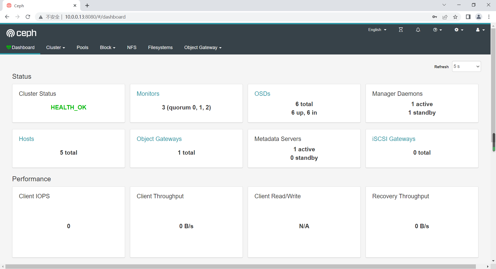
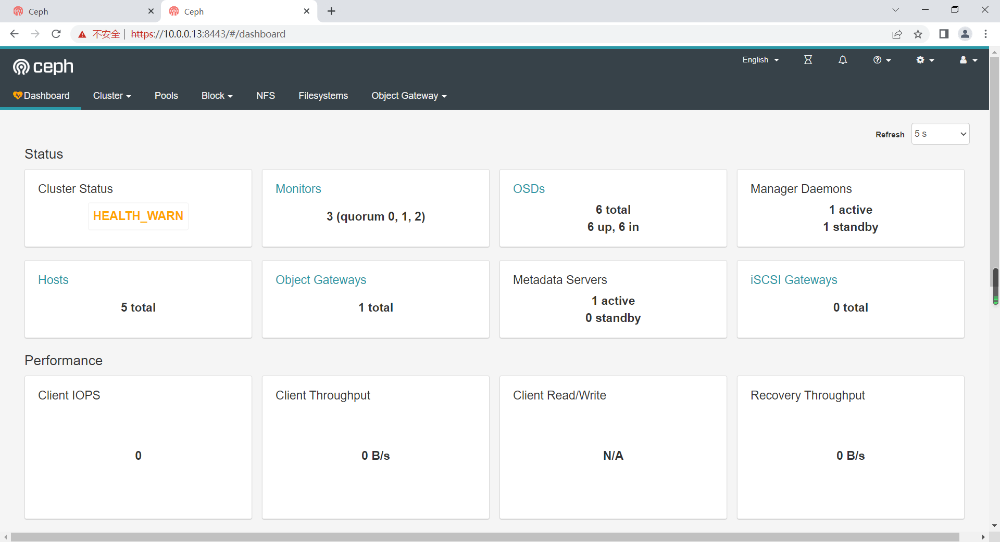
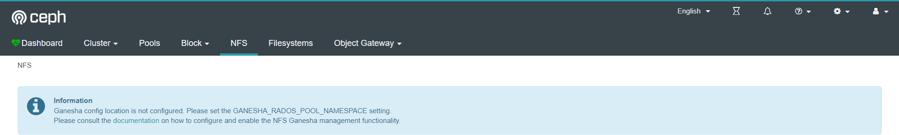
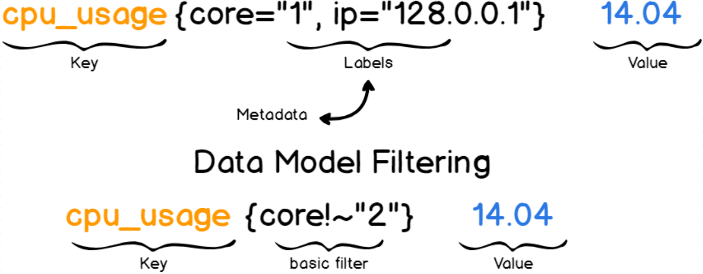
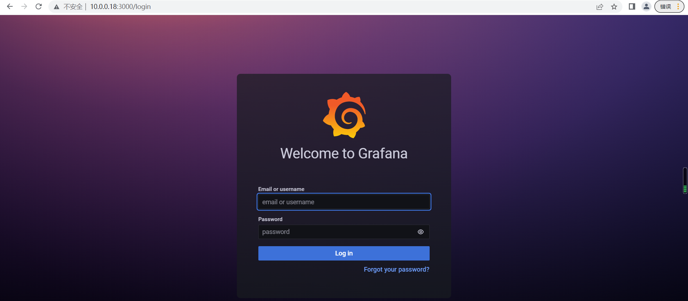
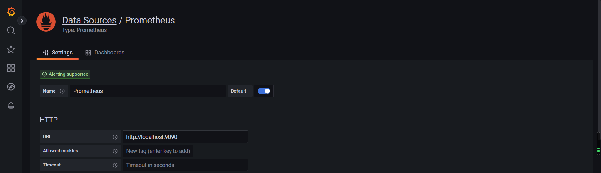
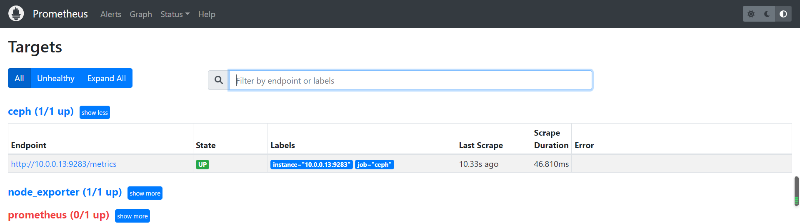

# 1 综合实践

## 1.1 存储池

### 1.1.1 创建实践

学习目标

这一节，我们从 基础知识、简单实践、小结 三个方面来学习。

**基础知识**

简介

```powershell
	存储的常用管理操作包括列出、创建、重命名和删除等操作，常用相关的工具都是 “ceph osd pool”的子命令，包括ls、create、rename和rm等
```

创建存储池

```powershell
副本型存储池创建命令
	ceph osd pool create <pool-name> <pg-num> [pgp-num] [replicated] \ [crush-rule-name] [expected-num-objects]
	
纠删码池创建命令
	ceph osd pool create <pool-name> <pg-num> <pgp-num> erasure \ [erasure-code-profile] [crush-rule-name] [expected-num-objects]
```

```powershell
命令格式中常用的参数
	pool-name：存储池名称，在一个RADOS存储集群上必须具有唯一性；
	pg-num：当前存储池中的PG数量，合理的PG数量对于存储池的数据分布及性能表现来说至关重要；
	pgp-num ：用于归置的PG数量，其值应该等于PG的数量
	replicated|erasure：存储池类型；副本存储池需更多原始存储空间，但已实现Ceph支持的所有操作，而纠删码存储池所需原始存储空间较少，但目前仅实现了Ceph的部分操作
	crush-ruleset-name：此存储池所用的CRUSH规则集的名称，不过，引用的规则集必须事先存在
```

获取存储池

```powershell
列出存储池
	ceph osd pool ls [detail]

获取存储池的统计数据
	ceph osd pool stats [pool-name]

显示存储池的用量信息
	rados df
```

重命名存储池

```powershell
重命名存储池
	ceph osd pool rename old-name new-name
```


**简单实践**

查看存储池信息

```powershell
列出所有存储池名称
[cephadm@admin ceph-cluster]$ ceph osd pool ls
.rgw.root
default.rgw.control
default.rgw.meta
default.rgw.log
default.rgw.buckets.index
default.rgw.buckets.data
default.rgw.otp
default.rgw.buckets.non-ec
cephfs-metadata
cephfs-data

获取所有存储池的详细信息
[cephadm@admin ceph-cluster]$ ceph osd pool ls detail
pool 6 '.rgw.root' replicated size 3 min_size 2 crush_rule 0 object_hash rjenkins pg_num 32 pgp_num 32 autoscale_mode warn last_change 117 flags hashpspool stripe_width 0 application rgw
...
结果显示：
	可以看到，所有存储池的详情信息
```

```powershell
获取所有存储池的统计数据
[cephadm@admin ceph-cluster]$ ceph osd pool stats
pool .rgw.root id 6
  nothing is going on
...
pool cephfs-data id 15
  nothing is going on
  
获取制定存储池的统计数据
[cephadm@admin ceph-cluster]$ ceph osd pool stats cephfs-data
pool cephfs-data id 15
  nothing is going on
```

```powershell
显示存储池的用量信息
[cephadm@admin ceph-cluster]$ rados df
POOL_NAME                     USED OBJECTS ... RD_OPS      RD WR_OPS      WR ...
.rgw.root                  768 KiB       4 ...      0     0 B      4   4 KiB ...
...
default.rgw.otp                0 B       0 ...      0     0 B      0     0 B ...

total_objects    328
total_used       7.0 GiB
total_avail      113 GiB
total_space      120 GiB
```

创建副本存储池

```powershell
创建副本型存储池
[cephadm@admin ceph-cluster]$ ceph osd pool create replicated-pool 32 32
pool 'replicated-pool' created

查看副本统计信息
[cephadm@admin ceph-cluster]$ ceph osd pool stats replicated-pool
pool replicated-pool id 18
  nothing is going on

查看副本详情信息
[cephadm@admin ceph-cluster]$ ceph osd pool ls detail | grep replicated-pool
pool 18 'replicated-pool' replicated size 3 min_size 2 crush_rule 0 object_hash rjenkins pg_num 32 pgp_num 32 autoscale_mode warn last_change 507 flags hashpspool stripe_width 0
```

创建纠偏码池

```powershell
创建纠删码池
[cephadm@admin ceph-cluster]$ ceph osd pool create erasure-pool 16 16 erasure
pool 'erasure-pool' created

查看副本统计信息
[cephadm@admin ceph-cluster]$ ceph osd pool stats erasure-pool
pool erasure-pool id 19
  nothing is going on

查看副本详情信息
[cephadm@admin ceph-cluster]$ ceph osd pool ls detail | grep erasure-pool
pool 19 'erasure-pool' erasure size 3 min_size 2 crush_rule 1 object_hash rjenkins pg_num 16 pgp_num 16 autoscale_mode warn last_change 511 flags hashpspool stripe_width 8192
```


**小结**

```

```

 

### 1.1.2 删除实践

学习目标

这一节，我们从 基础知识、简单实践、小结 三个方面来学习。

**基础知识**

简介

```powershell
意外删除存储池会导致数据丢失，因此 Ceph 实施了两个机制来防止删除存储池，要删除存储池，必须先禁用这两个机制
```

```powershell
第一个机制是NODELETE标志，其值需要为false，默认也是false
	查看命令：ceph osd pool get pool-name nodelete
	修改命令：ceph osd pool set pool-name nodelete false

第二个机制是集群范围的配置参数mon allow pool delete，其默认值为 “false”，这表示默认不能删除存储池，临时设定的方法如下
	ceph tell mon.* injectargs --mon-allow-pool-delete={true|false}
	建议删除之前将其值设置为true，删除完成后再改为false
```

```powershell
删除存储池命令格式
ceph osd pool rm pool-name pool-name --yes-i-really-really-mean-it
```


**简单实践**

删除存储池

```powershell
查看删除标识
[cephadm@admin ceph-cluster]$ ceph osd pool get replicated-pool nodelete
nodelete: false

删除存储池
[cephadm@admin ceph-cluster]$ ceph osd pool rm replicated-pool replicated-pool --yes-i-really-really-mean-it
Error EPERM: pool deletion is disabled; you must first set the mon_allow_pool_delete config option to true before you can destroy a pool
结果显示:
	默认无法删除存储池
```

```powershell
修改删除标识
[cephadm@admin ceph-cluster]$ ceph tell mon.* injectargs --mon-allow-pool-delete=true
mon.mon01: injectargs:mon_allow_pool_delete = 'true'
mon.mon02: injectargs:mon_allow_pool_delete = 'true'
mon.mon03: injectargs:mon_allow_pool_delete = 'true'

再次删除存储池
[cephadm@admin ceph-cluster]$ ceph osd pool rm replicated-pool replicated-pool --yes-i-really-really-mean-it
pool 'replicated-pool' removed
```

永久删除方法

```powershell
将所有的ceph.conf文件中，增加默认允许删除存储池的配置
[cephadm@admin ceph-cluster]$ cat /etc/ceph/ceph.conf
...
[mon]
mon_allow_pool_delete = true

然后同步到所有节点，重启mon服务
[cephadm@admin ceph-cluster]$ ceph-deploy --overwrite-conf config push admin mon01 mon02 mon03
[cephadm@admin ceph-cluster]$ for i in mon0{1..3}; do ssh $i "sudo systemctl restart ceph-mon.target"; done
```

```powershell
修改删除标识
[cephadm@admin ceph-cluster]$ ceph tell mon.* injectargs --mon-allow-pool-delete=false

创建存储池
[cephadm@admin ceph-cluster]$ ceph osd pool create replicated-pool 16 16
pool 'replicated-pool' created

删除存储池
[cephadm@admin ceph-cluster]$ ceph osd pool rm replicated-pool replicated-pool --yes-i-really-really-mean-it
pool 'replicated-pool' removed
```

**小结**

```

```


### 1.1.3 配额管理

学习目标

这一节，我们从 基础知识、简单实践、小结 三个方面来学习。

**基础知识**

设置存储池配额

```powershell
Ceph支持为存储池设置可存储对象的最大数量（max_objects）和可占用的最大空间（ max_bytes）两个纬度的配额
	ceph osd pool set-quota <pool-name> max_objects|max_bytes <val>

获取存储池配额的相关信息
	ceph osd pool get-quota <pool-name>
```

配置存储池参数

```powershell
存储池的诸多配置属性保存于配置参数中
	获取配置：ceph osd pool get <pool-name>
	设定配置：ceph osd pool set <pool-name> <key> 
```

```powershell
常用的可配置参数
    size：			存储池中的对象副本数；
    min_size：		I/O所需要的最小副本数；
    pg_num：			存储池的PG数量；
    pgp_num：		计算数据归置时要使用的PG的有效数量；
    crush_ruleset：	用于在集群中映射对象归置的规则组；
    nodelete：		控制是否可删除存储池；
    nopgchange：		控制是否可更改存储池的pg_num和pgp_num；
    nosizechange：	控制是否可更改存储池的大小；
    noscrub和nodeep-scrub：	控制是否可整理或深层整理存储池以解决临时高I/O负载的问题
    scrub_min_interval：	集群负载较低时整理存储池的最小时间间隔；
                默认值为0，表示其取值来自于配置文件中的osd_scrub_min_interval参数；
    scrub_max_interval：整理存储池的最大时间间隔；
                默认值为0，表示其取值来自于配置文件中的osd_scrub_max_interval参数；
    deep_scrub_interval：深层整理存储池的间隔；
                默认值为0，表示其取值来自于配置文件中的osd_deep_scrub参数；
```


**简单实践**

设置存储池配额

```powershell
获取存储池配额的相关信息
[cephadm@admin ceph-cluster]$ ceph osd pool get-quota erasure-pool
quotas for pool 'erasure-pool':
  max objects: N/A		# 表示没有限制
  max bytes  : N/A		# 表示没有限制

设置存储池配额的值
[cephadm@admin ceph-cluster]$ ceph osd pool set-quota erasure-pool max_objects 10000
set-quota max_objects = 10000 for pool erasure-pool
[cephadm@admin ceph-cluster]$ ceph osd pool set-quota erasure-pool max_bytes 1024000
set-quota max_bytes = 1024000 for pool erasure-pool
[cephadm@admin ceph-cluster]$ ceph osd pool get-quota erasure-pool
quotas for pool 'erasure-pool':
  max objects: 10k objects
  max bytes  : 1000 KiB
```

配置存储池参数

```powershell
创建存储池
[cephadm@admin ceph-cluster]$ ceph osd pool create replicated-pool 16 16
pool 'replicated-pool' created

获取配置
[cephadm@admin ceph-cluster]$ ceph osd pool get replicated-pool size
size: 3
```

```powershell
调整配置属性
[cephadm@admin ceph-cluster]$ ceph osd pool set replicated-pool size 4
set pool 21 size to 4
[cephadm@admin ceph-cluster]$ ceph osd pool get replicated-pool size
size: 4

调整配置属性
[cephadm@admin ceph-cluster]$ ceph osd pool set replicated-pool size 3
set pool 21 size to 3
[cephadm@admin ceph-cluster]$ ceph osd pool get replicated-pool size
size: 3
```

**小结**

```

```


### 1.1.4 快照管理

学习目标

这一节，我们从 基础知识、简单实践、小结 三个方面来学习。

**基础知识**

简介

```powershell
关于存储池快照
	存储池快照是指整个存储池的状态快照
	通过存储池快照，可以保留存储池状态的历史
	创建存储池快照可能需要大量存储空间，具体取决于存储池的大小
```

常见操作

```powershell
创建存储池快照
	ceph osd pool mksnap <pool-name> <snap-name>
	rados -p <pool-name> mksnap <snap-name>

列出存储池的快照
	rados -p <pool-name> lssnap

回滚存储池至指定的快照
	rados -p <pool-name> rollback <snap-name>

删除存储池快照
	ceph osd pool rmsnap <pool-name> <snap-name>
	rados -p <pool-name> rmsnap <snap-name>
```


**简单实践**

查看快照

```powershell
查看制定存储池的快照数量
[cephadm@admin ceph-cluster]$ rados -p replicated-pool lssnap
0 snaps
[cephadm@admin ceph-cluster]$ rados -p erasure-pool lssnap
0 snaps
```

制作快照

```powershell
创建快照
[cephadm@admin ceph-cluster]$ ceph osd pool mksnap replicated-pool replicated-snap
created pool replicated-pool snap replicated-snap
[cephadm@admin ceph-cluster]$ ceph osd pool mksnap erasure-pool erasure-snap
created pool erasure-pool snap erasure-snap

查看效果
[cephadm@admin ceph-cluster]$ rados -p replicated-pool lssnap
1       replicated-snap 2062.09.28 22:28:33
1 snaps
[cephadm@admin ceph-cluster]$ rados -p erasure-pool lssnap
1       erasure-snap    2062.09.28 22:28:43
1 snaps

结果分析：
	创建过image的存储池无法再创建存储池快照了，因为存储池当前已经为unmanaged snaps mode 或者 selfmanaged_snaps模式，而没有创建image的，就可以做存储池快照。
```

快照还原

```powershell
添加文件
[cephadm@admin ceph-cluster]$ rados put ceph-file /home/cephadm/ceph-cluster/ceph.conf --pool=erasure-pool
[cephadm@admin ceph-cluster]$ rados ls --pool=erasure-pool
ceph-file

添加快照
[cephadm@admin ceph-cluster]$ ceph osd pool mksnap erasure-pool erasure-snap1
created pool erasure-pool snap erasure-snap1
[cephadm@admin ceph-cluster]$ rados -p erasure-pool lssnap
1       erasure-snap    2062.09.28 22:28:43
2       erasure-snap1   2062.09.28 22:30:17
2 snaps

回滚快照
[cephadm@admin ceph-cluster]$ rados -p erasure-pool rollback ceph.conf erasure-snap
rolled back pool erasure-pool to snapshot erasure-snap
```

删除快照

```powershell
删除快照
[cephadm@admin ceph-cluster]$ ceph osd pool rmsnap erasure-pool erasure-snap1
removed pool erasure-pool snap erasure-snap1
[cephadm@admin ceph-cluster]$ ceph osd pool rmsnap erasure-pool erasure-snap
removed pool erasure-pool snap erasure-snap
[cephadm@admin ceph-cluster]$ rados --pool=erasure-pool lssnap
0 snaps
```


**小结**

```

```


### 1.1.5 压缩管理

学习目标

这一节，我们从 基础知识、简单实践、小结 三个方面来学习。

**基础知识**

简介

```powershell
	BlueStore存储引擎提供即时数据压缩，以节省磁盘空间
```

启用压缩

```powershell
ceph osd pool set <pool-name> compression_algorithm snappy
	压缩算法有none、zlib、lz4、zstd和snappy等几种，默认为snappy；
	zstd有较好的压缩比，但比较消耗CPU；
	lz4和snappy对CPU占用比例较低；
	不建议使用zlib；

ceph osd pool set <pool-name> compression_mode aggressive
	压缩模式：none、aggressive、passive和force，默认值为none；
	none：不压缩
	passive：若提示COMPRESSIBLE，则压缩
	aggressive：除非提示INCOMPRESSIBLE，否则就压缩；
	force：始终压缩
	
注意：如果需要全局压缩，最好在配置文件中定制
```

```powershell
其它可用的压缩参数
	compression_required_ratio：指定压缩比，取值格式为双精度浮点型，其值为
SIZE_COMPRESSED/SIZE_ORIGINAL，即压缩后的大小与原始内容大小的比值，默认为 .875；
	compression_max_blob_size：压缩对象的最大体积，无符号整数型数值，默认为0；
	compression_min_blob_size：压缩对象的最小体积，无符号整数型数值，默认为0；
```

```powershell
全局压缩选项
	可在ceph配置文件中设置压缩属性，它将对所有的存储池生效，可设置的相关参数如下
	bluestore_compression_algorithm
	bluestore_compression_mode
	bluestore_compression_required_ratio
	bluestore_compression_min_blob_size
	bluestore_compression_max_blob_size
	bluestore_compression_min_blob_size_ssd
	bluestore_compression_max_blob_size_ssd
	bluestore_compression_min_blob_size_hdd
	bluestore_compression_max_blob_size_hdd
```


**简单实践**

查看默认的算法

```powershell
[root@mon01 ~]# ceph daemon osd.0 config show | grep compression
    "bluestore_compression_algorithm": "snappy",
    ...
    "bluestore_compression_mode": "none",
    "bluestore_compression_required_ratio": "0.875000",
    ...
    "rbd_compression_hint": "none",
结果显示：
	默认的压缩算法是 snappy,默认的压缩模式是 node,压缩比例是0.875
注意：
	这条命令最好指定节点下执行
```

更改压缩算法

```powershell
管理节点设定压缩算法
[cephadm@admin ceph-cluster]$ ceph osd pool set erasure-pool compression_algorithm zstd
set pool 19 compression_algorithm to zstd

存储池查看效果
[cephadm@admin ceph-cluster]$ ceph osd pool ls detail | grep erasure-pool
pool 19 'erasure-pool' erasure ... compression_algorithm zstd
```

更改算法模式

```powershell
更改算法模式
[cephadm@admin ceph-cluster]$ ceph osd pool set erasure-pool compression_mode aggressive
set pool 19 compression_mode to aggressive

查看存储池算法模式
[cephadm@admin ceph-cluster]$ ceph osd pool ls detail | grep erasure-pool
pool 19 'erasure-pool' erasure ... compression_mode aggressive
```

还原算法模式和算法

```powershell
还原算法和模式
ceph osd pool set erasure-pool compression_algorithm snappy
ceph osd pool set erasure-pool compression_mode none

查看效果
[cephadm@admin ceph-cluster]$ ceph osd pool ls detail | grep erasure-pool
pool 19 'erasure-pool' erasure ... compression_algorithm snappy compression_mode none
```


**小结**

```

```


### 1.1.6 纠删码基础

学习目标

这一节，我们从 基础知识、简单实践、小结 三个方面来学习。

**基础知识**

场景介绍

```powershell
	纠删码理论(erasure coding，EC)始于 20 世纪 60 年代,它是一种数据保护方法。从原理上说，它将数据分割成片段，把冗余数据块扩展、编码，并将其存储在不同的位置，比如磁盘、存储节点或者其它地理位置。
	总数据块 = 原始数据块 + 校验块， 常见表示为，n = k + m
	当冗余级别为n时，将这些数据块分别存放在n个硬盘上，这样就能容忍小于m个（假设初始数据有k个）硬盘发生故障。当不超过m个硬盘发生故障时，只需任意选取k个正常的数据块就能计算得到所有的原始数据。
	在云存储中，我们通常会使用副本的方式来保证系统的可用性。问题是当存储达到 PB 级别后要求的容量将会非常高。通过使用纠删码技术可以在保证相同可用性的情况下，节省大量存储空间，从而大大的降低 TCO（总体成本）。Ceph 从 Firefly 版本开始支持纠删码。
```

```powershell
	比如8块磁盘的总数(N)，5个数据盘(K), 通过5个数据块计算出3个校验块(m)，我们可以用RS(5,3)来代表。在这样的场景中，每份数据都会切分5份--5*5的逆向矩阵，它可以容忍任意 3 块磁盘的故障。如果某些数据块丢失，可以通过剩下的可用数据恢复出原始的数据内容。
```


ceph纠偏码

```powershell
	Ceph纠删码实现了高速的计算，但有2个缺点：速度慢、只支持对象的部分操作。ceph中的EC编码是以插件的形式来提供的。EC编码有三个指标：空间利用率、数据可靠性和恢复效率。ceph提供以下几种纠删码插件：clay(coupled-layer)、jerasure、lrc、shec、isa等
```

```powershell
	Ceph支持以插件方式加载使用的纠删编码插件，存储管理员可根据存储场景的需要优化选择合用的插件。
jerasure：
	最为通用的和灵活的纠删编码插件，它也是纠删码池默认使用的插件；不过，任何一个OSD成员的丢失，都需要余下的所有成员OSD参与恢复过程；另外，使用此类插件时，管理员还可以通过technique选项指定要使用的编码技术：
	reed_sol_van：最灵活的编码技术，管理员仅需提供k和m参数即可；
	cauchy_good：更快的编码技术，但需要小心设置PACKETSIZE参数；
	reed_sol_r6_op、liberation、blaum_roth或liber8tion：
			仅支持使用m=2的编码技术，功能特性类同于RAID 6；
lrc：
	全称为Locally Repairable Erasure Code，即本地修复纠删码，除了默认的m个编码块之外，它会额外在本地创建指定数量（l）的奇偶校验块，从而在一个OSD丢失时，可以仅通过l个奇偶校验块完成恢复

isa：
	仅支持运行在intel CPU之上的纠删编码插件，它支持reed_sol_van和cauchy两种技术

shec：
	shec(k,m,l)，k为数据块，m为校验块，l代表计算校验块时需要的数据块数量。
	其最大允许失效数据块为：ml/k，恢复失效的单个数据块（data chunk）只需要额外读取l个数据块。
```

基础概念

```powershell
块（chunk）
	基于纠删码编码时，每次编码将产生若干大小相同的块(有序)。
	ceph通过数量相等的PG将这些分别存储在不同的osd中。
条带（strip）
	如果编码对象太大，可分多次进行编码，每次完成编码的部分称为条带。同一个对内的条带时有序的。
分片（shared）
	同一个对象中所有序号相同的块位于同一个PG上，他们组成对象的一个分片，分片的编号就是块的序号。
```

```powershell
空间利用率（rate）：
	通过k/n计算。
对象尺寸： 
	Ceph 存储集群里的对象有最大可配置尺寸，对象尺寸必须足够大,而且应该是条带单元的整数倍。
条带数量（strip_size）： 
	Ceph 客户端把一系列条带单元写入由条带数量所确定的一系列对象，这一系列的对象称为一个对象集。
	客户端写到对象集内的最后一个对象时，再返回到第一个。
条带宽度（strip_width）： 
	条带都有可配置的单元尺寸。Ceph 客户端把数据等分成适合写入对象的条带单元。
	strip_width = chunk_size * strip_size
```

```powershell
	假设有EC（k=4，m=2），strip_size=4，chunk_size=1K，那么strip_width=4K。在ceph中，strip_width默认为4K。
	假如object对象内容是 ABCDEFGHIJKL；将该数据对象写入pool时，纠删码函数把object分4个数据块：第1个是ABC,第2个是DEF，第3个是GHI，第4个是JKL；如果object的长度不是K的倍数，object会被填充一些内容；纠删码函数同时创建2个编码块：第4个是xxx，第5个是yyy；
```


**简单实践**

创建纠删码池

```powershell
命令格式
	ceph osd pool create <pool-name> <pg-num> <pgp-num> erasure [erasure-code-profile] [crush-rule-name] [expected-num-objects]

要点解析
	未指定要使用的纠删编码配置文件时，创建命令会为其自动创建一个，并在创建相关的CRUSH规则集时使用到它
	默认配置文件自动定义k=2和m=1，这意味着Ceph将通过三个OSD扩展对象数据，并且可以丢失其中一个OSD而不会丢失数据，因此，在冗余效果上，它相当于一个大小为2的副本池 ，不过，其存储空间有效利用率为2/3而非1/2。
```

其他命令

```powershell
列出纠删码配置文件
	ceph osd erasure-code-profile ls

获取指定的配置文件的相关内容
	ceph osd erasure-code-profile get default

自定义纠删码配置文件
	ceph osd erasure-code-profile set <name> [<directory=directory>] [<plugin=plugin>] [<crush-device-class>] [<crush-failure-domain>] [<key=value> ...] [--force]
	- directory：加载纠删码插件的目录路径，默认为/usr/lib/ceph/erasure-code；
	- plugin：用于生成及恢复纠删码块的插件名称，默认为jerasure；
	- crush-device-class：设备类别，例如hdd或ssd，默认为none，即无视类别；
	- crush-failure-domain：故障域，默认为host，支持使用的包括osd、host、rack、row和room等 ；
	- --force：强制覆盖现有的同名配置文件；
```

```powershell
示例：
	例如，如果所需的体系结构必须承受两个OSD的丢失，并且存储开销为40％
	ceph osd erasure-code-profile set myprofile  k=4  m=2 crush-failure-domain=osd
	例如，下面的命令创建了一个使用lrc插件的配置文件LRCprofile，其本地奇偶校验块为3，故障域为osd
	ceph osd erasure-code-profile set LRCprofile plugin=lrc k=4 m=2 l=3 crush-failure-domain=osd
```


查看纠删码池

```powershell
列出纠删码配置文件
[cephadm@admin ceph-cluster]$ ceph osd erasure-code-profile ls
default

获取指定的配置文件的相关内容
[cephadm@admin ceph-cluster]$ ceph osd erasure-code-profile get default
k=2
m=1
plugin=jerasure
technique=reed_sol_van
```

自定义纠删码配置

```powershell
创建纠删码配置
[cephadm@admin ceph-cluster]$ ceph osd erasure-code-profile set myprofile  k=4  m=2 crush-failure-domain=osd

查看纠删码配置信息
[cephadm@admin ceph-cluster]$ ceph osd erasure-code-profile ls
default
myprofile
[cephadm@admin ceph-cluster]$ ceph osd erasure-code-profile get myprofile
crush-device-class=
crush-failure-domain=osd
crush-root=default
jerasure-per-chunk-alignment=false
k=4
m=2
plugin=jerasure
technique=reed_sol_van
w=8
```

```powershell
创建定制的纠偏码池
[cephadm@admin ceph-cluster]$ ceph osd pool create erasure-pool-myprofile 8 8 erasure myprofile
pool 'erasure-pool-myprofile' created

查看效果
[cephadm@admin ceph-cluster]$ ceph osd pool ls detail | grep erasure-pool-myprofile
pool 22 'erasure-pool-myprofile' erasure size 6 min_size 5 crush_rule 2 object_hash rjenkins pg_num 8 pgp_num 8 autoscale_mode warn last_change 540 flags hashpspool stripe_width 16384
解析：
	erasure size 6 代表有(K+m)6个osd磁盘
```

基于插件定制纠偏码配置

```powershell
基于纠偏码算法定制专属配置
[cephadm@admin ceph-cluster]$ ceph osd erasure-code-profile set LRCprofile plugin=lrc k=4 m=2 l=3 crush-failure-domain=osd

查看纠删码配置信息
[cephadm@admin ceph-cluster]$ ceph osd erasure-code-profile ls
LRCprofile
default
myprofile
[cephadm@admin ceph-cluster]$ ceph osd erasure-code-profile get LRCprofile
crush-device-class=
crush-failure-domain=osd
crush-root=default
k=4
l=3
m=2
plugin=lrc
```

```powershell
创建定制配置的纠偏码池
[cephadm@admin ceph-cluster]$ ceph osd pool create erasure-pool-LRCprofile 1 1 erasure LRCprofile
pool 'erasure-pool-LRCprofile' created

查看效果
[cephadm@admin ceph-cluster]$ ceph osd pool ls detail | grep erasure-pool-LRCprofile
pool 23 'erasure-pool-LRCprofile' ... flags hashpspool stripe_width 16384
```


**小结**

```

```

### 1.1.7 纠删码实践

学习目标

这一节，我们从 数据实践、异常实践、小结三个方面来学习。

**数据实践**

纠删码池数据实践

```powershell
创建存储池
[cephadm@admin ceph-cluster]$ ceph osd pool create ecpool 12 12 erasure
pool 'ecpool' created
```

```powershell
数据写入实践
[cephadm@admin ceph-cluster]$ echo ABCDEFGHI | rados --pool ecpool put object_data -

数据读取实践
[cephadm@admin ceph-cluster]$ rados --pool ecpool get object_data -
ABCDEFGHI

注意：
	数据写入和读取的实践命令末尾必须有一个 - 
```

```powershell
文件写入实践
[cephadm@admin ceph-cluster]$ echo test > test.txt
[cephadm@admin ceph-cluster]$ rados -p ecpool put test test.txt

文件读取实践
[cephadm@admin ceph-cluster]$ rados -p ecpool get test file.txt
[cephadm@admin ceph-cluster]$ cat file.txt
test
```

纠删码池不支持部分image功能

```powershell
启用rbd功能
[cephadm@admin ceph-cluster]$ ceph osd pool application enable ecpool rbd
enabled application 'rbd' on pool 'ecpool'

创建image操作
[cephadm@admin ceph-cluster]$ rbd create myimg -p ecpool --size 1024
2062-09-29 01:01:01.144 7faafbfff700 -1 librbd::image::ValidatePoolRequest: handle_overwrite_rbd_info: pool missing required overwrite support
2062-09-29 01:01:01.144 7faafbfff700 -1 librbd::image::CreateRequest: 0x55a667ec7190 handle_validate_data_pool: pool does not support RBD images
rbd: create error: (22) Invalid argument
结果显示：
	纠偏码池不支持RBD images的参数操作
```


**异常实践**

```powershell
创建纠删码配置
[cephadm@admin ceph-cluster]$ ceph osd erasure-code-profile  set Ecprofile crush-failure-domain=osd k=3 m=2

查看纠删码配置信息
[cephadm@admin ceph-cluster]$ ceph osd erasure-code-profile ls
Ecprofile
[cephadm@admin ceph-cluster]$ ceph osd erasure-code-profile get  Ecprofile
crush-device-class=
crush-failure-domain=osd
crush-root=default
jerasure-per-chunk-alignment=false
k=3
m=2
plugin=jerasure
technique=reed_sol_van
w=8
```

```powershell
基于纠删码配置文件创建erasure类型的Ceph池：
[cephadm@admin ceph-cluster]$ ceph osd pool create Ecpool 16 16 erasure Ecprofile
pool 'Ecpool' created

确认效果
[cephadm@admin ceph-cluster]$ ceph osd dump | grep Ecpool
pool 25 'Ecpool' erasure size 5 min_size 4 crush_rule 4 object_hash rjenkins pg_num 16 pgp_num 16 autoscale_mode warn last_change 566 flags hashpspool stripe_width 12288
结果显示：
	erasure size 5 表示 3+2=5 个osd磁盘来存储数据和校验码
```

```powershell
创建文件后提交文件到纠删码池
[cephadm@admin ceph-cluster]$ echo test_ecpool > test_file.txt
[cephadm@admin ceph-cluster]$ rados put -p Ecpool object1 test_file.txt
[cephadm@admin ceph-cluster]$ rados -p Ecpool ls
object1
```

```powershell
检查纠删码池中和object1的OSDmap
[cephadm@admin ceph-cluster]$ ceph osd map Ecpool object1
osdmap e566 pool 'Ecpool' (25) object 'object1' -> pg 25.bac5debc (25.c) -> up ([2,1,0,4,5], p2) acting ([2,1,0,4,5], p2)
结果显示：
	0-5的osd磁盘上都有我们的数据库和校验块
```

测试效果

```powershell
找到两台节点，将两个被用到的osd移除，比如mon02主机上的osd2，mon03主机上的osd5
[cephadm@admin ceph-cluster]$ ssh mon03 sudo systemctl stop ceph-osd@5
[cephadm@admin ceph-cluster]$ ssh mon02 sudo systemctl stop ceph-osd@2
[cephadm@admin ceph-cluster]$ ceph osd tree
ID CLASS WEIGHT  TYPE NAME      STATUS REWEIGHT PRI-AFF
...
-5       0.03897     host mon02
 2   hdd 0.01949         osd.2    down  1.00000 1.00000
 3   hdd 0.01949         osd.3      up  1.00000 1.00000
-7       0.03897     host mon03
 4   hdd 0.01949         osd.4      up  1.00000 1.00000
 5   hdd 0.01949         osd.5    down  1.00000 1.00000
```

```powershell
检查EC池和object1的OSDmap
[cephadm@admin ceph-cluster]$ ceph osd map Ecpool object1
osdmap e574 pool 'Ecpool' (25) object 'object1' -> pg 25.bac5debc (25.c) -> up ([NONE,1,0,4,NONE], p1) acting ([NONE,1,0,4,NONE], p1)
结果显示：
	osd.5和osd.2 已经不管用了
	
获取文件查看
[cephadm@admin ceph-cluster]$ rados -p Ecpool get object1 ok.txt
结果显示：
	查看文件失败，可以看到，不允许有超过2个osd失败的效果
```

```powershell

```


**小结**

```

```


## 1.2 存储进阶

### 1.2.1 原理解读

学习目标

这一节，我们从 基础知识、简单实践、小结 三个方面来学习。

**基础知识**

存储池

```powershell
	RADOS存储集群提供的基础存储服务需要由“pool”分割为逻辑存储区域 -- 对象数据的名称空间。我们在部署ceph集群的过程中，涉及到大量的应用程序，而这些应用程序在创建的时候，需要专属的数据存储空间--存储池，比如rbd存储池、rgw存储池、cephfs存储池等。
	存储池还可以再进一步细分为一至多个子名称空间，比如我们在看pool的时候
	[cephadm@admin ceph-cluster]$ ceph osd pool ls
    .rgw.root
    default.rgw.control
    {根命名空间}.{应用命名空间}.{子空间}
```

```powershell
	对于Ceph集群来说，它的存储池主要由默认的副本池(replicated pool)和纠删码池(erasure code) 两种类型组成。
	客户端在使用这些存储池的时候，往往依赖于相关用户信息的认证机制。
```

数据存储逻辑


```powershell
	Ceph 在 RADOS 集群中动态存储、复制和重新平衡数据对象。由于许多不同的用户在无数 OSD 上出于不同目的将对象存储在不同的池中，因此 Ceph 操作需要一些数据放置规划。Ceph 中主要的数据放置规划概念包括：
```

```powershell
Pools（池）：
	Ceph 将数据存储在pool中，pool是用于存储对象的逻辑组。首次部署集群而不创建pool时，Ceph 使用默认pool来存储数据。
	pool主要管理的内容有：PG的数量、副本的数量和pool的 CRUSH 规则。
	当然了。要将数据存储在池中，您必须有一个经过身份验证的用户，该用户具有该池的权限。
参考资料：https://docs.ceph.com/en/quincy/rados/operations/pools/
```

```powershell
Placement Groups（归置组）：
	归置组 (PG) 是 Ceph 如何分发数据的内部实现细节。
	Ceph 将对象映射到归置组(PG)，归置组(PG)是逻辑对象池的分片或片段，它们将对象作为一个组放置到OSD中。当 Ceph 将数据存储在 OSD 中时，放置组会减少每个对象的元数据量。
	每个 PG 都属于一个特定的Pool，因此当多个Pool使用相同的 OSD 时，必须注意每个OSD的PG副本的总和不能超过OSD自身允许的PG数量阈值。
参考资料：https://docs.ceph.com/en/quincy/rados/operations/placement-groups
```

```powershell
CRUSH Maps（CRUSH 映射）： 
	CRUSH 是让 Ceph 在正常运行情况下进行数据扩展的重要部分。CRUSH 映射为 CRUSH 算法提供集群的物理拓扑数据，以确定对象及其副本的数据应该存储在哪里，以及如何跨故障域以增加数据安全等。
参考资料：https://docs.ceph.com/en/quincy/rados/operations/crush-map。
```

```powershell
Balancer：
	平衡器是一个功能，它会自动优化PG跨设备的分布，以实现数据的均衡分布，最大化集群中可以存储的数据量，并在OSD之间平均分配工作负载。
```

```powershell
Pool数量、CRUSH规则和PG数量决定了 Ceph 将如何放置数据
```


**简单实践**

```powershell
Ceph 的 RADOS中，引入了 PG 的概念用以更好地管理数据。PG 的引入降低对数量巨大的对象的管理难度。
	1、对象数量时刻处于变化中。而PG的数量经过人工规划因而严格可控。
	2、PG数量远小于对象，且生命周期稳定。因此以PG为单位进行数据同步或者迁移，相比较对象难度更小。

PG 最引人注目之处在于其可以在OSD之间（根据CRUSH的实时计算结果）自由迁移，这是ceph赖以实现自动数据恢复、自动数据平衡等高级特性的基础。
```

```powershell
	RADOS 提供的是基于 Object 的存储功能，每个 Object 会先通过简单的 Hash 算法归到一个 PG 中，PGID 再作为"参数"通过 CRUSH 计算置入到多个 OSD 中。
	Object - 可以理解为一个文件
	PG     - 可以理解为一个目录
	OSD    - 可以理解我一个PG目录下的简易文件系统
```

```powershell
存储池在操作资源对象的时候，需要设置：对象的所有权/访问权、归置组的数量、CRUSH 规则 
```

PG 映射到 OSD


```powershell
	每个Pool都有许多归置组。当 Ceph 客户端存储对象时，CRUSH 会将每个对象映射到一个归置组,然后CRUSH 将 PG 动态映射到 OSD。
	所以说，PG相当于 OSD守护进程 和 Ceph客户端之间的一个中间层：
		1 通过CRUSH实现数据对象动态平衡的分散到所有OSD中，同时也可以让客户端知道数据在哪个OSD中
		2 中间层还允许新加入的OSD和其他OSD在数据负载时候实现动态平衡
```

PG id

```powershell
	当 Ceph客户端绑定到 Ceph Mon节点时，它会检索 Cluster Map的最新副本。客户端可以通过Cluster Map了解集群中的所有监视器、OSD和元数据服务器信息。由于数据对象与Cluster Map无关，所以它对对象位置一无所知。
	客户端操作数据对象的时候，需要指定 对象ID(就是对象名称)和Pool。
```

```powershell
CRUSH算法允许客户端计算对象应该存储在哪里，从而实现客户端能够快速联系主 OSD 以存储或检索对象。
	1 Ceph 客户端输入Pool名称和对象ID
		rados put {object_name} /path/to/local_file --pool={pool_name}
	2 Ceph 获取对象ID后对其进行hash处理
		hash(对象ID名称)%PG_num
	3 Ceph 基于PG数为模对PG进行哈希计算后获取 PG ID，比如 58
	4 Ceph 根据pool名称获取Pool ID，比如 4
	5 Ceph 将pool ID 附加到 PG ID，比如 4.58
```

```powershell
	Ceph OSD 守护进程会检查彼此的心跳并向 Ceph Mon节点报告状态信息。
	Ceph OSD 守护进程会将同一组PG中所有对象的状态进行一致性同步，同步异常往往会自动解决
```

数据一致性

```powershell
	为了保证Ceph 存储集群的数据安全向，它被设计为存储至少两个对象副本，以便它可以在保持数据安全的同时继续在某个状态下运行。
	[root@mon01 ~]# ceph daemon osd.0 config show | grep default_size
    "osd_pool_default_size": "3",
    [root@mon01 ~]# ceph osd pool get ecpool size
	size: 3
	所以PG在关联的时候，往往会关联多个OSD的id值，我们会将同一个PG关联的多个OSD集合称为 Acting Set，注意该Set是一个有序集合。其中第一个OSD，我们将其称为 Primary OSD，然后依次类推为 Secondary OSD等等。注意Primary OSD守护进程会维护同一组PG的所有OSD副本数据状态的一致性。
```

```powershell
	对于Acting Set的 Ceph OSD 守护进程状态主要有四种：
		UP(启动已运行)、Down(关闭未运行)、In(集群中)、Out(集群外),
	
	我们可以通过 ceph -s、ceph osd tree、ceph osd stat来查看OSD的状态信息
	[root@mon01 ~]# ceph osd stat
	6 osds: 6 up (since 14h), 6 in (since 14h); epoch: e631
	注意：
		OSD和PG上的每一次状态变更的历史信息，我们称为epoch
```


**小结**

```

```


### 1.2.2 归置组

学习目标

这一节，我们从 基础知识、简单实践、小结 三个方面来学习。

**基础知识**

PG简介

```powershell
	当用户在Ceph存储集群中创建存储池Pool的时候，我们往往会为它创建PG和PGS，如果我们没有指定PG和PGP的话，则Ceph使用配置文件中的默认值来创建Pool的PG和PGP。通常情况下，我们建议用户根据实际情况在配置文件中自定义pool的对象副本数量和PG数目。
参考资料：
	https://docs.ceph.com/en/latest/rados/configuration/pool-pg-config-ref/
```

```powershell
	关于对象副本数目，用户可以根据自身对于数据安全性的要求程度进行设置，Ceph默认存储一份主数据对象和两个副本数据(osd pool default size = 3)。对于PG数目，假如数据对象副本数目为N，集群OSD数量为M，则每个OSD上的PG数量为X，官方提供了一个默认的PG数量计算公式。
	PG|PGP 数量 = M * X / N
注意：
	官方推荐X默认的值为100
	再一个，PG算出来的数据往往不是一个整数，但是我们往往将该值取为最接近2的幂次方值。	
```

```powershell
PG数量计数：
	假如Ceph集群有100个OSD，数据副本为3，则PG数量值为 100*100/3=3333.33,该值不是一个整数，我们将该值取为4096(2^12),所以我们可以将PG相关的属性设置为
	[global]
    osd pool default size = 4
    osd pool default min size = 1
    osd pool default pg mum = 4096
    osd pool default pgp mum = 4096

常见数量统计：
	OSD<5个，pg_num 设置为 256；5个<OSD<10个，pg_num 设置为 512；
	10个<OSD<50个，pg_num 设置为 2048；50个<OSD，pg_num 设置为 4096；
```

信息查看

```powershell
存储池的归置组数量设置好之后，还可以增加，但不可以减少
[cephadm@admin cephadm-cluster]$ ceph osd pool create mypool 128
pool 'mypool' created

获取PG和PGP的数量
[cephadm@admin cephadm-cluster]$ ceph osd pool get mypool pg_num
pg_num: 128
[cephadm@admin cephadm-cluster]$ ceph osd pool get mypool pgp_num
pgp_num: 128
```

```powershell
调整PG的数量
[cephadm@admin cephadm-cluster]$ ceph osd pool set mypool pg_num 256
set pool 7 pg_num to 256

调整PGP的数量(不允许大于PG梳理)
[cephadm@admin cephadm-cluster]$ ceph osd pool set mypool pgp_num 512
Error EINVAL: specified pgp_num 512 > pg_num 256
[cephadm@admin cephadm-cluster]$ ceph osd pool set mypool pgp_num 256
set pool 7 pgp_num to 256
```

```powershell
获取完整的PG的统计信息
[cephadm@admin cephadm-cluster]$ ceph pg dump
[cephadm@admin cephadm-cluster]$ ceph pg dump --format=json
[cephadm@admin cephadm-cluster]$ ceph pg dump --format=json-pretty
```

```powershell
获取精简的PG统计信息
[cephadm@admin cephadm-cluster]$ ceph -s | grep pgs
    pools:   1 pools, 256 pgs
    pgs:     256 active+clean
[cephadm@admin cephadm-cluster]$ ceph pg dump_stuck
ok

查看所有PG的状态
[cephadm@admin cephadm-cluster]$ ceph pg stat
256 pgs: 256 active+clean; 0 B data, 122 MiB used, 114 GiB / 120 GiB avail
```


```powershell
查看指定PG值的统计信息
[cephadm@admin cephadm-cluster]$ ceph pg 7.c4 query
```


状态

```powershell
检查集群状态时(ceph -s)， Ceph 会报告归置组状态,其最优状态为 active+clean。其他常见状态有：
    Creating 			Ceph 仍在创建归置组。
    Active				Ceph 可处理到归置组的请求。
    Clean				Ceph 把归置组内的对象复制了规定次数。
    Down				包含必备数据的副本挂了，所以归置组离线。
    Replay				某 OSD 崩溃后，归置组在等待客户端重放操作。
    Splitting			Ceph 正在把一归置组分割为多个。（实现了？）
    Scrubbing			Ceph 正在检查归置组的一致性。
    Degraded			归置组内的对象还没复制到规定次数。
    Inconsistent		Ceph 检测到了归置组内一或多个副本间不一致现象。
    Peering				归置组正在互联。
    Repair				Ceph 正在检查归置组、并试图修复发现的不一致（如果可能的话）。
    Recovering			Ceph 正在迁移/同步对象及其副本。
    Backfill			Ceph 正在扫描并同步整个归置组的内容，Backfill 是恢复的一种特殊情况。
    Wait-backfill		归置组正在排队，等候回填。
    Backfill-toofull	一回填操作在等待，因为目标 OSD 使用率超过了占满率。
    Incomplete			Ceph 探测到某一归置组异常。
    Stale				归置组处于一种未知状态，从归置组运行图变更起就没再收到它的更新。
    Remapped			归置组被临时映射到了另外一组 OSD ，它们不是 CRUSH 算法指定的。
    Undersized			此归置组的副本数小于配置的存储池副本水平。
    Peered				此归置组已互联，因为副本数没有达到标准，不能向客户端提供服务
    
异常状态标识
	Inactive 			归置组不能处理读写，因为它们在等待一个有最新数据的 OSD 复活且进入集群。
	Unclean 			归置组含有复制数未达到期望数量的对象，它们应该在恢复中。
	Stale 				归置组处于未知状态：存储它们的 OSD 有段时间没向监视器报告了。
```

**简单实践**

获取特殊状态的PG

```powershell
[cephadm@admin cephadm-cluster]$ ceph pg dump_stuck stale
ok
注意：
	其他的异常状态有：inactive|unclean|stale|undersized|degraded
```

列举不一致pg信息

```powershell
列出不一致的PG：
[cephadm@admin cephadm-cluster]$ rados list-inconsistent-pg mypool
[]
列出不一致的 rados 对象：
[cephadm@admin cephadm-cluster]$ rados list-inconsistent-obj 7.c4
{"epoch":156,"inconsistents":[]}

列出给定置放群组中不一致的快照集：
[cephadm@admin cephadm-cluster]$ rados list-inconsistent-snapset 7.c4
{"epoch":156,"inconsistents":[]}
```

修复损坏pg信息

```powershell
[cephadm@admin cephadm-cluster]$ ceph pg repair 7.c4
instructing pg 7.c4 on osd.4 to repair
```


临时PG

```powershell
	假设一个PG的acting set为[0,1,2]列表。此时如果osd0出现故障，导致CRUSH算法重新分配该PG的acting set为[3,1,2]。此时osd3为该PG的主OSD，但是OSD3为新加入的OSD，并不能负担该PG上的读操作。所以PG向Monitor申请一个临时的PG，osd1为临时的主OSD，这是up set变为[1,3,2]，acting set依然为[3,1,2]，导致acting set和up set不同。当osd3完成Backfill过程之后，临时PG被取消，该PG的up set修复为acting set，此时acting set和up set都是[3,1,2]列表。
```


**小结**

```

```


### 1.2.3 运行图

学习目标

这一节，我们从 基础知识、简单实践、小结 三个方面来学习。

**基础知识**

map简介

```powershell
	对于Ceph集群来说，有个非常重要的特点就是高性能，而高性能有一个非常突出的特点就是单位时间内处理业务数据的量。Ceph为了实现业务数据的精准高效操作，它主要是通过五种Map分别来实现特定的功能：
	Monitor Map
		Mon节点和所有节点的连接信息，包括ceph集群ID，monitor 节点名称，IP地址和端口等。
	CRUSH Map 
		让 Ceph 在正常运行情况下进行高效数据操作的重要支撑部分，包括数据的写入和查询用到的设备列表、存储桶信息、故障域结构，故障域规则等。
	OSD Map
		保存OSD的基本信息，包括ID，状态，副本、PG、OSD信息等，便于数据的均衡性操作。
	MDS Map
		保存MDS的基本信息，包括版本号、创建和修改时间、数据和元数据存储池、数量、MDS状态等。
	PG Map
		保存PG的基本信息，包括PG的ID、数量、状态、版本号、时间戳、容量百分比等。
```


**简单实践**

基本map关联关系

```powershell
查看mon相关的关联关系
[cephadm@admin cephadm-cluster]$  ceph mon dump
epoch 3
fsid d932ded6-3765-47c1-b0dc-e6957051e31a
...
2: [v2:10.0.0.15:3300/0,v1:10.0.0.15:6789/0] mon.mon03
dumped monmap epoch 3
```

```powershell
查看osd相关信息
[cephadm@admin cephadm-cluster]$ ceph osd dump
epoch 158
fsid d932ded6-3765-47c1-b0dc-e6957051e31a
...
osd.5 up   in  weight 1 up_from 146 up_thru 156 down_at 145 last_clean_interval [125,142) [v2:10.0.0.15:6800/1274,v1:10.0.0.15:6805/1274] [v2:192.168.8.15:6804/1274,v1:192.168.8.15:6805/1274] exists,up 67282205-0c58-49c8-9af6-878198d05f2e
```

```powershell
查看mds相关信息
[cephadm@admin cephadm-cluster]$ ceph mds dump
```

```powershell
查看crush相关信息
[cephadm@admin cephadm-cluster]$ ceph osd crush dump
{
    "devices": [ 					# 设备列表信息
        {
            "id": 0,
            "name": "osd.0",
            "class": "hdd"
        },
        ...
    ],
    "types": [						# 资源类型列表12类，主要有
        {							# osd、host、chassis、rack
            "type_id": 0,			# row、pdu、pod、room
            "name": "osd"			# datacenter、zone、region、root
        },
        ...
    ],
    "buckets": [					# 存储桶列表
        {
            "id": -1,
            "name": "default",
            ...
        },
        ...
    ],
    "rules": [						# 数据映射规则列表
        {
            "rule_id": 0,
            "rule_name": "replicated_rule",
            ...
    ],
    "tunables": {					# 可调节的相关属性
        "choose_local_tries": 0,
        ...
    },
    "choose_args": {}				# 可选择的其他参数
}
```

查看PG的相关信息

```powershell
查看pg相关的信息
[cephadm@admin cephadm-cluster]$ ceph pg dump
version 3481
stamp 2062-10-08 20:54:41.007647
last_osdmap_epoch 0
last_pg_scan 0
...
OSD_STAT USED    AVAIL   USED_RAW TOTAL   HB_PEERS    PG_SUM PRIMARY_PG_SUM
5         20 MiB  19 GiB  1.0 GiB  20 GiB [0,1,2,3,4]    137             44
...
sum      122 MiB 114 GiB  6.1 GiB 120 GiB
...
```

```powershell
查看PG-OSD关系图
[cephadm@admin cephadm-cluster]$ ceph pg map 7.c4
osdmap e158 pg 7.c4 (7.c4) -> up [4,2,1] acting [4,2,1]
```

```powershell
提交文件到对应的osd里面
[cephadm@admin ceph-cluster]$ rados put ceph-file /home/cephadm/ceph-cluster/ceph.conf --pool=mypool
object-PG-OSD关系图 查看ceph-file文件对象的内部属性关系
[cephadm@admin ceph-cluster]$ ceph osd map mypool ceph-file
osdmap e51 pool 'mypool' (1) object 'ceph-file' -> pg 1.7753490d (1.d) -> up ([2,1,5], p2) acting ([2,1,5], p2)
```

**小结**

```

```


### 1.2.4 CRUSH

学习目标

这一节，我们从 基础知识、简单实践、小结 三个方面来学习。

**基础知识**

简介

```powershell
	CRUSH(Controlled Replication Under Scalable Hashing)是ceph的核心设计之一，它本质上是Ceph存储集群使用的一种数据分发算法，类似于OpenStack的Swift和AQS的对象存储所使用的哈希和一致性hash数据分布算法。
	CRUSH算法通过接受多维参数，通过一定的计算对客户端对象数据进行分布存储位置的确定，来解决数据动态分发的问题。因此ceph客户端无需经过传统查表的方式来获取数据的索引，进而根据索引来读写数据，只需通过crush算法计算后直接和对应的OSD交互进行数据读写。这样，ceph就避免了查表这种传统中心化架构存在的单点故障、性能瓶颈以及不易扩展的缺陷。这也是Ceph相较于其他分布式存储系统具有高扩展性、高可用和高性能特点的主要原因。
```

CRUSH Map简介

```powershell
Ceph中的寻址至少要经历以下三次映射：
	File 和 object 映射：文件数据object的数据块切片操作，便于多数据的并行化处理。
	Object 和 PG 映射：将文件数据切分后的每一个Object通过简单的 Hash 算法归到一个 PG 中。
	PG 和 OSD 映射：将PG映射到主机实际的OSD数据磁盘上。
```

```powershell
	CRUSH算法提供了配置和更改和数据动态再平衡等关键特性，而CRUSH算法存储数据对象的过程可通过CRUSH Map控制并进行自定义修改，CRUSH Map是Ceph集群物理拓扑结构、副本策略以及故障域等信息抽象配置段，借助于CRUSH Map可以将数据伪随机地分布到集群的各个OSD上。
```


```powershell
CRUSH Map 由不同层次的逻辑Buckets 和 Devices组成：
	Buckets - Root指的是多区域，datacenter是数据中心，room是机房、rack是机柜，host是主机
	Devices - 主要指各种OSD存储设备
注意：
	对于每一个Ceph集群来说，CRUSH Map在正式上线前已经确定好了，如果用户需要自定义更改CRUSH Map的话，必须在集群上线前进行更改和核实，然后应用到CRUSH算法中。
```

Buckets

```powershell
CRUSH Map中的Buckets是用户自定义增加的，每个层级的Bucket对应不同的故障域，在实际应用中，为了更加精细化地隔离故障域，用户还可以增加PDU、POD、ROW、CHASSIS等，这些名称是用户随意定义的。
对于Ceph N版本来说，它默认声明了12种Buckets。
	root-根分区、region-可用区域、zone-数据区域、datacenter-数据中心
	room-机房、pod-机房单间、pdu-电源插座、row-机柜排
	rack-机柜、chassis-机箱、host-主机、osd-磁盘
```

配置文件解读

```powershell

# begin crush map  设定修正bug、优化算法、以及向后兼容老版本等属性信息
tunable choose_local_tries 0			# 为做向后兼容应保持为0
tunable choose_local_fallback_tries 0	# 为做向后兼容应保持为0
tunable choose_total_tries 50			# 选择bucket的最大重试次数
tunable chooseleaf_descend_once 1		# 为做向后兼容应保持为1
tunable chooseleaf_vary_r 1				# 修复旧bug，为做向后兼容应保持为1
tunable chooseleaf_stable 1				# 避免不必要的pg迁移，为做向后兼容应保持为1
tunable straw_calc_version 1			# straw算法版本，为做向后兼容应保持为1
tunable allowed_bucket_algs 54			# 允许使用的bucket选择算法，通过位运算计算得出的值

# devices 该部分保存了 Ceph 集群中所有 OSD 设备和 ceph-osd 守护进程的映射关系。
# 格式： device {num} {osd.name} [class {class}]
device 0 osd.0 class hdd
...
device 5 osd.5 class hdd

# types 该部分定义了在 CRUSH 层次结构中用到的 buckets 类型。
# 格式：type {num} {bucket-name}
type 0 osd			# OSD守护进程编号（如：osd.1,osd.2等）
type 1 host			# OSD所在主机名称
type 2 chassis		# host所在机箱名称
type 3 rack			# 机箱所在机柜名称
type 4 row			# 机柜所在排名称
type 5 pdu			# 机柜排所在的电源插座
type 6 pod			# 电源插座专属的单间
type 7 room			# 房间所属的机房
type 8 datacenter	# 机房所属的数据中心
type 9 zone			# 数据中心所属的数据区域
type 10 region		# 数据区域所属的可用区域
type 11 root		# 设备管理的根路径

# buckets 该部分定义了一个个具体的type类型的设备区域
host mon01 {
        id -3           # do not change unnecessarily
        id -4 class hdd         # do not change unnecessarily
        # weight 0.039
        alg straw2		# straw2算法减少了集群发生了改变后的数据移动
        hash 0  # bucket使用的hash算法，默认是rjenkins1
        item osd.0 weight 0.019		# 低一层级的bucket名称，以及其对应的weight
        item osd.1 weight 0.019
}
...

# rules 部分定义了存储池的属性，以及存储池中数据的存放方式，尤其是复制(replication)和放置(placement)数据的策略。默认的 CRUSH map 包含了适用于默认存储池 rbd 的一条规则。
rule replicated_rule {
        id 0				# 定制所属规则集
        type replicated		# 作用副本存储池范围
        min_size 1			# 副本少于1个，规则失效
        max_size 10			# 副本大于10个，规则失效
        step take default	# 作用于default类型的bucket
        step chooseleaf firstn 0 type host	# 作用于包含3个子bucket的host
        step emit  # 表示数据处理的方式，处理完数据后，清理处理过程
}

# end crush map
```

```powershell
bucket 实例的属性解析
[bucket类型] [bucket名称] {
   id [负整数表示bucket唯一ID]
   weight [表示设备容量之间的权重差异，权重1.00代表1T容量，权重0.5代表500G容量]
   alg [bucket类型的算法选择: uniform|list|tree|straw|straw2，它是性能和效率之间的一种妥协]
   hash [hash算法类型: 0 是默认的rjenkins1算法]
   item [当前bucket的子项元素] weight [相对权重值]
}

算法解读：
	uniform 每次设备变动，数据都会进行均衡处理，要求所有设备的权重一致，效率极低
	list 设备的变动场景以链表方式实现，大规模设备场景下，效率极其低下。
	tree 设备的变动场景以二叉树方式实现，综合数据处理性能叫均衡。
	straw 设备的变动场景在list和tree之间选择最优方式进行，同时支持副本放置时公平竞争处理和二级权重处理
	straw2 进阶版的straw，即使出现数据变动，不会影响到跨高层的数据操作。
```

```powershell
rule 实例的属性解析
rule <rule名称>{
    ruleset <当前规则所属的规则集，整数标识>
    type [指定rule作用的存储池类型 replicated|erasure]
    min_size <存储池的副本份数小于min_size值后，rule不起作用>
    max_size <存储池的副本份数大于max_size值后，rule不起作用>
    step take <获取一个 bucket类型名称，开始遍历其结构>
    step [choose|chooseleaf] [firstn|indep] <num> <bucket-type>
    step emit
}
注意：
	choose：选择到预期数量和类型的bucket即可结束
	chooseleaf：选择到预期数量和类型的bucket，并最终从这些bucket中选出叶子节点
	---
	当出现osd 异常情况时，
		副本池选择firstn方式，表示新节点以追加方式追加到osd列表
		纠删码池选择indep方式，表示新节点以原位置插入添加到osd列表，其他保持有序状态
	---
	如果 num==0，选择 N 个 bucket。
  	如果 num > 0 并且 num<N，选择 num 个 bucket。
  	如果 num < 0，选择 N-num 个 bucket
```

```powershell
举例1：
  	step choose firstn 1 type row
  	num=1，存储池的副本份数为3，0<num<3，因此，crush map会选择包含 1 个 bucket 的row进行处理。
  	
  	step chooseleaf firstn 0 type row
  	num=0，存储池的副本份数为3，num==0，因此，crush map会从包含 3 个 bucket 的row的每一个叶子节点中选择一个子元素。
```

```powershell
举例2：
	一个PG的5个副本分布在OSD 1，2，3，4，5上，然后3 down了。
	在firstn模式下：
		CRUSH算法发现3其down掉后，最后在末尾追加一个新的未down的OSD 6，OSD变迁过程为：
			1，2，3，4，5 -> 1，2，4，5，6。
	在indep模式下：
		CRUSH算法发现3其down掉后，会在3位置插入一个新的未down的OSD 6，OSD变迁过程为：
			1，2，3，4，5 -> 1，2，6，4，5。
```

**简单实践**

Crush map操作步骤解读

```powershell
crush 相关的信息，我们可以通过两种方法来进行操作：
	1 获取crush相关信息
		ceph osd crush dump
	2 操作crush相关信息
		获取crush map信息后进行格式转换，编辑文件后再次应用crush map数据
```

操作crush信息

```powershell
1、从monitor节点上获取CRUSH map
[cephadm@admin cephadm-cluster]$ ceph osd getcrushmap -o crushmap_file
23

默认获取的文件并不是普通的文本文件，无法直接查看
[cephadm@admin cephadm-cluster]$ file crushmap_file
crushmap_file: MS Windows icon resource - 8 icons, 1-colors
```

```powershell
2、获取该crushmap文件后，编译为可读文件
[cephadm@admin cephadm-cluster]$ crushtool -d crushmap_file -o crushmap_file.txt
[cephadm@admin cephadm-cluster]$ file crushmap_file.txt
crushmap_file.txt: ASCII text
```

```powershell
查看文件内容
[cephadm@admin cephadm-cluster]$ cat crushmap_file.txt
...  # 参考上述的文件格式解读
```

crush map信息修改

```powershell
修改crushmap_file文件内容
[cephadm@admin cephadm-cluster]$ vim crushmap_file.txt
...
rule replicated_rule {
        ...
        max_size 20     # 修改该值
        ...
}

3、将修改后的crushmap_file.txt编译为二进制文件
[cephadm@admin cephadm-cluster]$ crushtool -c crushmap_file.txt -o new_crushmap_file.txt
```

```powershell
4、将新的crushmap注入到ceph集群
[cephadm@admin cephadm-cluster]$ ceph osd setcrushmap -i new_crushmap_file.txt
24

确认效果
[cephadm@admin cephadm-cluster]$ ceph osd crush dump | grep max_size
            "max_size": 20,
[cephadm@admin cephadm-cluster]$ ceph osd crush rule dump | grep max_size
        "max_size": 20,
结果显示：
	crush map的数据修改成功了
```

**小结**

```

```


### 1.2.5 实践解读

学习目标

这一节，我们从 基础知识、简单实践、小结 三个方面来学习。

**基础知识**

案例需求

```powershell
	随着存储技术的发展，目前存储平台中的存储介质的类型也越来越多了，目前主要有两大类型：SSD磁盘和SAS|SATA磁盘。我们可以根据应用对于场景的使用特点，高性能场景的数据存储使用SSD磁盘，而普通数据的存储我们采用SAS磁盘，所以在SSD场景中，我们就可以基于SSD磁盘组成高性能POOL，将基于SAS|SATA磁盘组成常规POOL。
	以OpenStack场景为例，对于VM实例来说，Nova对于实时数据IO要求较高，所以推荐使用SSD存储池；VM实例创建过程中不高的冷数据，比如Glance镜像数据和Cinder块设备备份数据，推荐使用SAS|SATA的常规POOL。
```

场景规划


```powershell
	为了区分SSD和SAS磁盘，需要在CRUSH Map中增加Root层，增加SAS和SSD区域。
        业务A对性能要求较高，将SSD作为数据盘，需创建3副本的SSD存储池
        业务B对性能要求不高，但数据量较大，将SAS作为数据盘降低成本，需创建3副本的SAS存储池
```


**简单实践**

定制crush map

```powershell
定制专属文件
[cephadm@admin cephadm-cluster]$ cat crushmap_file_case.txt
# begin crush map
tunable choose_local_tries 0
tunable choose_local_fallback_tries 0
tunable choose_total_tries 50
tunable chooseleaf_descend_once 1
tunable chooseleaf_vary_r 1
tunable chooseleaf_stable 1
tunable straw_calc_version 1
tunable allowed_bucket_algs 54

# devices
device 0 osd.0 class ssd
device 1 osd.1 class sas
device 2 osd.2 class ssd
device 3 osd.3 class sas
device 4 osd.4 class ssd
device 5 osd.5 class sas

# types
type 0 osd
type 1 host
type 2 chassis
type 3 rack
type 4 row
type 5 pdu
type 6 pod
type 7 room
type 8 datacenter
type 9 zone
type 10 region
type 11 root

# buckets
host mon01-ssd {
        id -3           # do not change unnecessarily
        id -4 class ssd         # do not change unnecessarily
        # weight 0.039
        alg straw2
        hash 0  # rjenkins1
        item osd.0 weight 0.019
}

host mon02-ssd {
        id -5           # do not change unnecessarily
        id -6 class ssd         # do not change unnecessarily
        # weight 0.039
        alg straw2
        hash 0  # rjenkins1
        item osd.2 weight 0.019
}
host mon03-ssd {
        id -7           # do not change unnecessarily
        id -8 class ssd         # do not change unnecessarily
        # weight 0.039
        alg straw2
        hash 0  # rjenkins1
        item osd.4 weight 0.019
}
host mon01-sas {
        id -9 class sas
        alg straw2
        hash 0
        item osd.1 weight 0.019
}
host mon02-sas {
        id -10 class sas
        alg straw2
        hash 0
        item osd.3 weight 0.019
}
host mon03-sas {
        id -11 class sas
        alg straw2
        hash 0
        item osd.5 weight 0.019
}

root ssd {
    id -1
    id -2 class ssd
    alg straw2
    hash 0
    item mon01-ssd weight 0.019
    item mon02-ssd weight 0.019
    item mon03-ssd weight 0.019
}
root sas {
    id -127
    id -128 class sas
    alg straw2
    hash 0
    item mon01-sas weight 0.019
    item mon02-sas weight 0.019
    item mon03-sas weight 0.019
}

# rules
rule ssd_rule {
    id 0
    type replicated
    min_size 1
    max_size 10
    step take ssd
    step chooseleaf firstn 0 type host
    step emit

}
rule sas_rule {
    id 1
    type replicated
    min_size 1
    max_size 10
    step take sas
    step chooseleaf firstn 0 type host
    step emit
}

# end crush map
注意：
	每个元素都应该有自己的id值
	原则上来说，每个bucket名称最好不要一致，即使是同一台主机
```

```powershell
3、将修改后的crushmap_file.txt编译为二进制文件
[cephadm@admin cephadm-cluster]$ crushtool -c crushmap_file_case.txt -o crushmap_file_case
```

```powershell
4、将新的crushmap注入到ceph集群
[cephadm@admin cephadm-cluster]$ ceph osd setcrushmap -i crushmap_file_case
25
```

```powershell
确认效果
[cephadm@admin cephadm-cluster]$ ceph osd crush dump
        ...
[cephadm@admin cephadm-cluster]$ ceph osd crush rule dump
        ...
结果显示：
	crush map的数据修改成功了
```

```powershell
确认osd的状态树
[cephadm@admin cephadm-cluster]$ ceph osd tree
ID   CLASS WEIGHT  TYPE NAME          STATUS REWEIGHT PRI-AFF
-127       0.05699 root sas
 -12       0.01900     host mon01-sas
   1   sas 0.01900         osd.1          up  1.00000 1.00000
 -13       0.01900     host mon02-sas
   3   sas 0.01900         osd.3          up  1.00000 1.00000
 -14       0.01900     host mon03-sas
   5   sas 0.01900         osd.5          up  1.00000 1.00000
  -1       0.05699 root ssd
  -3       0.01900     host mon01-ssd
   0   ssd 0.01900         osd.0          up  1.00000 1.00000
  -5       0.01900     host mon02-ssd
   2   ssd 0.01900         osd.2          up  1.00000 1.00000
  -7       0.01900     host mon03-ssd
   4   ssd 0.01900         osd.4          up  1.00000 1.00000
```

```powershell
创建ssd存储池
[cephadm@admin cephadm-cluster]$ ceph osd pool create ssd_pool 16 16 replicated ssd_rule
pool 'ssd_pool' created

创建sas存储池
[cephadm@admin cephadm-cluster]$ ceph osd pool create sas_pool 16 16 replicated sas_rule
pool 'sas_pool' created
```

```powershell
确认不同的pool所使用的osd效果
[cephadm@admin cephadm-cluster]$ ceph pg ls-by-pool  ssd_pool |awk '{print $1,$2,$15}'
PG OBJECTS ACTING
15.0 0 [4,0,2]p4
...
15.f 0 [2,4,0]p2

[cephadm@admin cephadm-cluster]$ ceph pg ls-by-pool  sas_pool |awk '{print $1,$2,$15}'
PG OBJECTS ACTING
16.0 0 [3,5,1]p3
...
16.f 0 [5,3,1]p5
```


**小结**

```powershell

```


## 1.3 可视化

### 1.3.1 dashboard

学习目标

这一节，我们从 基础知识、简单实践、小结 三个方面来学习。

**基础知识**

简介

```powershell
	Ceph dashboard 是通过一个web界面，对已经运行的ceph集群进行状态查看以及功能配置等功能，早起ceph使用的是第三方的dashboard组件。
	
	关于dashboard是通过模块的方式来进行加载的，而且默认情况下，该模块是具备输出所有ceph集群状态的一个模块，因为这里面涉及到某些敏感信息，所以默认情况下，使用https协议来进行访问。
```

```powershell
参考资料：
	https://docs.ceph.com/en/latest/mgr/dashboard/
```

常见 监控模块工具

| 工具      | 解析                                                         |
| --------- | ------------------------------------------------------------ |
| calamari  | 对外提供了十分漂亮的web管理和监控界面，以及一套改进的REST API接口，在一定程度上简化了ceph管理，最初calamari是作为lnktank公司的ceph企业级商业产品来销售，红帽2015年收购后为了更好地推动ceph的发展，对外宣布calamari开源 |
| VSM       | Virtual Storage Manager是Inter公司研发并且开源的一款ceph集群管理和监控软件，简化了一些ceph集群部署的一些步骤，可以简单的通过web页面来操作 |
| Inksope   | Inksope是一个ceph的管理和监控系统，依赖于ceph提供的API，使用MongoDB来存储实时的监控数据和历史信息 |
| dashboard | 是用python开发的一个ceph的监控面板，用来监控ceph的运行状态。同时提供REST API来访问状态数据，该插件必须安装在mgr节点上。 |

查看模块相关的命令

```powershell
查与模块相关的功能
[cephadm@admin cephadm-cluster]$ ceph mgr --help | grep module
mgr module disable <module>                               disable mgr module
mgr module enable <module> {--force}                      enable mgr module
mgr module ls                                             list active mgr modules
...
```

```powershell
查看模块功能
[cephadm@admin cephadm-cluster]$ ceph mgr module ls
{
    "always_on_modules": [
        "balancer",
        "crash",
        "devicehealth",
        "orchestrator_cli",
        "progress",
        "rbd_support",
        "status",
        "volumes"
    ],
    "enabled_modules": [
        "iostat",
        "restful"
    ],
    "disabled_modules":
        {
            "name": "alerts",
            ...
```

部署dashboard模块

```powershell
默认情况下，ceph是没有dashboard模块的
[cephadm@admin cephadm-cluster]$ ceph mgr module ls | grep dashboard
[cephadm@admin cephadm-cluster]$
```

```powershell
在所有的mgr节点上部署dashoard模块
[cephadm@admin cephadm-cluster]$ for i in mon01 mon02
> do
> ssh cephadm@$i "sudo yum install ceph-mgr-dashboard -y"
> done
```

```powershell
确认ceph集群是否启动了dashboard的模块
[cephadm@admin cephadm-cluster]$ ceph mgr module ls | grep dashboard                          "name": "dashboard",
```

**简单实践**

启用dashboard

```powershell
启用dashboard模块
[cephadm@admin cephadm-cluster]$ ceph mgr module enable dashboard

查看已经启用的功能模块
[cephadm@admin cephadm-cluster]$ ceph mgr module ls | grep -A4 "enabled_modules"
    "enabled_modules": [
        "dashboard",
        "iostat",
        "restful"
    ],
```

查看状态

```powershell
关闭dashboard的tls功能
[cephadm@admin cephadm-cluster]$ ceph config set mgr mgr/dashboard/ssl false
```

```powershell
确认dashboard的服务效果
[cephadm@admin cephadm-cluster]$ ceph mgr services
{
    "dashboard": "http://stor01.superopsmsb.com:8080/"
}

查看服务器启动端口
[cephadm@admin cephadm-cluster]$ for i in mon01 mon02; do ssh cephadm@$i "sudo netstat -tnulp | grep 8080"; done
tcp6       0      0 :::8080       :::*       LISTEN      1963/ceph-mgr
tcp6       0      0 :::8080       :::*       LISTEN      1903/ceph-mgr
```

配置模块

```powershell
配置dashboard监听的mon节点地址和端⼝：
[cephadm@admin ceph-cluster]$ ceph config set mgr mgr/dashboard/mon01/server_addr 10.0.0.13 
[cephadm@admin ceph-cluster]$ ceph config set mgr mgr/dashboard/mon01/server_port 8080
[cephadm@admin ceph-cluster]$ ceph config set mgr mgr/dashboard/mon02/server_addr 10.0.0.14 
[cephadm@admin ceph-cluster]$ ceph config set mgr mgr/dashboard/mon02/server_port 8080
```

```powershell
重启mgr服务
[root@mon01 ~]# systemctl restart ceph-mgr.target
[root@mon02 ~]# systemctl restart ceph-mgr.target
```

```powershell
再次确认监听端口的效果
[cephadm@admin cephadm-cluster]$ for i in mon01 mon02; do ssh cephadm@$i "sudo netstat -tnulp | grep 8080"; done
tcp        0      0 10.0.0.13:8080   0.0.0.0:*    LISTEN      2549/ceph-mgr
tcp        0      0 10.0.0.14:8080   0.0.0.0:*    LISTEN      2211/ceph-mgr
```

```powershell
浏览器访问：10.0.0.13:8080 或者 10.0.0.14:8080 查看效果
```


设定登录密码

```powershell
设定登录的用户名和密码
[cephadm@admin ceph-cluster]$ echo "12345678" >> dashboard_passwd.txt
[cephadm@admin ceph-cluster]$ ceph dashboard set-login-credentials admin -i dashboard_passwd.txt
******************************************************************
***          WARNING: this command is deprecated.              ***
*** Please use the ac-user-* related commands to manage users. ***
******************************************************************
Username and password updated
```

```powershell
使用用户(admin)和密码(12345678),浏览器登录dashboard的效果
```



**小结**

```

```


### 1.3.2 tls实践

学习目标

这一节，我们从 基础知识、简单实践、小结 三个方面来学习。

**基础知识**

简介

```powershell
	如果我们希望ceph具有更加安全的访问能力的话，我们可以为dashboard能力提供tls能力。对于ceph来说，它的tls能力主要有两种方式：
	- 使用默认的tls能力
	- 使用自签证书实现tls能力
```

```powershell
注意：
	对于tls能力来说，我们需要提前对于ceph启用tls的功能
	ceph config set mgr mgr/dashboard/ssl true
```

基本步骤

```powershell
方法1：使用默认的tls能力
	ceph dashboard create-self-signed-cert
方法2：使用自签证书实现tls能力
	openssl req -new -nodes -x509 -subj "/O=IT/CN=ceph.superopsmsb.com" -days 3650 -keyout dashboard.key -out dashboard.crt -extensions v3_ca

配置dashboard加载证书
ceph config-key set mgr mgr/dashboard/crt -i dashboard.crt 
ceph config-key set mgr mgr/dashboard/key -i dashboard.key
```


**简单实践**

使用自动生成证书

```powershell
重启模块
[cephadm@admin ceph-cluster]$ mkdir tls && cd tls
[cephadm@admin tls]$ ceph mgr module disable dashboard
[cephadm@admin tls]$ ceph mgr module enable dashboard

启用tls服务
[cephadm@admin tls]$ ceph config set mgr mgr/dashboard/ssl true
```


```powershell
生成自签证书
[cephadm@admin tls]$ ceph dashboard create-self-signed-cert
Self-signed certificate created

创建 web 登录用户密码
[cephadm@admin tls]$ echo "12345678" >> dashboard_passwd.txt
[cephadm@admin tls]$ ceph dashboard set-login-credentials admin -i dashboard_passwd.txt
```

```powershell
重启mgr服务
[root@mon01 ~]# systemctl restart ceph-mgr.target
[root@mon02 ~]# systemctl restart ceph-mgr.target
```

```powershell
再次确认监听端口的效果
[cephadm@admin tls]$ for i in mon01 mon02; do ssh cephadm@$i "sudo netstat -tnulp | grep ceph-mgr"; done
...
tcp        0      0 10.0.0.13:8443    0.0.0.0:*     LISTEN      3093/ceph-mgr
tcp        0      0 10.0.0.14:8443    0.0.0.0:*     LISTEN      2491/ceph-mgr
```

```powershell
使用用户(admin)和密码(12345678),浏览器访问：https://10.0.0.13:8443 或者 https://10.0.0.14:8443 查看效果
```



使用自签名证书

```powershell
重启模块
[cephadm@admin tls]$ ceph mgr module disable dashboard
[cephadm@admin tls]$ ceph mgr module enable dashboard
```

```powershell
生成自签证书
[cephadm@admin tls]$ openssl req -new -nodes -x509 -subj "/O=IT/CN=ceph.superopsmsb.com" -days 3650 -keyout dashboard.key -out dashboard.crt -extensions v3_ca
Generating a 2048 bit RSA private key
.......+++
...................+++
writing new private key to 'dashboard.key'
-----
查看效果
[cephadm@admin tls]$ ls
dashboard.crt  dashboard.key  dashboard_passwd.txt
```

```powershell
应用自签证书
[cephadm@admin tls]$ ceph config-key set mgr mgr/dashboard/crt -i dashboard.crt 
[cephadm@admin tls]$ ceph config-key set mgr mgr/dashboard/key -i dashboard.key

创建 web 登录用户密码
[cephadm@admin tls]$ echo "12345678" >> dashboard_passwd.txt
[cephadm@admin tls]$ ceph dashboard set-login-credentials admin-openssl -i dashboard_passwd.txt
******************************************************************
***          WARNING: this command is deprecated.              ***
*** Please use the ac-user-* related commands to manage users. ***
******************************************************************
Username and password updated
```

```powershell
宿主机hosts 文件定制
10.0.0.13 ceph.superopsmsb.com
```

```powershell
使用用户(admin-openssl)和密码(12345678),浏览器访问 https://ceph.superopsmsb.com:8443 效果：
```


**小结**

```

```


### 1.3.3 RGW实践

学习目标

这一节，我们从 基础知识、简单实践、小结 三个方面来学习。

**基础知识**

简介

```powershell
	ceph的dashboard很多都是可以直接使用的，但是对于 rgw,cephfs,iscsi,监控等功能，需要基于手工方式启用功能。
```


准备rgw环境

```powershell
查看rgw的效果
[cephadm@admin cephadm-cluster]$ ceph -s | grep rgw
    rgw: 1 daemon active (stor04)
```


**简单实践**

用户准备

```powershell
创建专属的用户信息
[cephadm@admin cephadm-cluster]$ radosgw-admin user create --uid=rgw --display-name=rgw --system
{
    "user_id": "rgw",
    ...
    "keys": [
        {
            "user": "rgw",
            "access_key": "NAS972R98010Q2HUYW1F",
            "secret_key": "AvQO7AepS0017A75ClRAZxkhFmzFwXxahkyQFHdX"
        }
    ],
    ...
    
确认效果
[cephadm@admin cephadm-cluster]$ radosgw-admin user info --uid=rgw
```

为Dashboard设置access_key 和 secret_key

```powershell
注意：ceph的rgw属性定制是使用文件方式来实现
```

```powershell
定制access-key认证信息
[cephadm@admin cephadm-cluster]$ echo 'NAS972R98010Q2HUYW1F' > access-key.file
[cephadm@admin cephadm-cluster]$ ceph dashboard set-rgw-api-access-key -i access-key.file
Option RGW_API_ACCESS_KEY updated

定制secret_key认证信息
[cephadm@admin cephadm-cluster]$ echo 'AvQO7AepS0017A75ClRAZxkhFmzFwXxahkyQFHdX' > secret_key.file
[cephadm@admin cephadm-cluster]$ ceph dashboard set-rgw-api-secret-key -i secret_key.file
Option RGW_API_SECRET_KEY updated
```

重启mgr服务

```powershell
[root@mon01 ~]# systemctl restart ceph-mgr.target
[root@mon02 ~]# systemctl restart ceph-mgr.target
```

```powershell
查看dashboard的RGW效果
```


**小结**

```

```

### 1.3.4 NFS实践

学习目标

这一节，我们从 基础知识、简单实践、小结 三个方面来学习。

**基础知识**

简介

```powershell
	ceph的dashboard很多都是可以直接使用的，但是对于 rgw,nfs,iscsi,监控等功能，需要基于手工方式启用功能。自从Ceph 的J版本开始，ceph引入了 nfs-ganesha软件，ganesha通过rgw和cephfs两种方式实现ceph以nfs的方式实现外部功能访问。从Ceph Nautilus版本开始，Ceph Dashboard中可以直接支持配置这两种方式的NFS。
	- FSAL_RGW 调用librgw2将NFS协议转义为S3协议再通过RGW存入到Ceph中
	- FSAL_CEPH 调用libcephfs2将NFS转义为Cephfs协议再存入到Ceph 中
```



```powershell
参考资料：
	https://docs.ceph.com/en/latest/cephfs/nfs/#nfs
```

我们以stor04主机为ganesha节点

```powershell
查看是否安装librgw2和libcephfs2软件包
[root@stor04 ~]# rpm -qa |grep librgw
librgw2-14.2.22-0.el7.x86_64
[root@stor04 ~]# rpm -qa |grep libcephfs
libcephfs2-14.2.22-0.el7.x86_64
```

```powershell
定制软件源
cat >> /etc/yum.repos.d/nfs-ganesha.repo<< eof
[nfs-ganesha]
name=nfs-ganesha
baseurl=http://us-west.ceph.com/nfs-ganesha/rpm-V2.7-stable/nautilus/x86_64/
enabled=1
priority=1
eof
```

```powershell
部署ganesha服务
[root@stor04 ~]# yum install nfs-ganesha nfs-ganesha-ceph nfs-ganesha-rgw -y
```

```powershell
启动服务
[root@stor04 ~]# systemctl start nfs-ganesha.service
[root@stor04 ~]# systemctl status nfs-ganesha.service
[root@stor04 ~]# systemctl enable nfs-ganesha.service
```

**简单实践**

定制存储池

```powershell
新建 ganesha_data的pool，用来存放一些dashboard的nfs相关配置文件
[cephadm@admin cephadm-cluster]$ ceph osd pool create ganesha_data 16 16
pool 'ganesha_data' created
```

```powershell
新建空的daemon.txt文本文件。
[cephadm@admin cephadm-cluster]$  touch daemon.txt

导入daemon文件到ganesha_data pool中
[cephadm@admin cephadm-cluster]$ rados -p ganesha_data put conf-stor04.localdomain daemon.txt
```

```powershell
注意事项：
	存入rados的文件名必须要是conf-<daemon_id>格式，其中<daemon_id>对应于运行此服务的节点名称。
	后续Dashboard创建NFS后，conf-<daemon_id>会有内容，每个conf-<daemon_id>都包含指向NFS-Ganesha守护程序应服务的导出的RADOS URL。
		格式为：%url rados://<pool_name>[/<namespace>]/export-<id>
	conf-<daemon_id>和export-<id>对象必须存储在同一个RADOS池/命名空间
```

```powershell
确认效果
[cephadm@admin cephadm-cluster]$ rados -p ganesha_data ls
conf-mon02.localdomain
conf-mon03.localdomain
conf-mon01.localdomain
```

确定rgw认证信息

```powershell
查看当前Ceph节点的rgw认证信息
[cephadm@admin cephadm-cluster]$ ceph auth get client.rgw.stor04
[client.rgw.stor04]
        key = AQCkOEJj/uBgIRAALPAxf3NIp0EbGiCDgLegig==
        caps mon = "allow rw"
        caps osd = "allow rwx"
exported keyring for client.rgw.stor04
```

配置ganesha配置文件

```powershell
修改所有rgw节点上的ganesha配置文件 
[root@stor04 ~]# cat /etc/ganesha/ganesha.conf
...
# 定制rados的连接配置
RADOS_URLS {
    ceph_conf = "/etc/ceph/ceph.conf";
    Userid = "admin";
    watch_url = "rados://ganesha_data/conf-stor04.localdomain";
}
%url rados://ganesha_data/conf-stor04.localdomain
# 定制rgw的连接配置
RGW {
        ceph_conf = "/etc/ceph/ceph.conf";
        name = "client.rgw.stor04.localdomain";
        cluster = "ceph";
}
```

```powershell
配置解析：
	RADOS_URLS 定制rados的连接配置
		watch_url 指定rados的专属文件地址
	RGW 定制rgw的连接配置
		name 定制rgw的专属认证账户信息
```

```powershell
重启ganesha服务
[root@stor04 /etc/ceph]# systemctl restart nfs-ganesha
```


启用NFS-Ganesha能力

```powershell
设定dashboard的nfs配置所在位置
[cephadm@admin cephadm-cluster]$ ceph dashboard set-ganesha-clusters-rados-pool-namespace ganesha_data
Option GANESHA_CLUSTERS_RADOS_POOL_NAMESPACE updated
```

```powershell
重启mgr服务
[root@mon01 ~]# systemctl restart ceph-mgr.target
[root@mon02 ~]# systemctl restart ceph-mgr.target
```

```powershell
重新查看Dashboard的NFS功能效果
```


**小结**

```

```


## 1.4 监控

### 1.4.1 prom基础

学习目标

这一节，我们从 基础知识、术语解析、小结 三个方面来学习。

**基础知识**

软件简介

```powershell
    Prometheus 作为生态圈 Cloud Native Computing Foundation（CNCF）中的重要一员

    Prometheus 本身基于Go语言开发的一套开源的系统监控报警框架和时序列数据库(TSDB)。它启发于 Google 的 borgmon 监控系统，在一定程度上可以理解为，Google BorgMon监控系统的开源版本。
    该软件由工作在 SoundCloud 的 google 前员工在 2012 年创建，作为社区开源项目进行开发，并于 2015 年正式发布。2016 年，Prometheus 正式加入 Cloud Native Computing Foundation，随着容器技术的迅速发展，Kubernetes 已然成为大家追捧的容器集群管理系统。其活跃度仅次于 Kubernetes的开源项目, 现已广泛用于容器集群的监控系统中，当然不仅限于容器集群。。
    Prometheus功能更完善、更全面，性能也足够支撑上万台规模的集群。
```

```powershell
网站：https://prometheus.io/
github：https://github.com/prometheus
最新版本：2.39.1 / 2022-10-07
```

prometheus的架构效果图如下：


```
	从上图可以看出，Prometheus 的主要模块包括：Prometheus server, exporters, Pushgateway, PromQL, Alertmanager 以及图形界面。
```

其大概的工作流程是：

    1 Prometheus server 定期从配置好的 jobs 或者 exporters 中拉 metrics，或者接收来自 Pushgateway 发过来的 metrics，或者从其他的 Prometheus server 中拉 metrics。
    2 Prometheus server 在本地存储收集到的 metrics，并运行已定义好的 alert.rules，记录新的时间序列或者向 Alertmanager 推送警报，实现一定程度上的完全冗余功能。
    3 Alertmanager 根据配置文件，对接收到的警报进行去重分组，根据路由配置，向对应主机发出告警。
    4 集成Grafana或其他API作为图形界面，用于可视化收集的数据。

Prometheus 由几个主要的软件组件组成，其职责概述如下。

| 组件               | 解析                                                         |
| ------------------ | ------------------------------------------------------------ |
| Prometheus Server  | 彼此独立运行，仅依靠其本地存储来实现其核心功能：抓取时序数据，规则处理和警报等。 |
| Client Library     | 客户端库，为需要监控的服务生成相应的 metrics 并暴露给 Prometheus server。当 Prometheus server 来 pull 时，直接返回实时状态的 metrics。 |
| Push Gateway       | 主要用于短期的 jobs。由于这类 jobs 存在时间较短，可能在 Prometheus 来 pull 之前就消失了。为此，这次 jobs 可以直接向 Prometheus server 端推送它们的 metrics。这种方式主要用于服务层面的 metrics，对于机器层面的 metrices，需要使用 node exporter。 |
| Exporters          | 部署到第三方软件主机上，用于暴露已有的第三方服务的 metrics 给 Prometheus。 |
| Alertmanager       | 从 Prometheus server 端接收到 alerts 后，会进行去除重复数据，分组，并路由到对应的接受方式，以高效向用户完成告警信息发送。常见的接收方式有：电子邮件，pagerduty，OpsGenie, webhook 等,一些其他的工具。 |
| Data Visualization | Prometheus Web UI （Prometheus Server内建），及Grafana等     |
| Service Discovery  | 动态发现待监控的Target，从而完成监控配置的重要组件，在容器化环境中尤为有用；该组件目前由Prometheus Server内建支持； |

	在上诉的组件中，大多数都是用Go编写的，因此易于构建和部署为静态二进制文件。


**术语解析**

metrics

```powershell
	Prometheus中存储的数据为时间序列，即基于同一度量标准或者同一时间维度的数据流。除了时间序列数据的正常存储之外，Prometheus还会基于原始数据临时生成新的时间序列数据，用于后续查询的依据或结果。
	每个时间序列都由metric名称和标签(可选键值对)组合成唯一标识。
	
	查询语言允许基于这些维度进行过滤和聚合。更改任何标签值，包括添加或删除标签，都会创建一个新的时间序列。
```



数据获取

```powershell
	这些metric数据，是基于HTTP call方式来进行获取的，从对方的配置文件中指定的网络端点(endpoint)上周期性获取指标数据。每一个端点上几乎不可能只有一个数据指标。
	用Prometheus术语来说，一个单独 scrape(host:port;)的目标称为instance，通常对应于单个进程。 一组同种类型的 instances集合称为jobs，主要用于保证可扩展性和可靠性。
```


**小结**

```

```

### 1.4.2 prom部署

学习目标

这一节，我们从 prometheus部署、grafana部署、exporter部署、小结 四个方面来学习。

**prometheus部署**

准备工作

```powershell
创建软件目录
mkdir /data/{server,softs} -p
cd /data/softs

注意：
	以上所有的prometheus软件都去https://prometheus.io/download/网站下载。
	https://github.com/prometheus/prometheus/releases/download/v2.39.1/prometheus-2.39.1.linux-amd64.tar.gz
```

```powershell
解压软件
tar xf prometheus-2.39.1.linux-amd64.tar.gz -C /data/server/
cd /data/server
ln -s /data/server/prometheus-2.39.1.linux-amd64 /data/server/prometheus
```

安装软件

```powershell
配置准备
mkdir /data/server/prometheus/{data,cfg,logs,bin} -p
cd /data/server/prometheus
mv prometheus promtool bin/
mv prometheus.yml cfg/
```

```powershell
环境变量定制
]# cat /etc/profile.d/prometheus.sh 
#!/bin/bash
# set prometheus env
export PROMETHEUS_HOME=/data/server/prometheus
export PATH=$PATH:${PROMETHEUS_HOME}/bin

应用环境变量文件
]# source /etc/profile.d/prometheus.sh 
]# chmod +x /etc/profile.d/prometheus.sh
```

服务定制

```powershell
定制prometheus服务文件
]# cat /usr/lib/systemd/system/prometheus.service
[Unit]
Description=prometheus server project
After=network.target

[Service]
Type=simple
ExecStart=/data/server/prometheus/bin/prometheus --config.file=/data/server/prometheus/cfg/prometheus.yml --storage.tsdb.path=/data/server/prometheus/data
Restart=on-failure

[Install]
WantedBy=multi-user.target

配置解析：
	在这里，我们需要将定制的prometheus的配置文件和数据目录作为启动参数配置好
	其它的参数，我们可以基于prometheus --help 查看更多
	
启动服务
systemctl daemon-reload
systemctl start prometheus.service
systemctl status prometheus.service
systemctl enable prometheus.service
```

```powershell
检查效果
]# netstat -tnulp | egrep 'Pro|pro'
Proto Recv-Q Send-Q Local Address           Foreign Address         State       PID/Program name    
tcp6       0      0 :::9090                 :::*                    LISTEN      25082/prometheus 
结果显示：
	可以看到当前主机上可以看到一个端口9090，我们可通过可以看到prometheus的服务页面
	
浏览器访问 http://10.0.0.18:9090/，查看效果
```


**grafana部署**

准备工作

```powershell
创建软件目录
cd /data/softs
wget https://dl.grafana.com/enterprise/release/grafana-enterprise-9.2.0-1.x86_64.rpm
注意：
	grafana软件从 https://grafana.com/grafana/download 下载
```

安装软件

```powershell
安装软件
sudo yum install grafana-enterprise-9.2.0-1.x86_64.rpm
注意：
	这里安装的是本地文件，所以要加文件路径

安装插件
grafana-cli plugins list-remote
grafana-cli plugins install grafana-piechart-panel
grafana-cli plugins ls

启动服务
systemctl daemon-reload
systemctl start grafana-server.service
systemctl status grafana-server.service
systemctl enable grafana-server.service
```

```powershell
检查效果
]# netstat -tnulp | egrep 'Pro|gra'
Proto Recv-Q Send-Q Local Address           Foreign Address         State       PID/Program name    
tcp6       0      0 :::3000                 :::*                    LISTEN      25839/grafana-serve 
结果显示：
	当前主机上出现了一个端口3000
	
浏览器访问 http://10.0.0.18:3000/，查看效果
```



```powershell
输入用户名和密码：admin/admin，就会进入到更改密码的页面，重置过密码后，查看效果
```


```powershell
添加数据源: 点击 "Add your data source" 选择 "Prometheus" 出现添加界面
```



```powershell
点击最下面的 save & test
```


**exporter部署**

准备工作

```powershell
解压软件
cd /data/softs
tar xf node_exporter-1.4.0.linux-amd64.tar.gz -C /data/server/
```

```powershell
配置命令
ln -s /data/server/node_exporter-1.4.0.linux-amd64 /data/server/node_exporter
mkdir /data/server/node_exporter/bin
cd /data/server/node_exporter
mv node_exporter bin/

配置环境变量
# cat /etc/profile.d/node_exporter.sh
#!/bin/bash
# set node_exporter env
export PROMETHEUS_HOME=/data/server/node_exporter
export PATH=$PATH:${PROMETHEUS_HOME}/bin
```


```powershell
服务文件
]# cat /usr/lib/systemd/system/node_exporter.service
[Unit]
Description=node exporter project
After=network.target

[Service]
Type=simple
ExecStart=/data/server/node_exporter/bin/node_exporter
Restart=on-failure

[Install]
WantedBy=multi-user.target

启动服务
systemctl daemon-reload
systemctl start node_exporter.service
systemctl status node_exporter.service
systemctl enable node_exporter.service
```

```powershell
检查效果
]# netstat -tnulp | egrep 'Pro|node'    
Proto Recv-Q Send-Q Local Address           Foreign Address         State       PID/Program name    
tcp6       0      0 :::9100                 :::*                    LISTEN      24650/node_exporter 
结果显示：
	可以看到当前主机上可以看到一个端口9100
```

```powershell
访问http://10.0.0.18:9100/metrics 就可以看到node export所在节点的所有定制好的监控项。
[root@stor06 /data/server/node_exporter]# curl -s http://10.0.0.18:9100/metrics | head
# HELP go_gc_duration_seconds A summary of the pause duration of garbage collection cycles.
# TYPE go_gc_duration_seconds summary
go_gc_duration_seconds{quantile="0"} 0.000104469
go_gc_duration_seconds{quantile="0.25"} 0.000104469
```

环境集成

```powershell
编辑prometheus配置文件
]# vim /data/server/prometheus/cfg/prometheus.yml
...
scrape_configs:
  ...
  - job_name: 'node_exporter'
    static_configs:
    - targets: ['10.0.0.12:9100']
    
    属性解析：
        新增一个job_name 和 static_configs的属性
        targets 就是我们在基本概念中讲到的instance，格式就是"ip:port"
        
重启服务        
systemctl restart prometheus.service    
```

```powershell
浏览器访问 http://10.0.0.18:9090/targets 就可以看到node_exporter已经被prometheus加载到监控中了，效果如下
```


```powershell
登录到Grafana界面，点击左侧边栏"+",选择"import",在dashboard的输入框中输入 https://grafana.com/dashboards/8919,查看效果
```


```powershell
点击完 load后，在当前界面的下方找到数据集 prometheus，最后点击 import，效果如下
```


**小结**

```

```


### 1.4.3 ceph监控

学习目标

这一节，我们从 基础知识、简单实践、小结 三个方面来学习。

**基础知识**

简介

```powershell
	Ceph Manager内置了众多模块，包括prometheus模块，⽤于直接输出Prometheus⻛格的指标数据。我们只需要开启该功能即可，Prometheus模块默认监听于TCP协议的9283端⼝。
```

开启ceph的prometheus模块

````powershell
开启ceph的监听模块
[cephadm@admin ceph-cluster]$ ceph mgr module enable prometheus

查看模块效果
[cephadm@admin ceph-cluster]$ ceph mgr module ls
{
    ...
    "enabled_modules": [
        "dashboard",
        "iostat",
        "nfs",
        "prometheus",
        "restful"
    ],

检查mgr的暴露端口
root@mon02:~# netstat -tnulp | grep mgr
tcp        0      0 10.0.0.14:8443          0.0.0.0:*    LISTEN      8111/ceph-mgr
tcp6       0      0 :::9283                 :::*         LISTEN      8111/ceph-mgr
````

配置prometheus的监控配置

```powershell
]# vim /data/server/prometheus/cfg/prometheus.yml
...
scrape_configs:
  ...
  - job_name: 'ceph'
    static_configs:
    - targets: ['10.0.0.13:9283']
    
    属性解析：
        新增一个job_name 和 static_configs的属性
        targets 就是我们在基本概念中讲到的instance，格式就是"ip:port"
        
重启服务        
systemctl restart prometheus.service    

浏览器访问 http://10.0.0.18:9090/targets 就可以看到node_exporter已经被prometheus加载到监控中了，效果如下
```



```powershell
登录到Grafana界面，点击左侧边栏"+",选择"import",在dashboard的输入框中输入 https://grafana.com/dashboards/2842,查看效果
```


**小结**

```

```

## 1.5 k8s实践

### 1.5.1 基础环境

学习目标

这一节，我们从 集群规划、主机认证、小结 三个方面来学习。

**集群规划**

简介

```powershell
在这里，我们以单主分布式的主机节点效果来演示kubernetes的最新版本的集群环境部署。
```


节点集群组件规划


```powershell
master节点
	kubeadm(集群环境)、kubectl(集群管理)、kubelet(节点状态)
	kube-apiserver、kube-controller-manager、kube-scheduler、etcd
	containerd(docker方式部署)、flannel(插件部署)
node节点
	kubeadm(集群环境)、kubelet(节点状态)
	kube-proxy、containerd(docker方式部署)、flannel(插件部署)
```

主机名规划

| 序号 | 主机ip    | 主机名规划                                           |
| ---- | --------- | ---------------------------------------------------- |
| 1    | 10.0.0.19 | kubernetes-master.superopsmsb.com  kubernetes-master |
| 2    | 10.0.0.20 | kubernetes-node1.superopsmsb.com  kubernetes-node1   |
| 3    | 10.0.0.21 | kubernetes-node2.superopsmsb.com  kubernetes-node2   |

```powershell
修改master节点主机的hosts文件
[root@localhost ~]# cat /etc/hosts
10.0.0.19 kubernetes-master.superopsmsb.com kubernetes-master
10.0.0.20 kubernetes-node1.superopsmsb.com  kubernetes-node1
10.0.0.21 kubernetes-node2.superopsmsb.com  kubernetes-node2
```


**主机认证**

简介

```powershell
	因为整个集群节点中的很多文件配置都是一样的，所以我们需要配置跨主机免密码认证方式来定制集群的认证通信机制，这样后续在批量操作命令的时候，就非常轻松了。
```

脚本内容

```powershell
[root@localhost ~]# cat /data/scripts/01_remote_host_auth.sh
#!/bin/bash
# 功能: 批量设定远程主机免密码认证
# 版本: v0.2
# 作者: 书记
# 联系: superopsmsb.com

# 准备工作
user_dir='/root'
host_file='/etc/hosts'
login_user='root'
login_pass='123456'
target_type=(部署 免密 同步 主机名 退出)

# 菜单
menu(){
  echo -e "\e[31m批量设定远程主机免密码认证管理界面\e[0m"
  echo "====================================================="
  echo -e "\e[32m 1: 部署环境   2: 免密认证   3: 同步hosts \e[0m"
  echo -e "\e[32m 4: 设定主机名 5：退出操作 \e[0m"
  echo "====================================================="
}
# expect环境
expect_install(){
  if [ -f /usr/bin/expect ]
  then
     echo -e "\e[33mexpect环境已经部署完毕\e[0m"
  else
     yum install expect -y >> /dev/null 2>&1 && echo -e "\e[33mexpect软件安装完毕\e[0m" || (echo -e "\e[33mexpect软件安装失败\e[0m" && exit)
  fi
}
# 秘钥文件生成环境
create_authkey(){
  # 保证历史文件清空
  [ -d ${user_dir}/.ssh ] && rm -rf ${user_dir}/.ssh/*
  # 构建秘钥文件对
  /usr/bin/ssh-keygen -t rsa -P "" -f ${user_dir}/.ssh/id_rsa
  echo -e "\e[33m秘钥文件已经创建完毕\e[0m"
}
# expect自动匹配逻辑
expect_autoauth_func(){
  # 接收外部参数
  command="$@"
  expect -c "
    spawn ${command}
    expect {
      \"yes/no\" {send \"yes\r\"; exp_continue}
      \"*password*\" {send \"${login_pass}\r\"; exp_continue}
      \"*password*\" {send \"${login_pass}\r\"}
   }"
}
# 跨主机传输文件认证
sshkey_auth_func(){
  # 接收外部的参数
  local host_list="$*"
  for ip in ${host_list}
  do
     # /usr/bin/ssh-copy-id -i ${user_dir}/.ssh/id_rsa.pub root@10.0.0.12
     cmd="/usr/bin/ssh-copy-id -i ${user_dir}/.ssh/id_rsa.pub"
     remote_host="${login_user}@${ip}"
     expect_autoauth_func ${cmd} ${remote_host}
  done
}

# 跨主机同步hosts文件
scp_hosts_func(){
  # 接收外部的参数
  local host_list="$*"
  for ip in ${host_list}
  do
     remote_host="${login_user}@${ip}"
     scp ${host_file} ${remote_host}:${host_file}
  done
}

# 跨主机设定主机名规划
set_hostname_func(){
  # 接收外部的参数
  local host_list="$*"
  for ip in ${host_list}
  do
     host_name=$(grep ${ip} ${host_file}|awk '{print $NF}')
     remote_host="${login_user}@${ip}"
     ssh ${remote_host} "hostnamectl set-hostname ${host_name}"
  done
}
# 帮助信息逻辑
Usage(){
  echo "请输入有效的操作id"
}
# 逻辑入口
while true
do
  menu
  read -p "请输入有效的操作id: " target_id
  if [ ${#target_type[@]} -ge ${target_id} ]
  then
    if [ ${target_type[${target_id}-1]} == "部署" ]
    then
       echo "开始部署环境操作..."
       expect_install
       create_authkey
    elif [ ${target_type[${target_id}-1]} == "免密" ]
    then
       read -p "请输入需要批量远程主机认证的主机列表范围(示例: {12..19}): " num_list
       ip_list=$(eval echo 10.0.0.$num_list)
       echo "开始执行免密认证操作..."
       sshkey_auth_func ${ip_list}
    elif [ ${target_type[${target_id}-1]} == "同步" ]
    then
       read -p "请输入需要批量远程主机同步hosts的主机列表范围(示例: {12..19}): " num_list
       ip_list=$(eval echo 10.0.0.$num_list)
       echo "开始执行同步hosts文件操作..."
       scp_hosts_func ${ip_list}
    elif [ ${target_type[${target_id}-1]} == "主机名" ]
    then
       read -p "请输入需要批量设定远程主机主机名的主机列表范围(示例: {12..19}): " num_list
       ip_list=$(eval echo 10.0.0.$num_list)
       echo "开始执行设定主机名操作..."
       set_hostname_func ${ip_list}
    elif [ ${target_type[${target_id}-1]} == "退出" ]
    then
       echo "开始退出管理界面..."
       exit
    fi
  else
    Usage
  fi
done
```

```powershell
为了更好的把环境部署成功，最好提前更新一下软件源信息
[root@localhost ~]# yum makecache
```

```powershell
查看脚本执行效果
[root@localhost ~]# /bin/bash /data/scripts/01_remote_host_auth.sh
批量设定远程主机免密码认证管理界面
=====================================================
 1: 部署环境   2: 免密认证   3: 同步hosts
 4: 设定主机名 5：退出操作
=====================================================
请输入有效的操作id: 1
开始部署环境操作...
expect环境已经部署完毕
Generating public/private rsa key pair.
Your identification has been saved in /root/.ssh/id_rsa.
Your public key has been saved in /root/.ssh/id_rsa.pub.
The key fingerprint is:
SHA256:u/Tzk0d9sNtG6r9Kx+6xPaENNqT3Lw178XWXQhX1yMw root@kubernetes-master
The key's randomart image is:
+---[RSA 2048]----+
|               .+|
|             + o.|
|              E .|
|             o.  |
|        S   +  +.|
|         . . *=+B|
|        o   o+B%O|
|       . o. +.O+X|
|        . .o.=+XB|
+----[SHA256]-----+
秘钥文件已经创建完毕
批量设定远程主机免密码认证管理界面
=====================================================
 1: 部署环境   2: 免密认证   3: 同步hosts
 4: 设定主机名 5：退出操作
=====================================================
请输入有效的操作id: 2
请输入需要批量远程主机认证的主机列表范围(示例: {12..19}): {19..21}
开始执行免密认证操作...
spawn /usr/bin/ssh-copy-id -i /root/.ssh/id_rsa.pub root@10.0.0.19
...
Now try logging into the machine, with:   "ssh 'root@10.0.0.21'"
and check to make sure that only the key(s) you wanted were added.

批量设定远程主机免密码认证管理界面
=====================================================
 1: 部署环境   2: 免密认证   3: 同步hosts
 4: 设定主机名 5：退出操作
=====================================================
请输入有效的操作id: 3
请输入需要批量远程主机同步hosts的主机列表范围(示例: {12..19}): {19..21}
开始执行同步hosts文件操作...
hosts                                    100%  470   226.5KB/s   00:00
hosts                                    100%  470   458.8KB/s   00:00
hosts                                    100%  470   533.1KB/s   00:00
批量设定远程主机免密码认证管理界面
=====================================================
 1: 部署环境   2: 免密认证   3: 同步hosts
 4: 设定主机名 5：退出操作
=====================================================
请输入有效的操作id: 4
请输入需要批量设定远程主机主机名的主机列表范围(示例: {12..19}): {19..21}
开始执行设定主机名操作...
批量设定远程主机免密码认证管理界面
=====================================================
 1: 部署环境   2: 免密认证   3: 同步hosts
 4: 设定主机名 5：退出操作
=====================================================
请输入有效的操作id: 5
开始退出管理界面...
```

检查效果

```powershell
[root@localhost ~]# exec /bin/bash
[root@kubernetes-master ~]# for i in {19..21}
> do
> name=$(ssh root@10.0.0.$i "hostname")
> echo 10.0.0.$i $name
> done
10.0.0.19 kubernetes-master
10.0.0.20 kubernetes-node1
10.0.0.21 kubernetes-node2
```


**小结**

```

```


### 1.5.2 集群准备

学习目标

这一节，我们从 内核调整、软件源配置、小结 三个方面来学习。

**内核调整**

简介

```powershell
根据kubernetes官方资料的相关信息，我们需要对kubernetes集群是所有主机进行内核参数的调整。
```

禁用swap

```powershell
	部署集群时，kubeadm默认会预先检查当前主机是否禁用了Swap设备，并在未禁用时强制终止部署过程。因此，在主机内存资源充裕的条件下，需要禁用所有的Swap设备，否则，就需要在后文的kubeadm init及kubeadm join命令执行时额外使用相关的选项忽略检查错误

关闭Swap设备，需要分两步完成。
首先是关闭当前已启用的所有Swap设备：
swapoff -a
        
而后编辑/etc/fstab配置文件，注释用于挂载Swap设备的所有行。
方法一：手工编辑
vim /etc/fstab
# UUID=0a55fdb5-a9d8-4215-80f7-f42f75644f69 none  swap    sw      0       0

方法二：
sed -i 's/.*swap.*/#&/' /etc/fstab 
 	替换后位置的&代表前面匹配的整行内容
注意：
	只需要注释掉自动挂载SWAP分区项即可，防止机子重启后swap启用

内核(禁用swap)参数
cat >> /etc/sysctl.d/k8s.conf << EOF
vm.swappiness=0
EOF
sysctl -p /etc/sysctl.d/k8s.conf
```

网络参数

```powershell
配置iptables参数，使得流经网桥的流量也经过iptables/netfilter防火墙
cat >> /etc/sysctl.d/k8s.conf << EOF
net.bridge.bridge-nf-call-ip6tables = 1
net.bridge.bridge-nf-call-iptables = 1
net.ipv4.ip_forward = 1
EOF

配置生效
modprobe br_netfilter
modprobe overlay
sysctl -p /etc/sysctl.d/k8s.conf
```

```powershell
脚本方式
[root@localhost ~]# cat /data/scripts/02_kubernetes_kernel_conf.sh
#!/bin/bash
# 功能: 批量设定kubernetes的内核参数调整
# 版本: v0.1
# 作者: 书记
# 联系: superopsmsb.com

# 禁用swap
swapoff -a
sed -i 's/.*swap.*/#&/' /etc/fstab
cat >> /etc/sysctl.d/k8s.conf << EOF
vm.swappiness=0
EOF
sysctl -p /etc/sysctl.d/k8s.conf

# 打开网络转发
cat >> /etc/sysctl.d/k8s.conf << EOF
net.bridge.bridge-nf-call-ip6tables = 1
net.bridge.bridge-nf-call-iptables = 1
net.ipv4.ip_forward = 1
EOF

# 加载相应的模块
modprobe br_netfilter
modprobe overlay
sysctl -p /etc/sysctl.d/k8s.conf
```

脚本执行

```powershell
master主机执行效果
[root@kubernetes-master ~]# /bin/bash /data/scripts/02_kubernetes_kernel_conf.sh
vm.swappiness = 0
vm.swappiness = 0
net.bridge.bridge-nf-call-ip6tables = 1
net.bridge.bridge-nf-call-iptables = 1
net.ipv4.ip_forward = 1
```

```powershell
所有node主机执行效果
[root@kubernetes-master ~]# for i in 20 21;do ssh root@10.0.0.$i mkdir /data/scripts -p; scp /data/scripts/02_kubernetes_kernel_conf.sh root@10.0.0.$i:/data/scripts/02_kubernetes_kernel_conf.sh;ssh root@10.0.0.$i "/bin/bash /data/scripts/02_kubernetes_kernel_conf.sh";done
```

**软件源配置**

简介

```powershell
	由于我们需要在多台主机上初始化kubernetes主机环境，所以我们需要在多台主机上配置kubernetes的软件源，以最简便的方式部署kubernetes环境。
```

定制阿里云软件源

```powershell
定制阿里云的关于kubernetes的软件源
[root@kubernetes-master ~]# cat > /etc/yum.repos.d/kubernetes.repo << EOF
[kubernetes]
name=Kubernetes
baseurl=https://mirrors.aliyun.com/kubernetes/yum/repos/kubernetes-el7-x86_64
enabled=1
gpgcheck=0
repo_gpgcheck=0
gpgkey=https://mirrors.aliyun.com/kubernetes/yum/doc/yum-key.gpg https://mirrors.aliyun.com/kubernetes/yum/doc/rpm-package-key.gpg
EOF

更新软件源
[root@kubernetes-master ~]# yum makecache fast
[root@kubernetes-master ~]# yum install kubeadm-1.23.9-0 kubectl-1.23.9-0 kubelet-1.23.9-0 -y
```

其他节点主机同步软件源

```powershell
[root@kubernetes-master ~]# for i in 20 21;do scp /etc/yum.repos.d/kubernetes.repo root@10.0.0.$i:/etc/yum.repos.d/kubernetes.repo;ssh root@10.0.0.$i "yum makecache fast; yum install kubeadm-1.23.9-0 kubelet-1.23.9-0 -y";done

```


**小结**

```

```


### 1.5.3 容器环境

学习目标

这一节，我们从 Docker环境、环境配置、小结 三个方面来学习。

**Docker环境**

简介

```powershell
	由于kubernetes1.24版本才开始将默认支持的容器引擎转换为了Containerd了，所以这里我们还是以Docker软件作为后端容器的引擎，因为目前的CKA考试环境是以kubernetes1.23版本为基准的。
```

软件源配置

```powershell
安装基础依赖软件
[root@kubernetes-master ~]# yum install -y yum-utils device-mapper-persistent-data lvm2

定制专属的软件源
[root@kubernetes-master ~]# yum-config-manager --add-repo http://mirrors.aliyun.com/docker-ce/linux/centos/docker-ce.repo
```

安装软件

```powershell
确定最新版本的docker
[root@kubernetes-master ~]# yum list docker-ce --showduplicates | sort -r

安装最新版本的docker
[root@kubernetes-master ~]# yum install -y docker-ce
```

检查效果

```powershell
启动docker服务
[root@kubernetes-master ~]# systemctl restart docker

检查效果
[root@kubernetes-master ~]# docker version
Client: Docker Engine - Community
 Version:           20.10.17
 API version:       1.41
 Go version:        go1.17.11
 Git commit:        100c701
 Built:             Mon Jun  6 23:05:12 2022
 OS/Arch:           linux/amd64
 Context:           default
 Experimental:      true

Server: Docker Engine - Community
 Engine:
  Version:          20.10.17
  API version:      1.41 (minimum version 1.12)
  Go version:       go1.17.11
  Git commit:       a89b842
  Built:            Mon Jun  6 23:03:33 2022
  OS/Arch:          linux/amd64
  Experimental:     false
 containerd:
  Version:          1.6.6
  GitCommit:        10c12954828e7c7c9b6e0ea9b0c02b01407d3ae1
 runc:
  Version:          1.1.2
  GitCommit:        v1.1.2-0-ga916309
 docker-init:
  Version:          0.19.0
  GitCommit:        de40ad0
```


**环境配置**

需求

```powershell
1 镜像仓库
	默认安装的docker会从官方网站上获取docker镜像，有时候会因为网络因素无法获取，所以我们需要配置国内镜像仓库的加速器
2 kubernetes的改造
	kubernetes的创建容器，需要借助于kubelet来管理Docker，而默认的Docker服务进程的管理方式不是kubelet的类型，所以需要改造Docker的服务启动类型为systemd方式。
	
注意：
	默认情况下，Docker的服务修改有两种方式：
		1 Docker服务 - 需要修改启动服务文件，需要重载服务文件，比较繁琐。
		2 daemon.json文件 - 修改文件后，只需要重启docker服务即可，该文件默认情况下不存在。
```

定制docker配置文件

```powershell
定制配置文件
[root@kubernetes-master ~]# cat >> /etc/docker/daemon.json <<-EOF
{
  "registry-mirrors": [
    "http://74f21445.m.daocloud.io",
    "https://registry.docker-cn.com",
    "http://hub-mirror.c.163.com",
    "https://docker.mirrors.ustc.edu.cn"
  ], 
  "insecure-registries": ["10.0.0.20:80"], 
  "exec-opts": ["native.cgroupdriver=systemd"]
}
EOF

重启docker服务
[root@kubernetes-master ~]# systemctl restart docker
```

检查效果

```powershell
查看配置效果
[root@kubernetes-master ~]# docker info
Client:
 ...

Server:
 ...
 Cgroup Driver: systemd
 ...
 Insecure Registries:
  10.0.0.20:80
  127.0.0.0/8
 Registry Mirrors:
  http://74f21445.m.daocloud.io/
  https://registry.docker-cn.com/
  http://hub-mirror.c.163.com/
  https://docker.mirrors.ustc.edu.cn/
 Live Restore Enabled: false
```

docker环境定制脚本

```powershell
查看脚本内容
[root@localhost ~]# cat /data/scripts/03_kubernetes_docker_install.sh
#!/bin/bash
# 功能: 安装部署Docker容器环境
# 版本: v0.1
# 作者: 书记
# 联系: superopsmsb.com

# 准备工作

# 软件源配置
softs_base(){
  # 安装基础软件
  yum install -y yum-utils device-mapper-persistent-data lvm2
  # 定制软件仓库源
  yum-config-manager --add-repo http://mirrors.aliyun.com/docker-ce/linux/centos/docker-ce.repo
  # 更新软件源
  systemctl restart network
  yum makecache fast
}

# 软件安装
soft_install(){
  # 安装最新版的docker软件
  yum install -y docker-ce
  # 重启docker服务
  systemctl restart docker
}

# 加速器配置
speed_config(){
  # 定制加速器配置
cat > /etc/docker/daemon.json <<-EOF
{
  "registry-mirrors": [
    "http://74f21445.m.daocloud.io",
    "https://registry.docker-cn.com",
    "http://hub-mirror.c.163.com",
    "https://docker.mirrors.ustc.edu.cn"
  ],
  "insecure-registries": ["10.0.0.20:80"],
  "exec-opts": ["native.cgroupdriver=systemd"]
}
EOF
  # 重启docker服务
  systemctl restart docker
}

# 环境监测
docker_check(){
  process_name=$(docker info | grep 'p D' | awk '{print $NF}')
  [ "${process_name}" == "systemd" ] && echo "Docker软件部署完毕" || (echo "Docker软件部署失败" && exit)
}

# 软件部署
main(){
  softs_base
  soft_install
  speed_config
  docker_check
}

# 调用主函数
main
```

```powershell
其他主机环境部署docker
[root@kubernetes-master ~]# for i in {19..21}; do ssh root@10.0.0.$i "mkdir -p /data/scripts"; scp /data/scripts/03_kubernetes_docker_install.sh root@10.0.0.$i:/data/scripts/03_kubernetes_docker_install.sh; done

其他主机各自执行下面的脚本
/bin/bash /data/scripts/03_kubernetes_docker_install.sh
```


**小结**

```

```


### 1.5.4 k8s环境

学习目标

这一节，我们从 集群部署、其他配置、小结 三个方面来学习。

**集群部署**

镜像获取

```powershell
镜像获取脚本内容
[root@localhost ~]# cat /data/scripts/04_kubernetes_get_images.sh
#!/bin/bash
# 功能: 获取kubernetes依赖的Docker镜像文件
# 版本: v0.1
# 作者: 书记
# 联系: superopsmsb.com
# 定制普通环境变量
ali_mirror='registry.aliyuncs.com'
harbor_mirror='kubernetes-register.superopsmsb.com'
harbor_repo='google_containers'

# 环境定制
kubernetes_image_get(){
  # 获取脚本参数
  kubernetes_version="$1"
  # 获取制定kubernetes版本所需镜像
  images=$(kubeadm config images list --kubernetes-version=${kubernetes_version} | awk -F "/" '{print $NF}')

  # 获取依赖镜像
  for i in ${images}
  do
    docker pull ${ali_mirror}/${harbor_repo}/$i
    docker tag ${ali_mirror}/${harbor_repo}/$i  ${harbor_mirror}/${harbor_repo}/$i
    docker rmi ${ali_mirror}/${harbor_repo}/$i
  done
}

# 脚本的帮助
Usage(){
  echo "/bin/bash $0 "
}

# 脚本主流程
if [ $# -eq 0 ]
then
   read -p "请输入要获取kubernetes镜像的版本(示例: v1.23.9): " kubernetes_version
   kubernetes_image_get ${kubernetes_version}
else
   Usage
fi
```

```powershell
脚本执行效果
[root@kubernetes-master ~]# /bin/bash /data/scripts/04_kubernetes_get_images.sh
请输入要获取kubernetes镜像的版本(示例: v1.23.9): v1.23.9
...
```

```powershell
node节点获取镜像
docker pull registry.aliyuncs.com/google_containers/kube-proxy:v1.23.9
docker pull registry.aliyuncs.com/google_containers/pause:3.6
```


master环境初始化

```powershell
环境初始化命令
kubeadm init --kubernetes-version=1.23.9 \
--apiserver-advertise-address=10.0.0.19 \
--image-repository registry.aliyuncs.com/google_containers \
--service-cidr=10.96.0.0/12 \
--pod-network-cidr=10.244.0.0/16 \
--ignore-preflight-errors=Swap
```

```powershell
设定kubernetes的认证权限
[root@kubernetes-master ~]# mkdir -p $HOME/.kube
[root@kubernetes-master ~]# sudo cp -i /etc/kubernetes/admin.conf $HOME/.kube/config
[root@kubernetes-master ~]# sudo chown $(id -u):$(id -g) $HOME/.kube/config

再次检测
[root@kubernetes-master ~]# kubectl get nodes
NAME                STATUS     ROLES                  AGE     VERSION
kubernetes-master   NotReady   control-plane,master   4m10s   v1.23.9
```


node环境初始化

```powershell
node节点环境初始化
kubeadm join 10.0.0.19:6443 --token vfiiwc.se99g4ai8wl2md9r  --discovery-token-ca-cert-hash sha256:0c552edf7b884431dfc1877e6f09a0660460ddbdc567d2366dae43dbc10e9554
```


**其他配置**

网络环境配置

```powershell
创建基本目录
mkdir /data/kubernetes/flannel -p
cd /data/kubernetes/flannel

获取配置文件
wget https://raw.githubusercontent.com/flannel-io/flannel/master/Documentation/kube-flannel.yml
```

```powershell
所有节点获取镜像
docker pull docker.io/rancher/mirrored-flannelcni-flannel-cni-plugin:v1.1.0
docker pull docker.io/rancher/mirrored-flannelcni-flannel:v0.19.2
```

```powershell
应用网络环境配置文件
kubectl apply -f kube-flannel.yml
```

```powershell
确认效果
[root@localhost /data/kubernetes/flannel]# kubectl  get nodes
NAME                STATUS   ROLES                  AGE     VERSION
kubernetes-master   Ready    control-plane,master   10m     v1.23.9
kubernetes-node1    Ready    <none>                 9m56s   v1.23.9
kubernetes-node2    Ready    <none>                 9m52s   v1.23.9
```

命令优化

```powershell
放到当前用户的环境文件中
[root@kubernetes-master ~]# echo "source <(kubectl completion bash)" >> ~/.bashrc
[root@kubernetes-master ~]# echo "source <(kubeadm completion bash)" >> ~/.bashrc
[root@kubernetes-master ~]# source ~/.bashrc

测试效果
[root@kubernetes-master ~]# kubectl get n
namespaces                         networkpolicies.networking.k8s.io  nodes
[root@kubernetes-master ~]# kubeadm co
completion  config
```


**小结**

```

```


### 1.5.5 rbd实践

学习目标

这一节，我们从 基础知识、简单实践、小结 三个方面来学习。

**基础知识**

简介

```powershell
自从k8s1.13版本以来，ceph与k8s的集成越来越紧密。ceph为k8s提供存储服务主要有两种方式，cephfs和ceph rdb；cephfs方式支持k8s的pv的3种访问模式ReadWriteOnce，ReadOnlyMany，ReadWriteMany ，RBD支持ReadWriteOnce，ReadOnlyMany。
```

准备工作

```powershell
跨主机免密码认证
[root@admin /data/scripts]# /bin/bash 01_remote_host_auth.sh
批量设定远程主机免密码认证管理界面
=====================================================
 1: 部署环境   2: 免密认证   3: 同步hosts
 4: 设定主机名 5：退出操作
=====================================================
请输入有效的操作id: 2
请输入需要批量远程主机认证的主机列表范围(示例: {12..19}): {19..21}
开始执行免密认证操作...
spawn /usr/bin/ssh-copy-id -i /root/.ssh/id_rsa.pub root@10.0.0.19
...
Now try logging into the machine, with:   "ssh 'root@10.0.0.21'"
and check to make sure that only the key(s) you wanted were added.

批量设定远程主机免密码认证管理界面
=====================================================
 1: 部署环境   2: 免密认证   3: 同步hosts
 4: 设定主机名 5：退出操作
=====================================================
请输入有效的操作id: 5
开始退出管理界面...
```

```powershell
ceph环境准备工作
[root@admin /data/scripts]# for i in {19..21}
do
  scp /etc/yum.repos.d/ceph.repo root@10.0.0.$i:/etc/yum.repos.d/
  ssh root@10.0.0.$i "yum install ceph -y"
done
```

```powershell
准备文件
[root@admin /data/scripts]# for i in {19..21};do scp 02_create_ceph_user.sh 03_remote_cephadm_auth.sh root@10.0.0.$i:/data/scripts; done

准备专属用户
/bin/bash /data/scripts/02_create_ceph_user.sh
```

```powershell
定制数据目录的认证
[cephadm@admin cephadm-cluster]$ /bin/bash /data/scripts/03_remote_cephadm_auth.sh
批量设定远程主机免密码认证管理界面
=====================================================
 1: 部署环境   2: 免密认证   3: 退出操作
=====================================================
请输入有效的操作id: 2
请输入需要批量远程主机认证的主机列表范围(示例: {12..19}): {19..21}
开始执行免密认证操作...
spawn /usr/bin/ssh-copy-id -i /home/cephadm/.ssh/id_rsa.pub cephadm@10.0.0.19
...
```

```powershell
同步配置文件
[cephadm@admin cephadm-cluster]$ ceph-deploy config push kubernetes-master kubernetes-node1 kubernetes-node2
```

创建rbd相关的存储池

```powershell
创建存储池
[cephadm@admin ceph-cluster]$ ceph osd pool create kube-rbddata 16 16
pool 'kube-rbddata' created

启用rbd功能
[cephadm@admin ceph-cluster]$ ceph osd pool application enable kube-rbddata rbd
enabled application 'rbd' on pool 'kube-rbddata'

存储池初始化
[cephadm@admin ceph-cluster]$ rbd pool init -p kube-rbddata

创建存储镜像
[cephadm@admin ceph-cluster]$ rbd create kube-rbddata/kubeimg --size 2Gi

查看效果
[cephadm@admin ceph-cluster]$ rbd ls -p kube-rbddata -l
NAME     SIZE   PARENT  FMT  PROT  LOCK
kubeimg  2 GiB            2

查看镜像属性
[cephadm@admin cephadm-cluster]$ rbd info kube-rbddata/kubeimg
rbd image 'kubeimg':
        size 2 GiB in 512 objects
        ...
        features: layering, exclusive-lock, object-map, fast-diff, deep-flatten
```

```powershell
注意：
	有可能在k8s使用rbd的时候，提示不支持 object-map, fast-diff, deep-flatten 属性，那么我们到时候执行如下命令：
	rbd feature disable kube-rbddata/kubeimg exclusive-lock object-map fast-diff deep-flatten
```

创建专属的访问存储池的用户账号

```powershell
创建专属的账号信息
[cephadm@admin ceph-cluster]$ ceph auth get-or-create client.k8s mon 'allow r' osd 'allow * pool=kube-rbddata' -o ceph.client.k8s.keyring

查看秘钥环文件
[cephadm@admin ceph-cluster]$ cat ceph.client.k8s.keyring
[client.k8s]
        key = AQCAR0hj6rCdNhAAFPIDxBTzujdX3SpFDE+pOQ==
 
完善秘钥环文件
[cephadm@admin cephadm-cluster]$ ceph auth get client.k8s -o ceph.client.k8s.keyring
exported keyring for client.k8s
[cephadm@admin cephadm-cluster]$ cat ceph.client.k8s.keyring
[client.k8s]
        key = AQCAR0hj6rCdNhAAFPIDxBTzujdX3SpFDE+pOQ==
        caps mon = "allow r"
```

```powershell
传递秘钥环文件到所有k8s节点
for i in {19..21}
do
  scp ceph.client.k8s.keyring root@10.0.0.$i:/etc/ceph/
done
```

```powershell
查看效果
[root@kubernetes-master ~]# rbd --user k8s -p kube-rbddata ls
kubeimg
[root@kubernetes-master ~]# ceph --user k8s -s
  cluster:
    id:     d932ded6-3765-47c1-b0dc-e6957051e31a
    health: HEALTH_WARN
            application not enabled on 1 pool(s)
            ...
```

ceph查看效果

```powershell
查看当前ceph的pool信息
[root@kubernetes-master ~]# ceph --user k8s osd pool ls | grep kube
kube-rbddata

创建对应的镜像信息
[root@kubernetes-master ~]# rbd --user k8s create kube-rbddata/podimg02 --size 1G
[root@kubernetes-master ~]# rbd --user k8s ls -p kube-rbddata | grep od
podimg01
```


**简单实践**

准备工作

```powershell
待测试客户端准备镜像
[root@kubernetes-node1 ~]# docker pull redis:6.2.5
```

定制pod测试1 

```powershell
定制专属的pod测试资源清单文件 01-ceph-k8s-pod-test.yaml
apiVersion: v1
kind: Pod
metadata:
  name: redis-with-rdb-test
spec:
  nodeName: kubernetes-node1
  containers:
  - name: redis
    image: redis:6.2.5
    imagePullPolicy: IfNotPresent
    volumeMounts:
    - mountPath: "/data"
      name: redis-cephrbd-vol
  volumes:
  - name: redis-cephrbd-vol
    rbd:
      monitors:
      - 10.0.0.13:6789
      - 10.0.0.14:6789
      - 10.0.0.15:6789
      pool: kube-rbddata
      image: kubeimg
      fsType: xfs
      user: k8s
      keyring: /etc/ceph/ceph.client.k8s.keyring
      
应用资源清单文件
kubectl apply -f 01-ceph-k8s-pod-test.yaml
```

```powershell
检查效果
[root@kubernetes-master /data/kubernetes/ceph]# kubectl get pod -o wide
NAME                  READY   STATUS    RESTARTS   AGE   IP           NODE      ...
redis-with-rdb-test   1/1     Running   0          22s   10.244.1.2   k8s-node1 ...

查看信息
[root@kubernetes-master /data/kubernetes/ceph]# kubectl describe  pod redis-with-rdb-test
```

```powershell
查看宿主机绑定效果
[root@kubernetes-node1 ~]# rbd showmapped
id pool         namespace image   snap device
0  kube-rbddata           kubeimg -    /dev/rbd0
[root@kubernetes-node1 ~]# mount | grep rbd
/dev/rbd0 on /var/lib/kubelet/plugins/kubernetes.io/rbd/mounts/kube-rbddata-image-kubeimg type xfs (rw,relatime,attr2,inode64,sunit=8192,swidth=8192,noquota)
/dev/rbd0 on /var/lib/kubelet/pods/006fb6bd-6623-4f29-88d9-53e6f4fe5222/volumes/kubernetes.io~rbd/redis-cephrbd-vol type xfs (rw,relatime,attr2,inode64,sunit=8192,swidth=8192,noquota)
```

```powershell
查看pod
[root@kubernetes-master /data/kubernetes/ceph]# kubectl get pod
NAME                  READY   STATUS    RESTARTS   AGE
redis-with-rdb-test   1/1     Running   0          7m39s

进入pod查看效果
[root@kubernetes-master /data/kubernetes/ceph]# kubectl  exec -it redis-with-rdb-test -- bash
root@redis-with-rdb-test:/data# mount | grep rbd
/dev/rbd0 on /data type xfs (rw,relatime,attr2,inode64,sunit=8192,swidth=8192,noquota)

redis使用rdb效果
root@redis-with-rdb-test:/data# ls
lost+found
root@redis-with-rdb-test:/data# redis-cli
127.0.0.1:6379> set nihao nihao
OK
127.0.0.1:6379> set buhao buhao
OK
127.0.0.1:6379> keys *
1) "buhao"
2) "nihao"
127.0.0.1:6379> BGSAVE
Background saving started
127.0.0.1:6379> exit
root@redis-with-rdb-test:/data# ls
dump.rdb  lost+found
```

```powershell
宿主机确认效果
[root@kubernetes-node1 ~]# ls /var/lib/kubelet/plugins/kubernetes.io/rbd/mounts/kube-rbddata-image-kubeimg
dump.rdb
```

```powershell
收尾动作
[root@kubernetes-master /data/kubernetes/ceph]# kubectl  delete -f 01-ceph-k8s-pod-test.yaml
pod "redis-with-rdb-test" deleted
```


定制pod实践2

```powershell
创建专属的镜像磁盘
[cephadm@admin ceph-cluster]$ rbd create kube-rbddata/kubeimg02 --size 2Gi
[cephadm@admin ceph-cluster]$ rbd ls -p kube-rbddata -l
NAME       SIZE   PARENT  FMT  PROT  LOCK
kubeimg    2 GiB            2        excl
kubeimg02  2 GiB            2

清理磁盘格式
[cephadm@admin ceph-cluster]$ rbd feature disable kube-rbddata/kubeimg02 exclusive-lock object-map fast-diff deep-flatten
```

```powershell
查看ceph的keyring的信息
[cephadm@admin ceph-cluster]$ cat ceph.client.k8s.keyring
[client.k8s]
        key = AQDh47ZhqWklMRAAY+6UM0wkbSRc2DeLctQY+A==
        
[cephadm@admin ceph-cluster]$ ceph auth print-key client.k8s
AQDh47ZhqWklMRAAY+6UM0wkbSRc2DeLctQY+A==

生成对应的base64编码信息
[cephadm@admin ceph-cluster]$ ceph auth print-key client.k8s | base64
QVFEaDQ3WmhxV2tsTVJBQVkrNlVNMHdrYlNSYzJEZUxjdFFZK0E9PQ==
```

```powershell
定制专属的pod测试资源清单文件 02-ceph-k8s-pod-secret.yaml
apiVersion: v1
kind: Secret
metadata:
  name: ceph-secret
type: "kubernetes.io/rbd"
data:
  key: QVFEaDQ3WmhxV2tsTVJBQVkrNlVNMHdrYlNSYzJEZUxjdFFZK0E9PQ==
---
apiVersion: v1
kind: Pod
metadata:
  name: redis-with-secret-test
spec:
  nodeName: kubernetes-node1
  containers:
  - name: redis
    image: redis:6.2.5
    imagePullPolicy: IfNotPresent
    volumeMounts:
    - mountPath: "/data"
      name: redis-cephrbd-vol
  volumes:
  - name: redis-cephrbd-vol
    rbd:
      monitors:
      - 10.0.0.13:6789
      - 10.0.0.14:6789
      - 10.0.0.15:6789
      pool: kube-rbddata
      image: kubeimg02
      fsType: xfs
      readOnly: false
      user: k8s
      secretRef:
        name: ceph-secret
      
应用资源清单文件
kubectl apply -f 02-ceph-k8s-pod-secret.yaml
```

```powershell
查看效果
[root@kubernetes-master /data/kubernetes/ceph]# kubectl  get pod -o wide
NAME                     READY   STATUS    RESTARTS   AGE   IP           NODE      ...
redis-with-secret-test   1/1     Running   0          13s   10.244.2.3   k8s-node2 ...
```

```powershell
收尾动作
[root@kubernetes-master /data/kubernetes/ceph]# kubectl delete -f 02-ceph-k8s-pod-secret.yaml
secret "ceph-secret" deleted
pod "redis-with-secret-test" deleted
```


**小结**

```

```


### 1.5.6 CephFS实践

学习目标

这一节，我们从 基础知识、简单实践、小结 三个方面来学习。

**基础知识**

需求

```powershell
k8s对ceph rbd模式不支持ReadWriteMany（RWX）,为了满足k8s的灵活性需求,采用支持多点挂载的cephfs工作模式
```

准备工作

```powershell
检查cephfs环境
[cephadm@admin cephadm-cluster]$ ceph  fs  ls
name: cephfs, metadata pool: cephfs-metadata, data pools: [cephfs-data ]
[cephadm@admin cephadm-cluster]$ ceph -s | grep mds
    mds: cephfs:1 {0=stor05=up:active}
```

```powershell
保存用户账号的密钥信息于secret文件，用于客户端挂载操作认证之用
[cephadm@admin ceph-cluster]$ ceph auth print-key client.fsclient > fsclient.key
[cephadm@admin ceph-cluster]$ cat fsclient.key
AQBgdTJj+LVdFBAAZOjGIsw4t+o1swZlW4CvKQ==
```

```powershell
将秘钥文件传递给所有的k8s节点主机
for i in {19..21}
do
  scp fsclient.key root@10.0.0.$i:/etc/ceph/
done
```

```powershell
创建专属的数据目录
[root@kubernetes-node2 ~]# mkdir /cephfs-data/

挂载cephFS对象
[root@kubernetes-node2 ~]# mount -t ceph 10.0.0.13:6789,10.0.0.14:6789,10.0.0.15:6789:/ /cephfs-data/ -o name=fsclient,secretfile=/etc/ceph/fsclient.key
注意：
	内核空间挂载ceph文件系统，要求必须指定ceph文件系统的挂载路径
	
确认挂载效果
[root@kubernetes-node2 ~]# mount | grep cephfs
10.0.0.13:6789,10.0.0.14:6789,10.0.0.15:6789:/ on /cephfs-data type ceph (rw,relatime,name=fsclient,secret=<hidden>,acl,wsize=16777216)
```


**简单实践**

创建资源清单文件

```powershell
获取秘钥信息
[root@kubernetes-master /data/kubernetes/ceph]# cat /etc/ceph/fsclient.key
AQDYCUpjmLjUDxAAYkfNGUG5FUYaFVE6jlFgrQ==

生成专属的秘钥信息
[root@kubernetes-master /data/kubernetes/ceph]# echo -n 'AQDYCUpjmLjUDxAAYkfNGUG5FUYaFVE6jlFgrQ==' | base64
QVFEWUNVcGptTGpVRHhBQVlrZk5HVUc1RlVZYUZWRTZqbEZnclE9PQ==
```

```powershell
创建secret资源清单文件 03-cephfs-k8s-test.yaml
apiVersion: v1
kind: Secret
metadata:
  name: ceph-secret
data:
  key: QVFEWUNVcGptTGpVRHhBQVlrZk5HVUc1RlVZYUZWRTZqbEZnclE9PQ==
---
apiVersion: v1
kind: PersistentVolume
metadata:
  name: cephfs-pv
  labels:
    pv: cephfs-pv
spec:
  capacity:
    storage: 1Gi
  accessModes:
    - ReadWriteMany
  cephfs:
    monitors:
      - 10.0.0.13:6789
      - 10.0.0.14:6789
      - 10.0.0.15:6789
    user: fsclient
    secretRef:
      name: ceph-secret
    readOnly: false
  persistentVolumeReclaimPolicy: Delete
---
kind: PersistentVolumeClaim
apiVersion: v1
metadata:
  name: cephfs-pvc
spec:
  accessModes:
    - ReadWriteMany
  resources:
    requests:
      storage: 1Gi
  selector:
    matchLabels:
      pv: cephfs-pv
```

```powershell
定制资源清单 04-cephfs-k8s-pod-redis.yaml
apiVersion: v1
kind: Pod
metadata:
  name: superopsmsb-redis
spec:
  nodeName: kubernetes-node1
  volumes:
    - name: redis-cephfs-vol
      persistentVolumeClaim:
        claimName: cephfs-pvc
  containers:
  - name: redis
    image: redis:6.2.5
    imagePullPolicy: IfNotPresent
    volumeMounts:
    - mountPath: "/data"
      name: redis-cephfs-vol
```

测试效果

```powershell
应用资源清单文件
[root@kubernetes-master /data/kubernetes/ceph]# kubectl  apply -f 03-cephfs-k8s-test.yaml -f 04-cephfs-k8s-pod-redis.yaml

确认效果
[root@kubernetes-master /data/kubernetes/ceph]# kubectl describe pod superopsmsb-redis
```

```powershell
客户端确认效果
[root@kubernetes-node1 ~]# mount | grep ceph
10.0.0.13:6789,10.0.0.14:6789,10.0.0.15:6789:/ on /var/lib/kubelet/pods/41a1af23-da66-486c-b80d-a2e084f75edc/volumes/kubernetes.io~cephfs/cephfs-pv type ceph (rw,relatime,name=fsclient,secret=<hidden>,acl,wsize=16777216)
```

```powershell
收尾操作
[root@kubernetes-master /data/kubernetes/ceph]# kubectl  delete -f 04-cephfs-k8s-pod-redis.yaml -f 03-cephfs-k8s-test.yaml
```


**小结**

```

```

### 1.5.7 SC基础

学习目标

这一节，我们从 基础知识、简单实践、小结 三个方面来学习。

**基础知识**

需求

```powershell
    对于手工方式为应用提供指定的存储能力是可行的，但是在k8s动态变化的场景中，尤其是面对无状态的集群服务，如何自由的提供存储能力，是想当要考量的一个话题，对于这种场景，我们可以在SC的基础上，实现动态的为应用服务提供存储能力。
```

ceph-csi

```powershell
	ceph-csi扩展各种存储类型的卷的管理能力，实现第三方存储ceph的各种操作能力与k8s存储系统的结合。调用第三方存储ceph的接口或命令，从而提供ceph数据卷的创建/删除、挂载/解除挂载的具体操作实现。前面分析组件中的对于数据卷的创建/删除、挂载/解除挂载操作，全是调用ceph-csi，然后由ceph-csi调用ceph提供的命令或接口来完成最终的操作。
	自从kubernetes 1.13版本之后，ceph-csi为k8s环境动态地提供相关的存储能力。
```

版本支持

| Ceph CSI Version | Container Orchestrator Name | Version Tested      |
| ---------------- | --------------------------- | ------------------- |
| v3.7.1           | Kubernetes                  | v1.22, v1.23, v1.24 |
| v3.7.0           | Kubernetes                  | v1.22, v1.23, v1.24 |
| v3.6.1           | Kubernetes                  | v1.21, v1.22, v1.23 |
| v3.6.0           | Kubernetes                  | v1.21, v1.22, v1.23 |

**简单实践**

组件功能

```powershell
创建 pvc:
	external-provisioner组件监听到pvc创建事件后，负责拼接请求，然后调用ceph-csi的CreateVolume方法来创建存储；
删除 pvc:
	pv对象状态由bound变为release，external-provisioner监听到pv更新事件后，负责调用ceph-csi的DeleteVolume方法来删除存储。

pod关联pvc:
	kubelet会调用ceph-csi组件将创建好的存储从ceph集群挂载到pod所在的node上，然后再挂载到pod相应的目录上；

pod断开pvc:
	kubelet会调用ceph-csi组件相应方法，解除存储在pod目录上的挂载，再解除存储在node上的挂载。
```

服务组成

```powershell
	ceph-csi含有rbdType、cephfsType、livenessType三大类型服务,它们可以通过启动参数指定一种服务来进行启动。
	- rbdType主要进行rbd的操作完成与ceph的交互
	- cephfsType主要进行cephfs的操作完成与ceph交互
	- livenessType该服务主要是定时向csi endpoint探测csi组件的存活，然后统计到prometheus指标中。
```

```powershell
rbdType、cephfsType类型的服务可以细分为如下三个子服务：
	- ControllerServer：主要负责创建、删除cephfs/rbd存储等操作。
	- NodeServer：部署在k8s中的每个node上，主要负责cephfs、rbd在node节点上相关的操作。
	- IdentityServer：主要是返回自身服务的相关信息，如返回服务身份信息、服务能力、暴露存活探测接口等
	
注意：
	其中NodeServer与ControllerServer只能选其一进行启动
	IdentityServer会伴随着NodeServer或ControllerServer的启动而启动。
```


应用组件

```powershell
	ceph-csi 在部署的时候，主要涉及到以下组件
external-provisioner（csi-provisioner）：
	- 创建provision环境，然后负责监听pvc是否需要动态创建和删除存储卷
	
external-attacher（csi-attacher）：
	- 负责获取PV的所有信息，然后判断是否调用CSI Plugin的ControllerPublish做attach，还是调用CntrollerUnpublish接口做detach
	
external-snapshotter：
	- 对镜像文件进行快照相关操作，同时负责判断PVC中是否调整需求的存储容量空间大小
	
node-driver-registrar
	调用CSI Plugin的接口获取插件信息，通过Kubelet的插件注册机制将CSI Plugin注册到kubelet

livenessprobe
	调用CSI Plugin的Probe接口，同时在/healthz暴露HTTP健康检查探针
```


部署解读

```powershell
	对于ceph-csi环境的部署来说，主要涉及到两个文件：
	csi-xxxplugin-provisioner.yaml部署的相关组件：
		csi-provisioner	 核心sc服务能力，负责根据pvc来管理pv对象，动态的管理ceph中的image
		csi-snapshotter  负责处理存储快照相关的操作
		csi-attacher	 负责操作VolumeAttachment对象，并没有操作存储。
		csi-resizer		 负责处理存储扩容相关的操作
		csi-xxxplugin	 核心的ceph-csi组件，负责与kubernetes对接存储相关的操作
		liveness-prometheus	负责探测并上报csi-rbdplugin服务的存活情况
	csi-xxxplugin.yaml部署的相关组件：
		driver-registrar 向kubelet传入csi-xxxplugin容器提供服务的socket地址等信息。
		csi-xxxplugin	 负责与kubernetes对接存储相关的操作
		liveness-prometheus  负责探测并上报csi-xxxplugin服务的存活情况	
	注意：
		xxx 主要有两类：rdb和cephfs
```


**小结**

```

```


### 1.5.8 SC-rbd实践

学习目标

这一节，我们从 基础环境、简单实践、小结 三个方面来学习。

**基础知识**

```powershell
参考资料：
	https://docs.ceph.com/en/quincy/rbd/rbd-kubernetes/
```

准备工作

```powershell
获取代码环境
cd /data/kubernetes/
git clone https://github.com/ceph/ceph-csi.git
cd ceph-csi/deploy/rbd/kubernetes/
```

```powershell
获取基本状态信息
[cephadm@admin cephadm-cluster]$ ceph mon dump
epoch 3
fsid d932ded6-3765-47c1-b0dc-e6957051e31a
last_changed 2062-09-30 23:25:47.516433
created 2062-09-30 19:05:03.907227
min_mon_release 14 (nautilus)
0: [v2:10.0.0.13:3300/0,v1:10.0.0.13:6789/0] mon.mon01
1: [v2:10.0.0.14:3300/0,v1:10.0.0.14:6789/0] mon.mon02
2: [v2:10.0.0.15:3300/0,v1:10.0.0.15:6789/0] mon.mon03
这里重点关注：
	fsid-ceph集群的id 和 mon节点的列表
```


部署rbd环境

```powershell
修改核心配置文件 csi-config-map.yaml
---
apiVersion: v1
kind: ConfigMap
metadata:
  name: "ceph-csi-config"
data:
  config.json: |-
    [
      {
        "clusterID": "d932ded6-3765-47c1-b0dc-e6957051e31a",
        "monitors": [
          "10.0.0.13:6789",
          "10.0.0.14:6789",
          "10.0.0.15:6789"
        ]
      }
    ]
注意：
	修改 clusterID 和 monitors 部分内容
```

```powershell
创建依赖的configmap文件
cat <<EOF > ceph-config-map.yaml
---
apiVersion: v1
kind: ConfigMap
data:
  config.json: |-
    {}
metadata:
  name: ceph-csi-encryption-kms-config
---
apiVersion: v1
kind: ConfigMap
data:
  ceph.conf: |
    [global]
    auth_cluster_required = cephx
    auth_service_required = cephx
    auth_client_required = cephx
  keyring: |
metadata:
  name: ceph-config
EOF
```

```powershell
修改部署资源清单文件 csi-rbdplugin-provisioner.yaml
...
kind: Deployment
apiVersion: apps/v1
metadata:
  name: csi-rbdplugin-provisioner
  # replace with non-default namespace name
  namespace: default
spec:
  replicas: 2   # 将3修改为2
  ...
```

```powershell
部署资源清单文件
kubectl apply -f csi-config-map.yaml
kubectl apply -f ceph-config-map.yaml
kubectl apply -f csidriver.yaml
kubectl apply -f csi-provisioner-rbac.yaml
kubectl apply -f csi-nodeplugin-rbac.yaml
kubectl apply -f csi-rbdplugin-provisioner.yaml
kubectl apply -f csi-rbdplugin.yaml
注意：
	csidriver.yaml 对于pod挂载pvc是非常重要的，如果不执行会导致挂载失败
```

确认效果

```powershell
检查效果
[root@kubernetes-master /data/kubernetes/ceph-csi/deploy/rbd/kubernetes]# kubectl  get pod
NAME                                         READY   STATUS    RESTARTS   AGE
csi-rbdplugin-8xq6m                          3/3     Running   0          53s
csi-rbdplugin-nbf8g                          3/3     Running   0          53s
csi-rbdplugin-provisioner-8599998d64-77zqd   7/7     Running   0          54s
csi-rbdplugin-provisioner-8599998d64-p48wm   7/7     Running   0          54s
```

**简单实践**

ceph环境准备

```powershell
创建专属的存储池
[cephadm@admin cephadm-cluster]$ ceph osd pool create kubernetes 64
pool 'kubernetes' created
[cephadm@admin cephadm-cluster]$ rbd pool init kubernetes
```

```powershell
创建专属的用户 -- 可选
[cephadm@admin cephadm-cluster]$ ceph auth get-or-create client.kubernetes mon 'profile rbd' osd 'profile rbd pool=kubernetes' mgr 'profile rbd pool=kubernetes'
[client.kubernetes]
        key = AQA7VUpjyHt/OxAAh1GTn8eWEWBmW2lJ61NmjQ==
```

```powershell
我们这里以admin用户为例 
[cephadm@admin cephadm-cluster]$ ceph auth get client.admin
[client.admin]
        key = AQByzTZjaEaCCRAAolAFknx1x/LgTYhNyy50cw==
        ...
```

应用测试

```powershell
进入专属测试文件目录
cd /data/kubernetes/ceph-csi/examples/rbd/
```

```powershell
修改secret文件  secret.yaml
...
stringData:
  userID: admin
  userKey: AQByzTZjaEaCCRAAolAFknx1x/LgTYhNyy50cw==
...
修改：
	根据提示信息修改 userID 和 userKey 的信息
	这里的userKey无需进行base64加密
```

```powershell
修改SC配置 storageclass.yaml
...
parameters:
...
  clusterID: d932ded6-3765-47c1-b0dc-e6957051e31a
  ...
  pool: kubernetes
  ...
修改：
	根据提示信息修改 clusterID 和 pool 的信息
```

```powershell
应用资源清单文件
kubectl  apply -f secret.yaml
kubectl  apply -f storageclass.yaml
kubectl  apply -f pvc.yaml
kubectl  apply -f pod.yaml
```

测试效果

```powershell
确定pvc和pv的效果
[root@kubernetes-master /data/kubernetes/ceph-csi/examples/rbd]# kubectl  get  pvc
NAME      STATUS   VOLUME                                     CAPACITY   ...
rbd-pvc   Bound    pvc-441dbf43-5051-4130-b8d7-a539e5395ba1   1Gi        ...
[root@kubernetes-master /data/kubernetes/ceph-csi/examples/rbd]# kubectl  get  pv
NAME                                       CAPACITY   ACCESS MODES   ...
pvc-441dbf43-5051-4130-b8d7-a539e5395ba1   1Gi        RWO            ...
```

```powershell
确定pod效果
[root@kubernetes-master /data/kubernetes/ceph-csi/examples/rbd]# kubectl  describe pod csi-rbd-demo-pod  | grep -A3 Volumes:
Volumes:
  mypvc:
    Type:       PersistentVolumeClaim (a reference to a PersistentVolumeClaim in the same namespace)
    ClaimName:  rbd-pvc
```

```powershell
ceph环境中确认效果
[cephadm@admin cephadm-cluster]$ rbd ls --pool kubernetes -l
NAME                                         SIZE  PARENT FMT PROT LOCK
csi-vol-0a8bcde0-ddd0-4ca8-a194-70bf61aaf691 1 GiB          2
```

移除应用

```powershell
移除应用
kubectl  delete -f pod.yaml
kubectl  delete -f pvc.yaml

ceph环境中确认效果
[cephadm@admin cephadm-cluster]$ rbd ls --pool kubernetes -l
[cephadm@admin cephadm-cluster]$
```

环境收尾

```powershell
清理应用环境
cd /data/kubernetes/ceph-csi/examples/rbd
kubectl  delete -f storageclass.yaml -f secret.yaml

清理sc环境
cd /data/kubernetes/ceph-csi/deploy/rbd/kubernetes
kubectl  delete -f ./
```

```powershell
清理ceph环境
ceph osd pool rm kubernetes kubernetes --yes-i-really-really-mean-it
ceph auth rm client.kubernetes
```


**小结**

```

```

### 1.5.9 SC-cephfs实践

学习目标

这一节，我们从 基础环境、简单实践、小结 三个方面来学习。

**基础知识**

准备工作

```powershell
获取代码环境
cd /data/kubernetes/ceph-csi/deploy/cephfs/kubernetes/
```

```powershell
获取基本状态信息
[cephadm@admin cephadm-cluster]$ ceph mon dump
epoch 3
fsid d932ded6-3765-47c1-b0dc-e6957051e31a
last_changed 2062-09-30 23:25:47.516433
created 2062-09-30 19:05:03.907227
min_mon_release 14 (nautilus)
0: [v2:10.0.0.13:3300/0,v1:10.0.0.13:6789/0] mon.mon01
1: [v2:10.0.0.14:3300/0,v1:10.0.0.14:6789/0] mon.mon02
2: [v2:10.0.0.15:3300/0,v1:10.0.0.15:6789/0] mon.mon03
这里重点关注：
	fsid-ceph集群的id 和 mon节点的列表
```


部署rbd环境

```powershell
修改核心配置文件 csi-config-map.yaml
---
apiVersion: v1
kind: ConfigMap
metadata:
  name: "ceph-csi-config"
data:
  config.json: |-
    [
      {
        "clusterID": "d932ded6-3765-47c1-b0dc-e6957051e31a",
        "monitors": [
          "10.0.0.13:6789",
          "10.0.0.14:6789",
          "10.0.0.15:6789"
        ]
      }
    ]
注意：
	修改 clusterID 和 monitors 部分内容
```

```powershell
创建依赖的configmap文件
cat <<EOF > ceph-config-map.yaml
---
apiVersion: v1
kind: ConfigMap
data:
  ceph.conf: |
    [global]
    auth_cluster_required = cephx
    auth_service_required = cephx
    auth_client_required = cephx
  keyring: |
metadata:
  name: ceph-config
EOF
```

```powershell
修改部署资源清单文件 csi-cephfsplugin-provisioner.yaml
...
kind: Deployment
apiVersion: apps/v1
metadata:
  name: csi-cephfsplugin-provisioner
spec:
  selector:
    matchLabels:
      app: csi-cephfsplugin-provisioner
  replicas: 2   # 将3修改为2
  ...
      containers:
        - name: csi-provisioner
          ...
            - "--extra-create-metadata=false"
        - name: csi-snapshotter
          ...
            - "--extra-create-metadata=false"
注意：
	一定要将 --extra-create-metadata 的值设为 false，否则后续对于subvolume要求较高，报错信息：
		API call not implemented server-side: No handler found for 'fs subvolume metadata set'
```

```powershell
部署资源清单文件
kubectl  apply -f ./

注意：
	csidriver.yaml 对于pod挂载pvc是非常重要的，如果不执行会导致挂载失败	
```

确认效果

```powershell
检查效果
[root@kubernetes-master /data/kubernetes/ceph-csi/deploy/cephfs/kubernetes]# kubectl  get pod
NAME                                            READY   STATUS    RESTARTS   AGE
csi-cephfsplugin-dtdsn                          3/3     Running   0          27s
csi-cephfsplugin-provisioner-65d8546b95-k2rzt   5/5     Running   0          27s
csi-cephfsplugin-provisioner-65d8546b95-zwhws   5/5     Running   0          26s
csi-cephfsplugin-sd9rk                          3/3     Running   0          27s

```


**简单实践**

ceph环境准备

```powershell
如果没有cephfs环境的话，执行如下命令
ceph osd pool create cephfs-data 16 16
ceph osd pool create cephfs-metadata 16 16
ceph fs new cephfs cephfs-metadata cephfs-data
```

```powershell
确认当前的cephfs环境
[cephadm@admin cephadm-cluster]$ ceph fs ls
name: cephfs, metadata pool: cephfs-metadata, data pools: [cephfs-data ]
```

```powershell
创建专属的用户 -- 可选
[cephadm@admin cephadm-cluster]$ ceph auth get-or-create client.fsclient mon 'allow r' mds 'allow rw' osd 'allow rwx pool=cephfs-data' -o ceph.client.fsclient.keyring
```

```powershell
我们这里以admin 和 fsclient用户为例 
[cephadm@admin cephadm-cluster]$ ceph auth get-key client.fsclient
AQDYCUpjmLjUDxAAYkfNGUG5FUYaFVE6jlFgrQ==

[cephadm@admin cephadm-cluster]$ ceph auth get-key client.admin
AQByzTZjaEaCCRAAolAFknx1x/LgTYhNyy50cw==
```

应用测试

```powershell
进入专属测试文件目录
cd /data/kubernetes/ceph-csi/examples/cephfs/
```

```powershell
修改secret文件  secret.yaml
...
stringData:
  # Required for statically provisioned volumes
  userID: fsclient
  userKey: AQDYCUpjmLjUDxAAYkfNGUG5FUYaFVE6jlFgrQ==

  # Required for dynamically provisioned volumes
  adminID: admin
  adminKey: AQByzTZjaEaCCRAAolAFknx1x/LgTYhNyy50cw==
...
修改：
	根据提示信息修改 userID 和 userKey 的信息
	这里的userKey无需进行base64加密
```

```powershell
修改SC配置 storageclass.yaml
...
parameters:
...
  clusterID: d932ded6-3765-47c1-b0dc-e6957051e31a
  ...
  fsName: cephfs
  # (optional) Ceph pool into which volume data shall be stored
  pool: cephfs-data
  ...
  mounter: kernel
  ...
mountOptions:
  - discard
修改：
	根据提示信息修改 clusterID、fsName、pool、mounter 的信息
```

```powershell
应用资源清单文件
kubectl  apply -f secret.yaml
kubectl  apply -f storageclass.yaml
kubectl  apply -f pvc.yaml
kubectl  apply -f pod.yaml
```

测试效果

```powershell
确定pvc和pv的效果
[root@kubernetes-master /data/kubernetes/ceph-csi/examples/cephfs]# kubectl  get  pvc
NAME             STATUS   VOLUME                                     CAPACITY   ...
csi-cephfs-pvc   Bound    pvc-6868b7d4-5daa-4c56-ba38-02334bc7a3aa   1Gi        ...
[root@kubernetes-master /data/kubernetes/ceph-csi/examples/cephfs]# kubectl  get  pv
NAME                                       CAPACITY   ACCESS MODES   ...
pvc-6868b7d4-5daa-4c56-ba38-02334bc7a3aa   1Gi        RWX            ...
```

```powershell
确定pod效果
[root@kubernetes-master /data/kubernetes/ceph-csi/examples/rbd]# kubectl  describe pod csi-cephfs-demo-pod  | grep -A3 Volumes:
Volumes:
  mypvc:
    Type:       PersistentVolumeClaim (a reference to a PersistentVolumeClaim in the same namespace)
    ClaimName:  csi-cephfs-pvc
```

```powershell
pod环境中确认效果
[root@kubernetes-master /data/kubernetes/ceph-csi/deploy/cephfs/kubernetes]# kubectl  exec -it csi-cephfs-demo-pod -- mount | grep ceph
10.0.0.13:6789,10.0.0.14:6789,10.0.0.15:6789:/volumes/csi/csi-vol-b7cd7860-8d68-4a20-91ee-b3031ef8c3a9/78b1871c-1274-4c47-8bd6-1f255a5275ed on /var/lib/www type ceph (rw,relatime,name=admin,secret=<hidden>,fsid=00000000-0000-0000-0000-000000000000,acl,mds_namespace=cephfs,wsize=16777216)
```

环境收尾

```powershell
清理应用环境
cd /data/kubernetes/ceph-csi/examples/rbd
kubectl  delete -f pod.yaml -f pvc.yaml
kubectl  delete -f storageclass.yaml -f secret.yaml

清理sc环境
cd /data/kubernetes/ceph-csi/deploy/rbd/kubernetes
kubectl  delete -f ./
```

```powershell
清理ceph环境
ceph osd pool rm kubernetes kubernetes --yes-i-really-really-mean-it
ceph auth rm client.kubernetes
```


**小结**

```

```


### 1.5.10 集群部署

学习目标

这一节，我们从 基础知识、简单实践、小结 三个方面来学习。

**基础知识**

简介

```powershell
	Rook 是 Kubernetes 的开源云原生存储编排器，为各种存储解决方案提供平台、框架和支持，以与云原生环境进行原生集成。
	Rook 将存储软件转变为自我管理、自我扩展和自我修复的存储服务。它通过自动化部署、引导、配置、供应、扩展、升级、迁移、灾难恢复、监控和资源管理来实现这一点。Rook 使用底层云原生容器管理、调度和编排平台提供的设施来履行其职责。	Rook 利用扩展点深度集成到云原生环境中，并为调度、生命周期管理、资源管理、安全性、监控和用户体验提供无缝体验。
	Rook 是用 golang 实现的。Ceph 是用 C++ 实现的，其中数据路径经过高度优化。
```

```powershell
	Rook是一个自管理的分布式存储编排系统，可以为Kubernetes提供便利的存储解决方案，Rook本身并不提供存储，而是在Kubernetes和存储之间提供适配层，简化存储系统的部署和维护工作。目前，主要支持存储系统包括但不限于Ceph(主推)、Cassandra、NFS。
	从本质上来说，Rook 是一个可以提供 Ceph 集群管理能力的 Operator。Rook 使用 CRD 一个控制器来对 Ceph 之类的资源进行部署和管理。
```

```powershell
最新版本: 1.10.3
官方地址：https://rook.io/docs/rook/v1.9/ceph-storage.html
github: https://github.com/rook/rook
```


环境要求

```powershell
1) K8s集群，1.16版本+
2) K8s至少3个工作节点
3) 每个工作节点有一块未使用的硬盘
4) Rook支持部署Ceph Nautilus以上版本
```

准备工作

```powershell
查看master节点的污点
[root@kubernetes-master ~]# kubectl describe nodes kubernetes-master | grep Taints:
Taints:             node-role.kubernetes.io/master:NoSchedule

移除master节点的污点
[root@kubernetes-master ~]# kubectl taint nodes kubernetes-master node-role.kubernetes.io/master:NoSchedule-
node/kubernetes-master untainted

确认效果
[root@kubernetes-master ~]# kubectl describe nodes kubernetes-master | grep Taints:
Taints:             <none>
```

部署环境

```powershell
获取软件
cd /data/kubernetes
git clone https://github.com/rook/rook.git
cd rook/deploy/examples
```

```powershell
创建rook
kubectl apply -f crds.yaml -f common.yaml -f operator.yaml
```

```powershell
部署ceph
kubectl apply -f cluster.yaml
```

```powershell
部署Rook Ceph工具
kubectl apply -f toolbox.yaml
```

```powershell
部署Ceph UI
kubectl apply -f dashboard-external-https.yaml
```

检查效果

```powershell
检查pod
[root@kubernetes-master /data/kubernetes/rook/deploy/examples]# kubectl  get pod -n rook-ceph
NAME                                                          READY   ...
csi-cephfsplugin-cs9z7                                        2/2     ...
csi-cephfsplugin-l2bgm                                        2/2     ...
csi-cephfsplugin-provisioner-657868fc8c-66nsc                 5/5     ...
csi-cephfsplugin-provisioner-657868fc8c-phdxm                 5/5     ...
csi-cephfsplugin-x7d7k                                        2/2     ...
csi-rbdplugin-425nc                                           2/2     ...
csi-rbdplugin-kthc2                                           2/2     ...
csi-rbdplugin-provisioner-9d6787bcd-4pzvf                     5/5     ...
csi-rbdplugin-provisioner-9d6787bcd-q6gnf                     5/5     ...
csi-rbdplugin-zt2qc                                           2/2     ...
rook-ceph-crashcollector-kubernetes-master-6795cf77b5-k6m98   1/1     ...
rook-ceph-crashcollector-kubernetes-node1-7986cf44b-m7fdv     1/1     ...
rook-ceph-crashcollector-kubernetes-node2-7d666d4f7c-lhvcw    1/1     ...
rook-ceph-mgr-a-567fc6fbf9-tr9kq                              2/2     ...
rook-ceph-mgr-b-56496f5b65-7mtzb                              2/2     ...
rook-ceph-mon-a-74dd858bcf-rn6bs                              1/1     ...
rook-ceph-mon-b-7dbffc8dd8-ddvsl                              1/1     ...
rook-ceph-mon-c-6f7567b6dc-n7c47                              1/1     ...
rook-ceph-operator-785cc8f794-l8dc5                           1/1     ...
rook-ceph-osd-0-98876dbd6-49wl4                               1/1     ...
rook-ceph-osd-1-c867b6ddc-clc6c                               1/1     ...
rook-ceph-osd-2-d74bd646-rhwbs                                1/1     ...
rook-ceph-osd-3-779b6dc974-q6lbm                              1/1     ...
rook-ceph-osd-4-5646549855-crjqf                              1/1     ...
rook-ceph-osd-5-7b96ffbf6c-jsdsm                              1/1     ...
rook-ceph-osd-prepare-kubernetes-master-fxtbp                 0/1     ...
rook-ceph-osd-prepare-kubernetes-node1-l4f2s                  0/1     ...
rook-ceph-osd-prepare-kubernetes-node2-k6wx4                  0/1     ...
rook-ceph-tools-7c8ddb978b-sqlj2                              1/1     ...
```

```powershell
检查svc
[root@kubernetes-master /data/kubernetes/rook/deploy/examples]# kubectl  get svc -n rook-ceph
NAME                                     TYPE        ...  PORT(S)             AGE
rook-ceph-mgr                            ClusterIP   ...  9283/TCP            26m
rook-ceph-mgr-dashboard                  ClusterIP   ...  8443/TCP            26m
rook-ceph-mgr-dashboard-external-https   NodePort    ...  8443:31825/TCP      44m
rook-ceph-mon-a                          ClusterIP   ...  6789/TCP,3300/TCP   36m
rook-ceph-mon-b                          ClusterIP   ...  6789/TCP,3300/TCP   35m
rook-ceph-mon-c                          ClusterIP   ...  6789/TCP,3300/TCP   29m
```

查看dashboard

```powershell
获取Ceph Dashboard登录密码
[root@kubernetes-master /data/kubernetes/rook/deploy/examples]# kubectl -n rook-ceph get secret rook-ceph-dashboard-password -o jsonpath="{['data']['password']}" | base64 -d
^B7+jmpcdh+}u^[*@n)K
```

```powershell
浏览器访问： https://10.0.0.19:31825，输入用户名admin，密码^B7+jmpcdh+}u^[*@n)K
```


命令环境监测

```powershell
获取ceph-tools工具
[root@kubernetes-master ~]# kubectl  get pod -n rook-ceph  | grep tools
rook-ceph-tools-7c8ddb978b-sqlj2     1/1     Running     0             18m

进入到专用工具环境
[root@kubernetes-master ~]# kubectl -n rook-ceph exec -it rook-ceph-tools-7c8ddb978b-sqlj2 -- /bin/bash
bash-4.4$
```

```powershell
检查ceph环境
[root@kubernetes-master ~]# kubectl -n rook-ceph exec -it rook-ceph-tools-7c8ddb978b-sqlj2 -- /bin/bash
bash-4.4$ ceph -s
  cluster:
    id:     d20c23c6-4d4f-4926-a0ca-fed583a907a0
    health: HEALTH_WARN
            clock skew detected on mon.c

  services:
    mon: 3 daemons, quorum a,b,c (age 17m)
    mgr: b(active, since 19m), standbys: a
    osd: 6 osds: 6 up (since 18m), 6 in (since 22m)

  data:
    pools:   1 pools, 1 pgs
    objects: 2 objects, 449 KiB
    usage:   92 MiB used, 120 GiB / 120 GiB avail
    pgs:     1 active+clean
```

```powershell
bash-4.4$ ceph df
--- RAW STORAGE ---
CLASS     SIZE    AVAIL    USED  RAW USED  %RAW USED
hdd    120 GiB  120 GiB  92 MiB    92 MiB       0.08
TOTAL  120 GiB  120 GiB  92 MiB    92 MiB       0.08

--- POOLS ---
POOL  ID  PGS   STORED  OBJECTS     USED  %USED  MAX AVAIL
.mgr   1    1  449 KiB        2  449 KiB      0     38 GiB
```

部署rbd 和 cephfs环境

```powershell
部署rbd环境
kubectl apply -f csi/rbd/storageclass.yaml

部署cephfs环境
kubectl apply -f filesystem.yaml
kubectl apply -f csi/cephfs/storageclass.yaml
```

```powershell
检查环境
[root@kubernetes-master /data/kubernetes/rook/deploy/examples]# kubectl  get sc
NAME              PROVISIONER                     RECLAIMPOLICY   ...
rook-ceph-block   rook-ceph.rbd.csi.ceph.com      Delete          ...
rook-cephfs       rook-ceph.cephfs.csi.ceph.com   Delete          ...
```

**简单实践**

存储测试

```powershell
定制资源清单文件 pvc.yaml
apiVersion: v1
kind: PersistentVolumeClaim
metadata:
  name: mysql-pv-claim
  labels:
    app: wordpress
spec:
  storageClassName: rook-ceph-block
  accessModes:
  - ReadWriteOnce
  resources:
    requests:
      storage: 20Gi
```

```powershell
应用资源对象文件
kubectl apply -f pvc.yaml
```

```powershell
确定效果
[root@kubernetes-master /data/kubernetes/rook/deploy/examples]# kubectl  get pvc
NAME             STATUS        VOLUME                                     ...
mysql-pv-claim   Bound         pvc-fa8d837b-a087-471f-8d00-0c8a9fe65835   ...

[root@kubernetes-master /data/kubernetes/rook/deploy/examples]# kubectl -n rook-ceph exec -it rook-ceph-tools-7c8ddb978b-sqlj2 -- rbd ls --pool replicapool -l
NAME                                          SIZE    PARENT  FMT  PROT  LOCK
csi-vol-c7d28742-4ca9-11ed-bffb-d22d32d7a8e9  20 GiB            2
```

wordpress测试

```powershell
应用资源对象文件
kubectl  apply -f mysql.yaml -f wordpress.yaml
```

```powershell
获取pvc的效果
[root@kubernetes-master /data/kubernetes/rook/deploy/examples]# kubectl get pvc -l app=wordpress
NAME             STATUS   VOLUME                                     ...   AGE
mysql-pv-claim   Bound    pvc-38487272-e3cf-46a2-be06-0e20af42054f   ...   25s
wp-pv-claim      Bound    pvc-17da7479-cb6d-46b5-a4fe-0f230f0ae780   ...   25s

获取pod的效果
[root@kubernetes-master /data/kubernetes/rook/deploy/examples]# kubectl get pods -l app=wordpress
NAME                               READY   STATUS    RESTARTS   AGE
wordpress-b98c66fff-gbxbc          1/1     Running   0          38s
wordpress-mysql-79966d6c5b-6g82t   1/1     Running   0          38s

获取svc的效果
[root@kubernetes-master /data/kubernetes/rook/deploy/examples]# kubectl get svc -l app=wordpress
NAME              TYPE           CLUSTER-IP      EXTERNAL-IP   PORT(S)        AGE
wordpress         LoadBalancer   10.98.101.125   <pending>     80:31606/TCP   47s
wordpress-mysql   ClusterIP      None            <none>        3306/TCP       47s
```

```powershell
浏览器访问： http://10.0.0.19:31606，可以看到wordpress的部署页面
```


**小结**

```

```

